# Wprowadzenie do przedmiotu

Oryginał: [01 Wprowadzenie do przedmiotu.pptx](../01%20Wprowadzenie%20do%20przedmiotu.pptx)

## Slajdy

### 1. Podstawy telekomunikacji – wprowadzenie do przedmiotu

Mikołaj Leszczuk

### 2. Spis treści wykładu

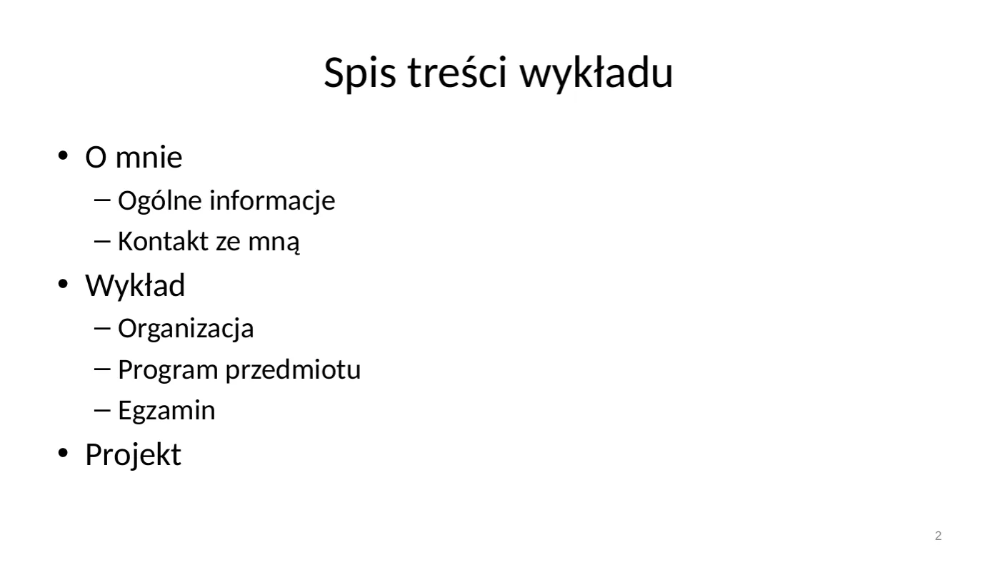

O mnie  
Ogólne informacje  
Kontakt ze mną  
Wykład  
Organizacja  
Program przedmiotu  
Egzamin  
Projekt  
2

### 3. O MNIE

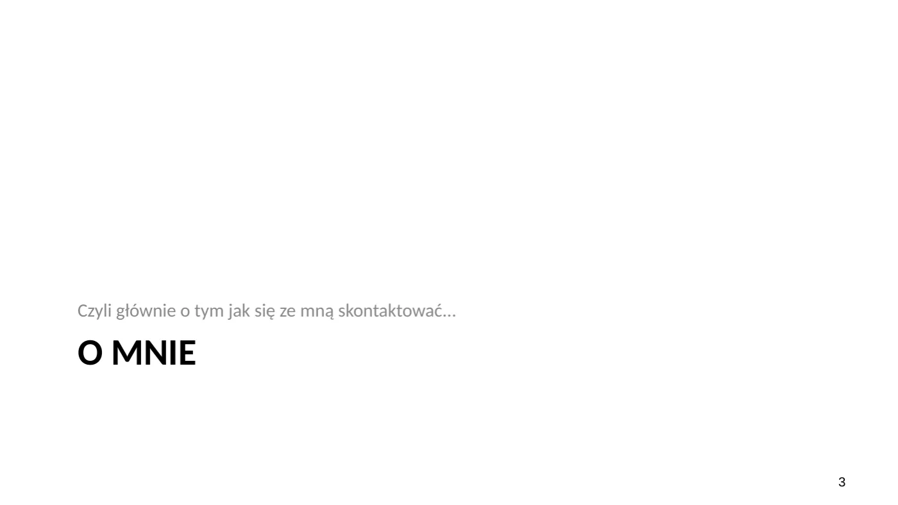

Czyli głównie o tym jak się ze mną skontaktować...  
3

### 4. Ogólne informacje

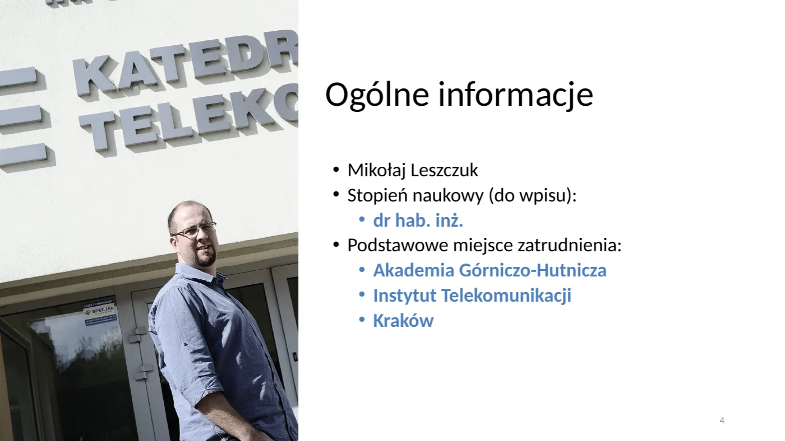

Mikołaj Leszczuk  
Stopień naukowy (do wpisu):  
dr hab. inż.  
Podstawowe miejsce zatrudnienia:  
Akademia Górniczo-Hutnicza  
Instytut Telekomunikacji  
Kraków  
4

### 5. Kontakt ze mną

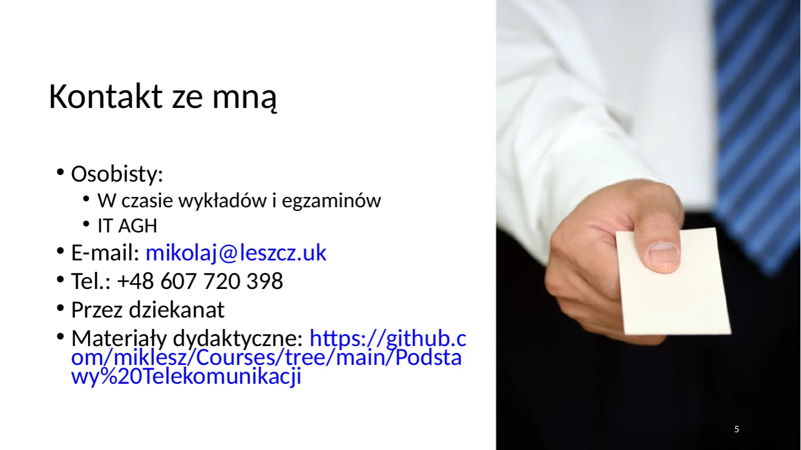

Osobisty:  
W czasie wykładów i egzaminów  
I  
T AGH  
E-mail:  
mikolaj@leszcz.uk  
Tel.: +48 607 720 398  
Przez dziekanat  
Materiały dydaktyczne:  
https://github.com/miklesz/Courses/tree/main/Podstawy%20Telekomunikacji  
5

### 6. WYKŁAD

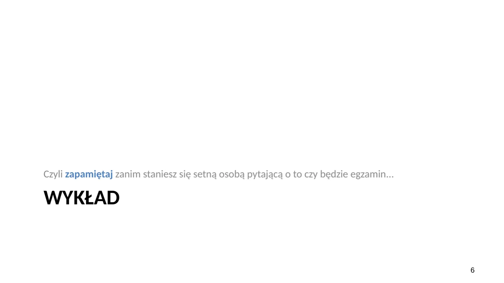

Czyli  
zapamiętaj  
zanim staniesz się setną osobą pytającą o to czy będzie egzamin...  
6

### 7. Jak zorganizowany jest wykład?

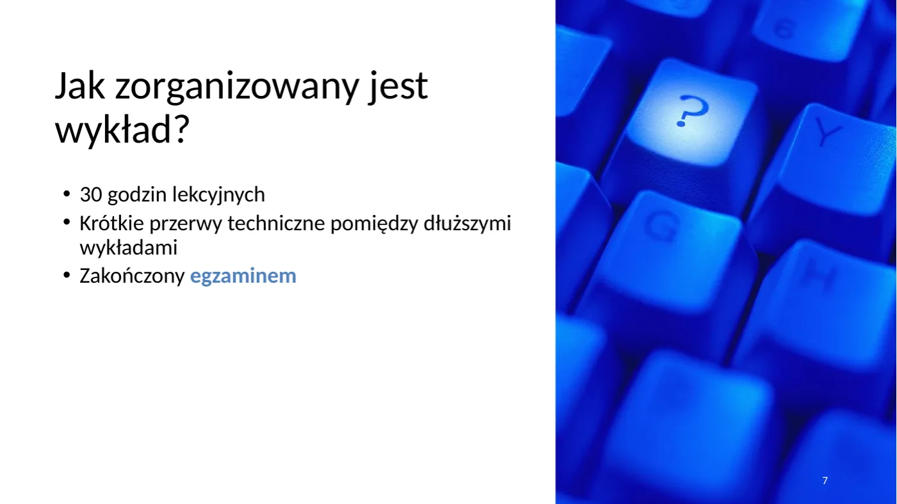

30 godzin lekcyjnych  
Krótkie przerwy techniczne pomiędzy dłuższymi wykładami  
Zakończony  
egzaminem  
7

### 8. Program wykładu (1/2)

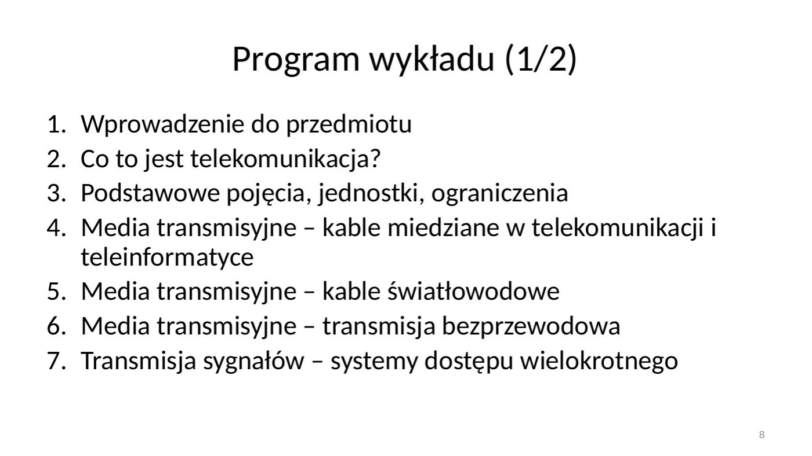

Wprowadzenie do przedmiotu  
Co to jest telekomunikacja?  
Podstawowe pojęcia, jednostki, ograniczenia  
Media transmisyjne – kable miedziane w telekomunikacji i teleinformatyce  
Media transmisyjne – kable światłowodowe  
Media transmisyjne – transmisja bezprzewodowa  
Transmisja sygnałów – systemy dostępu wielokrotnego  
8

### 9. Program wykładu (2/2)

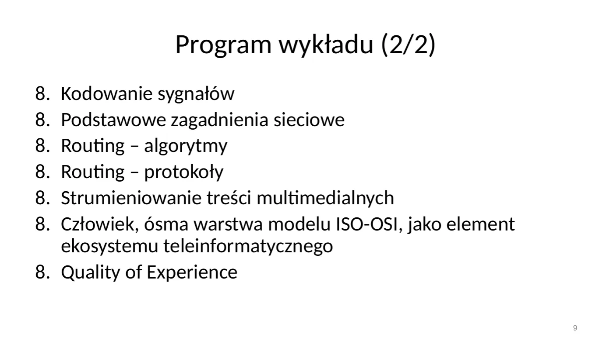

Kodowanie sygnałów  
Podstawowe zagadnienia sieciowe  
Routing – algorytmy  
Routing – protokoły  
Strumieniowanie treści multimedialnych  
Człowiek, ósma warstwa modelu ISO-OSI, jako element ekosystemu teleinformatycznego  
Quality of Experience  
9

### 10. Egzamin

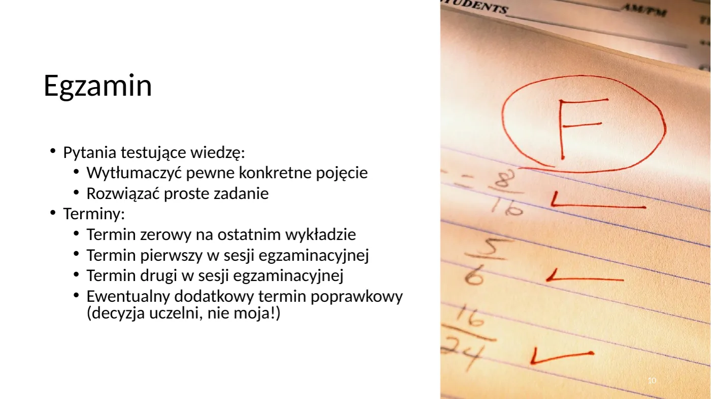

Pytania testujące wiedzę:  
Wytłumaczyć pewne konkretne pojęcie  
Rozwiązać proste zadanie  
Terminy:  
Termin zerowy na ostatnim wykładzie  
Termin pierwszy w sesji egzaminacyjnej  
Termin drugi w sesji egzaminacyjnej  
Ewentualny dodatkowy termin poprawkowy (decyzja uczelni, nie moja!)  
10

### 11. Przykładowe pytania egzaminacyjne

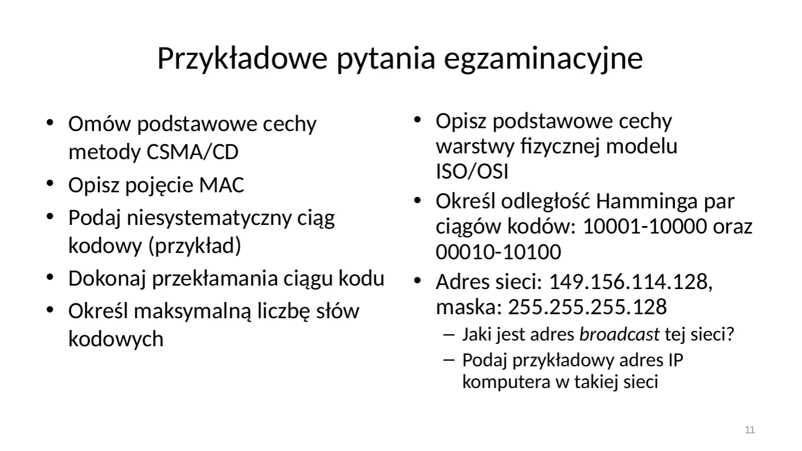

Omów podstawowe cechy metody CSMA/CD  
Opisz pojęcie MAC  
Podaj niesystematyczny ciąg kodowy (przykład)  
Dokonaj przekłamania ciągu kodu  
Określ maksymalną liczbę słów kodowych  
11  
Opisz podstawowe cechy warstwy fizycznej modelu ISO/OSI  
Określ odległość Hamminga par ciągów kodów: 10001-10000 oraz 00010-10100  
Adres sieci: 149.156.114.128, maska: 255.255.255.128  
Jaki jest adres  
broadcast  
tej sieci?  
Podaj przykładowy adres IP komputera w takiej sieci

### 12. PROJEKT

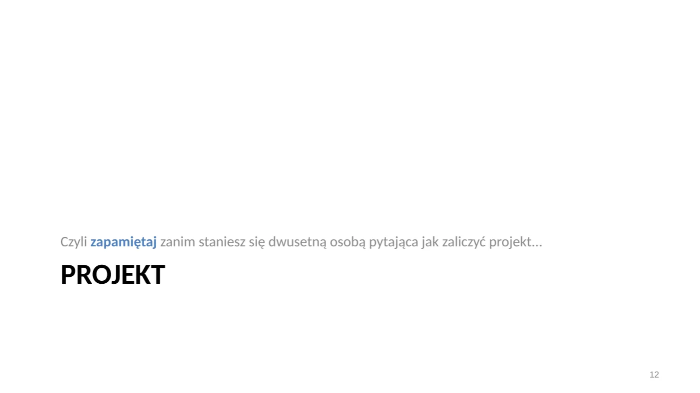

Czyli  
zapamiętaj  
zanim staniesz się dwusetną osobą pytająca jak zaliczyć projekt...  
12

### 13. Opis zajęć projektowych (1/2)

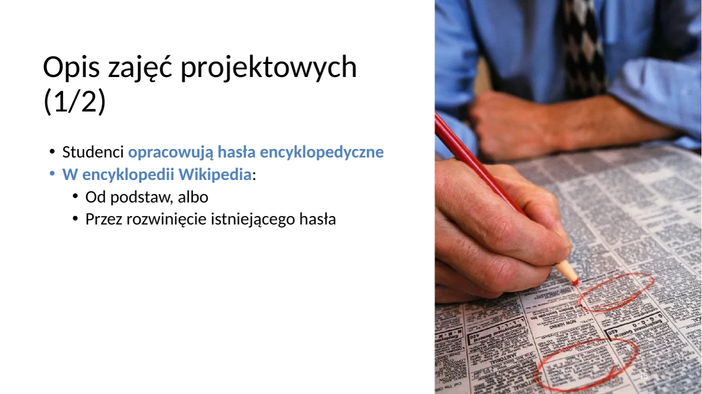

Studenci  
opracowują hasła encyklopedyczne  
W encyklopedii Wikipedia  
:  
Od podstaw, albo  
Przez rozwinięcie istniejącego hasła  
13

### 14. Opis zajęć projektowych (2/2)

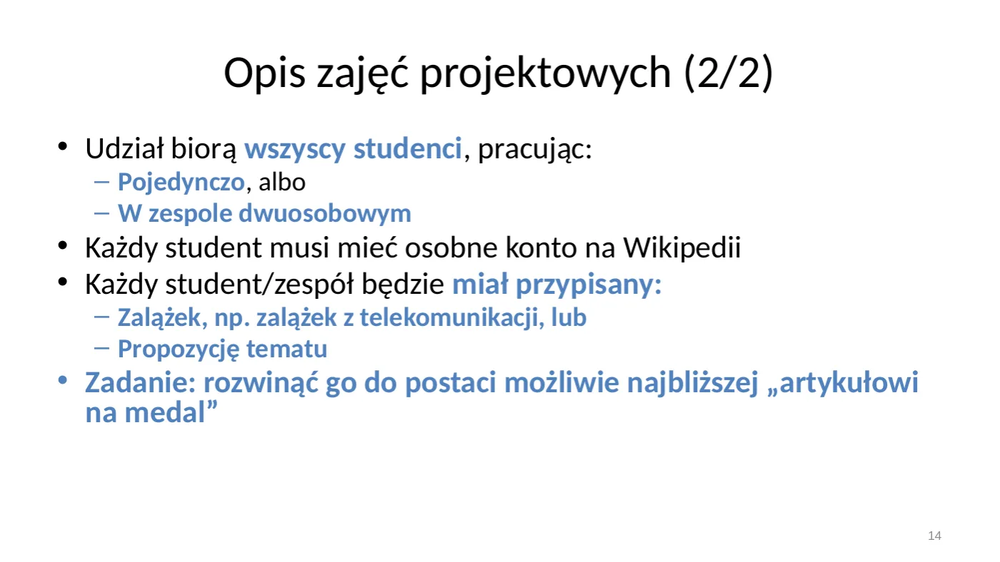

Udział biorą  
wszyscy studenci  
, pracując:  
Pojedynczo  
, albo  
W zespole dwuosobowym  
Każdy student musi mieć osobne konto na Wikipedii  
Każdy student/zespół będzie  
miał przypisany:  
Zalążek, np. zalążek z telekomunikacji, lub  
Propozycję tematu  
Zadanie: rozwinąć go do postaci możliwie najbliższej „artykułowi na medal”  
14

### 15. Opieka nad projektem

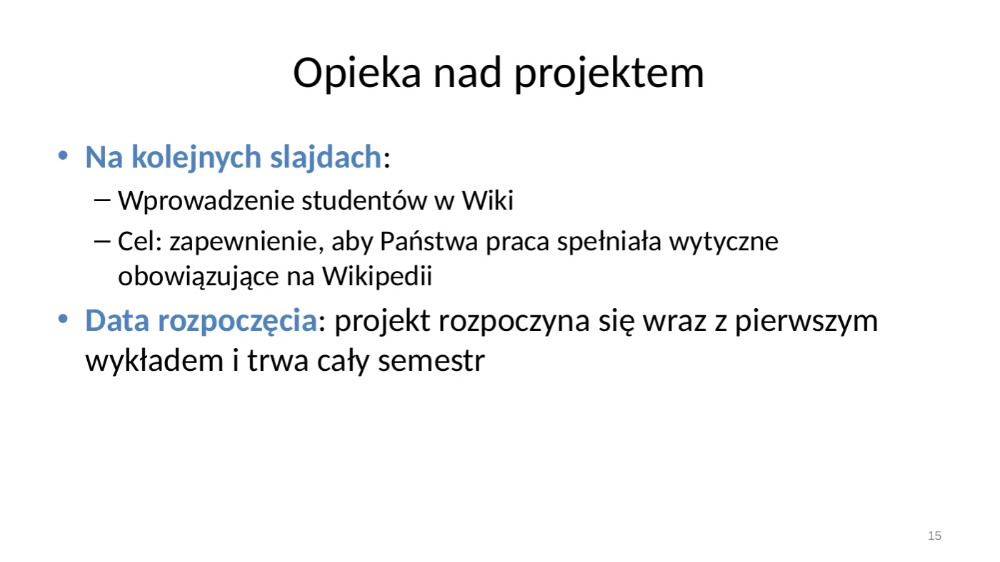

Na kolejnych slajdach  
:  
Wprowadzenie studentów w Wiki  
Cel: zapewnienie, aby Państwa praca spełniała wytyczne obowiązujące na Wikipedii  
Data rozpoczęcia  
: projekt rozpoczyna się wraz z pierwszym wykładem i trwa cały semestr  
15

### 16. Podstawowe cechy Wikipedii

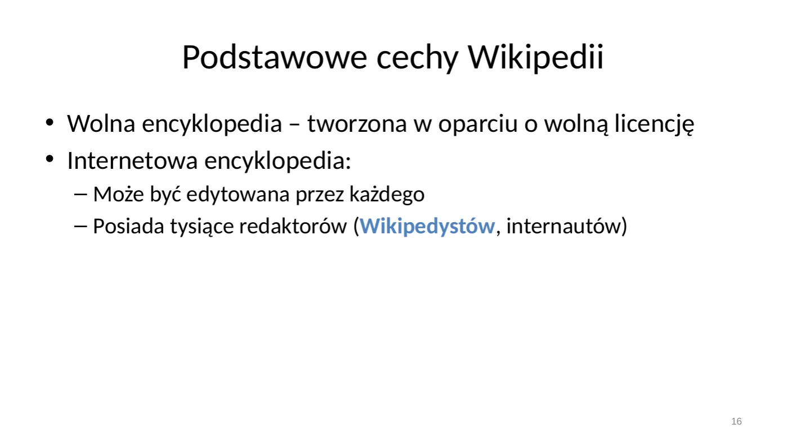

Wolna encyklopedia – tworzona w oparciu o wolną licencję  
Internetowa encyklopedia:  
Może być edytowana przez każdego  
Posiada tysiące redaktorów (  
Wikipedystów  
, internautów)  
16

### 17. Wprowadzenie dla studentów

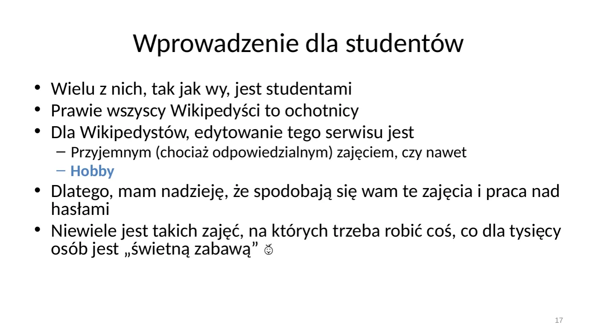

Wielu z nich, tak jak wy, jest studentami  
Prawie wszyscy Wikipedyści to ochotnicy  
Dla Wikipedystów, edytowanie tego serwisu jest  
Przyjemnym (chociaż odpowiedzialnym) zajęciem, czy nawet  
Hobby  
Dlatego, mam nadzieję, że spodobają się wam te zajęcia i praca nad hasłami  
Niewiele jest takich zajęć, na których trzeba robić coś, co dla tysięcy osób jest „świetną zabawą” ☺  
17

### 18. Więcej o Wikipedii

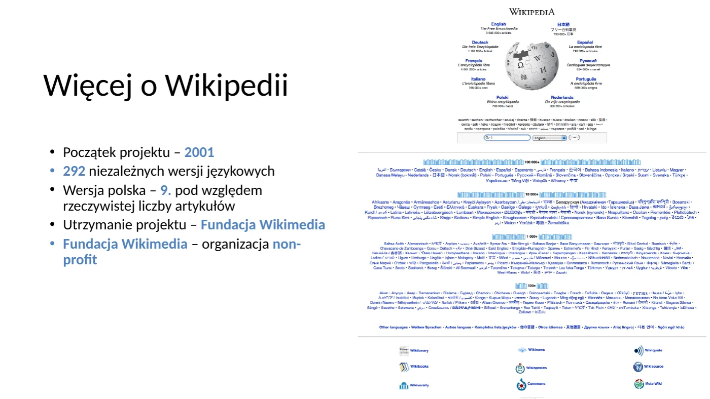

Początek projektu –  
2001  
292  
niezależnych wersji językowych  
Wersja polska –  
9.  
pod względem rzeczywistej liczby artykułów  
Utrzymanie projektu –  
Fundacja Wikimedia  
Fundacja Wikimedia  
– organizacja  
non-profit  
18

### 19. Dlaczego Wikipedia? (1/2)

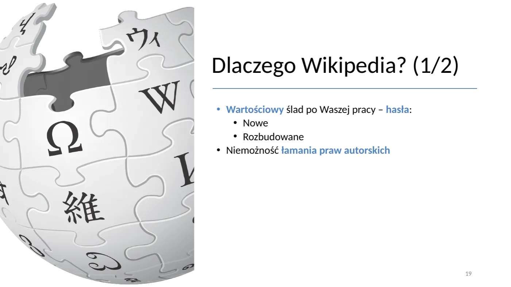

Wartościowy  
ślad po Waszej pracy –  
hasła  
:  
Nowe  
Rozbudowane  
Niemożność  
łamania  
praw autorskich  
19

### 20. Dlaczego Wikipedia? (2/2)

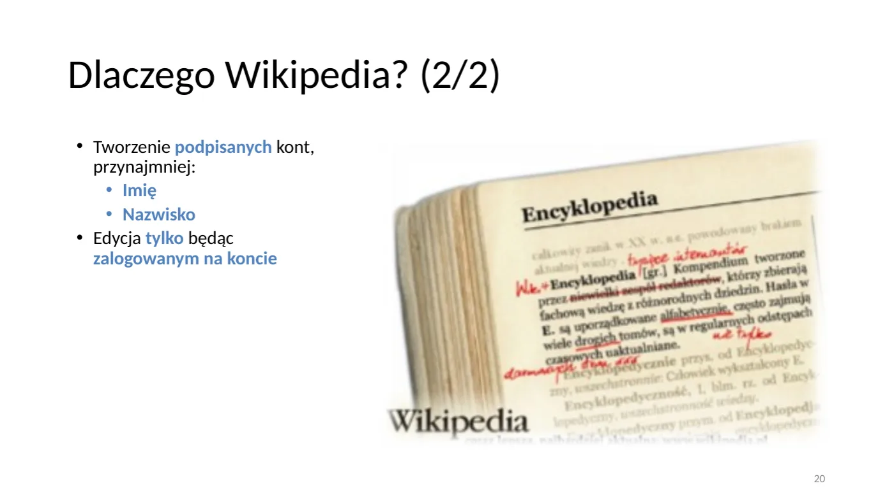

Tworzenie  
podpisanych  
kont, przynajmniej:  
Imię  
Nazwisko  
Edycja  
tylko  
będąc  
zalogowanym na koncie  
20

### 21. Start (1/3)

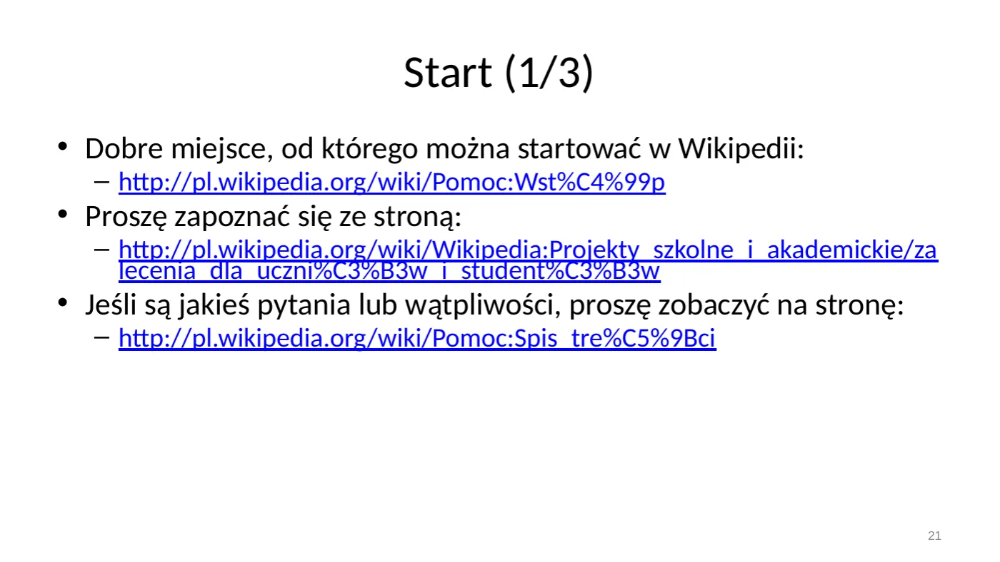

Dobre miejsce, od którego można startować w Wikipedii:  
http://pl.wikipedia.org/wiki/Pomoc:Wst%C4%99p  
Proszę zapoznać się ze stroną:  
http://pl.wikipedia.org/wiki/Wikipedia:Projekty_szkolne_i_akademickie/zalecenia_dla_uczni%C3%B3w_i_student%C3%B3w  
Jeśli są jakieś pytania lub wątpliwości, proszę zobaczyć na stronę:  
http://pl.wikipedia.org/wiki/Pomoc:Spis_tre%C5%9Bci  
21

### 22. Start (2/3)

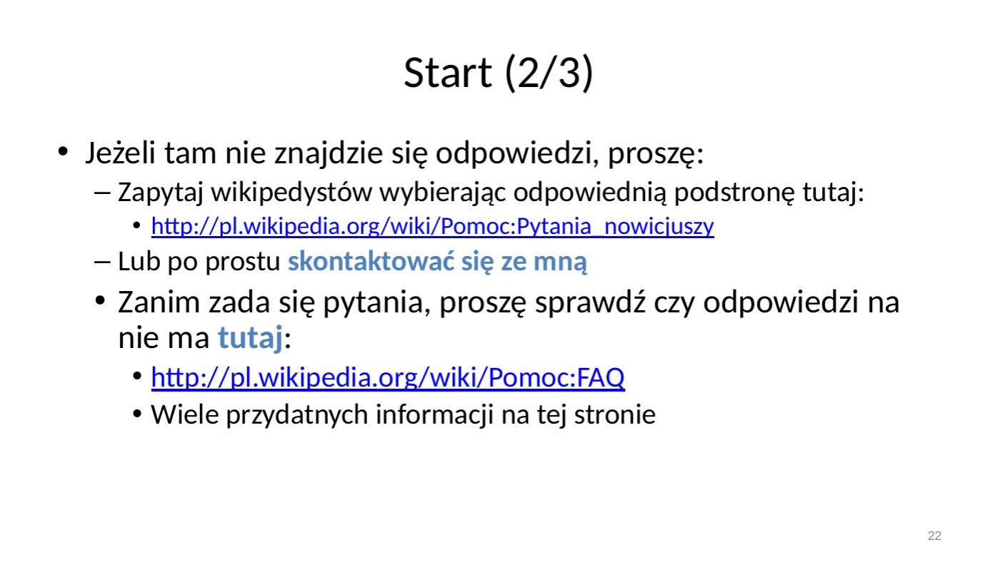

Jeżeli tam nie znajdzie się odpowiedzi, proszę:  
Zapytaj wikipedystów wybierając odpowiednią podstronę tutaj:  
http://pl.wikipedia.org/wiki/Pomoc:Pytania_nowicjuszy  
Lub po prostu  
skontaktować się ze mną  
Zanim zada się pytania, proszę sprawdź czy odpowiedzi na nie ma  
tutaj  
:  
http://pl.wikipedia.org/wiki/Pomoc:FAQ  
Wiele przydatnych informacji na tej stronie  
22

### 23. Start (3/3)

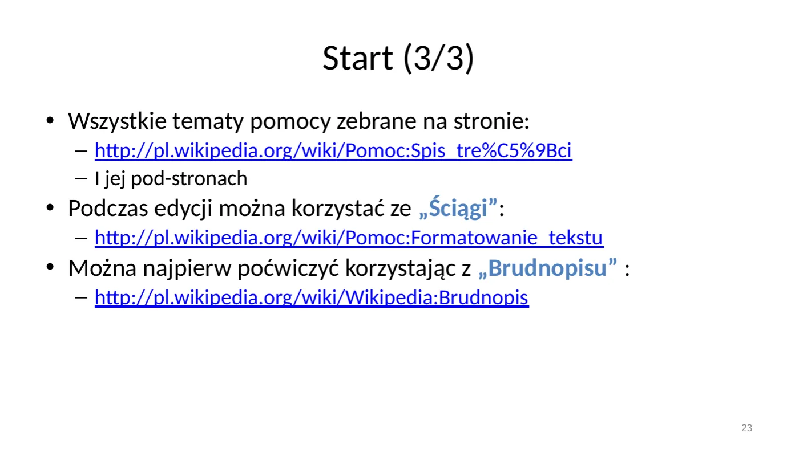

Wszystkie tematy pomocy zebrane na stronie:  
http://pl.wikipedia.org/wiki/Pomoc:Spis_tre%C5%9Bci  
I jej pod-stronach  
Podczas edycji można korzystać ze  
„Ściągi”  
:  
http://pl.wikipedia.org/wiki/Pomoc:Formatowanie_tekstu  
Można najpierw poćwiczyć korzystając z  
„Brudnopisu”  
:  
http://pl.wikipedia.org/wiki/Wikipedia:Brudnopis  
23

### 24. Edycja

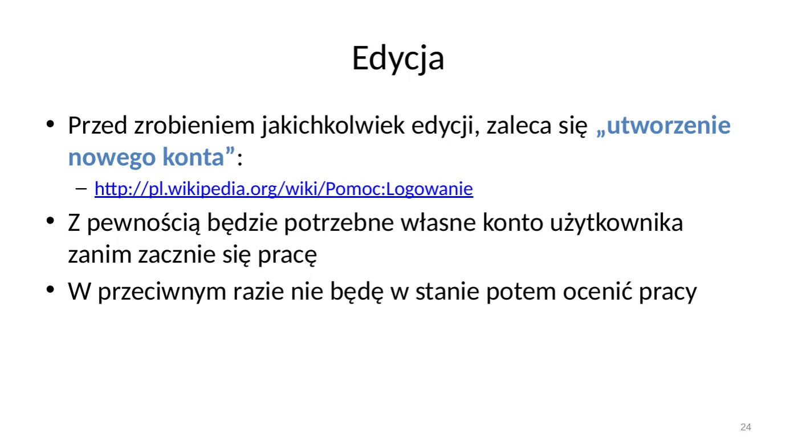

Przed zrobieniem jakichkolwiek edycji, zaleca się  
„utworzenie nowego konta”  
:  
http://pl.wikipedia.org/wiki/Pomoc:Logowanie  
Z pewnością będzie potrzebne własne konto użytkownika zanim zacznie się pracę  
W przeciwnym razie nie będę w stanie potem ocenić pracy  
24

### 25. Standardy Wikipedii

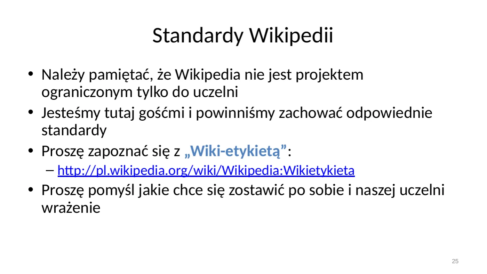

Należy pamiętać, że Wikipedia nie jest projektem ograniczonym tylko do uczelni  
Jesteśmy tutaj gośćmi i powinniśmy zachować odpowiednie standardy  
Proszę zapoznać się z  
„Wiki-etykietą”  
:  
http://pl.wikipedia.org/wiki/Wikipedia:Wikietykieta  
Proszę pomyśl jakie chce się zostawić po sobie i naszej uczelni wrażenie  
25

### 26. Komunikacja (1/3)

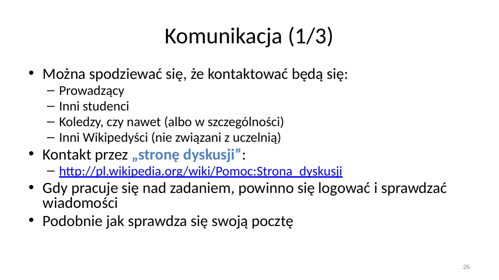

Można spodziewać się, że kontaktować będą się:  
Prowadzący  
Inni studenci  
Koledzy, czy nawet (albo w szczególności)  
Inni Wikipedyści (nie związani z uczelnią)  
Kontakt przez  
„stronę dyskusji”  
:  
http://pl.wikipedia.org/wiki/Pomoc:Strona_dyskusji  
Gdy pracuje się nad zadaniem, powinno się logować i sprawdzać wiadomości  
Podobnie jak sprawdza się swoją pocztę  
26

### 27. Komunikacja (2/3)

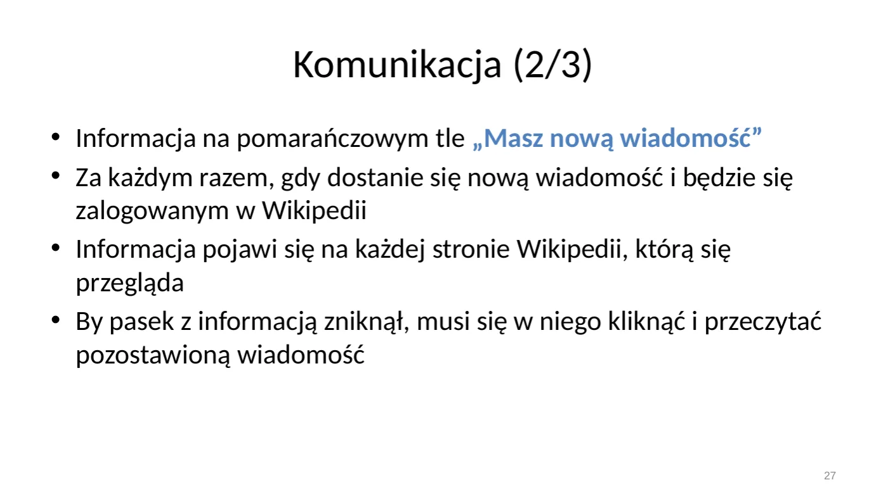

Informacja na pomarańczowym tle  
„Masz nową wiadomość”  
Za każdym razem, gdy dostanie się nową wiadomość i będzie się zalogowanym w Wikipedii  
Informacja pojawi się na każdej stronie Wikipedii, którą się przegląda  
By pasek z informacją zniknął, musi się w niego kliknąć i przeczytać pozostawioną wiadomość  
27

### 28. Komunikacja (3/3)

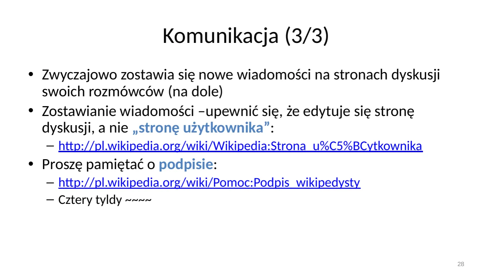

Zwyczajowo zostawia się nowe wiadomości na stronach dyskusji swoich rozmówców (na dole)  
Zostawianie wiadomości –upewnić się, że edytuje się stronę dyskusji, a nie  
„stronę użytkownika”  
:  
http://pl.wikipedia.org/wiki/Wikipedia:Strona_u%C5%BCytkownika  
Proszę pamiętać o  
podpisie  
:  
http://pl.wikipedia.org/wiki/Pomoc:Podpis_wikipedysty  
Cztery tyldy ~~~~  
28

### 29. Podpisywanie kont (1/2)

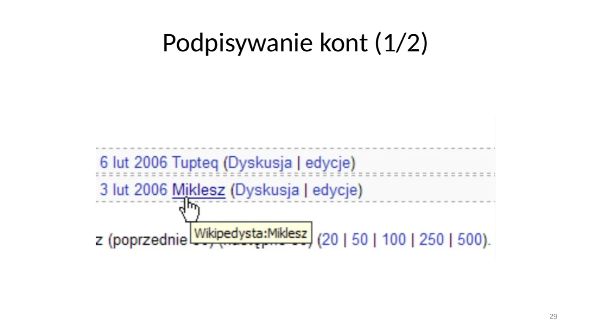

29

### 30. Podpisywanie kont (2/2)

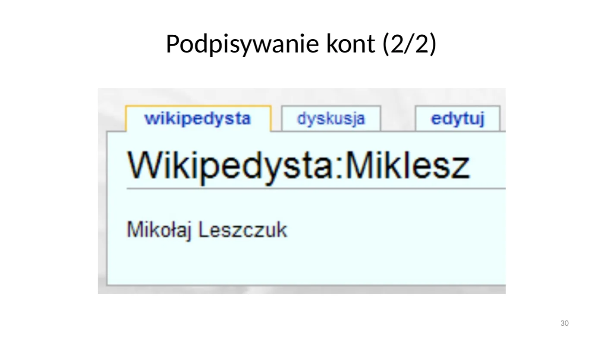

30

### 31. Prawa autorskie (1/2)

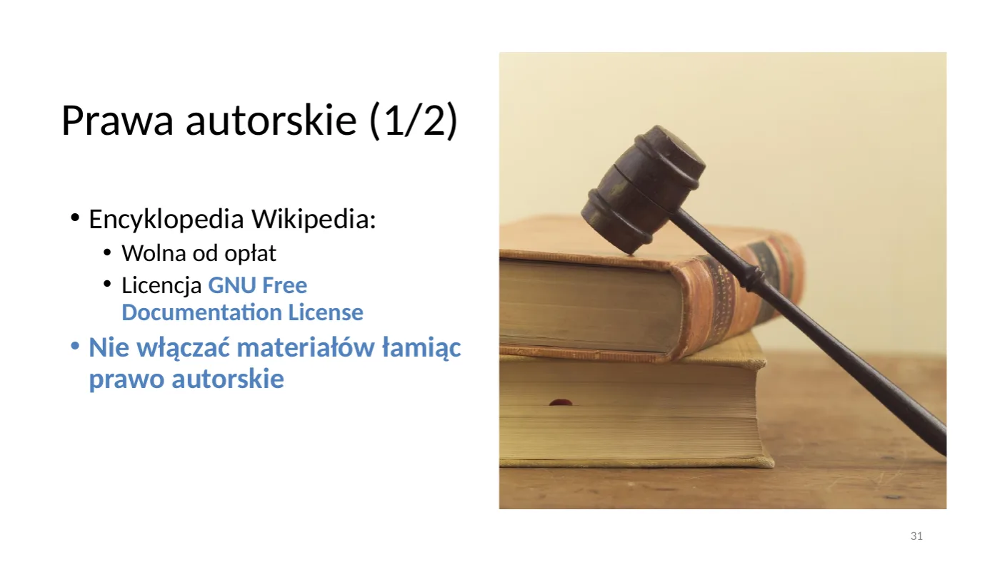

Encyklopedia Wikipedia:  
Wolna od opłat  
Licencja  
GNU Free Documentation License  
Nie włączać materiałów łamiąc prawo autorskie  
31

### 32. Prawa autorskie (2/2)

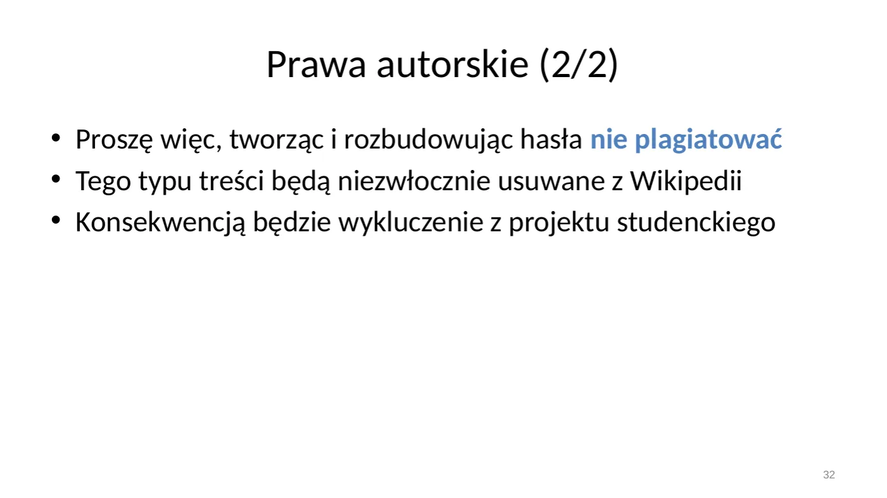

Proszę więc, tworząc i rozbudowując hasła  
nie plagiatować  
Tego typu treści będą niezwłocznie usuwane z Wikipedii  
Konsekwencją będzie wykluczenie z projektu studenckiego  
32

### 33. Jakie hasła opracować?

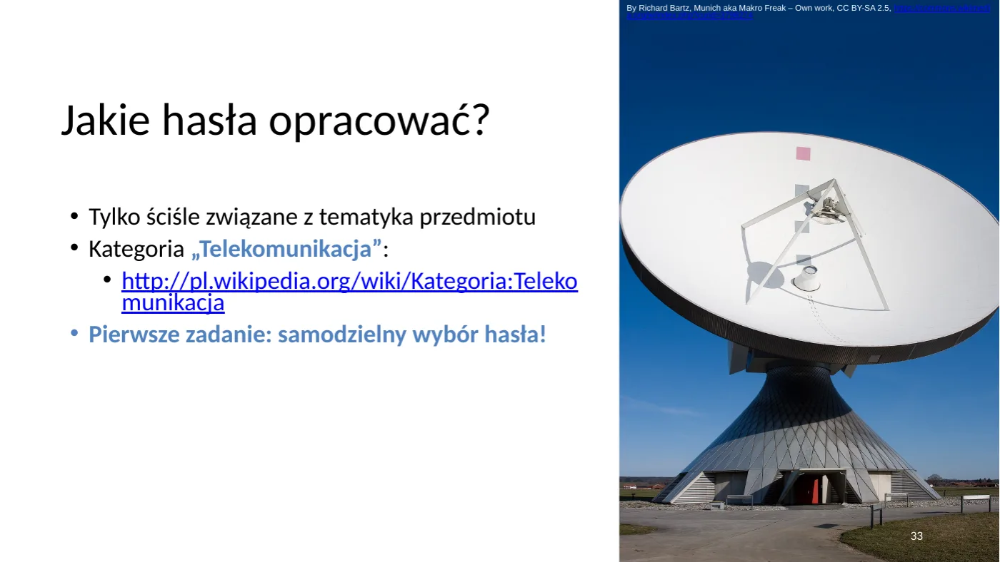

Tylko ściśle związane z tematyka przedmiotu  
Kategoria  
„Telekomunikacja”  
:  
http://pl.wikipedia.org/wiki/Kategoria:Telekomunikacja  
Pierwsze zadanie: samodzielny wybór hasła!  
33  
By Richard Bartz, Munich aka Makro Freak – Own work, CC BY-SA 2.5,  
https://commons.wikimedia.org/w/index.php?curid=3798274

### 34. Zadanie do wykonania a liczebność zespołu

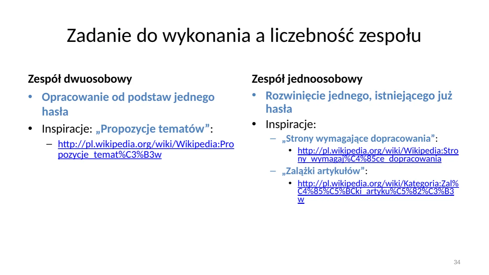

Zespół dwuosobowy  
Opracowanie od podstaw jednego hasła  
Inspiracje:  
„Propozycje tematów”  
:  
http://pl.wikipedia.org/wiki/Wikipedia:Propozycje_temat%C3%B3w  
Zespół jednoosobowy  
Rozwinięcie jednego, istniejącego już hasła  
Inspiracje:  
„Strony wymagające dopracowania”  
:  
http://pl.wikipedia.org/wiki/Wikipedia:Strony_wymagaj%C4%85ce_dopracowania  
„Zalążki artykułów”  
:  
http://pl.wikipedia.org/wiki/Kategoria:Zal%C4%85%C5%BCki_artyku%C5%82%C3%B3w  
34

### 35. Inne sposoby na szukanie ciekawego tematu (1/3)

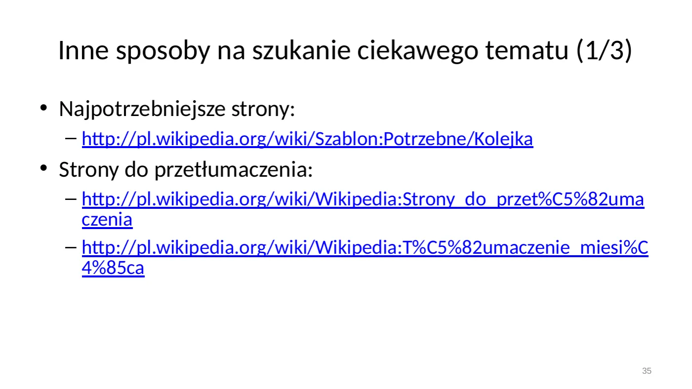

Najpotrzebniejsze strony:  
http://pl.wikipedia.org/wiki/Szablon:Potrzebne/Kolejka  
Strony do przetłumaczenia:  
http://pl.wikipedia.org/wiki/Wikipedia:Strony_do_przet%C5%82umaczenia  
http://pl.wikipedia.org/wiki/Wikipedia:T%C5%82umaczenie_miesi%C4%85ca  
35

### 36. Inne sposoby na szukanie ciekawego tematu (2/3)

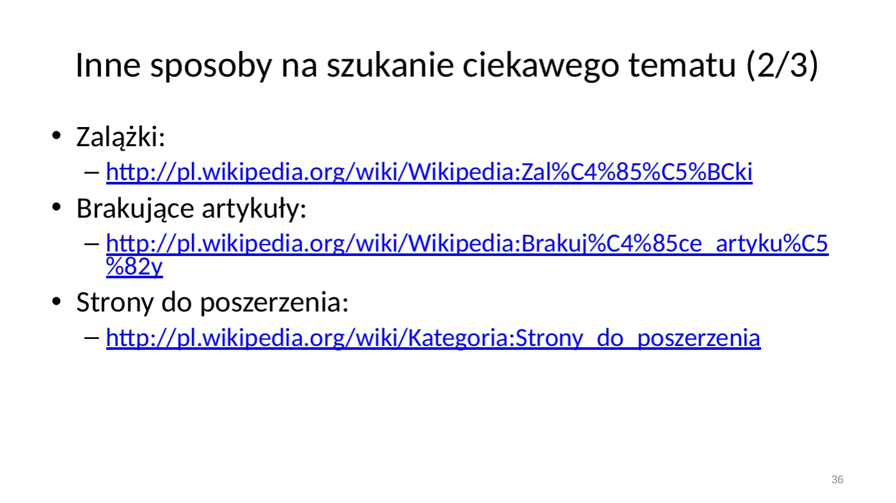

Zalążki:  
http://pl.wikipedia.org/wiki/Wikipedia:Zal%C4%85%C5%BCki  
Brakujące artykuły:  
http://pl.wikipedia.org/wiki/Wikipedia:Brakuj%C4%85ce_artyku%C5%82y  
Strony do poszerzenia:  
http://pl.wikipedia.org/wiki/Kategoria:Strony_do_poszerzenia  
36

### 37. Inne sposoby na szukanie ciekawego tematu (3/3)

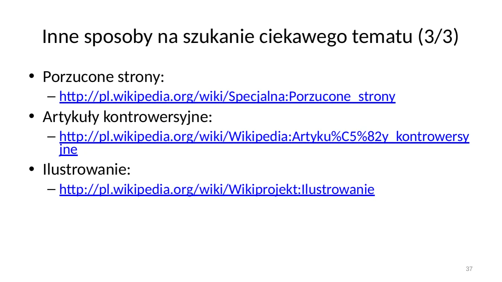

Porzucone strony:  
http://pl.wikipedia.org/wiki/Specjalna:Porzucone_strony  
Artykuły kontrowersyjne:  
http://pl.wikipedia.org/wiki/Wikipedia:Artyku%C5%82y_kontrowersyjne  
Ilustrowanie:  
http://pl.wikipedia.org/wiki/Wikiprojekt:Ilustrowanie  
37

### 38. Rozpoczęcie pracy – krok po kroku (1/2)

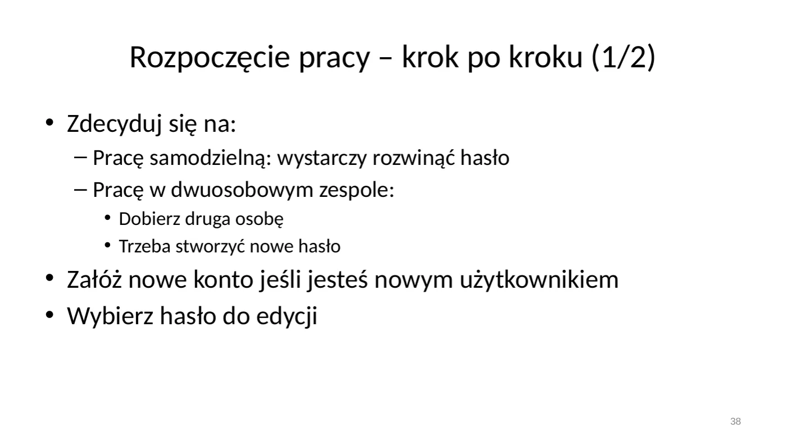

Zdecyduj się na:  
Pracę samodzielną: wystarczy rozwinąć hasło‏  
Pracę w dwuosobowym zespole:  
Dobierz druga osobę  
Trzeba stworzyć nowe hasło‏  
Załóż nowe konto jeśli jesteś nowym użytkownikiem  
Wybierz hasło do edycji  
38

### 39. Rozpoczęcie pracy – krok po kroku (2/2)

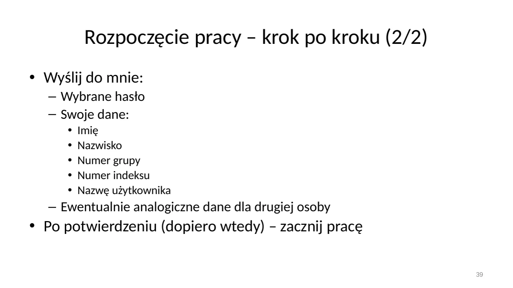

Wyślij do mnie:  
Wybrane hasło  
Swoje dane:  
Imię  
Nazwisko  
Numer grupy  
Numer indeksu  
Nazwę użytkownika  
Ewentualnie analogiczne dane dla drugiej osoby  
Po potwierdzeniu (dopiero wtedy) – zacznij pracę  
39

### 40. Zakończenie pracy – krok po kroku

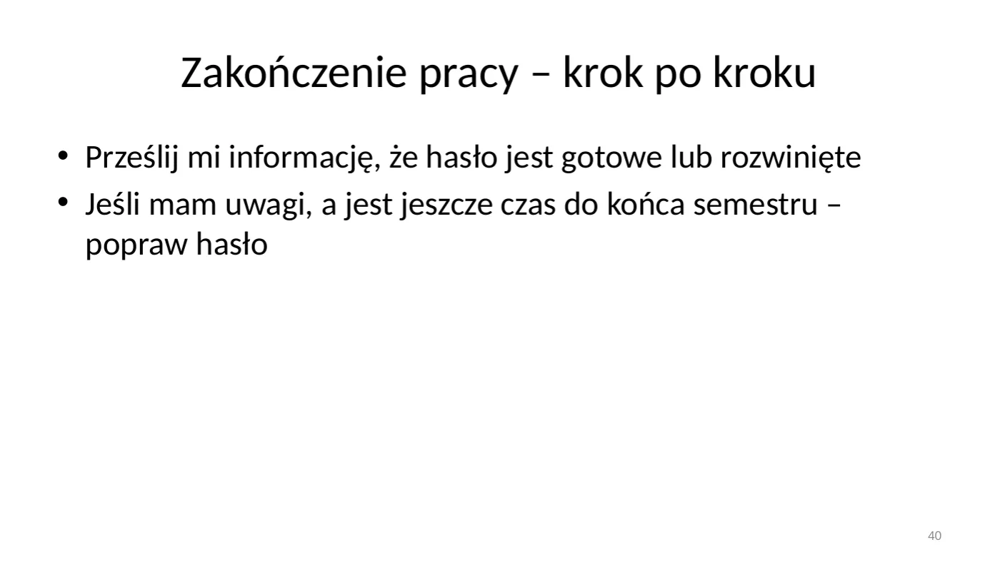

Prześlij mi informację, że hasło jest gotowe lub rozwinięte  
Jeśli mam uwagi, a jest jeszcze czas do końca semestru – popraw hasło  
40

### 41. Skala ocen i sposób oceniania przeze mnie projektów

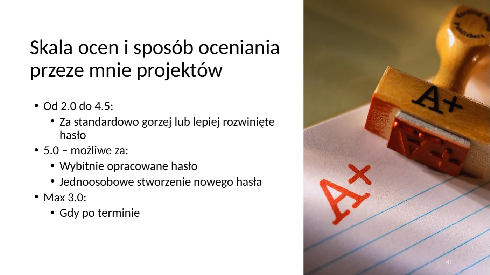

Od 2.0 do 4.5:  
Za standardowo gorzej lub lepiej rozwinięte hasło  
5.0 – możliwe za:  
Wybitnie opracowane hasło  
Jednoosobowe stworzenie nowego hasła  
Max 3.0:  
Gdy po terminie  
41

### 42. Co robić, a czego unikać (1/2)

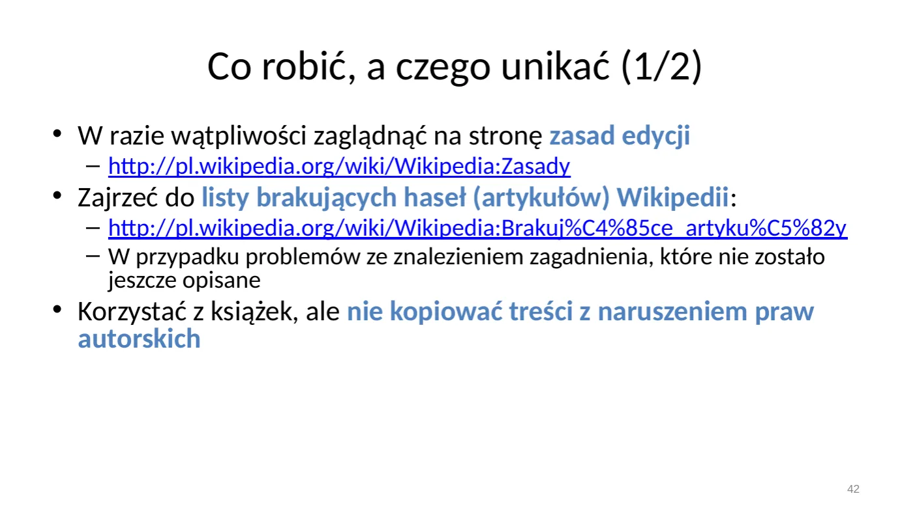

W razie wątpliwości zaglądnąć na stronę  
zasad edycji  
http://pl.wikipedia.org/wiki/Wikipedia:Zasady  
Zajrzeć do  
listy brakujących haseł (artykułów) Wikipedii  
:  
http://pl.wikipedia.org/wiki/Wikipedia:Brakuj%C4%85ce_artyku%C5%82y  
W przypadku problemów ze znalezieniem zagadnienia, które nie zostało jeszcze opisane  
Korzystać z książek, ale  
nie kopiować treści z naruszeniem praw autorskich  
42

### 43. Co robić, a czego unikać (2/2)

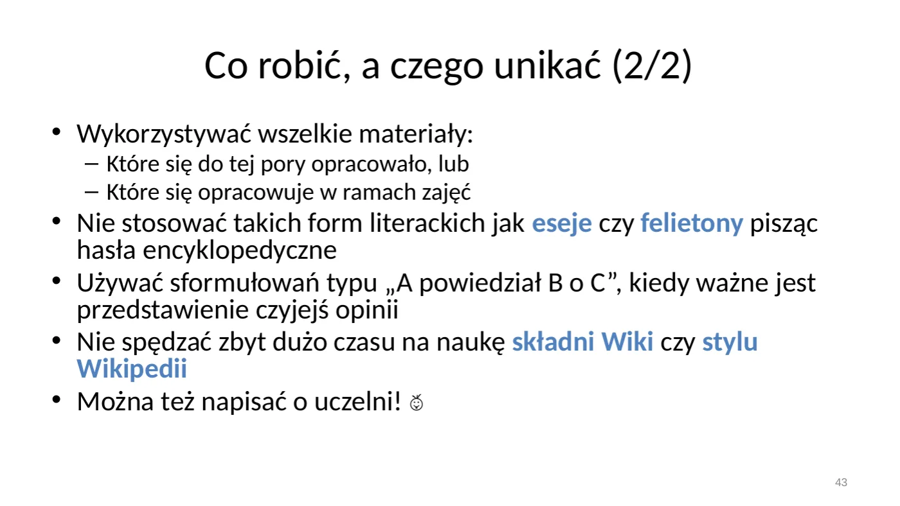

Wykorzystywać wszelkie materiały:  
Które się do tej pory opracowało, lub  
Które się opracowuje w ramach zajęć  
Nie stosować takich form literackich jak  
eseje  
czy  
felietony  
pisząc hasła encyklopedyczne  
Używać sformułowań typu „A powiedział B o C”, kiedy ważne jest przedstawienie czyjejś opinii  
Nie spędzać zbyt dużo czasu na naukę  
składni Wiki  
czy  
stylu Wikipedii  
Można też napisać o uczelni! ☺  
43

### 44. Kilka innych przydatnych rad (1/2)

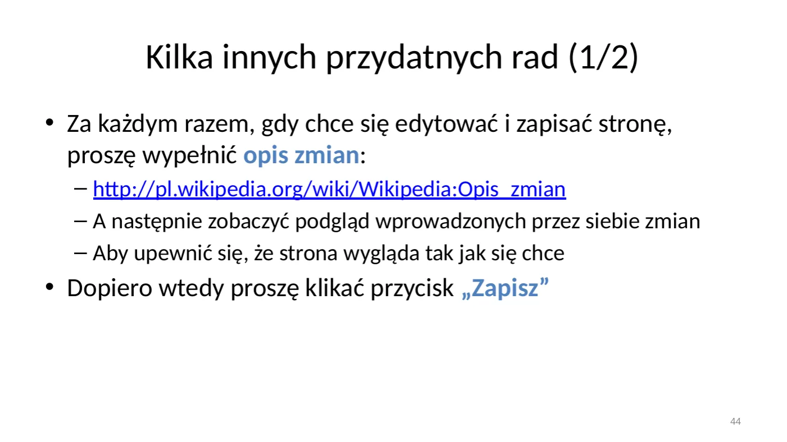

Za każdym razem, gdy chce się edytować i zapisać stronę, proszę wypełnić  
opis zmian  
:  
http://pl.wikipedia.org/wiki/Wikipedia:Opis_zmian  
A następnie zobaczyć podgląd wprowadzonych przez siebie zmian  
Aby upewnić się, że strona wygląda tak jak się chce  
Dopiero wtedy proszę klikać przycisk  
„Zapisz”  
44

### 45. Kilka innych przydatnych rad (2/2)

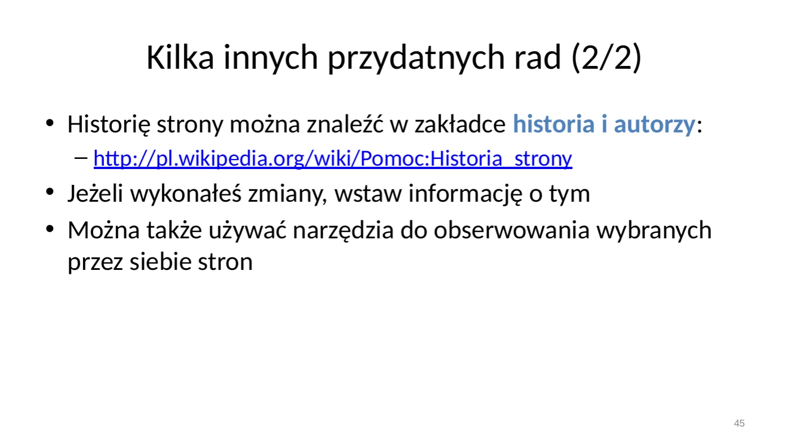

Historię strony można znaleźć w zakładce  
historia i autorzy  
:  
http://pl.wikipedia.org/wiki/Pomoc:Historia_strony  
Jeżeli wykonałeś zmiany, wstaw informację o tym  
Można także używać narzędzia do obserwowania wybranych przez siebie stron  
45

### 46. Wikipedia – grzechy główne, czyli jak NIE dostać zaliczenia? ☺

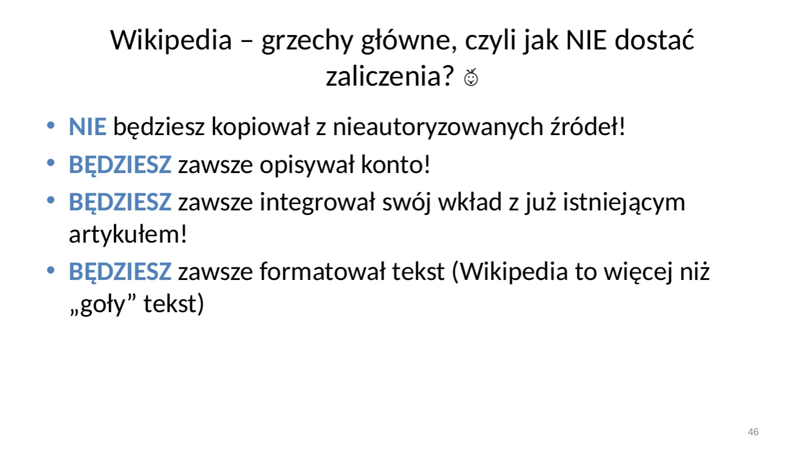

NIE  
będziesz kopiował z nieautoryzowanych źródeł!  
BĘDZIESZ  
zawsze opisywał konto!  
BĘDZIESZ  
zawsze integrował swój wkład z już istniejącym artykułem!  
BĘDZIESZ  
zawsze formatował tekst (Wikipedia to więcej niż „goły” tekst)  
46

### 47. Wymiana maili ze mną – uwagi ogólne (1/2)

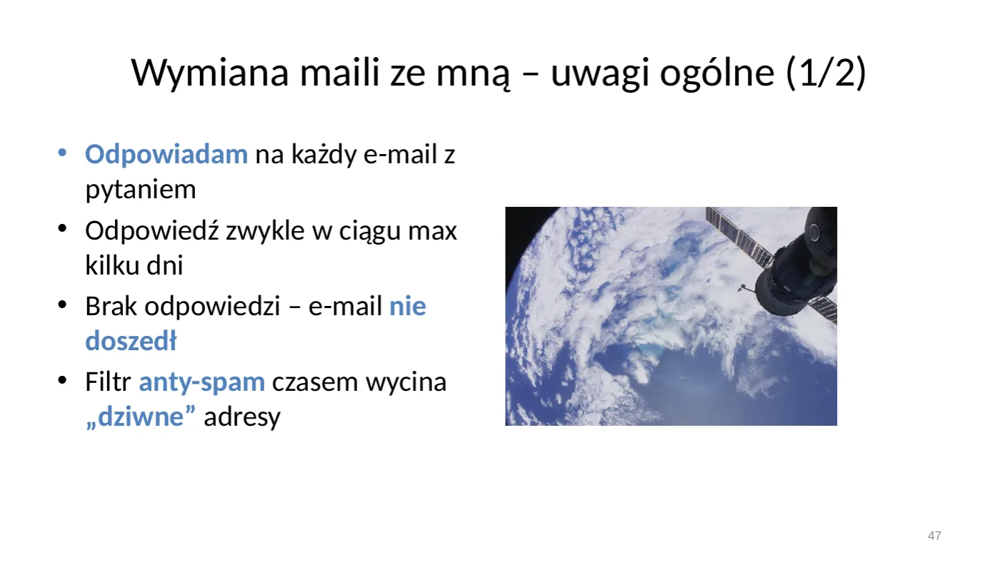

Odpowiadam  
na każdy e-mail z pytaniem  
Odpowiedź zwykle w ciągu max kilku dni  
Brak odpowiedzi – e-mail  
nie doszedł  
Filtr  
anty-spam  
czasem wycina  
„dziwne”  
adresy  
47

### 48. Wymiana maili ze mną – uwagi ogólne (2/2)

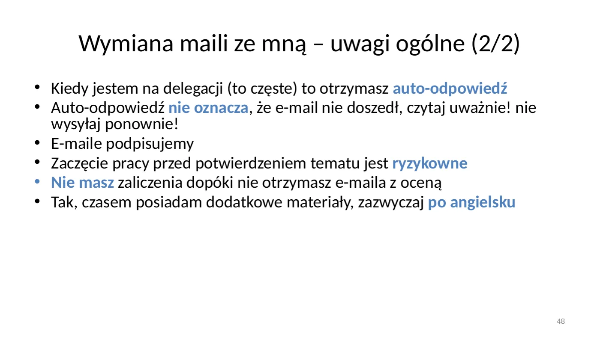

Kiedy jestem na delegacji (to częste) to otrzymasz  
auto-odpowiedź  
Auto-odpowiedź  
nie oznacza  
, że e-mail nie doszedł, czytaj uważnie! nie wysyłaj ponownie!  
E-maile podpisujemy  
Zaczęcie pracy przed potwierdzeniem tematu jest  
ryzykowne  
Nie masz  
zaliczenia dopóki nie otrzymasz e-maila z oceną  
Tak, czasem posiadam dodatkowe materiały, zazwyczaj  
po angielsku  
48

### 49. Ważna informacja (jeszcze raz)

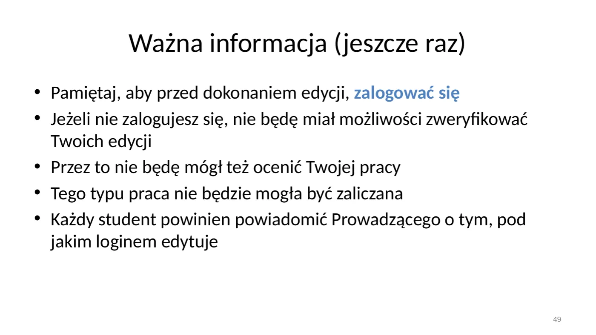

Pamiętaj, aby przed dokonaniem edycji,  
zalogować się  
Jeżeli nie zalogujesz się, nie będę miał możliwości zweryfikować Twoich edycji  
Przez to nie będę mógł też ocenić Twojej pracy  
Tego typu praca nie będzie mogła być zaliczana  
Każdy student powinien powiadomić Prowadzącego o tym, pod jakim loginem edytuje  
49

### 50. Wstępne ćwiczenie (1/3)

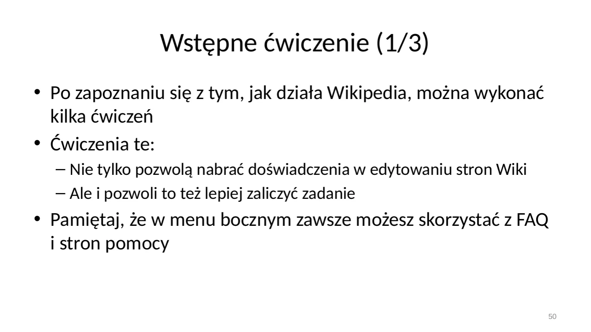

Po zapoznaniu się z tym, jak działa Wikipedia, można wykonać kilka ćwiczeń  
Ćwiczenia te:  
Nie tylko pozwolą nabrać doświadczenia w edytowaniu stron Wiki  
Ale i pozwoli to też lepiej zaliczyć zadanie  
Pamiętaj, że w menu bocznym zawsze możesz skorzystać z FAQ i stron pomocy  
50

### 51. Wstępne ćwiczenie (2/3)

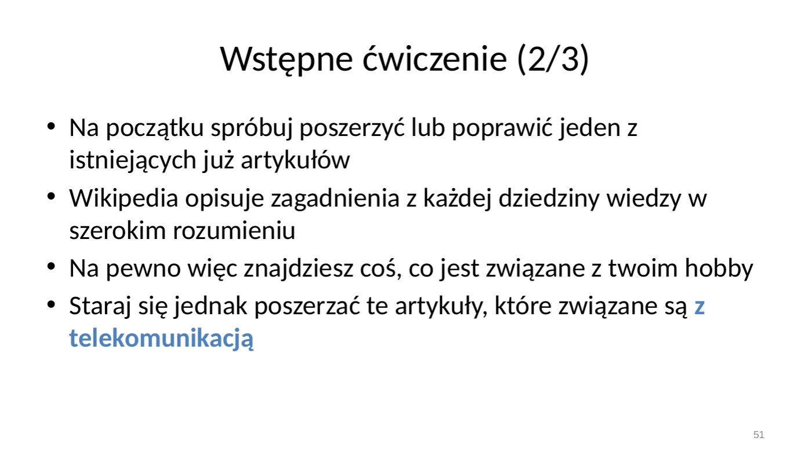

Na początku spróbuj poszerzyć lub poprawić jeden z istniejących już artykułów  
Wikipedia opisuje zagadnienia z każdej dziedziny wiedzy w szerokim rozumieniu  
Na pewno więc znajdziesz coś, co jest związane z twoim hobby  
Staraj się jednak poszerzać te artykuły, które związane są  
z telekomunikacją  
51

### 52. Wstępne ćwiczenie (3/3)

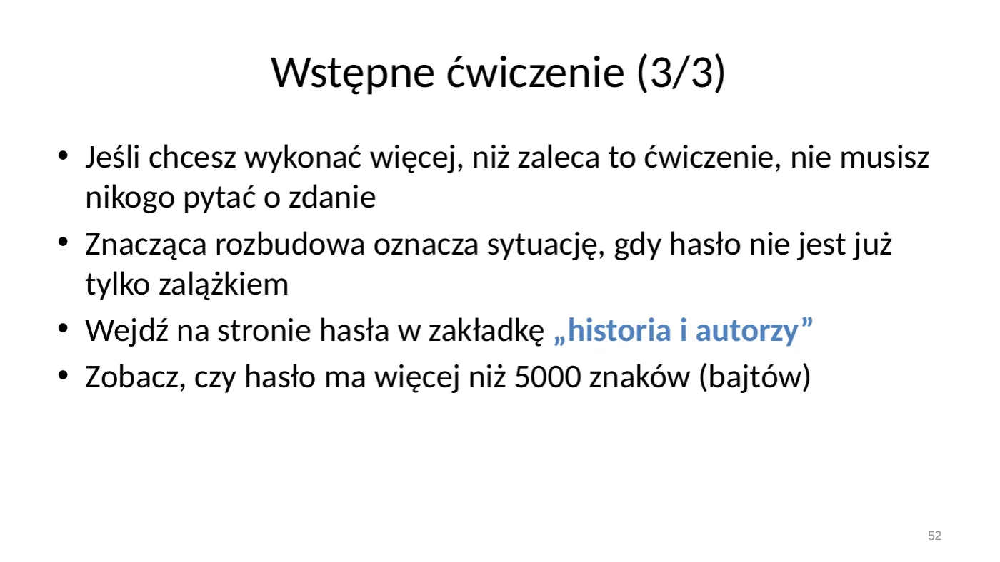

Jeśli chcesz wykonać więcej, niż zaleca to ćwiczenie, nie musisz nikogo pytać o zdanie  
Znacząca rozbudowa oznacza sytuację, gdy hasło nie jest już tylko zalążkiem  
Wejdź na stronie hasła w zakładkę  
„historia i autorzy”  
Zobacz, czy hasło ma więcej niż 5000 znaków (bajtów)  
52

### 53. Przydatne linki w Wikipedii („wierzchołek góry lodowej”)

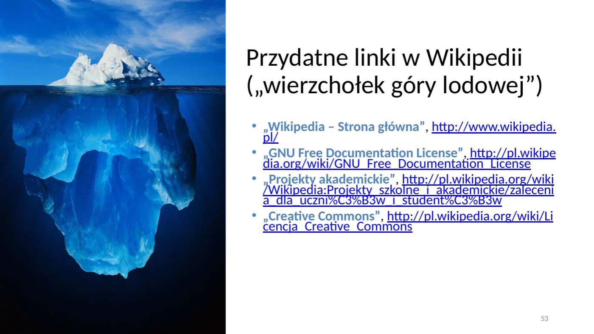

„Wikipedia – Strona główna”  
,  
http://www.wikipedia.pl/  
„GNU Free Documentation License”  
,  
http://pl.wikipedia.org/wiki/GNU_Free_Documentation_License  
„Projekty akademickie”  
,  
http://pl.wikipedia.org/wiki/Wikipedia:Projekty_szkolne_i_akademickie/zalecenia_dla_uczni%C3%B3w_i_student%C3%B3w  
„Creative Commons”  
,  
http://pl.wikipedia.org/wiki/Licencja_Creative_Commons  
53

