# Co to jest telekomunikacja

Oryginał: [02 Co to jest telekomunikacja.pptx](../02%20Co%20to%20jest%20telekomunikacja.pptx)

## Slajdy

### 1. Co to jest telekomunikacja?

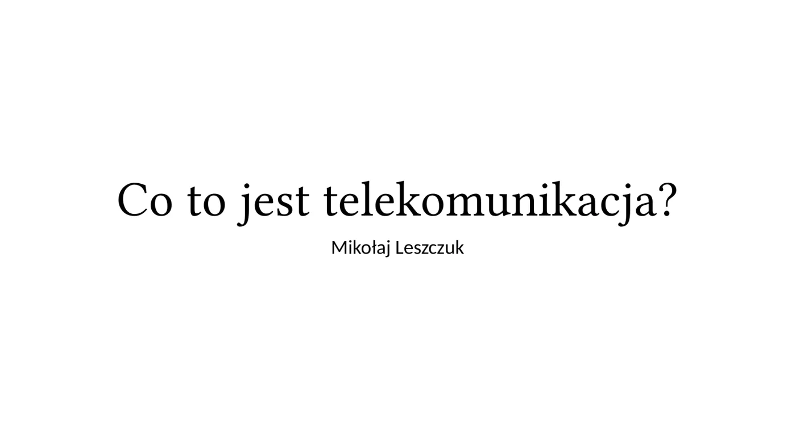

Mikołaj Leszczuk

### 2. Program (plan) wykładu

Pojęcie telekomunikacji  
Rys historyczny (S. Morse, A. G. Bell i inni)  
Modele systemów telekomunikacyjnych (architektury sieci, modele ISO/OSI i TCP/IP)  
2

### 3. Pojęcie telekomunikacji

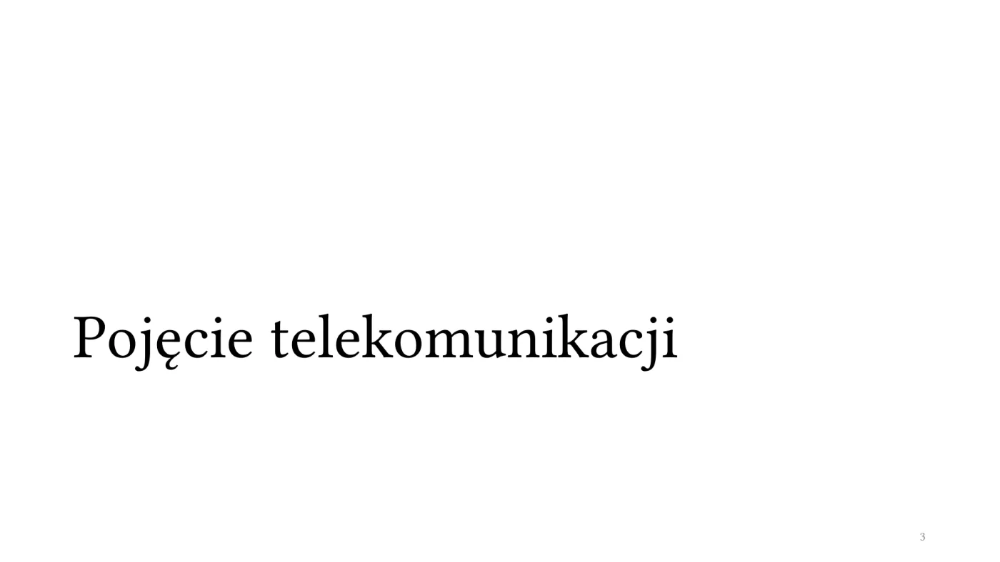

3

### 4. Pojęcie telekomunikacji

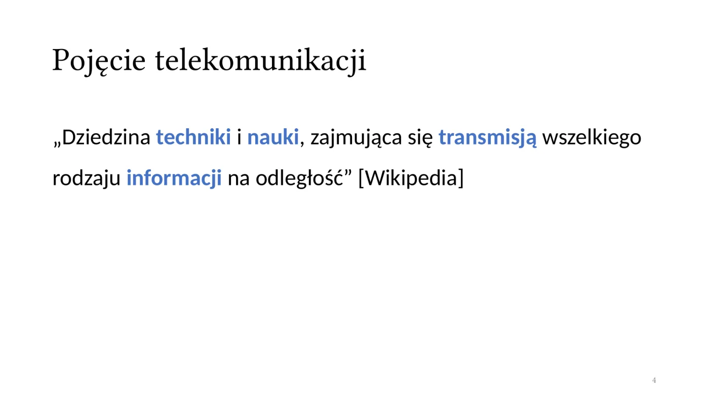

„Dziedzina  
techniki  
i  
nauki  
, zajmująca się  
transmisją  
wszelkiego rodzaju  
informacji  
na odległość” [Wikipedia]  
4

### 5. Rys historyczny

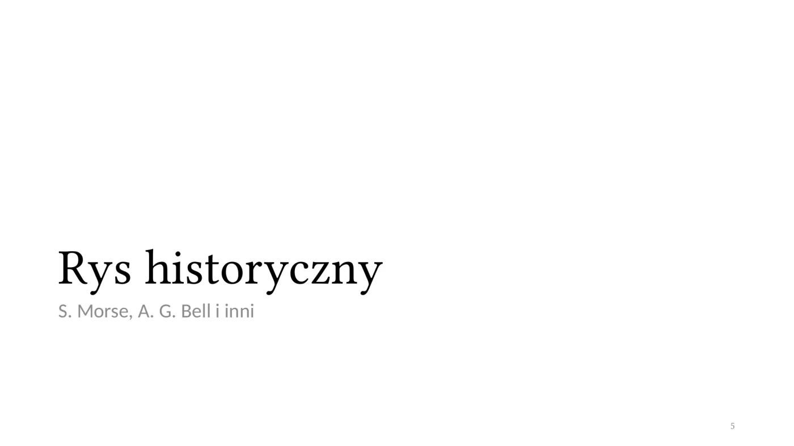

S. Morse, A. G. Bell i inni  
5

### 6. Samuel Finley Breese Morse (telegraf)

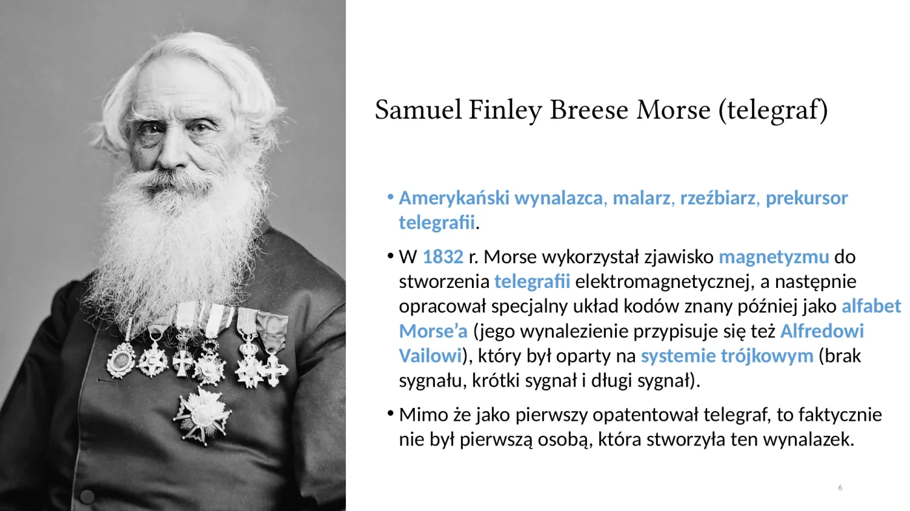

Amerykański wynalazca  
,  
malarz  
,  
rzeźbiarz  
,  
prekursor  
telegrafii  
.  
W  
1832  
r. Morse wykorzystał zjawisko  
magnetyzmu  
do stworzenia  
telegrafii  
elektromagnetycznej, a następnie opracował specjalny układ kodów znany później jako  
alfabet Morse’a  
(jego wynalezienie przypisuje się też  
Alfredowi  
Vailowi  
), który był oparty na  
systemie trójkowym  
(brak sygnału, krótki sygnał i długi sygnał).  
Mimo że jako pierwszy opatentował telegraf, to faktycznie nie był pierwszą osobą, która stworzyła ten wynalazek.  
6

### 7. Alexander Graham Bell (telefon)

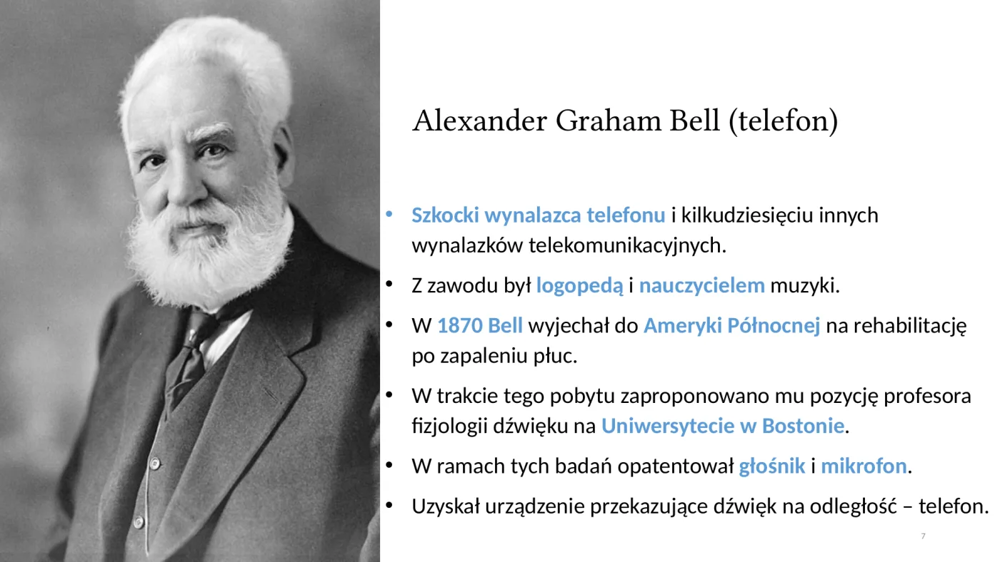

Szkocki  
wynalazca  
telefonu  
i kilkudziesięciu innych wynalazków telekomunikacyjnych.  
Z zawodu był  
logopedą  
i  
nauczycielem  
muzyki.  
W  
1870 Bell  
wyjechał do  
Ameryki Północnej  
na rehabilitację po zapaleniu płuc.  
W trakcie tego pobytu zaproponowano mu pozycję profesora fizjologii dźwięku na  
Uniwersytecie w Bostonie  
.  
W ramach tych badań opatentował  
głośnik  
i  
mikrofon  
.  
Uzyskał urządzenie przekazujące dźwięk na odległość – telefon.  
7

### 8. Guglielmo Marconi (radio)

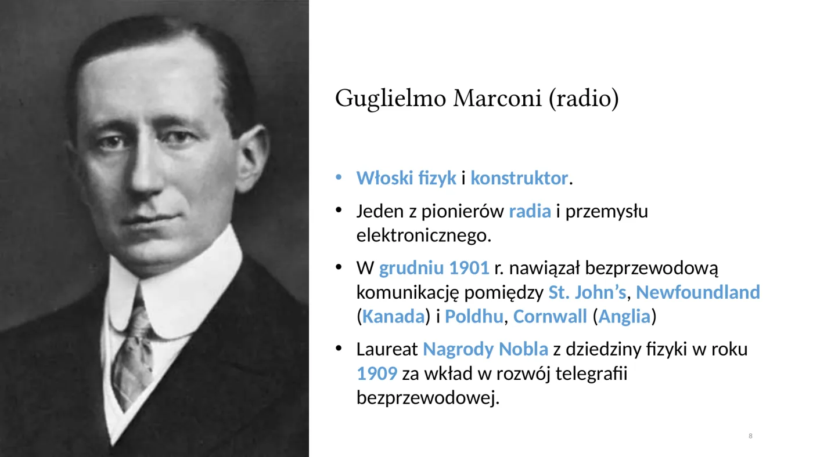

Włoski fizyk  
i  
konstruktor  
.  
Jeden z pionierów  
radia  
i przemysłu elektronicznego.  
W  
grudniu 1901  
r. nawiązał bezprzewodową komunikację pomiędzy  
St. John’s  
,  
Newfoundland  
(  
Kanada  
) i  
Poldhu  
,  
Cornwall  
(  
Anglia  
)  
Laureat  
Nagrody Nobla  
z dziedziny fizyki w roku  
1909  
za wkład w rozwój telegrafii bezprzewodowej.  
8

### 9. Nikola Tesla (radio)

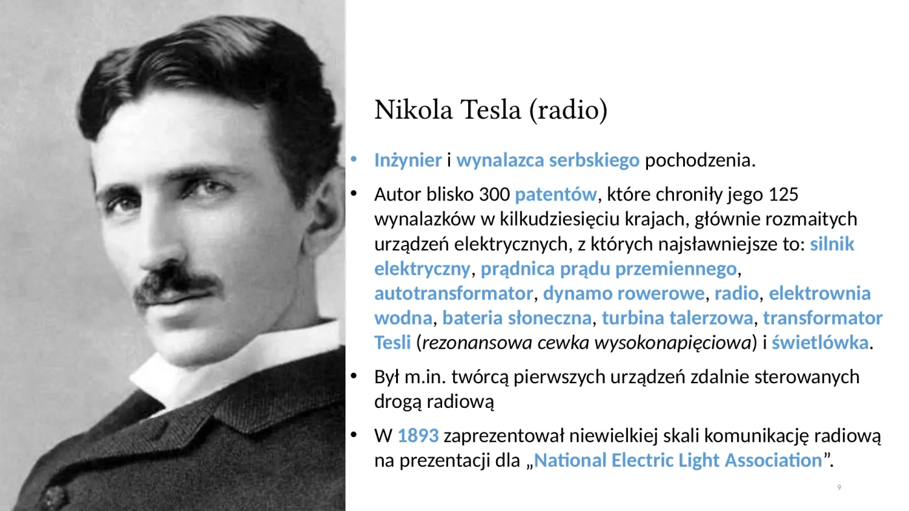

Inżynier  
i  
wynalazca serbskiego  
pochodzenia.  
Autor blisko 300  
patentów  
, które chroniły jego 125 wynalazków w kilkudziesięciu krajach, głównie rozmaitych urządzeń elektrycznych, z których najsławniejsze to:  
silnik elektryczny  
,  
prądnica prądu przemiennego  
,  
autotransformator  
,  
dynamo rowerowe  
,  
radio  
,  
elektrownia wodna  
,  
bateria słoneczna  
,  
turbina talerzowa  
,  
transformator Tesli  
(  
rezonansowa cewka wysokonapięciowa  
) i  
świetlówka  
.  
Był m.in. twórcą pierwszych urządzeń zdalnie sterowanych drogą radiową  
W  
1893  
zaprezentował niewielkiej skali komunikację radiową na prezentacji dla „  
National  
Electric  
Light  
Association  
”.  
9

### 10. John Logie Baird (telewizja)

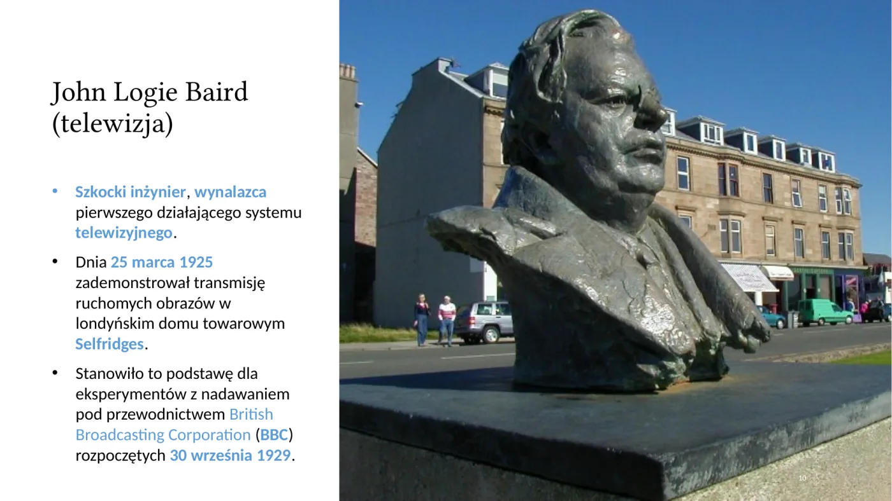

Szkocki inżynier  
,  
wynalazca  
pierwszego działającego systemu  
telewizyjnego  
.  
Dnia  
25 marca 1925  
zademonstrował transmisję ruchomych obrazów w londyńskim domu towarowym  
Selfridges  
.  
Stanowiło to podstawę dla eksperymentów z nadawaniem pod przewodnictwem  
British  
Broadcasting  
Corporation  
(  
BBC  
) rozpoczętych  
30 września 1929  
.  
10

### 11. George Robert

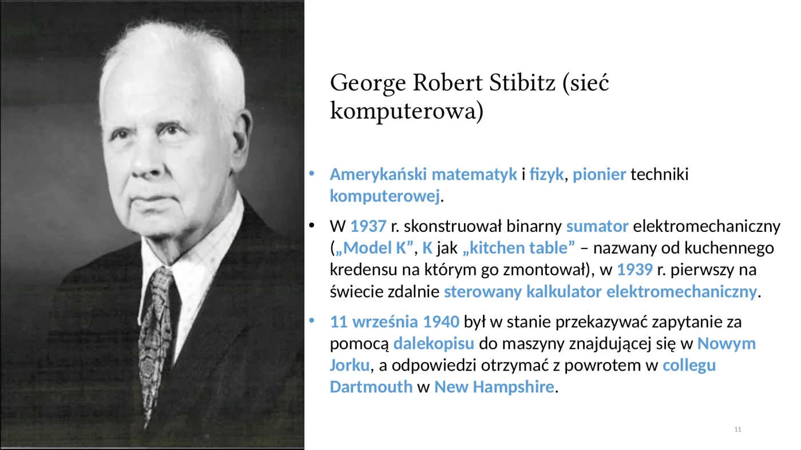

Stibitz  
(sieć komputerowa)  
Amerykański matematyk  
i  
fizyk  
,  
pionier  
techniki  
komputerowej  
.  
W  
1937  
r. skonstruował binarny  
sumator  
elektromechaniczny (  
„Model K”  
,  
K  
jak  
„  
kitchen  
table  
”  
– nazwany od kuchennego kredensu na którym go zmontował), w  
1939  
r. pierwszy na świecie zdalnie  
sterowany kalkulator elektromechaniczny  
.  
11 września 1940  
był w stanie przekazywać zapytanie za pomocą  
dalekopisu  
do maszyny znajdującej się w  
Nowym Jorku  
, a odpowiedzi otrzymać z powrotem w  
collegu  
Dartmouth  
w  
New Hampshire  
.  
11

### 12. Robert

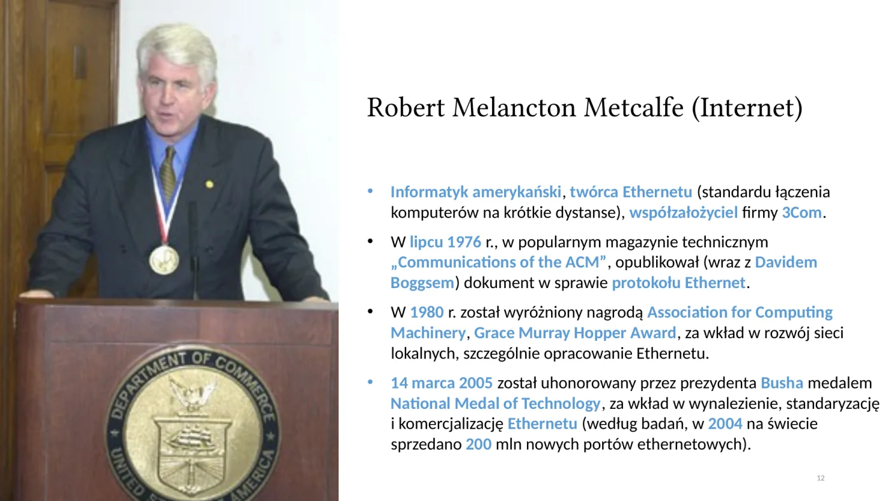

Melancton  
Metcalfe  
(Internet)  
Informatyk amerykański  
,  
twórca Ethernetu  
(standardu łączenia komputerów na krótkie dystanse),  
współzałożyciel  
firmy  
3Com  
.  
W  
lipcu 1976  
r., w popularnym magazynie technicznym  
„Communications of the ACM”  
, opublikował (wraz z  
Davidem  
Boggsem  
) dokument w sprawie  
protokołu Ethernet  
.  
W  
1980  
r. został wyróżniony nagrodą  
Association  
for Computing  
Machinery  
,  
Grace Murray Hopper  
Award  
, za wkład w rozwój sieci lokalnych, szczególnie opracowanie Ethernetu.  
14 marca 2005  
został uhonorowany przez prezydenta  
Busha  
medalem  
National  
Medal of Technology  
, za wkład w wynalezienie, standaryzację i komercjalizację  
Ethernetu  
(według badań, w  
2004  
na świecie sprzedano  
200  
mln nowych portów  
ethernetowych  
).  
12

### 13. Modele systemów telekomunikacyjnych

Architektury sieci  
13

### 14. Historia warstwowych architektur sieci komputerowych

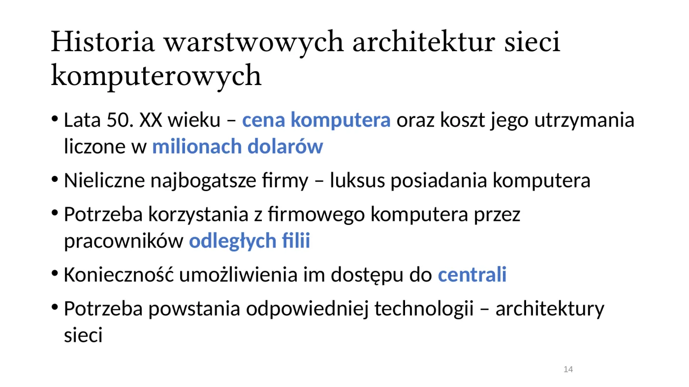

Lata 50. XX wieku –  
cena komputera  
oraz koszt jego utrzymania liczone w  
milionach dolarów  
Nieliczne najbogatsze firmy – luksus posiadania komputera  
Potrzeba korzystania z firmowego komputera przez pracowników  
odległych filii  
Konieczność umożliwienia im dostępu do  
centrali  
Potrzeba powstania odpowiedniej technologii – architektury sieci  
14

### 15. Architektura sieci

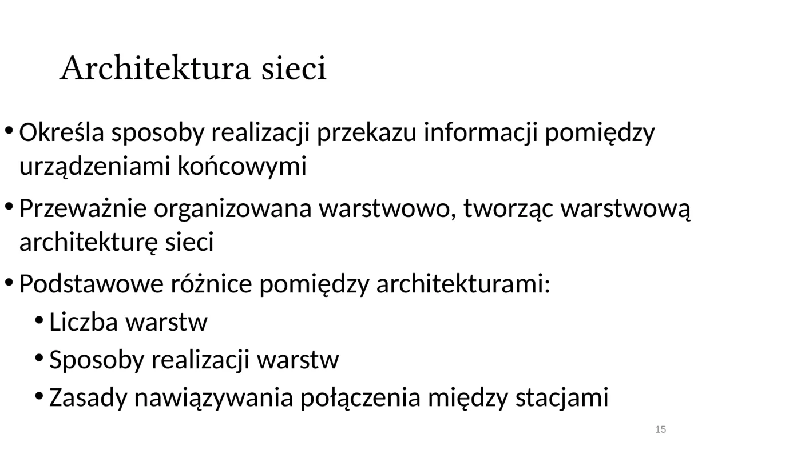

Określa sposoby realizacji przekazu informacji pomiędzy urządzeniami końcowymi  
Przeważnie organizowana warstwowo, tworząc warstwową architekturę sieci  
Podstawowe różnice pomiędzy architekturami:  
Liczba warstw  
Sposoby realizacji warstw  
Zasady nawiązywania połączenia między stacjami  
15

### 16. Ważniejsze warstwowe architektury sieci

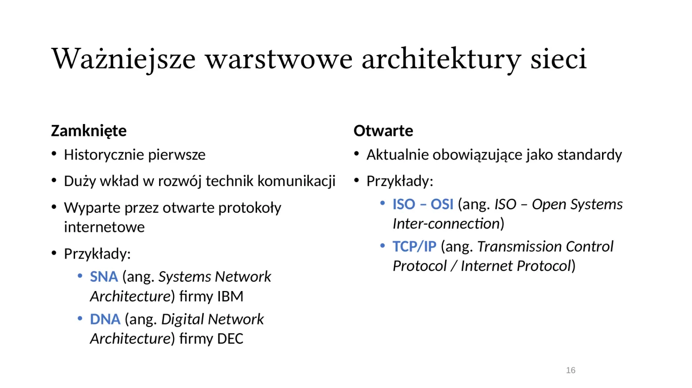

Zamknięte  
Historycznie pierwsze  
Duży wkład w rozwój technik komunikacji  
Wyparte przez otwarte protokoły internetowe  
Przykłady:  
SNA  
(ang.  
Systems Network Architecture  
) firmy IBM  
DNA  
(ang.  
Digital Network Architecture  
) firmy DEC  
Otwarte  
Aktualnie obowiązujące jako standardy  
Przykłady:  
ISO – OSI  
(ang.  
ISO –  
Open Systems Inter-  
connection  
)  
TCP/IP  
(ang.  
Transmission Control Protocol  
/  
Internet Protocol  
)  
16

### 17. Modele systemów telekomunikacyjnych

Model ISO/OSI  
17

### 18. Model ISO/OSI (1/3)

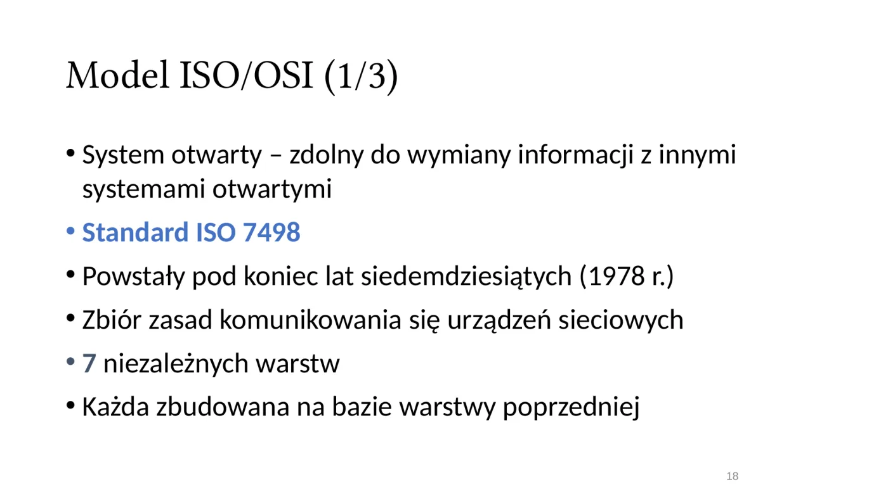

System otwarty – zdolny do wymiany informacji z innymi systemami otwartymi  
Standard ISO 7498  
Powstały pod koniec lat siedemdziesiątych (1978 r.)  
Zbiór zasad komunikowania się urządzeń sieciowych  
7  
niezależnych warstw  
Każda zbudowana na bazie warstwy poprzedniej  
18

### 19. Model ISO/OSI (2/3)

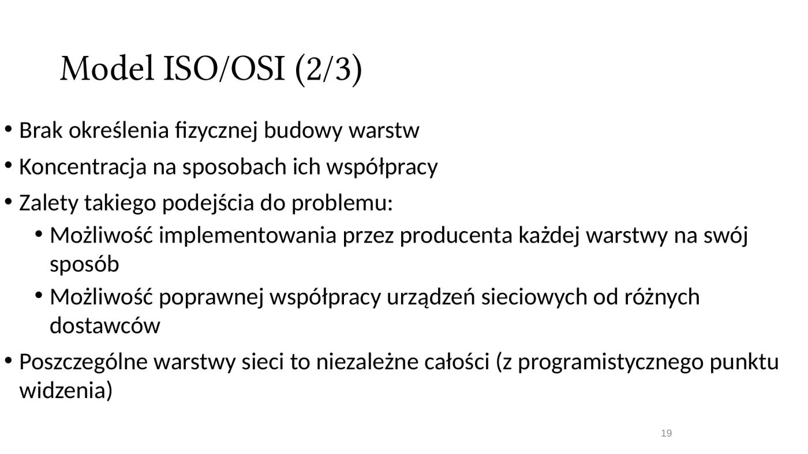

Brak określenia fizycznej budowy warstw  
Koncentracja na sposobach ich współpracy  
Zalety takiego podejścia do problemu:  
Możliwość implementowania przez producenta każdej warstwy na swój sposób  
Możliwość poprawnej współpracy urządzeń sieciowych od różnych dostawców  
Poszczególne warstwy sieci to niezależne całości (z programistycznego punktu widzenia)  
19

### 20. Model ISO/OSI (3/3)

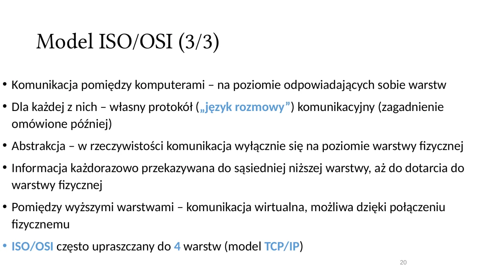

Komunikacja pomiędzy komputerami – na poziomie odpowiadających sobie warstw  
Dla każdej z nich – własny protokół (  
„język rozmowy”  
) komunikacyjny (zagadnienie omówione później)  
Abstrakcja – w rzeczywistości komunikacja wyłącznie się na poziomie warstwy fizycznej  
Informacja każdorazowo przekazywana do sąsiedniej niższej warstwy, aż do dotarcia do warstwy fizycznej  
Pomiędzy wyższymi warstwami – komunikacja wirtualna, możliwa dzięki połączeniu fizycznemu  
ISO/OSI  
często upraszczany do  
4  
warstw (model  
TCP/IP  
)  
20

### 21. Model ISO/OSI

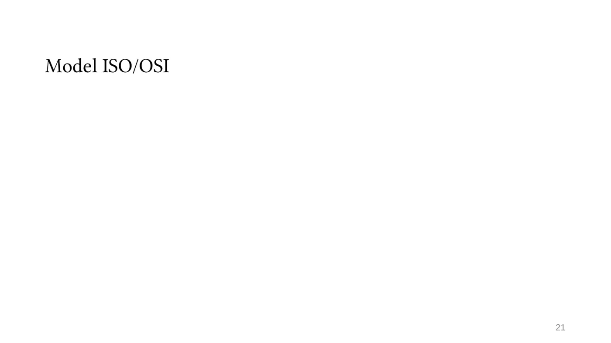

21

[Odtwórz materiał z tego slajdu](../web/media/02/slide-021-media1.mp4)

[Odtwórz materiał z tego slajdu](../web/media/02/slide-021-media1.mp4)

### 22. Warstwa 1 ISO/OSI – fizyczna

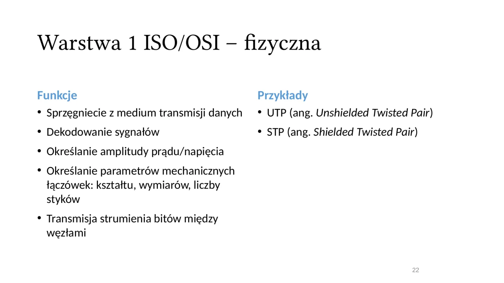

Funkcje  
Sprzęgniecie z medium transmisji danych  
Dekodowanie sygnałów  
Określanie amplitudy prądu/napięcia  
Określanie parametrów mechanicznych łączówek: kształtu, wymiarów, liczby styków  
Transmisja strumienia bitów między węzłami  
Przykłady  
UTP (ang.  
Unshielded  
Twisted  
Pair  
)  
STP (ang.  
Shielded  
Twisted  
Pair  
)  
22

### 23. Warstwa 2 ISO/OSI – łącza danych

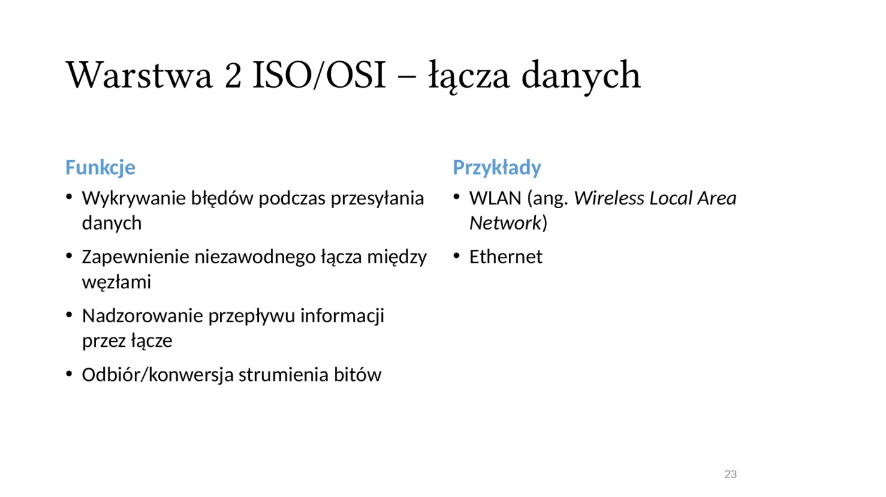

Funkcje  
Wykrywanie błędów podczas przesyłania danych  
Zapewnienie niezawodnego łącza między węzłami  
Nadzorowanie przepływu informacji przez łącze  
Odbiór/konwersja strumienia bitów  
Przykłady  
WLAN (ang.  
Wireless  
Local  
Area Network  
)  
Ethernet  
23

### 24. Warstwa 3 ISO/OSI – sieciowa

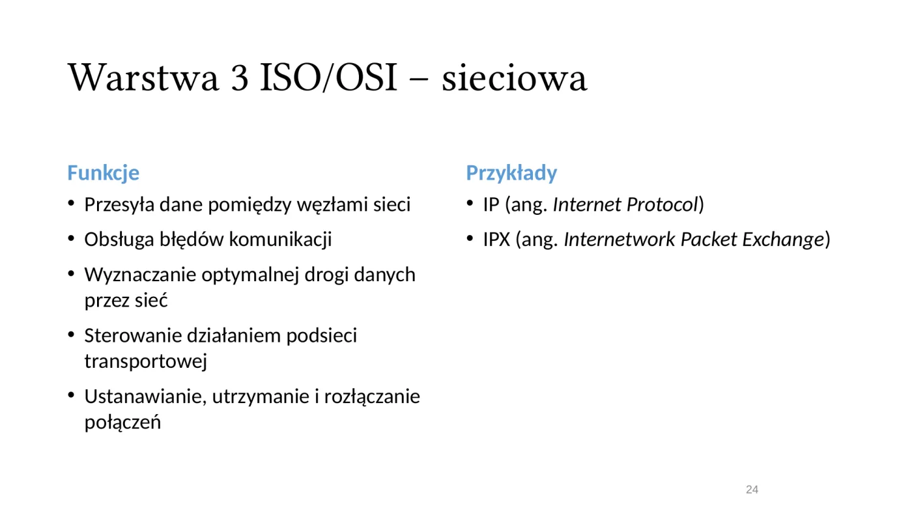

Funkcje  
Przesyła dane pomiędzy węzłami sieci  
Obsługa błędów komunikacji  
Wyznaczanie optymalnej drogi danych przez sieć  
Sterowanie działaniem podsieci transportowej  
Ustanawianie, utrzymanie i rozłączanie połączeń  
Przykłady  
IP (ang.  
Internet Protocol  
)  
IPX (ang.  
Internetwork Packet Exchange  
)  
24

### 25. Warstwa 4 ISO/OSI – transportowa

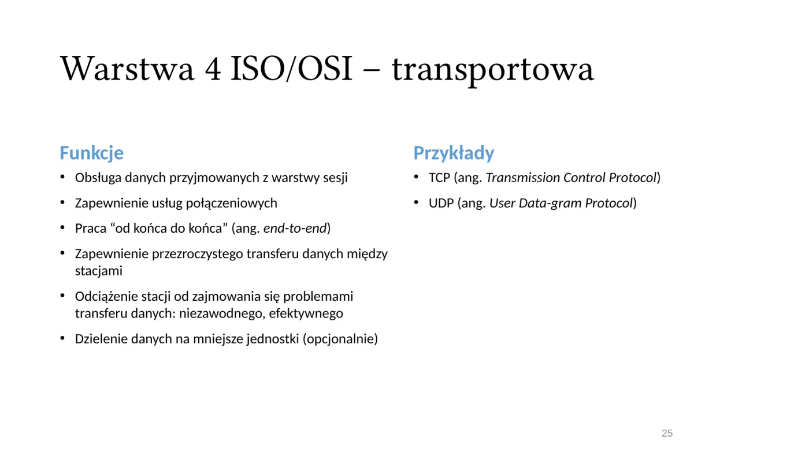

Funkcje  
Obsługa danych przyjmowanych z warstwy sesji  
Zapewnienie usług połączeniowych  
Praca “od końca do końca” (ang.  
end-to-end  
)  
Zapewnienie przezroczystego transferu danych między stacjami  
Odciążenie stacji od zajmowania się problemami transferu danych: niezawodnego, efektywnego  
Dzielenie danych na mniejsze jednostki (opcjonalnie)  
Przykłady  
TCP (ang.  
Transmission Control Protocol  
)  
UDP  
(ang.  
User Data-gram Protocol  
)  
25

### 26. Warstwa 5 ISO/OSI – sesji

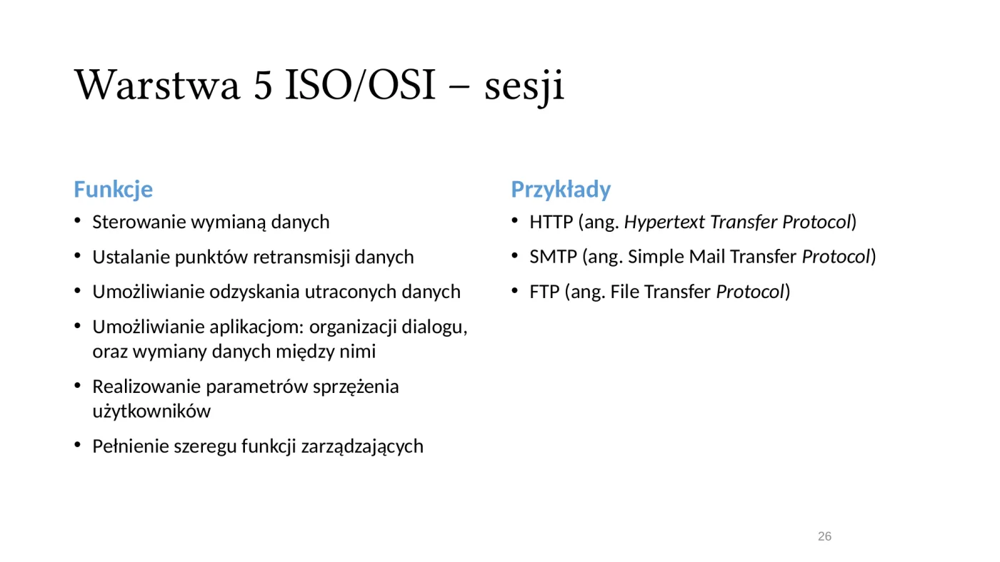

Funkcje  
Sterowanie wymianą danych  
Ustalanie punktów retransmisji danych  
Umożliwianie odzyskania utraconych danych  
Umożliwianie aplikacjom: organizacji dialogu, oraz wymiany danych między nimi  
Realizowanie parametrów sprzężenia użytkowników  
Pełnienie szeregu funkcji zarządzających  
Przykłady  
HTTP (ang.  
Hypertext Transfer Protocol  
)  
SMTP  
(ang.  
Simple Mail Transfer  
Protocol  
)  
FTP  
(ang.  
File Transfer  
Protocol  
)  
26

### 27. Warstwa 6 ISO/OSI – prezentacji

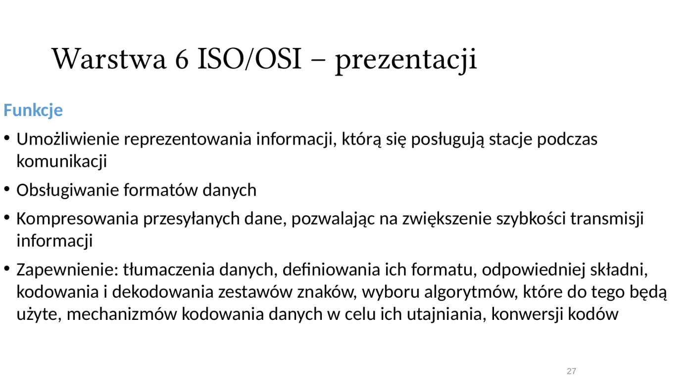

Funkcje  
Umożliwienie reprezentowania informacji, którą się posługują stacje podczas komunikacji  
Obsługiwanie formatów danych  
Kompresowania przesyłanych dane, pozwalając na zwiększenie szybkości transmisji informacji  
Zapewnienie: tłumaczenia danych, definiowania ich formatu, odpowiedniej składni, kodowania i dekodowania zestawów znaków, wyboru algorytmów, które do tego będą użyte, mechanizmów kodowania danych w celu ich utajniania, konwersji kodów  
27

### 28. Warstwa 7 ISO/OSI – aplikacji

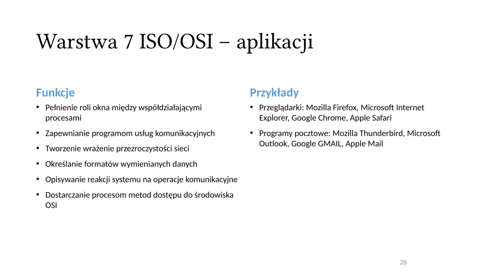

Funkcje  
Pełnienie roli okna między współdziałającymi procesami  
Zapewnianie programom usług komunikacyjnych  
Tworzenie wrażenie przezroczystości sieci  
Określanie formatów wymienianych danych  
Opisywanie reakcji systemu na operacje komunikacyjne  
Dostarczanie procesom metod dostępu do środowiska OSI  
Przykłady  
Przeglądarki: Mozilla Firefox, Microsoft Internet Explorer, Google Chrome, Apple Safari  
Programy pocztowe: Mozilla Thunderbird, Microsoft Outlook, Google GMAIL, Apple Mail  
28

### 29. Protokoły (1/2)

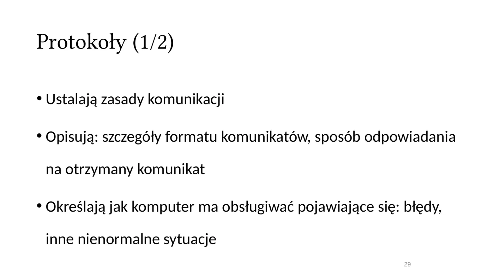

Ustalają zasady komunikacji  
Opisują: szczegóły formatu komunikatów, sposób odpowiadania na otrzymany komunikat  
Określają jak komputer ma obsługiwać pojawiające się: błędy, inne nienormalne sytuacje  
29

### 30. Protokoły (2/2)

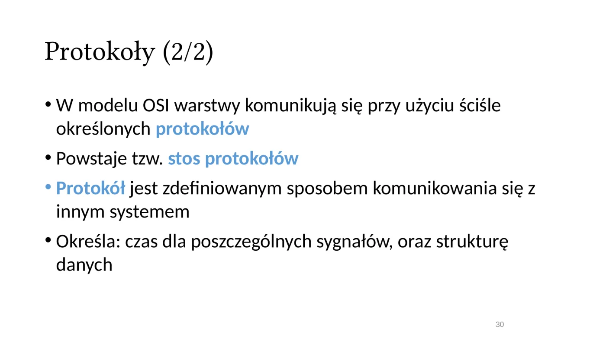

W modelu OSI warstwy komunikują się przy użyciu ściśle określonych  
protokołów  
Powstaje tzw.  
stos protokołów  
Protokół  
jest zdefiniowanym sposobem komunikowania się z innym systemem  
Określa: czas dla poszczególnych sygnałów, oraz strukturę danych  
30

### 31. Ramki i pakiety (1/3)

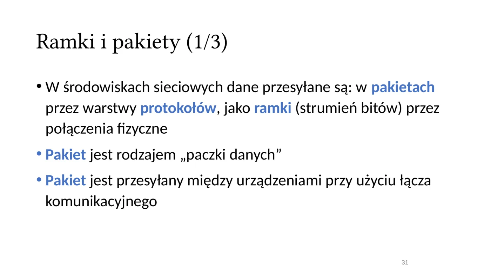

W środowiskach sieciowych dane przesyłane są: w  
pakietach  
przez warstwy  
protokołów  
, jako  
ramki  
(strumień bitów) przez połączenia fizyczne  
Pakiet  
jest rodzajem „paczki danych”  
Pakiet  
jest przesyłany między urządzeniami przy użyciu łącza komunikacyjnego  
31

### 32. Ramki i pakiety (2/3)

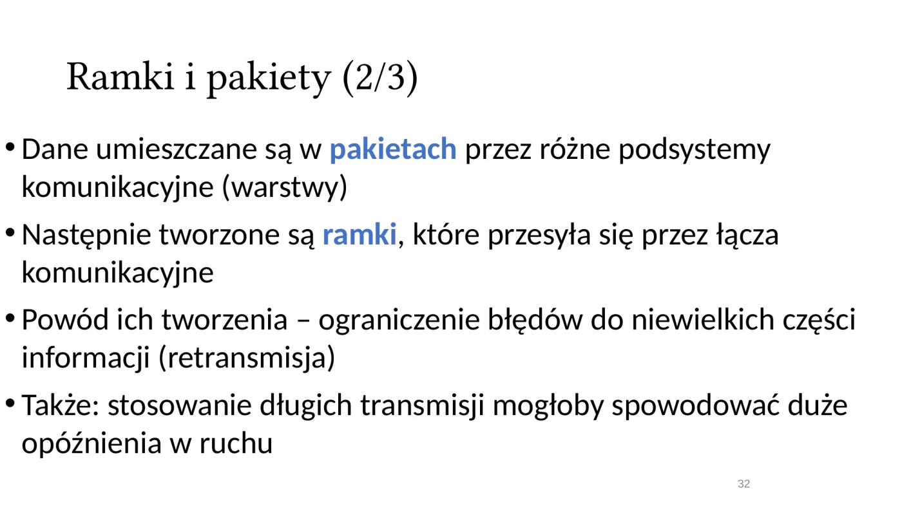

Dane umieszczane są w  
pakietach  
przez różne podsystemy komunikacyjne (warstwy)  
Następnie tworzone są  
ramki  
, które przesyła się przez łącza komunikacyjne  
Powód ich tworzenia – ograniczenie błędów do niewielkich części informacji (retransmisja)  
Także: stosowanie długich transmisji mogłoby spowodować duże opóźnienia w ruchu  
32

### 33. Ramki i pakiety (3/3)

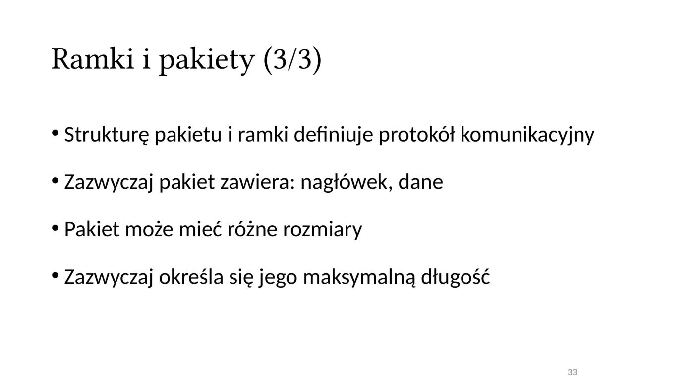

Strukturę pakietu i ramki definiuje protokół komunikacyjny  
Zazwyczaj pakiet zawiera: nagłówek, dane  
Pakiet może mieć różne rozmiary  
Zazwyczaj określa się jego maksymalną długość  
33

### 34. Przykładowa zawartości nagłówka

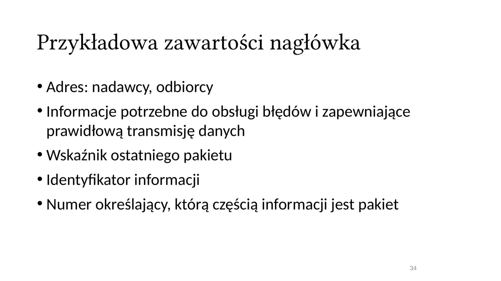

Adres: nadawcy, odbiorcy  
Informacje potrzebne do obsługi błędów i zapewniające prawidłową transmisję danych  
Wskaźnik ostatniego pakietu  
Identyfikator informacji  
Numer określający, którą częścią informacji jest pakiet  
34

### 35. Protokoły komunikacyjne poszczególnych warstw (1/2)

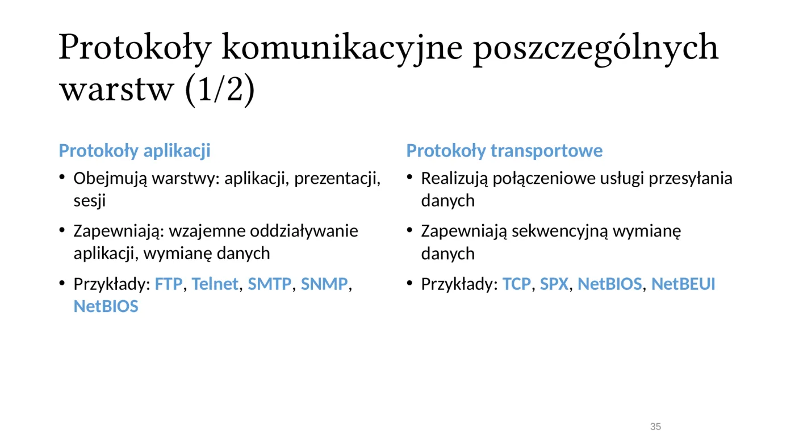

Protokoły aplikacji  
Obejmują warstwy: aplikacji, prezentacji, sesji  
Zapewniają: wzajemne oddziaływanie aplikacji, wymianę danych  
Przykłady:  
FTP  
,  
Telnet  
,  
SMTP  
,  
SNMP  
,  
NetBIOS  
Protokoły transportowe  
Realizują połączeniowe usługi przesyłania danych  
Zapewniają sekwencyjną wymianę danych  
Przykłady:  
TCP  
,  
SPX  
,  
NetBIOS  
,  
NetBEUI  
35

### 36. Protokoły komunikacyjne poszczególnych warstw (2/2)

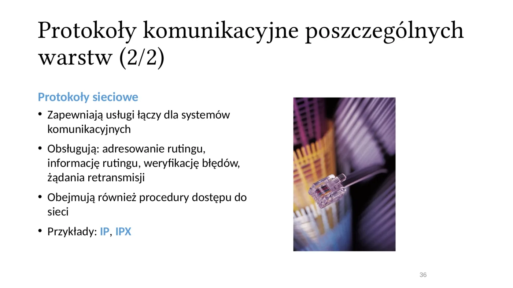

Protokoły sieciowe  
Zapewniają usługi łączy dla systemów komunikacyjnych  
Obsługują: adresowanie rutingu, informację rutingu, weryfikację błędów, żądania retransmisji  
Obejmują również procedury dostępu do sieci  
Przykłady:  
IP  
,  
IPX  
36

### 37. Dialog między równorzędnymi warstwami protokołów

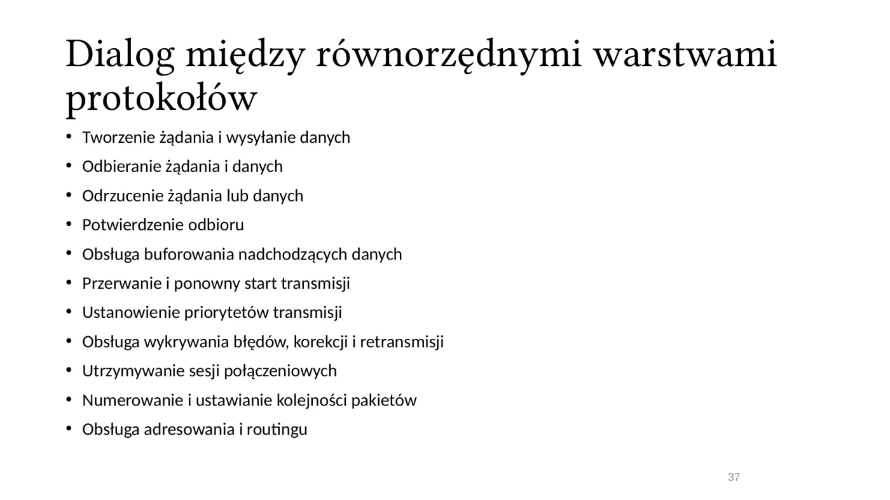

Tworzenie żądania i wysyłanie danych  
Odbieranie żądania i danych  
Odrzucenie żądania lub danych  
Potwierdzenie odbioru  
Obsługa buforowania nadchodzących danych  
Przerwanie i ponowny start transmisji  
Ustanowienie priorytetów transmisji  
Obsługa wykrywania błędów, korekcji i retransmisji  
Utrzymywanie sesji połączeniowych  
Numerowanie i ustawianie kolejności pakietów  
Obsługa adresowania i routingu  
37

### 38. Komunikacja w Modelu OSI (przykład z warstwami 3 do 5

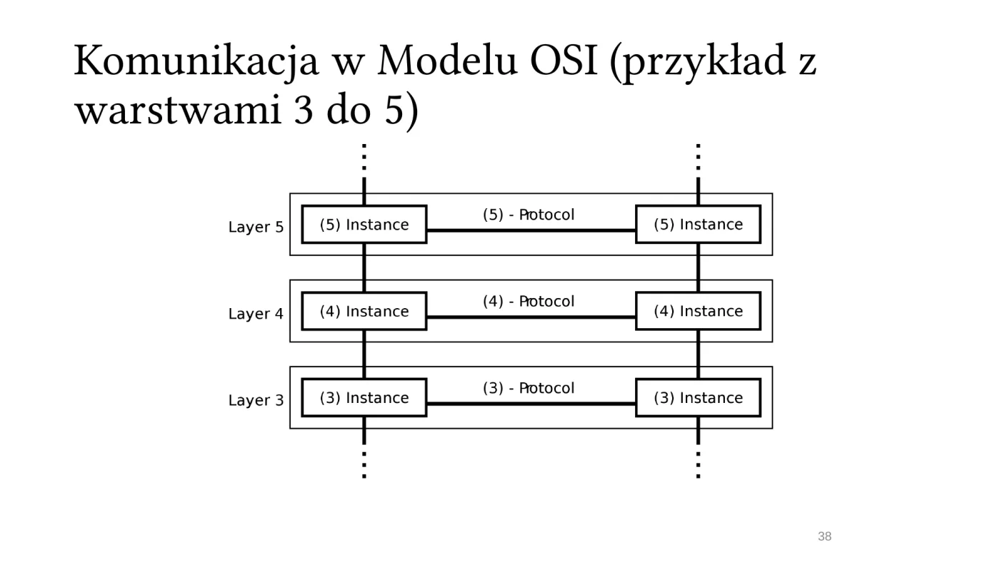

)  
38

### 39. Konwersja i kapsułkowanie protokołów

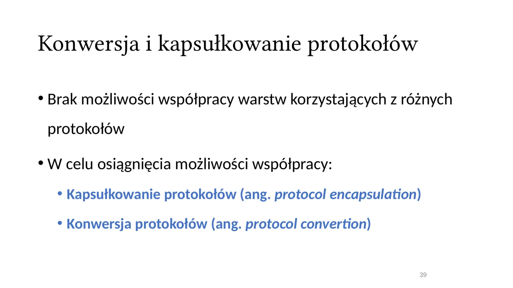

Brak możliwości współpracy warstw korzystających z różnych protokołów  
W celu osiągnięcia możliwości współpracy:  
Kapsułkowanie protokołów (ang.  
protocol  
encapsulation  
)  
Konwersja protokołów (ang.  
protocol  
convertion  
)  
39

### 40. Kapsułkowanie protokołów (1/2)

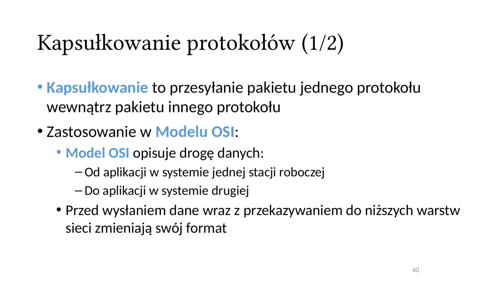

Kapsułkowanie  
to przesyłanie pakietu jednego protokołu wewnątrz pakietu innego protokołu  
Zastosowanie w  
Modelu OSI  
:  
Model OSI  
opisuje drogę danych:  
Od aplikacji w systemie jednej stacji roboczej  
Do aplikacji w systemie drugiej  
Przed wysłaniem dane wraz z przekazywaniem do niższych warstw sieci zmieniają swój format  
40

### 41. Kapsułkowanie protokołów (2/2)

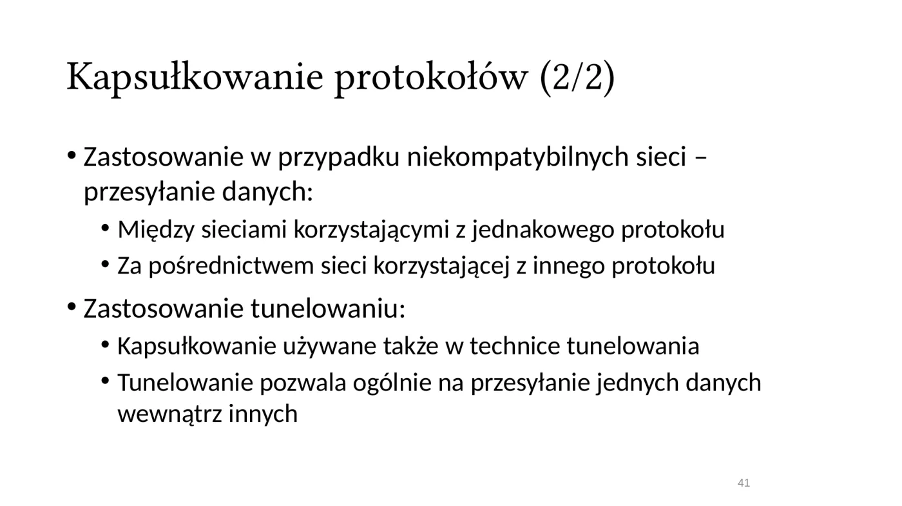

Zastosowanie w przypadku niekompatybilnych sieci – przesyłanie danych:  
Między sieciami korzystającymi z jednakowego protokołu  
Za pośrednictwem sieci korzystającej z innego protokołu  
Zastosowanie tunelowaniu:  
Kapsułkowanie używane także w technice tunelowania  
Tunelowanie pozwala ogólnie na przesyłanie jednych danych wewnątrz innych  
41

### 42. Kapsułkowanie danych wg Modelu OSI

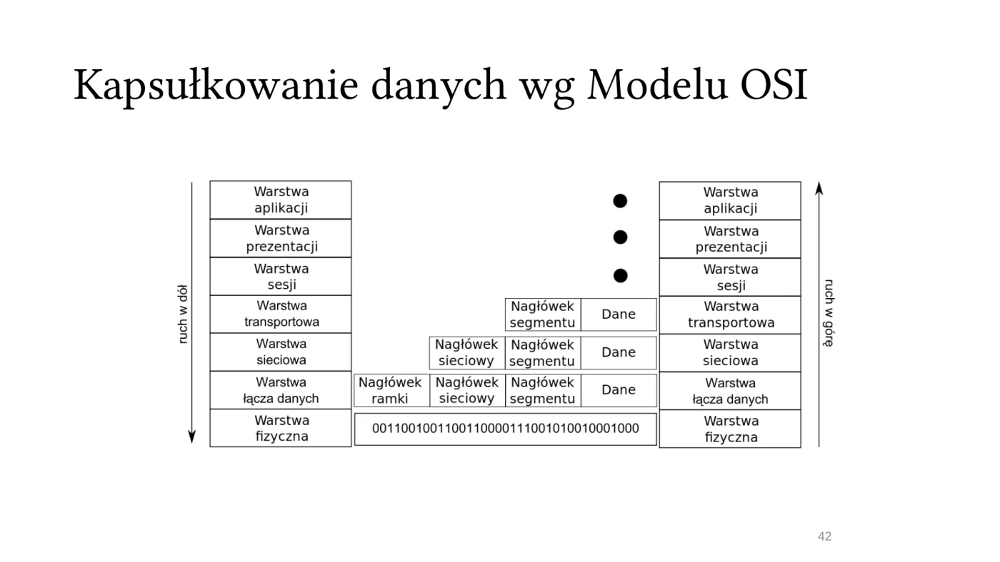

42

### 43. Animacja wyjaśniająca jak działa model OSI – pakiety przechodzące przez stos protokołów

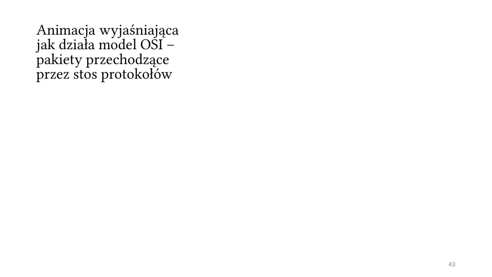

43

[Odtwórz materiał z tego slajdu](../web/media/02/slide-043-media2.mp4)

[Odtwórz materiał z tego slajdu](../web/media/02/slide-043-media2.mp4)

### 44. Animacja przepływu danych przez warstwy modelu ISO/OSI

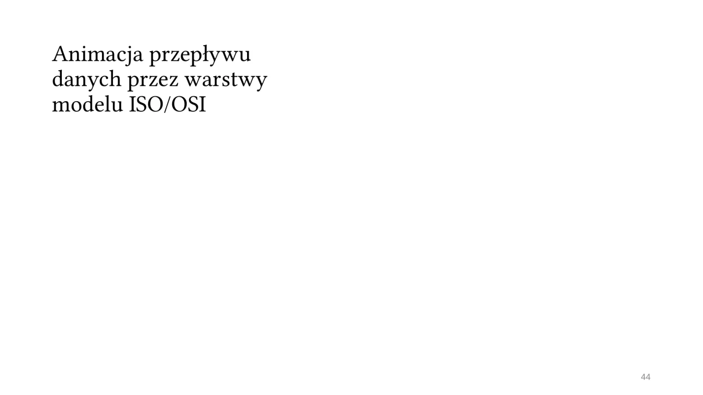

44

[Odtwórz materiał z tego slajdu](../web/media/02/slide-044-media3.mp4)

[Odtwórz materiał z tego slajdu](../web/media/02/slide-044-media3.mp4)

### 45. Konwersja protokołów

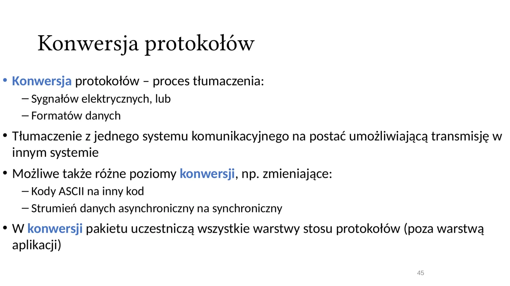

Konwersja  
protokołów – proces tłumaczenia:  
Sygnałów elektrycznych, lub  
Formatów danych  
Tłumaczenie z jednego systemu komunikacyjnego na postać umożliwiającą transmisję w innym systemie  
Możliwe także różne poziomy  
konwersji  
, np. zmieniające:  
Kody ASCII na inny kod  
Strumień danych asynchroniczny na synchroniczny  
W  
konwersji  
pakietu uczestniczą wszystkie warstwy stosu protokołów (poza warstwą aplikacji)  
45

### 46. Jak zapamiętać warstwy modelu warstwowego?

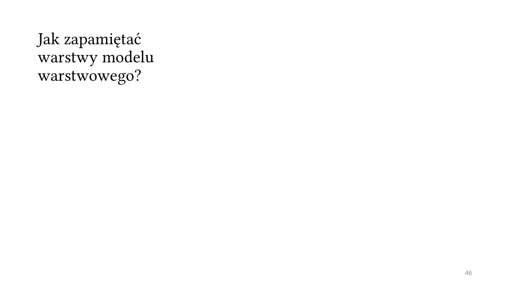

46

[Odtwórz materiał z tego slajdu](../web/media/02/slide-046-media4.mp4)

[Odtwórz materiał z tego slajdu](../web/media/02/slide-046-media4.mp4)

### 47. Modele systemów telekomunikacyjnych

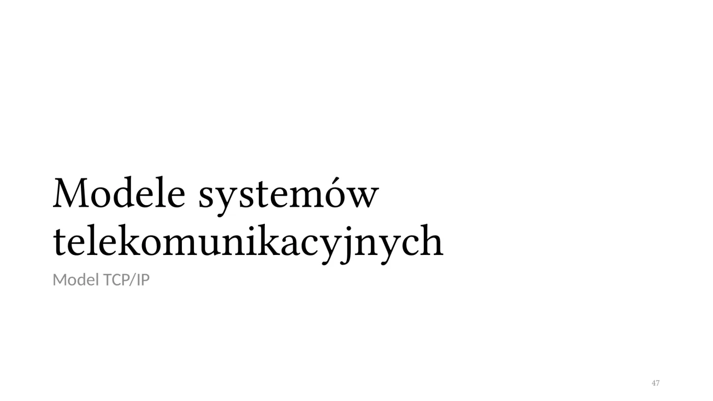

Model TCP/IP  
47

### 48. Uproszczony stos protokołów

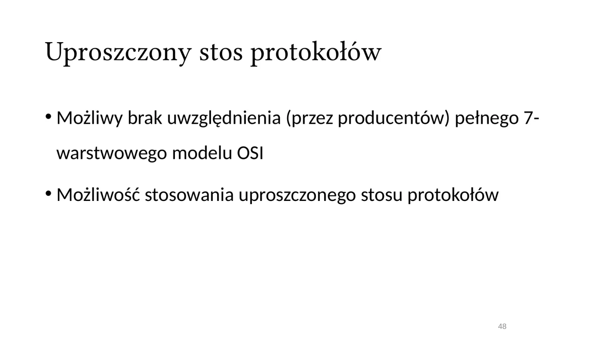

Możliwy brak uwzględnienia (przez producentów) pełnego 7-warstwowego modelu OSI  
Możliwość stosowania uproszczonego stosu protokołów  
48

### 49. Model TCP/IP

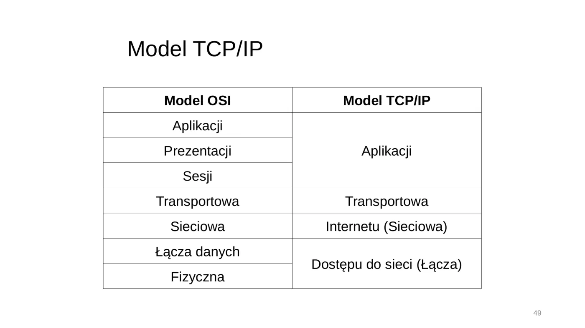

Model OSI  
Model TCP/IP  
Aplikacji  
Aplikacji  
Prezentacji  
Sesji  
Transportowa  
Transportowa  
Sieciowa  
Internetu (Sieciowa)  
Łącza danych  
Dostępu do sieci (Łącza)  
Fizyczna  
49

### 50. Warstwa 1 TCP/IP – łącza

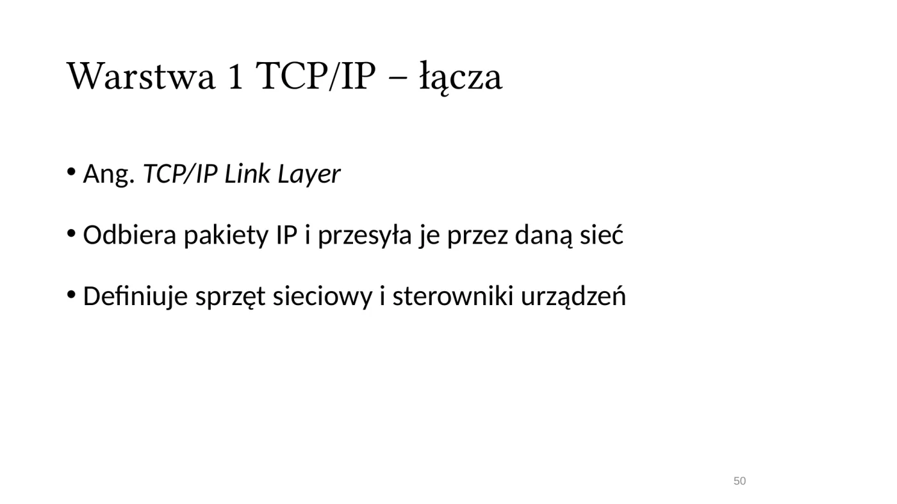

Ang.  
TCP/IP Link Layer  
Odbiera pakiety IP i przesyła je przez daną sieć  
Definiuje sprzęt sieciowy i sterowniki urządzeń  
50

### 51. Warstwa 2 TCP/IP – sieciowa

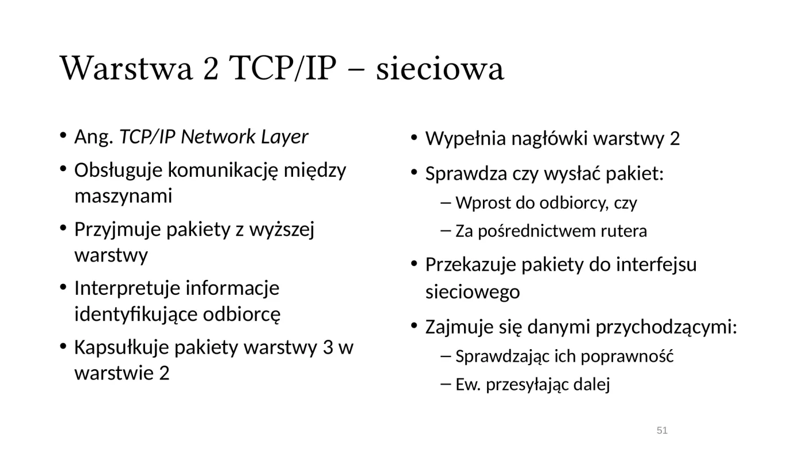

Ang.  
TCP/IP Network Layer  
Obsługuje komunikację między maszynami  
Przyjmuje pakiety z wyższej warstwy  
Interpretuje informacje identyfikujące odbiorcę  
Kapsułkuje pakiety warstwy 3 w warstwie 2  
Wypełnia nagłówki warstwy 2  
Sprawdza czy wysłać pakiet:  
Wprost do odbiorcy, czy  
Za pośrednictwem rutera  
Przekazuje pakiety do interfejsu sieciowego  
Zajmuje się danymi przychodzącymi:  
Sprawdzając ich poprawność  
Ew. przesyłając dalej  
51

### 52. Warstwa 3 TCP/IP – transportowa

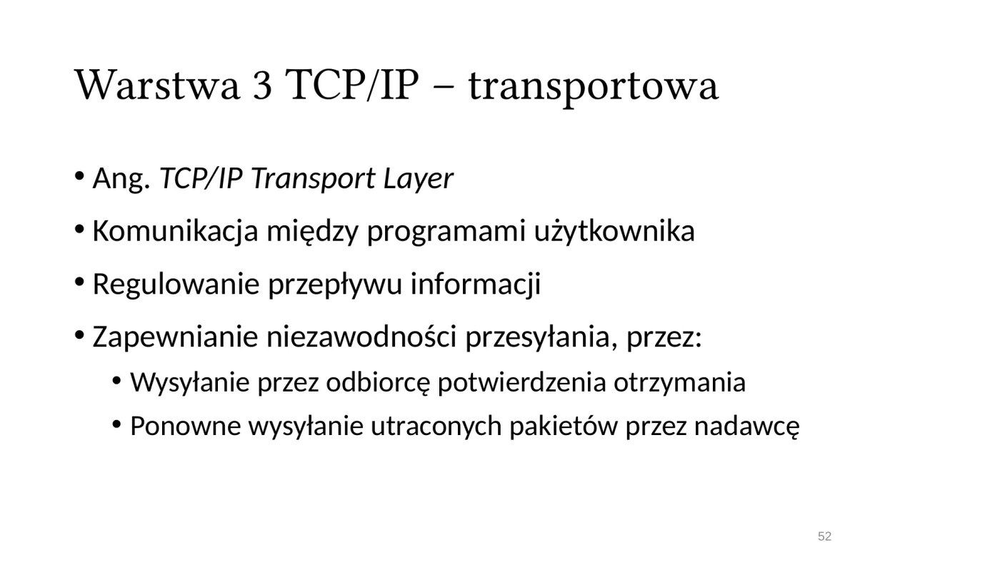

Ang.  
TCP/IP Transport Layer  
Komunikacja między programami użytkownika  
Regulowanie przepływu informacji  
Zapewnianie niezawodności przesyłania, przez:  
Wysyłanie przez odbiorcę potwierdzenia otrzymania  
Ponowne wysyłanie utraconych pakietów przez nadawcę  
52

### 53. Warstwa 4 TCP/IP – aplikacji

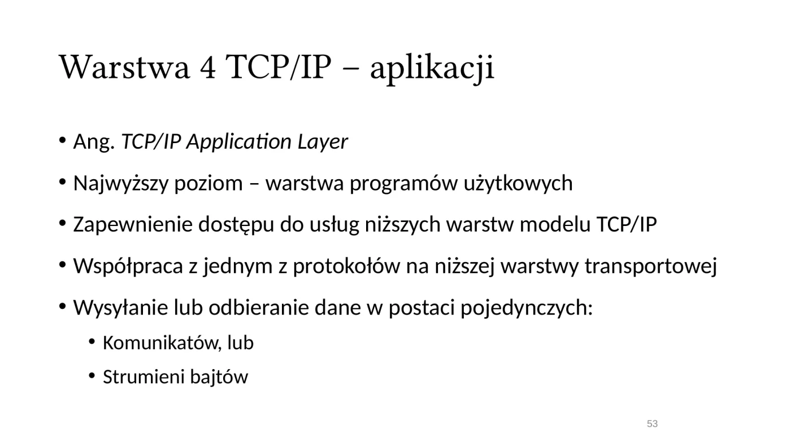

Ang.  
TCP/IP Application Layer  
Najwyższy poziom – warstwa programów użytkowych  
Zapewnienie dostępu do usług niższych warstw modelu TCP/IP  
Współpraca z jednym z protokołów na niższej warstwy transportowej  
Wysyłanie lub odbieranie dane w postaci pojedynczych:  
Komunikatów, lub  
Strumieni bajtów  
53

### 54. Połączenie TCP/IP dwóch hostów internetowych

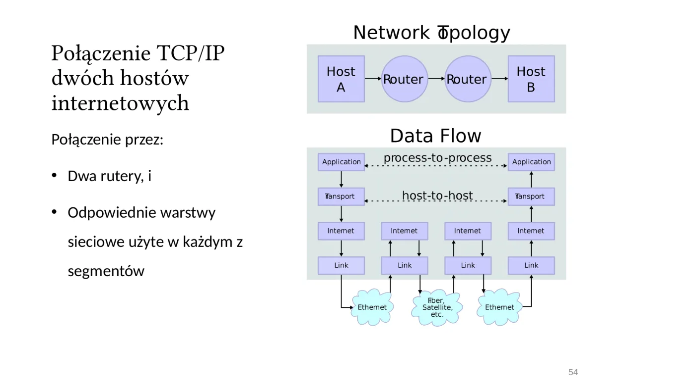

Połączenie przez:  
Dwa rutery, i  
Odpowiednie warstwy sieciowe użyte w każdym z segmentów  
54

### 55. Kapsułkowanie TCP/IP

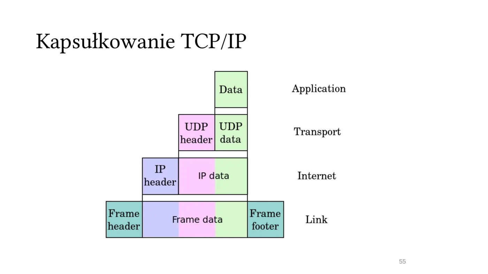

55

### 56. Podsumowanie wykładu

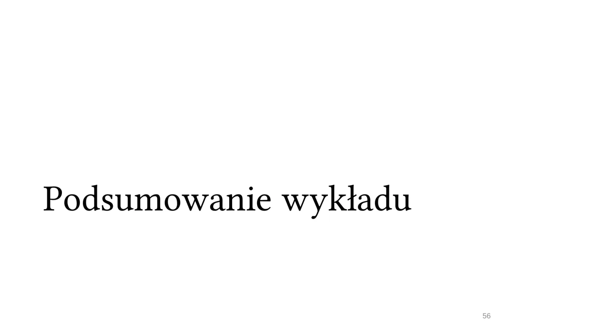

56

### 57. Podsumowanie wykładu

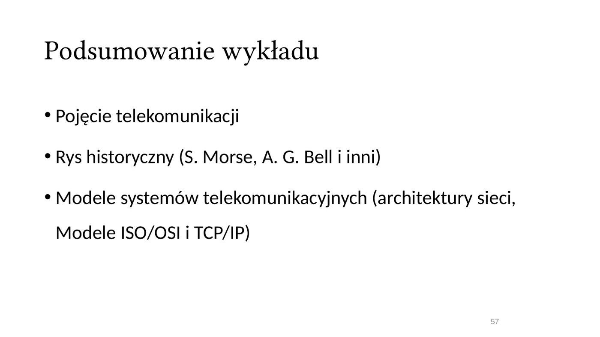

Pojęcie telekomunikacji  
Rys historyczny (S. Morse, A. G. Bell i inni)  
Modele systemów telekomunikacyjnych (architektury sieci, Modele ISO/OSI i TCP/IP)  
57

### 58. Materiały dodatkowe

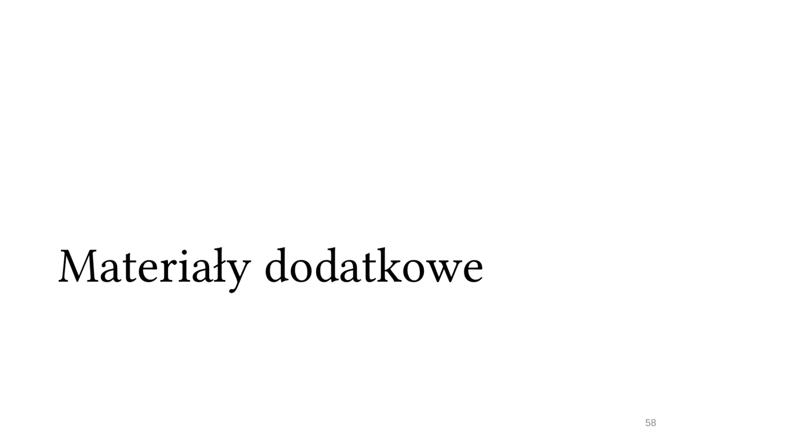

58

### 59. Materiały (źródła) dodatkowe (1/2)

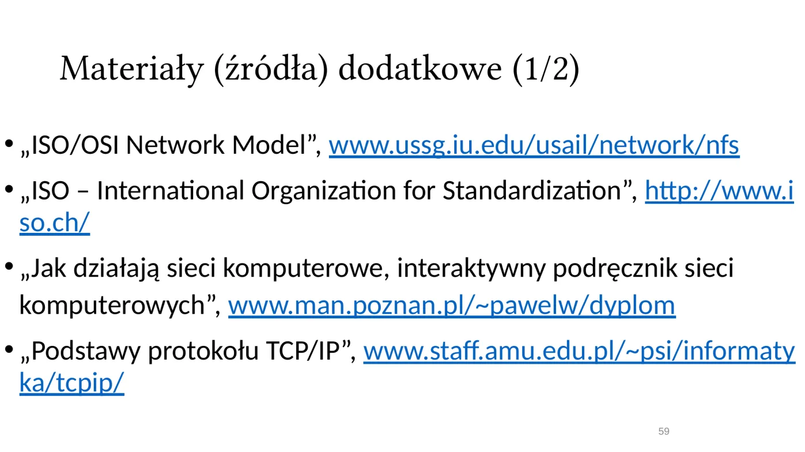

„ISO/OSI Network Model”,  
www.ussg.iu.edu/usail/network/nfs  
„ISO – International Organization for Standardization”,  
http://www.iso.ch/  
„Jak działają sieci komputerowe, interaktywny podręcznik sieci komputerowych”,  
www.man.poznan.pl/~pawelw/dyplom  
„Podstawy protokołu TCP/IP”,  
www.staff.amu.edu.pl/~psi/informatyka/tcpip/  
59

### 60. Materiały (źródła) dodatkowe (2/2)

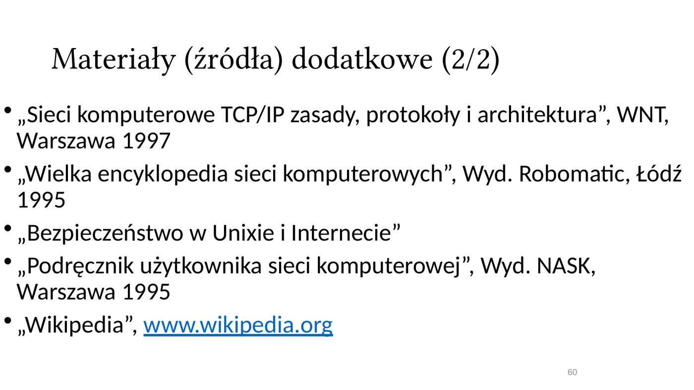

„Sieci komputerowe TCP/IP zasady, protokoły i architektura”, WNT, Warszawa 1997  
„Wielka encyklopedia sieci komputerowych”, Wyd.  
Robomatic  
, Łódź 1995  
„Bezpieczeństwo w  
Unixie  
i Internecie”  
„Podręcznik użytkownika sieci komputerowej”, Wyd. NASK, Warszawa 1995  
„Wikipedia”,  
www.wikipedia.org  
60

