# Podstawowe pojęcia, jednostki, ograniczenia

Oryginał: [03 Podstawowe pojęcia, jednostki, ograniczenia.pptx](../03%20Podstawowe%20poje%CC%A8cia%2C%20jednostki%2C%20ograniczenia.pptx)

## Slajdy

### 1. Podstawowe pojęcia, jednostki, ograniczenia

Mikołaj Leszczuk

### 2. Plan wykładu

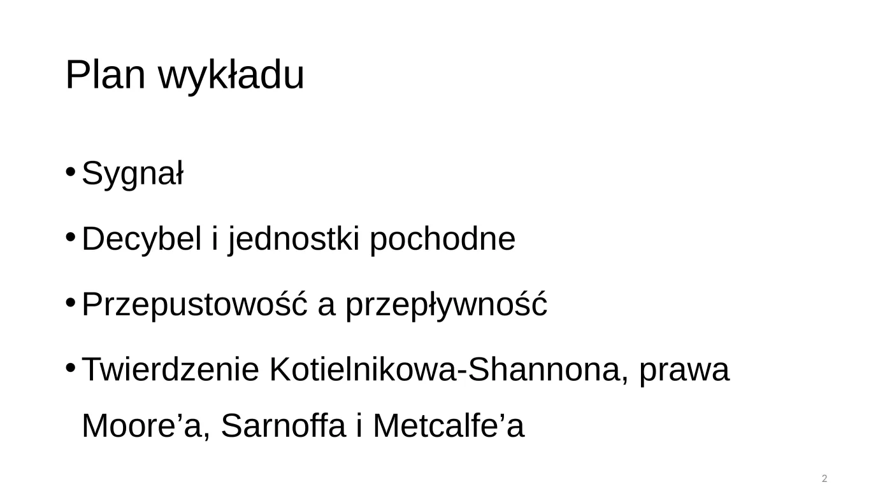

Sygnał  
Decybel i jednostki pochodne  
Przepustowość a przepływność  
Twierdzenie  
Kotielnikowa-Shannona  
, prawa Moore’a, Sarnoffa i  
Metcalfe’a  
2

### 3. Sygnał

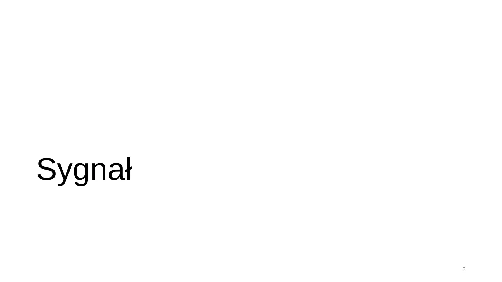

3

### 4. Sygnał

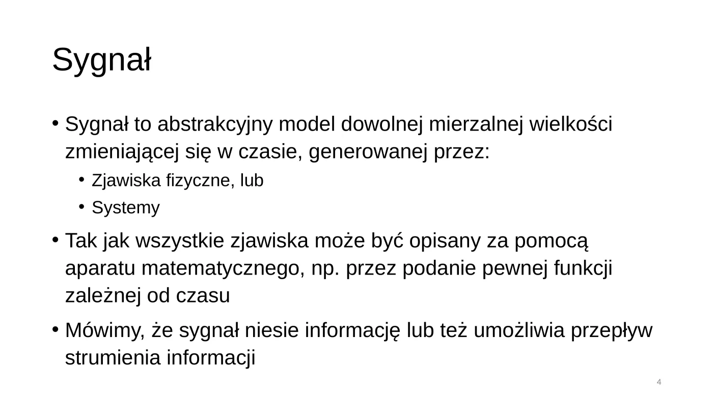

Sygnał to abstrakcyjny model dowolnej mierzalnej wielkości zmieniającej się w czasie, generowanej przez:  
Zjawiska fizyczne, lub  
Systemy  
Tak jak wszystkie zjawiska może być opisany za pomocą aparatu matematycznego, np. przez podanie pewnej funkcji zależnej od czasu  
Mówimy, że sygnał niesie informację lub też umożliwia przepływ strumienia informacji  
4

### 5. Decybel i jednostki pochodne

5

### 6. Decybel

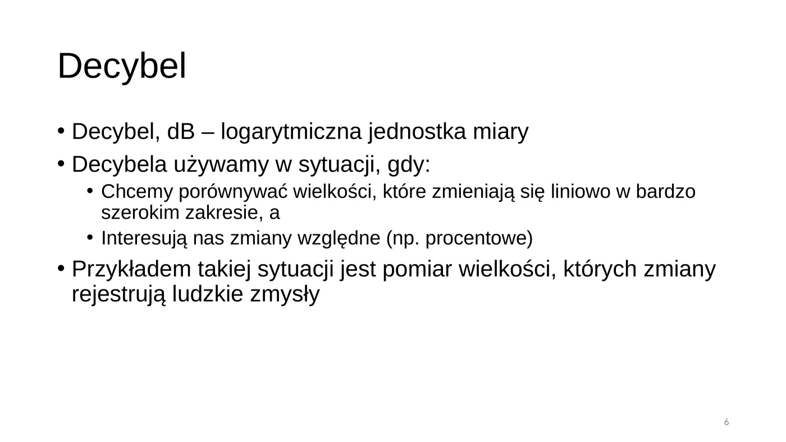

Decybel, dB – logarytmiczna jednostka miary  
Decybela używamy w sytuacji, gdy:  
Chcemy porównywać wielkości, które  
zmieniają  
się liniowo w bardzo szerokim zakresie, a  
Interesują nas zmiany względne (np. procentowe)  
Przykładem takiej sytuacji jest pomiar wielkości, których zmiany rejestrują ludzkie zmysły  
6

### 7. Decybel

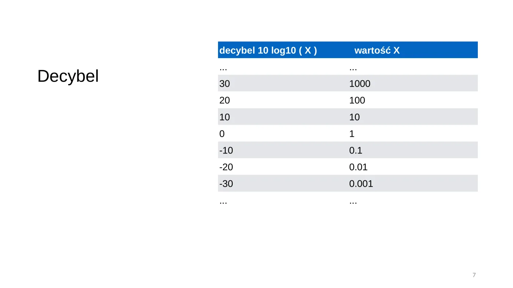

decybel 10 log10 ( X )  
wartość X  
...  
...  
30  
1000  
20  
100  
10  
10  
0  
1  
-10  
0.1  
-20  
0.01  
-30  
0.001  
...  
...  
7

### 8. Jednostki pochodne

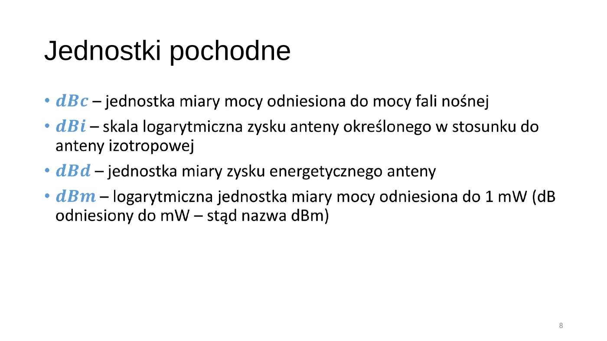

8

### 9. Przepustowość a przepływność

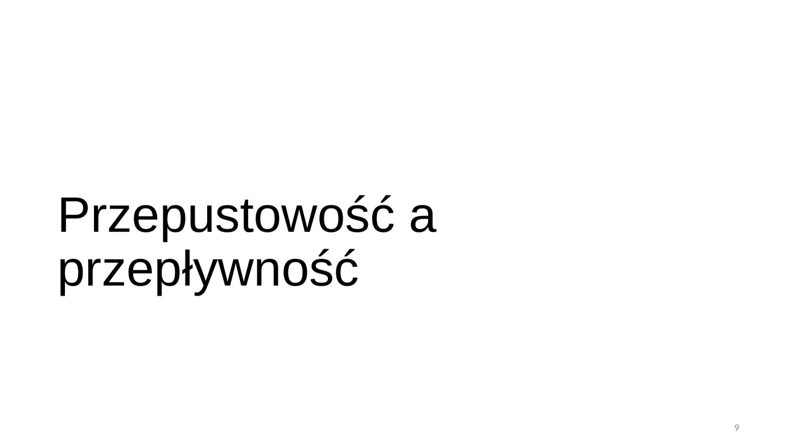

9

### 10. Przepustowość a przepływność

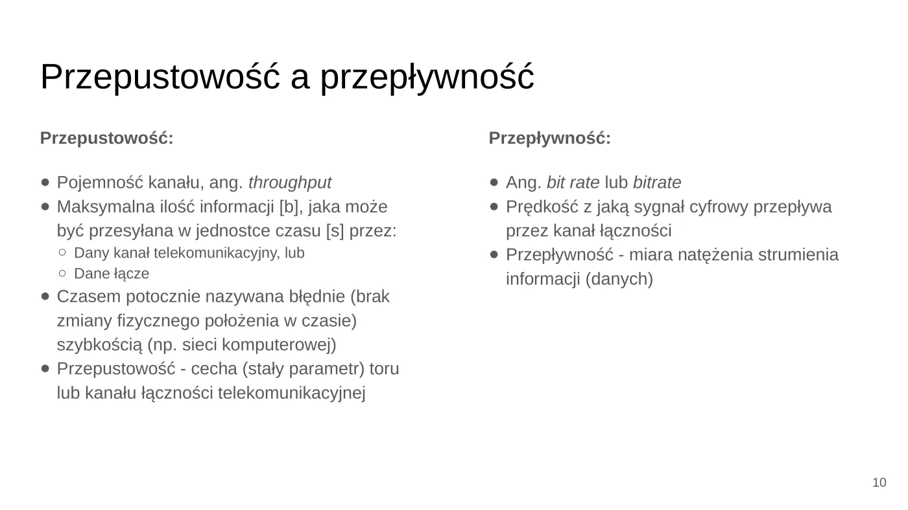

Przepustowość:  
Pojemność kanału, ang.  
throughput  
Maksymalna ilość informacji [b], jaka może być przesyłana w jednostce czasu [s] przez:  
Dany kanał telekomunikacyjny, lub  
Dane łącze  
Czasem potocznie nazywana błędnie (brak zmiany fizycznego położenia w czasie) szybkością (np. sieci komputerowej)  
Przepustowość - cecha (stały parametr) toru lub kanału łączności telekomunikacyjnej  
Przepływność:  
Ang.  
bit rate  
lub  
bitrate  
Prędkość z jaką sygnał cyfrowy przepływa przez kanał łączności  
Przepływność - miara natężenia strumienia informacji (danych)  
10

### 11. Przepustowość a przepływność

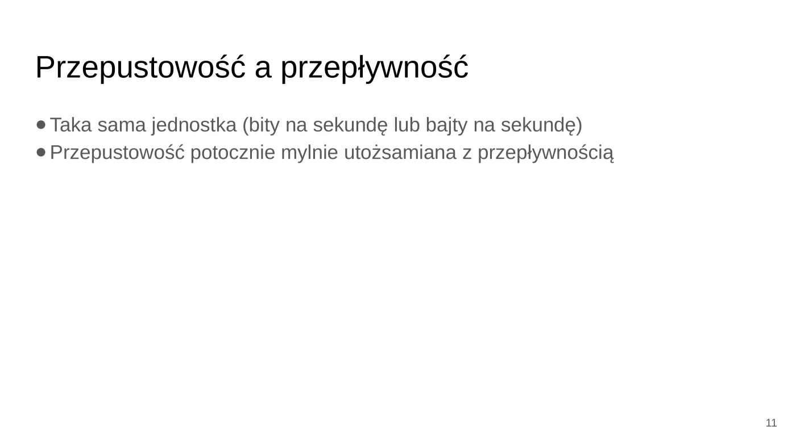

Taka sama jednostka (bity na sekundę lub bajty na sekundę)  
Przepustowość potocznie mylnie utożsamiana z przepływnością  
11

### 12. Twierdzenie

Kotielnikowa-Shannona  
, prawa Moore’a, Sarnoffa i  
Metcalfe’a  
12

### 13. –Twierdzenie Kotielnikowa-Shannona

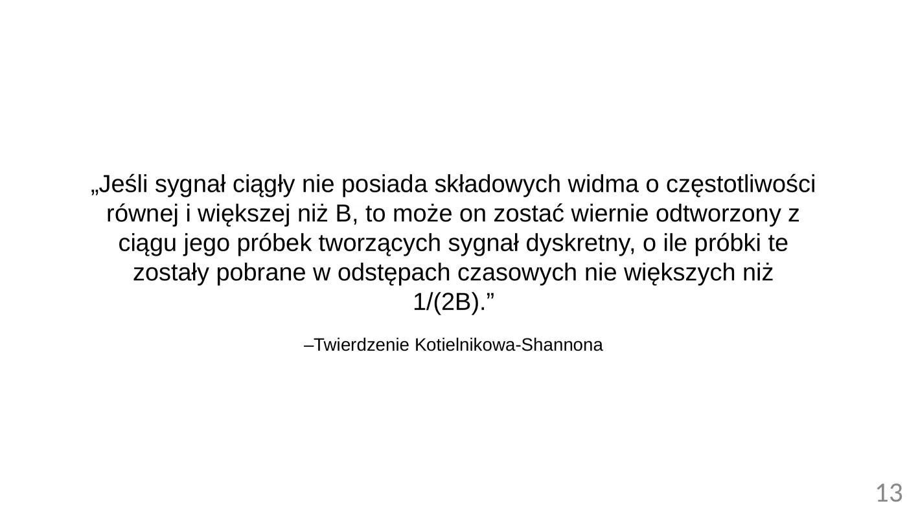

„Jeśli sygnał ciągły nie posiada składowych widma o częstotliwości równej i większej niż B, to może on zostać wiernie odtworzony z ciągu jego próbek tworzących sygnał dyskretny, o ile próbki te zostały pobrane w odstępach czasowych nie większych niż 1/(2B).”  
13

### 14. Znane również jako twierdzenie Whittakera-Nyquista-

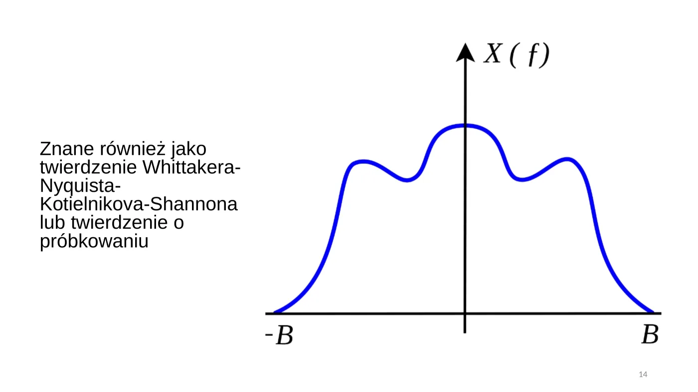

Kotielnikova-Shannona lub twierdzenie o próbkowaniu  
14

### 15. Prawo Moore’a (1/2)

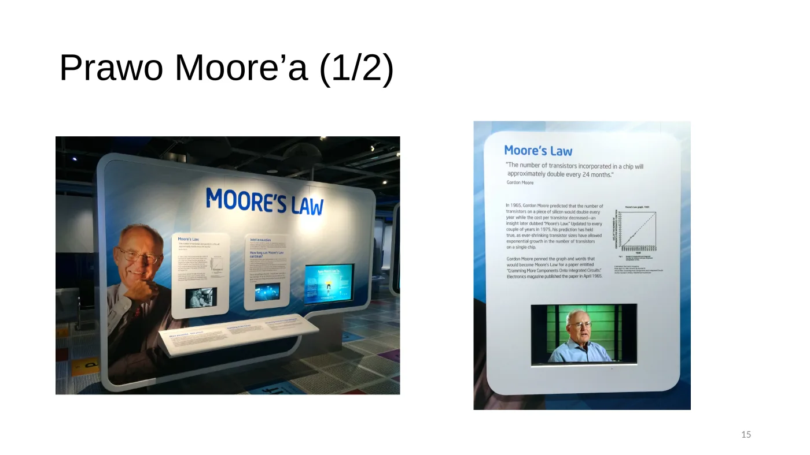

15

### 16. Prawo Moore’a (2/2)

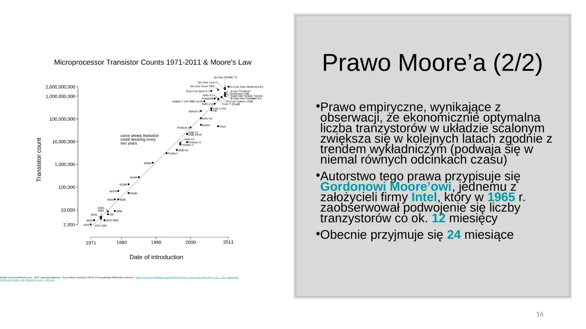

Prawo empiryczne, wynikające z obserwacji, że ekonomicznie optymalna liczba tranzystorów w układzie scalonym zwiększa się w kolejnych latach zgodnie z trendem wykładniczym (podwaja się w niemal równych odcinkach czasu)  
Autorstwo tego prawa przypisuje się  
Gordonowi Moore’owi  
, jednemu z założycieli firmy  
Intel  
, który w  
1965  
r. zaobserwował  
podwojenie  
się liczby tranzystorów co ok.  
12  
miesięcy  
Obecnie przyjmuje się  
24  
miesiące  
16  
„Transistor Count and Moore's Law – 2011” autorstwa Wgsimon – Praca własna. Licencja CC BY-SA 3.0 na podstawie Wikimedia Commons –  
https://commons.wikimedia.org/wiki/File:Transistor_Count_and_Moore%27s_Law_-_2011.svg#/media/File:Transistor_Count_and_Moore%27s_Law_-_2011.svg

### 17. –Prawo Sarnoffa

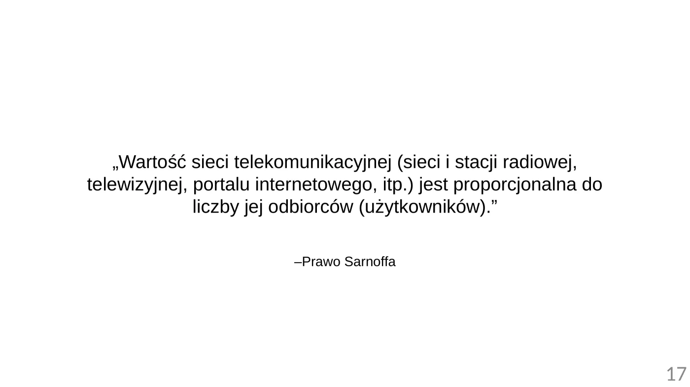

„Wartość sieci telekomunikacyjnej (sieci i stacji radiowej, telewizyjnej, portalu internetowego, itp.) jest proporcjonalna do liczby jej odbiorców (użytkowników).”  
17

### 18. Oryginalnie ukute przez Davida Sarnoffa (1891 – 1971)

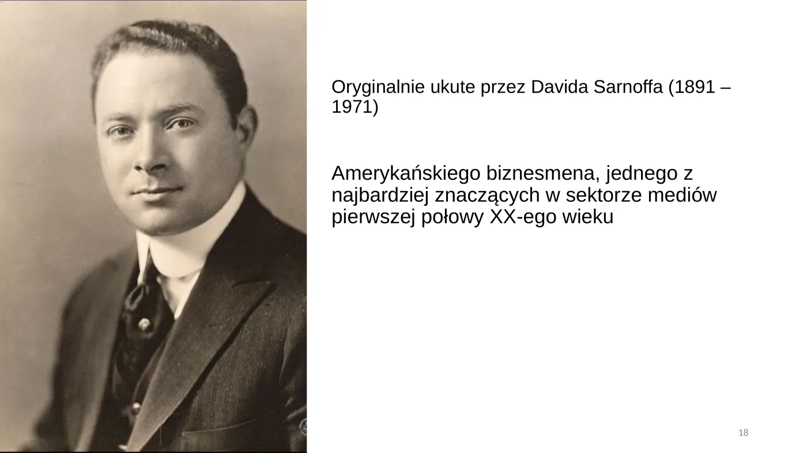

Amerykańskiego biznesmena, jednego z najbardziej znaczących w sektorze mediów pierwszej połowy XX-ego wieku  
18

### 19. Wyjaśnienie prawa Sarnoffa

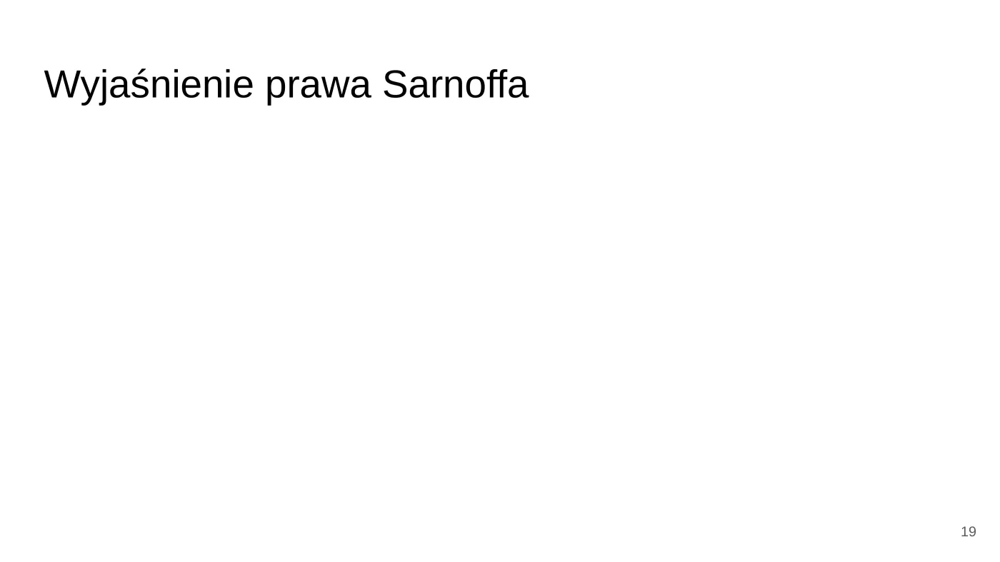

19

### 20. –Prawo Metcalfe’a

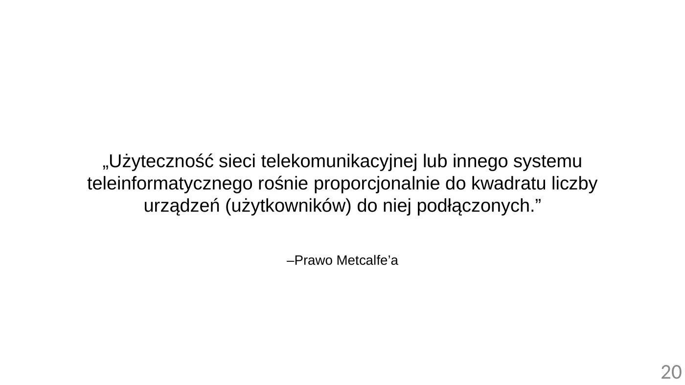

„Użyteczność sieci telekomunikacyjnej lub innego systemu teleinformatycznego rośnie proporcjonalnie do kwadratu liczby urządzeń (użytkowników) do niej podłączonych.”  
20

### 21. Prawo Metcalfe’a

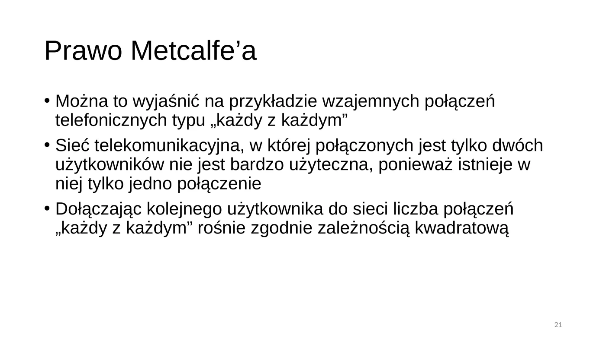

Można to wyjaśnić na przykładzie wzajemnych połączeń telefonicznych typu „każdy z każdym”  
Sieć telekomunikacyjna, w której połączonych jest tylko dwóch użytkowników nie jest bardzo użyteczna, ponieważ istnieje w niej tylko jedno połączenie  
Dołączając kolejnego użytkownika do sieci liczba połączeń „każdy z każdym” rośnie zgodnie zależnością kwadratową  
21

### 22. Prawo Metcalfe’a

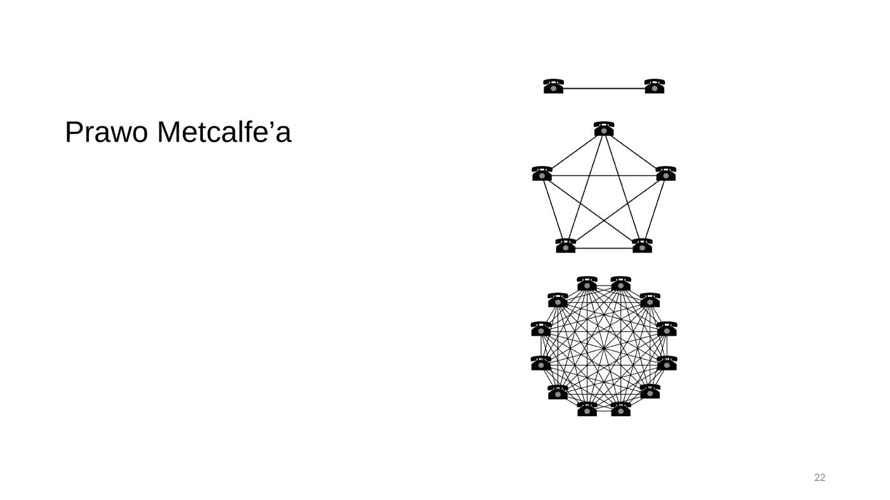

22

### 23. Wyjaśnienie prawa

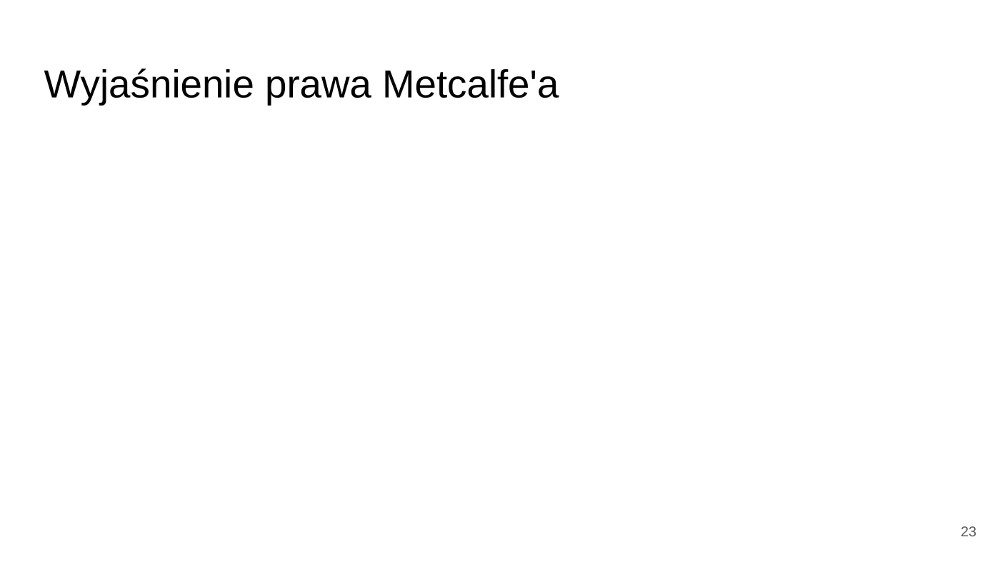

Metcalfe'a  
23

### 24. Podsumowanie wykładu

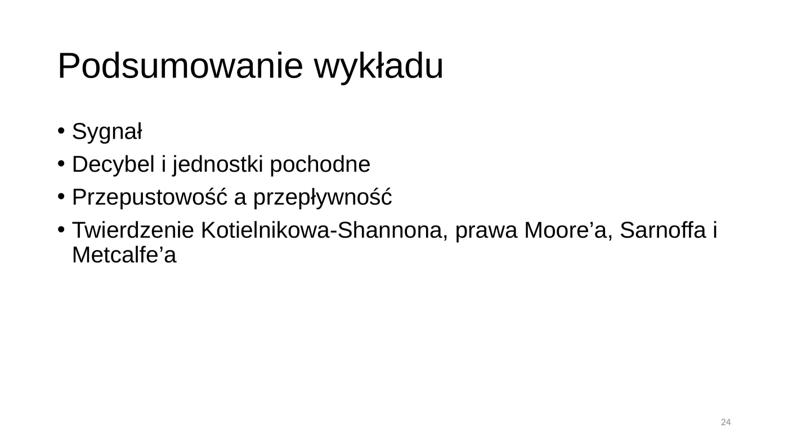

Sygnał  
Decybel i jednostki pochodne  
Przepustowość a przepływność  
Twierdzenie  
Kotielnikowa-Shannona  
, prawa Moore’a, Sarnoffa i  
Metcalfe’a  
24

