# Media transmisyjne - kable miedziane w telekomunikacji i teleinformatyce

Oryginał: [04 Media transmisyjne - kable miedziane w telekomunikacji i teleinformatyce.pptx](../04%20Media%20transmisyjne%20-%20kable%20miedziane%20w%20telekomunikacji%20i%20teleinformatyce.pptx)

## Slajdy

### 1. Warstwa fizyczna – przekaz elektryczny

Mikołaj Leszczuk

### 2. Plan wykładu

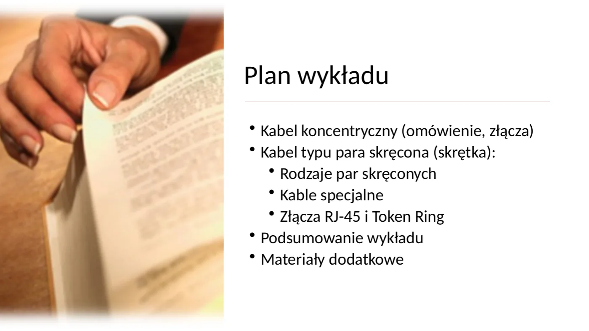

Kabel koncentryczny (omówienie, złącza)  
Kabel typu para skręcona (skrętka):  
Rodzaje par skręconych  
Kable specjalne  
Złącza RJ-45 i  
Token  
Ring  
Podsumowanie wykładu  
Materiały dodatkowe  
2

### 3. Kabel koncentryczny

3

### 4. Kabel koncentryczny – omówienie (1/2)

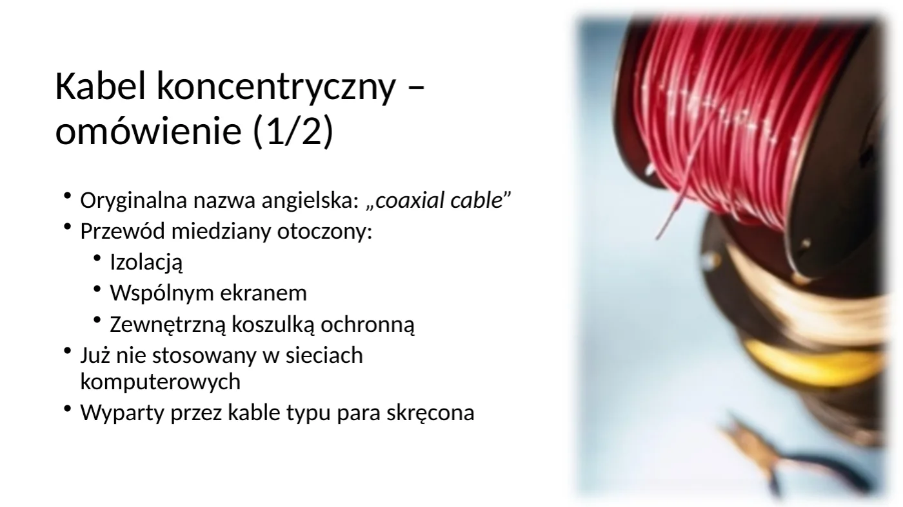

Oryginalna nazwa angielska:  
„  
coaxial  
cable  
”  
Przewód miedziany otoczony:  
Izolacją  
Wspólnym ekranem  
Zewnętrzną koszulką ochronną  
Już nie stosowany w sieciach komputerowych  
Wyparty przez kable typu para skręcona  
4

### 5. Kabel koncentryczny – omówienie (2/2)

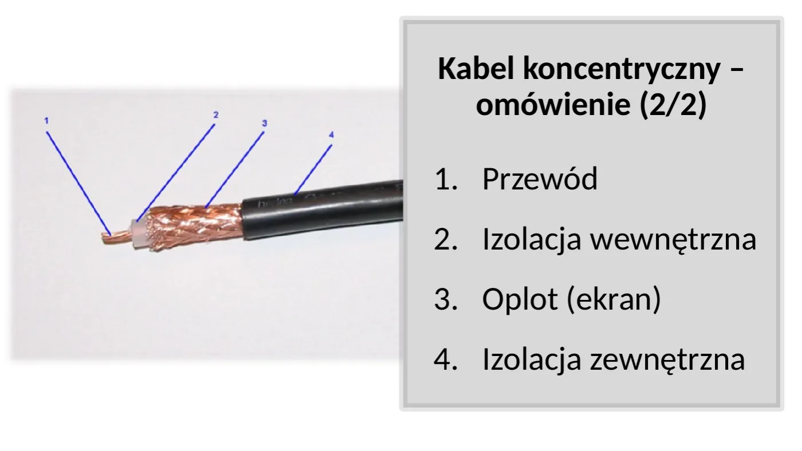

5  
Przewód  
Izolacja wewnętrzna  
Oplot (ekran)  
Izolacja zewnętrzna

### 6. Złącze koncentryczne BNC

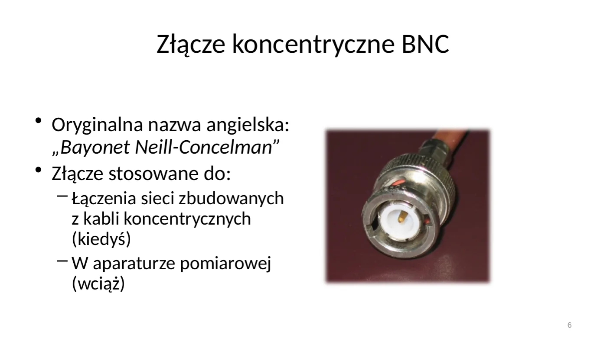

Oryginalna nazwa angielska:  
„  
Bayonet  
Neill-  
Concelman  
”  
Złącze stosowane do:  
Łączenia sieci zbudowanych z kabli koncentrycznych (kiedyś)  
W aparaturze pomiarowej (wciąż)  
6

### 7. Złącze N – stosowane do sygnałów HF (do 18 GHz)

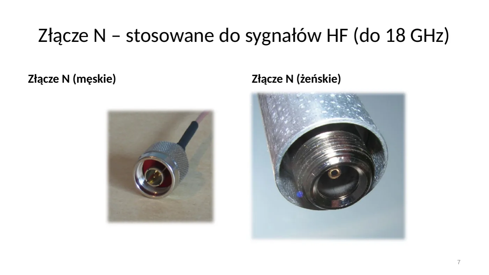

Złącze N (męskie)  
Złącze N (żeńskie)  
7

### 8. KABEL TYPU PARA SKRĘCONA (SKRĘTKA)

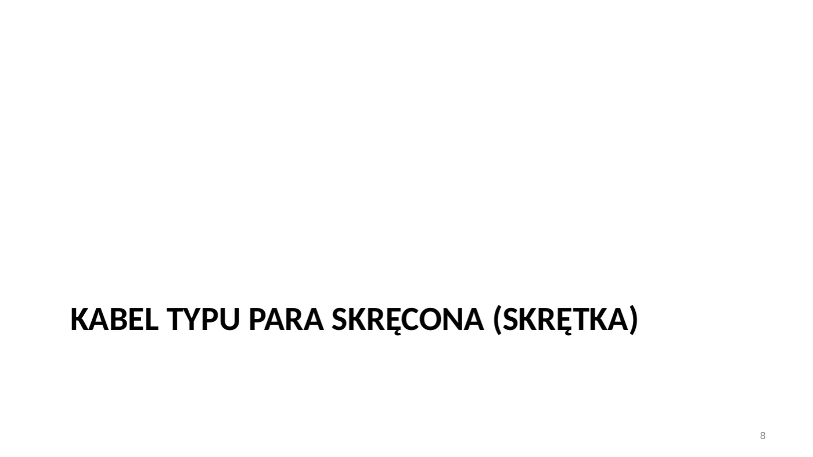

8

### 9. Kabel typu para skręcona – skrętka (1/2)

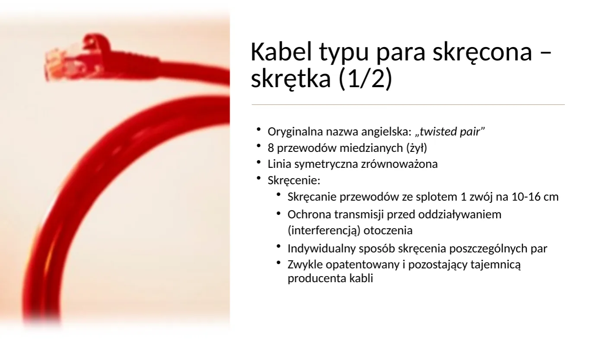

Oryginalna nazwa angielska:  
„  
twisted  
pair  
”  
8 przewodów miedzianych (żył)  
Linia symetryczna zrównoważona  
Skręcenie:  
Skręcanie przewodów ze splotem 1 zwój na 10-16 cm  
Ochrona transmisji przed oddziaływaniem (interferencją) otoczenia  
Indywidualny sposób skręcenia poszczególnych par  
Zwykle  
opatentowany  
i pozostający tajemnicą producenta kabli  
9

### 10. Kabel typu para skręcona – skrętka (2/2)

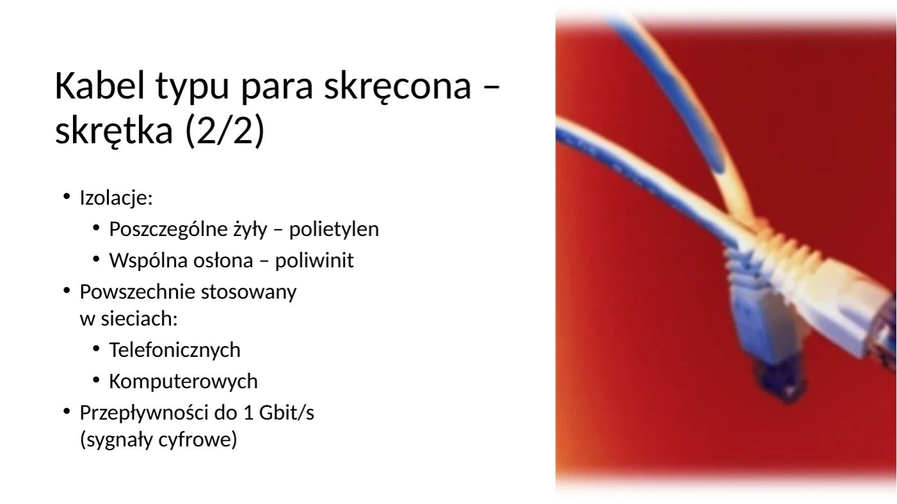

Izolacje:  
Poszczególne żyły – polietylen  
Wspólna osłona –  
poliwinit  
Powszechnie stosowany  
w sieciach:  
Telefonicznych  
Komputerowych  
Przepływności do 1  
Gbit  
/s  
(sygnały cyfrowe)  
10

### 11. Para skręcona – przykładowe zdjęcia

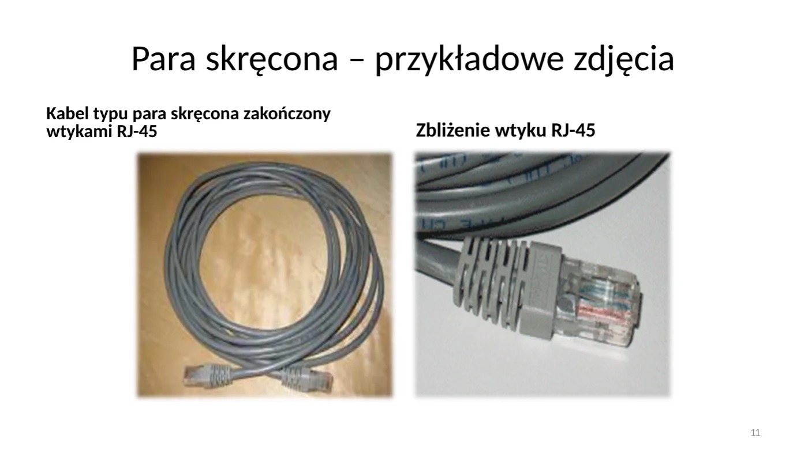

Kabel typu para skręcona zakończony wtykami RJ-45  
Zbliżenie wtyku RJ-45  
11

### 12. Karta sieciowa ze złączem BNC (po lewej) oraz RJ-45 (po prawej)

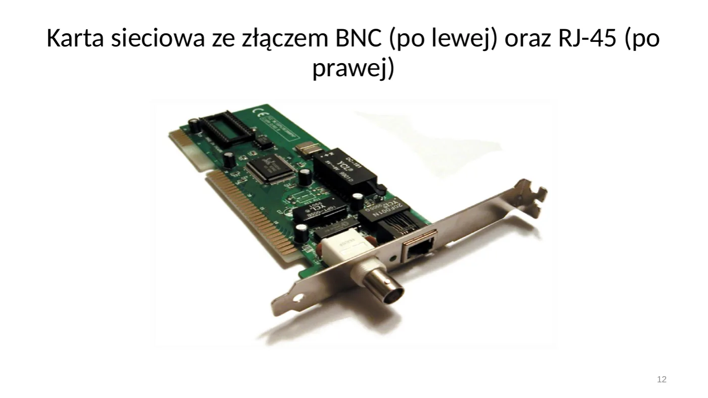

12

### 13. KABEL TYPU PARA SKRĘCONA (SKRĘTKA)

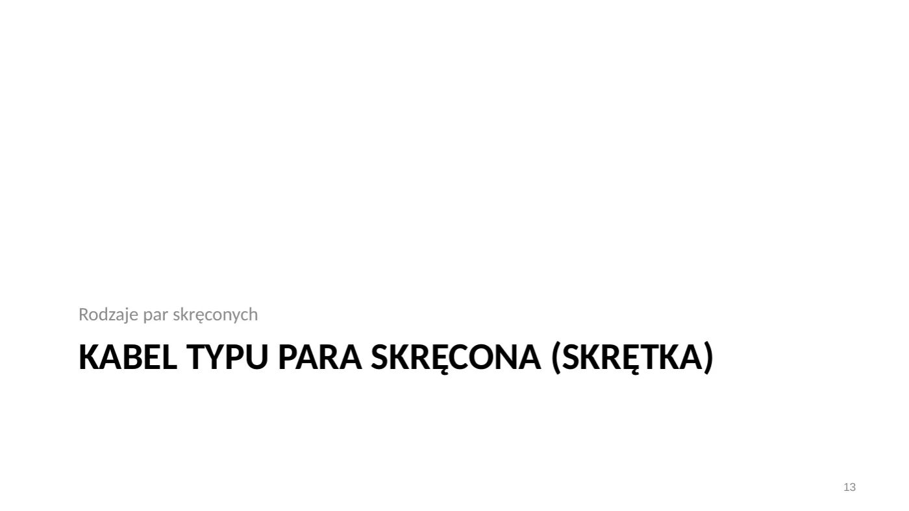

Rodzaje par skręconych  
13

### 14. Rodzaje

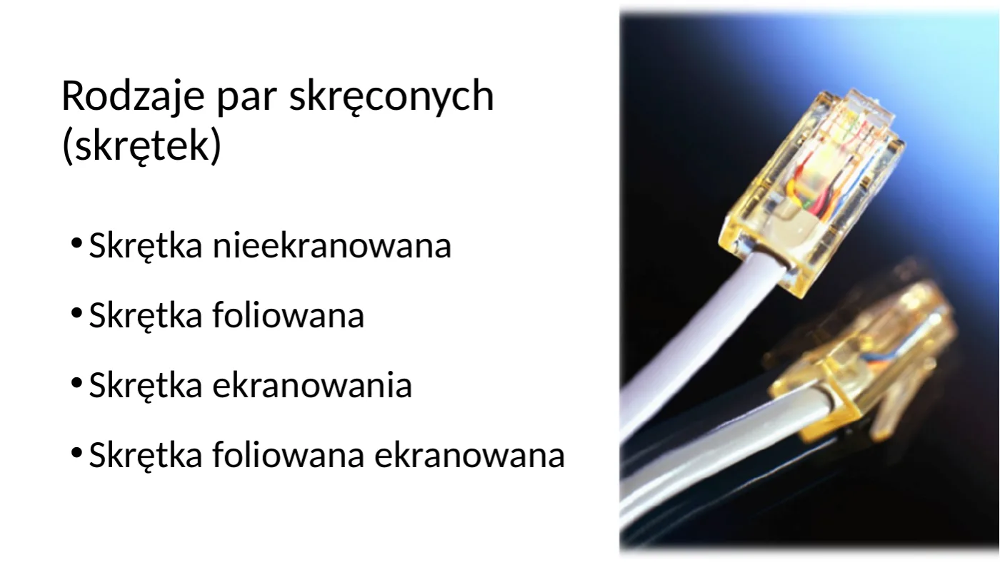

par  
skręconych  
(  
skrętek  
)  
Skrętka nieekranowana  
Skrętka foliowana  
Skrętka ekranowania  
Skrętka foliowana ekranowana  
14

### 15. Skrętka nieekranowana

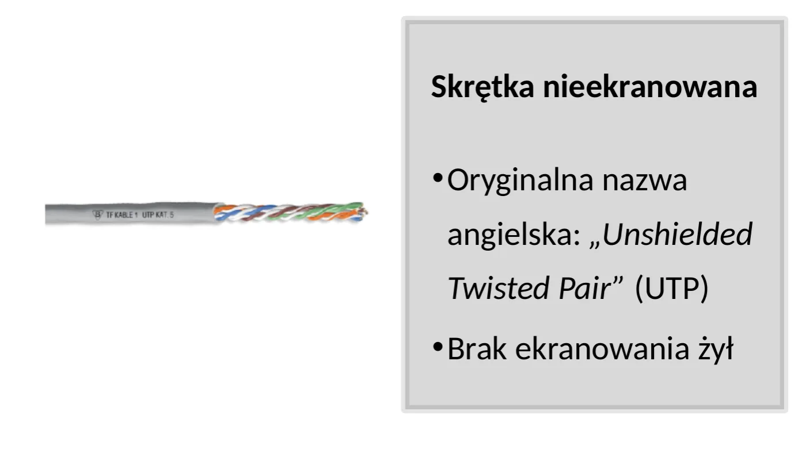

Oryginalna nazwa angielska:  
„  
Unshielded  
Twisted  
Pair  
”  
(UTP)  
Brak ekranowania żył  
15

### 16. Popularność skrętki nieekranowanej‏‏

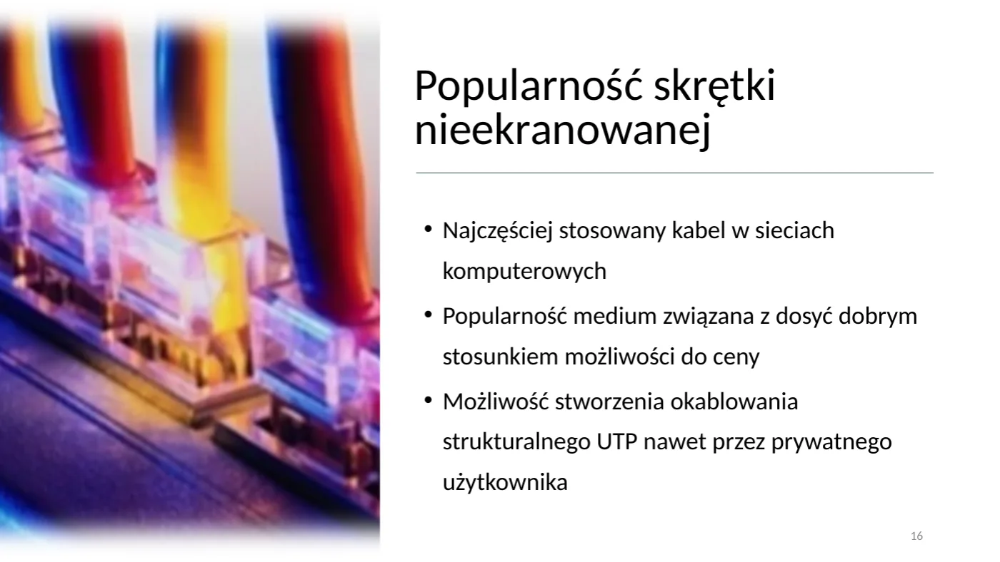

Najczęściej stosowany kabel w sieciach komputerowych  
Popularność medium związana z dosyć dobrym stosunkiem możliwości do ceny  
Możliwość stworzenia okablowania strukturalnego UTP nawet przez prywatnego użytkownika  
16

### 17. Unshielded Twisted Pair

17

[Odtwórz materiał z tego slajdu](../web/media/04/slide-017-media1.mp4)

[Odtwórz materiał z tego slajdu](../web/media/04/slide-017-media1.mp4)

### 18. Skrętka foliowana (1/2)

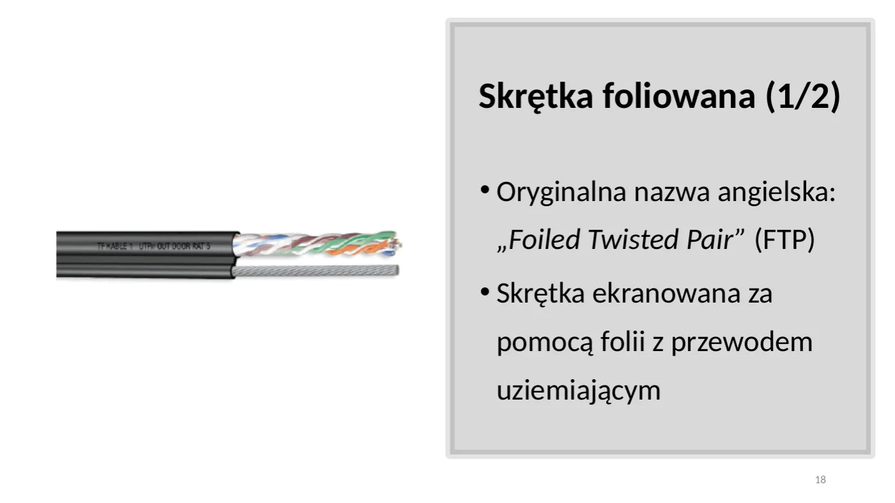

Oryginalna  
nazwa  
angielska  
:  
„Foiled Twisted Pair  
”  
(FTP)  
Skrętka  
ekranowana  
za  
pomocą  
folii  
z  
przewodem  
uziemiającym  
18

### 19. Skrętka foliowana (2/2)

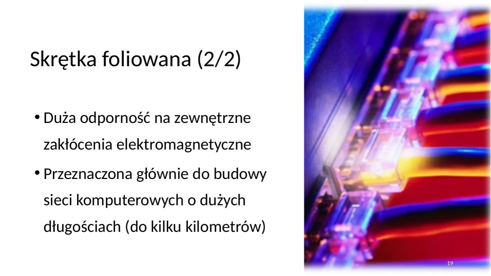

Duża  
odporność  
na  
zewnętrzne  
zakłócenia  
elektromagnetyczne  
Przeznaczona  
głównie  
do  
budowy  
sieci  
komputerowych  
o  
dużych  
długościach  
(do  
kilku  
kilometrów  
)  
19

### 20. Skrętka ekranowana (1/3)

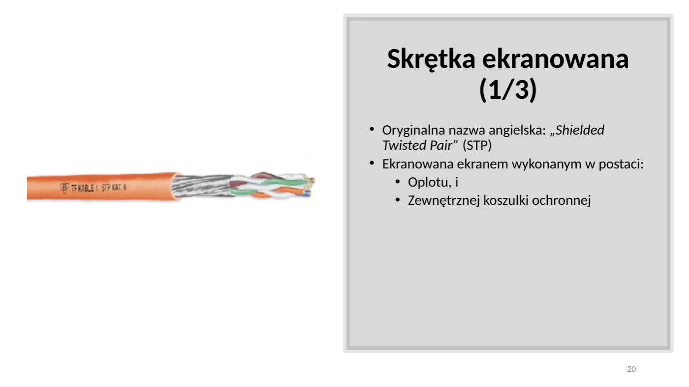

Oryginalna nazwa angielska:  
„Shielded Twisted Pair  
”  
(STP)  
Ekranowana ekranem wykonanym w postaci:  
Oplotu, i  
Zewnętrznej koszulki ochronnej‏  
20

### 21. Skrętka ekranowana (2/3)

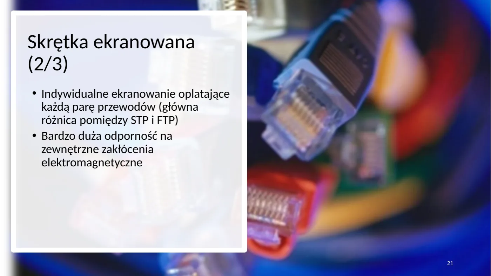

Indywidualne ekranowanie oplatające każdą parę przewodów (główna różnica pomiędzy STP i FTP)  
Bardzo duża odporność na zewnętrzne zakłócenia elektromagnetyczne  
21

### 22. Skrętka ekranowana (3/3)

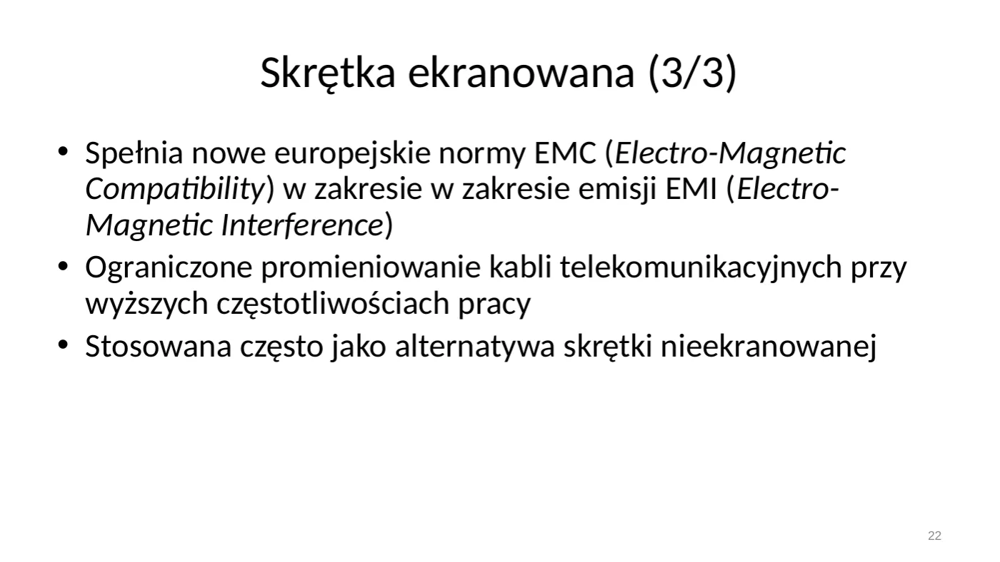

Spełnia nowe europejskie normy EMC (  
Electro-Magnetic Compatibility  
) w zakresie w zakresie emisji EMI (  
Electro-Magnetic Interference  
)  
Ograniczone promieniowanie kabli telekomunikacyjnych przy wyższych częstotliwościach pracy  
Stosowana często jako alternatywa skrętki nieekranowanej  
22

### 23. Skrętka foliowana ekranowana

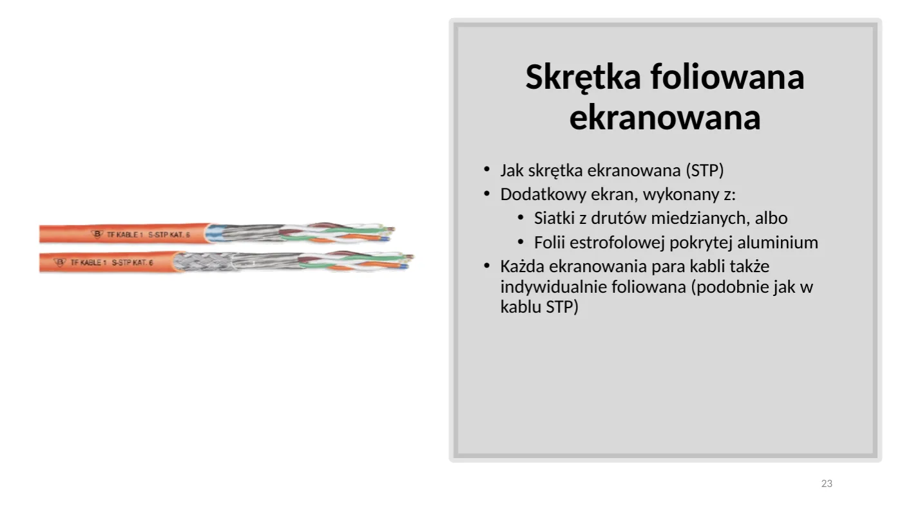

Jak skrętka ekranowana (STP)  
Dodatkowy ekran, wykonany z:  
Siatki z drutów miedzianych, albo  
Folii estrofolowej pokrytej aluminium  
Każda ekranowania para kabli także indywidualnie foliowana (podobnie jak w kablu STP)  
23

### 24. KABEL TYPU PARA SKRĘCONA (SKRĘTKA)

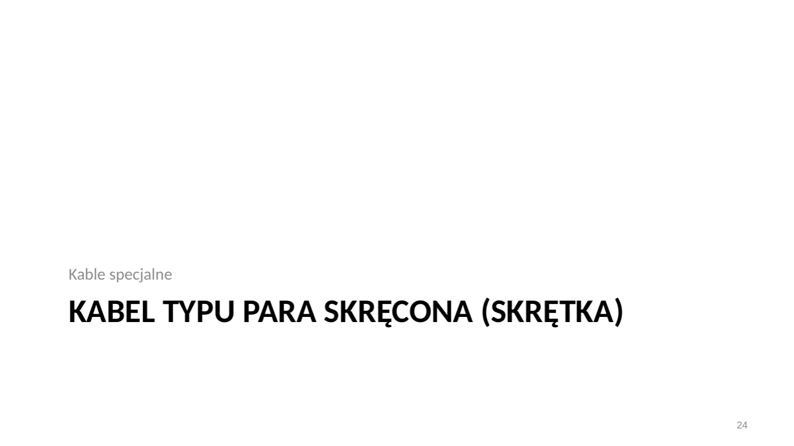

Kable specjalne  
24

### 25. Kable specjalne

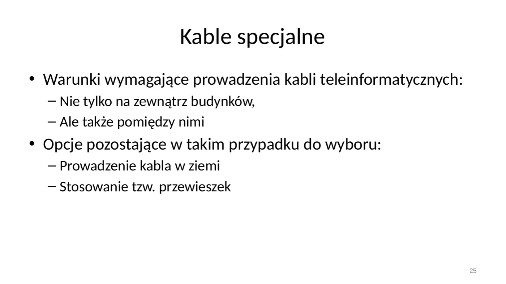

Warunki wymagające prowadzenia kabli teleinformatycznych:  
Nie tylko na zewnątrz budynków,  
Ale także pomiędzy nimi  
Opcje pozostające w takim przypadku do wyboru:  
Prowadzenie kabla w ziemi  
Stosowanie tzw. przewieszek  
25

### 26. Prowadzenie kabla w ziemi

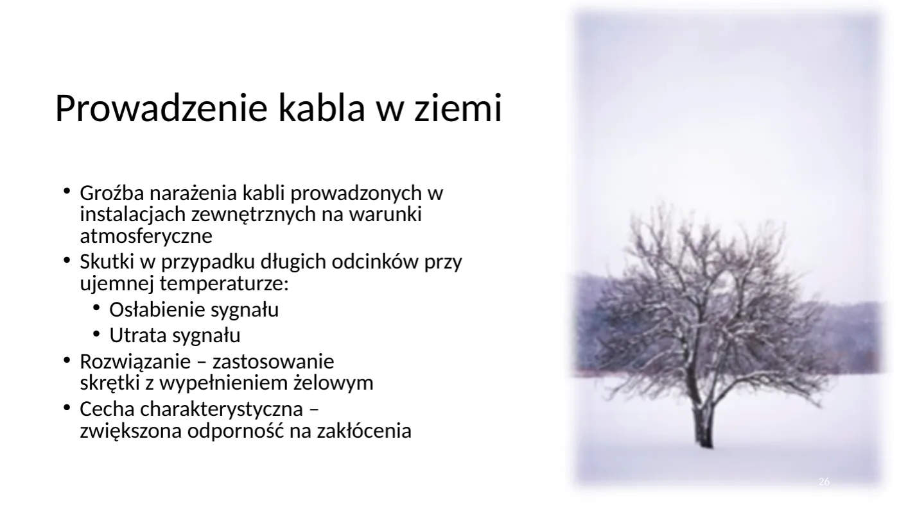

Groźba narażenia kabli prowadzonych w instalacjach zewnętrznych na warunki atmosferyczne  
Skutki w przypadku długich odcinków przy ujemnej temperaturze:  
Osłabienie sygnału  
Utrata sygnału  
Rozwiązanie – zastosowanie  
skrętki z wypełnieniem żelowym  
Cecha charakterystyczna –  
zwiększona odporność na zakłócenia  
26

### 27. Stosowanie przewieszek

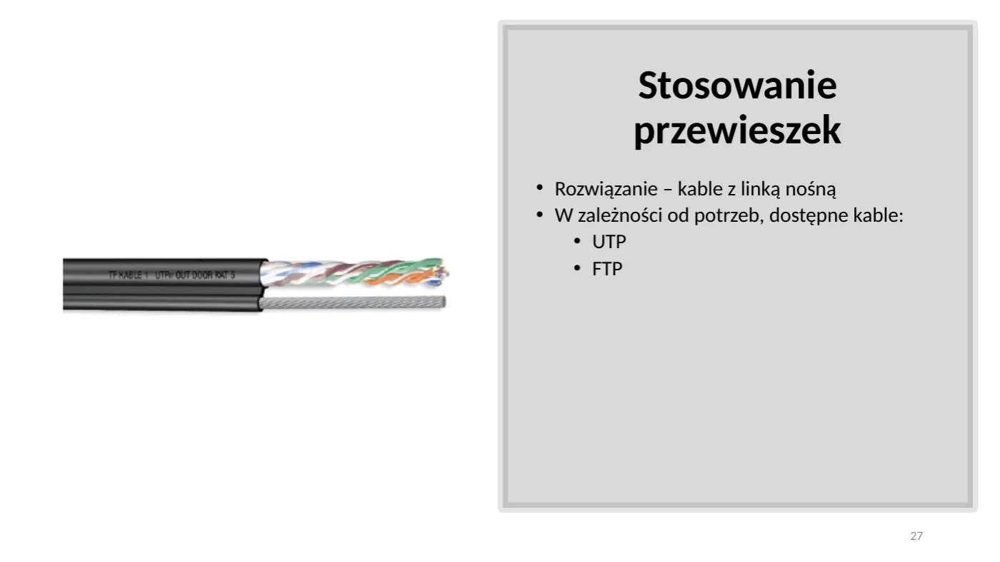

Rozwiązanie – kable z linką nośną  
W zależności od potrzeb, dostępne kable:  
UTP  
FTP  
27

### 28. KABEL TYPU PARA SKRĘCONA (SKRĘTKA)

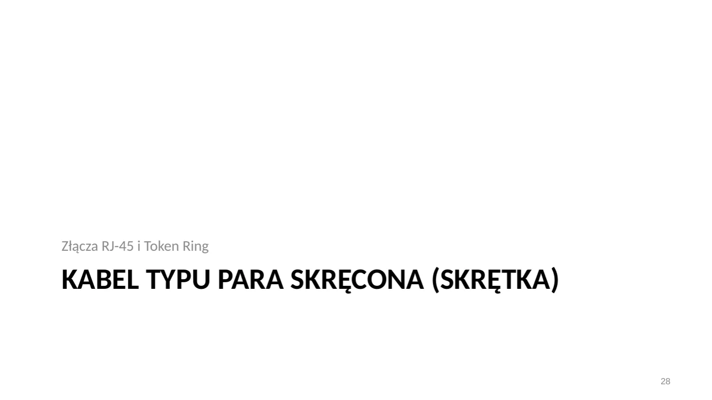

Złącza RJ-45 i Token Ring  
28

### 29. Podłączanie do sieci złącza RJ-45

29

[Odtwórz materiał z tego slajdu](../web/media/04/slide-029-media2.mp4)

[Odtwórz materiał z tego slajdu](../web/media/04/slide-029-media2.mp4)

### 30. Złącze RJ-45 (1/2)

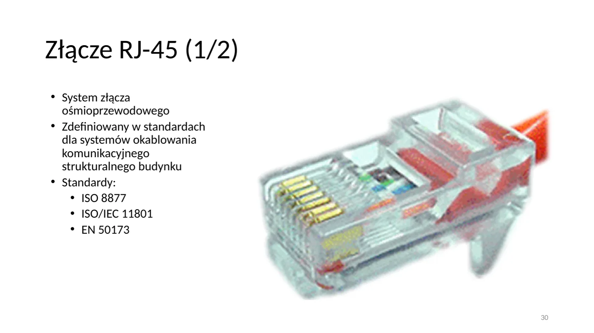

System złącza ośmioprzewodowego  
Zdefiniowany w standardach dla systemów okablowania komunikacyjnego strukturalnego budynku  
Standardy:  
ISO 8877  
ISO/IEC 11801  
EN 50173  
30

### 31. Złącze RJ-45 (2/2)

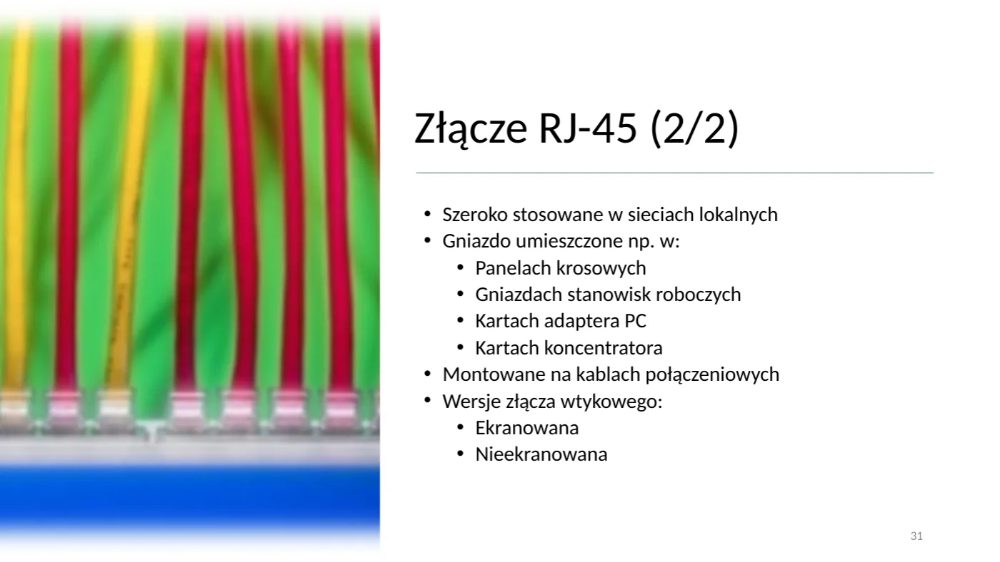

Szeroko stosowane w sieciach lokalnych  
Gniazdo umieszczone np. w:  
Panelach krosowych  
Gniazdach stanowisk roboczych  
Kartach adaptera PC  
Kartach koncentratora  
Montowane na kablach połączeniowych  
Wersje złącza wtykowego:  
Ekranowana  
Nieekranowana  
31

### 32. Okablowanie Ethernet UTP

32

[Odtwórz materiał z tego slajdu](../web/media/04/slide-032-media3.mp4)

[Odtwórz materiał z tego slajdu](../web/media/04/slide-032-media3.mp4)

### 33. Skrętka prosta RJ-45

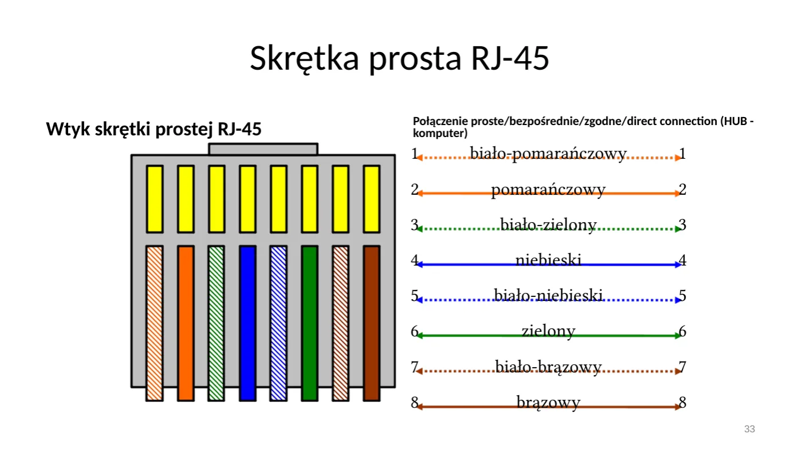

Wtyk skrętki prostej RJ-45  
Połączenie proste/bezpośrednie/zgodne/direct connection (HUB - komputer)‏  
1  
2  
3  
4  
5  
6  
7  
8  
1  
2  
3  
4  
5  
6  
7  
8  
brązowy  
biało-brązowy  
zielony  
biało-niebieski  
niebieski  
biało-zielony  
pomarańczowy  
biało-pomarańczowy  
33

### 34. Skrętka skrzyżowana RJ-45

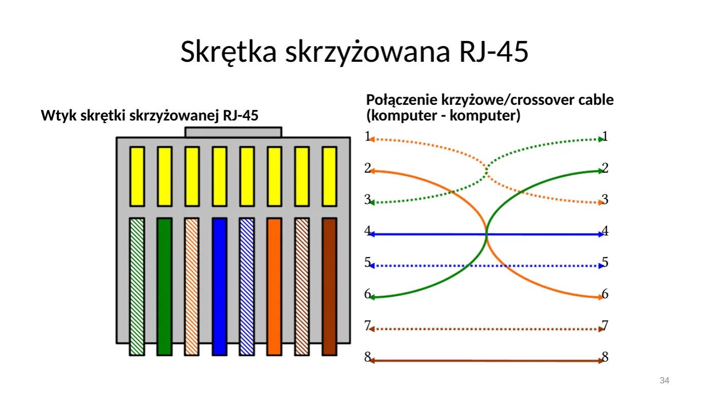

Wtyk skrętki skrzyżowanej RJ-45  
Połączenie krzyżowe/crossover cable (komputer - komputer)‏  
1  
2  
3  
4  
5  
6  
7  
8  
1  
2  
3  
4  
5  
6  
7  
8  
34

### 35. Wtyki i zaciskarki do wtyków

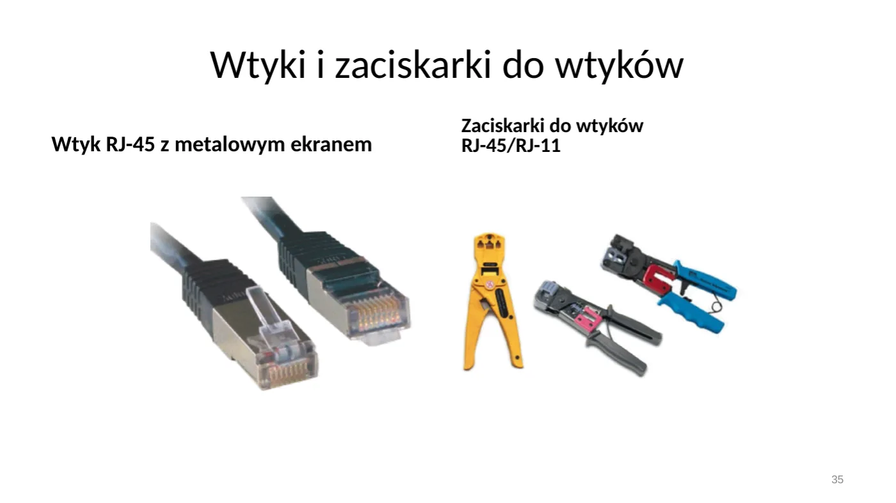

Wtyk RJ-45 z metalowym  
ekranem  
Zaciskarki do wtyków  
RJ-45/RJ-11  
35

### 36. RJ-45 – animacja

36

[Odtwórz materiał z tego slajdu](../web/media/04/slide-036-media4.mp4)

[Odtwórz materiał z tego slajdu](../web/media/04/slide-036-media4.mp4)

### 37. Okablowanie Ethernet

37

[Odtwórz materiał z tego slajdu](../web/media/04/slide-037-media5.mp4)

[Odtwórz materiał z tego slajdu](../web/media/04/slide-037-media5.mp4)

### 38. Złącze Token Ring

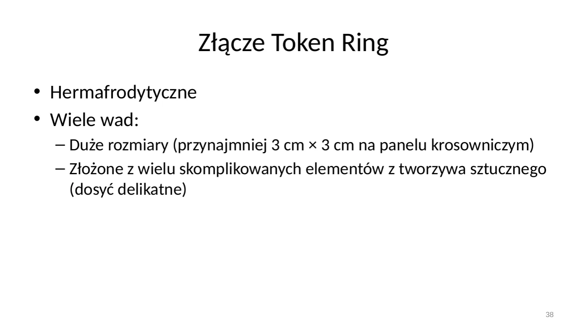

Hermafrodytyczne  
Wiele wad:  
Duże rozmiary (przynajmniej 3 cm × 3 cm na panelu krosowniczym)  
Złożone z wielu skomplikowanych elementów z tworzywa sztucznego (dosyć delikatne)  
38

### 39. Hermafrodytyczne złącze IBM Token Ring z klipsem blokującym

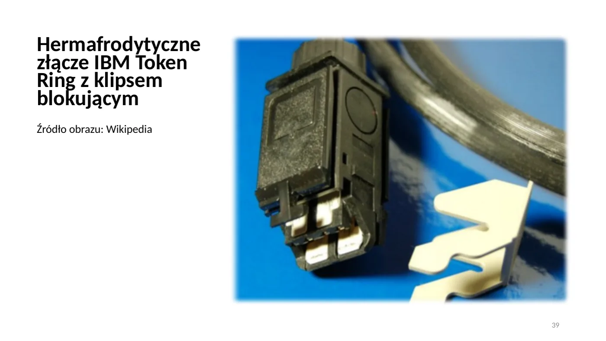

Źródło obrazu: Wikipedia  
39

### 40. Kabel typu – IEEE 802.5

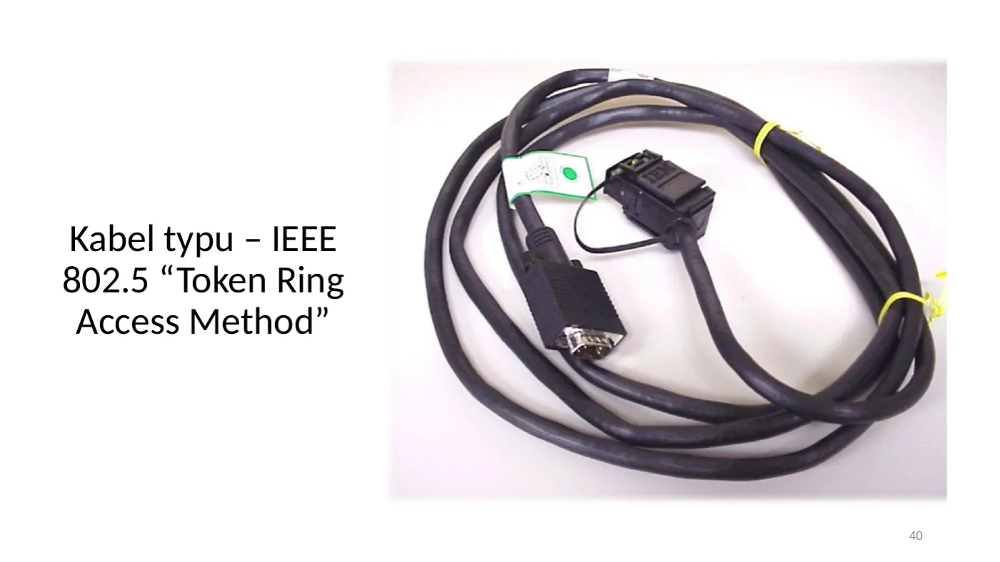

“  
Token  
Ring Access Method  
”  
40

### 41. PODSUMOWANIE WYKŁADU

41

### 42. Podsumowanie wykładu

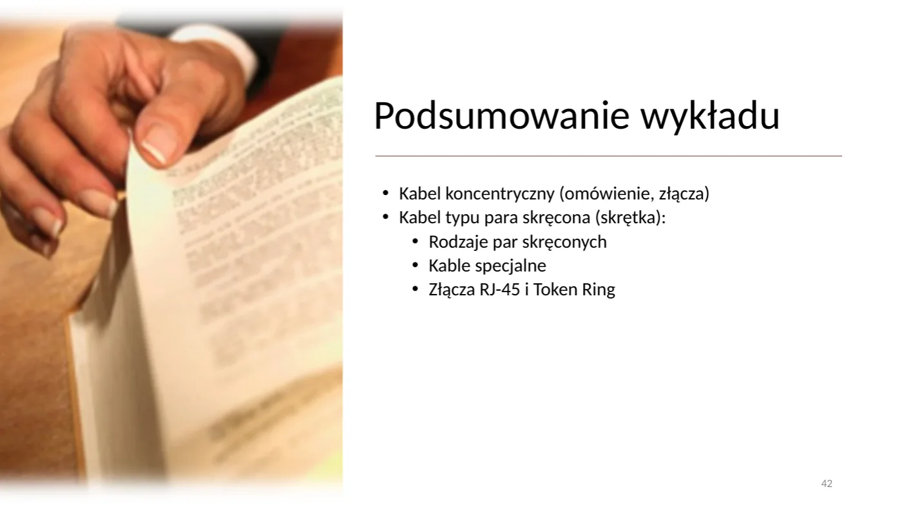

Kabel koncentryczny (omówienie, złącza)  
Kabel typu para skręcona (skrętka):  
Rodzaje par skręconych  
Kable specjalne  
Złącza RJ-45 i Token Ring  
42

### 43. MATERIAŁY DODATKOWE

43

### 44. Materiały (źródła) dodatkowe

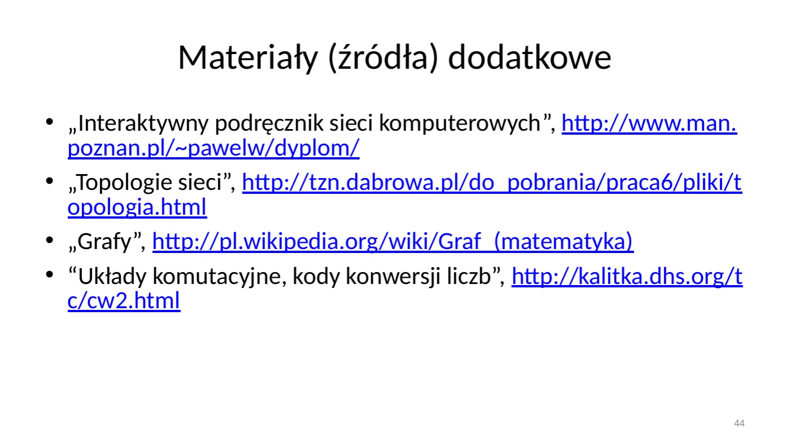

„Interaktywny podręcznik sieci komputerowych  
”  
,  
http://www.man.poznan.pl/~pawelw/dyplom/  
„Topologie sieci  
”  
,  
http://tzn.dabrowa.pl/do_pobrania/praca6/pliki/topologia.html  
„Grafy  
”  
,  
http://pl.wikipedia.org/wiki/Graf_(matematyka)  
“  
Układy komutacyjne, kody konwersji liczb  
”  
,  
http://kalitka.dhs.org/tc/cw2.html  
44

