# Media transmisyjne - kable światłowodowe

Oryginał: [05 Media transmisyjne - kable światłowodowe.pptx](../05%20Media%20transmisyjne%20-%20kable%20s%CC%81wiat%C5%82owodowe.pptx)

## Slajdy

### 1. Media transmisyjne – kable

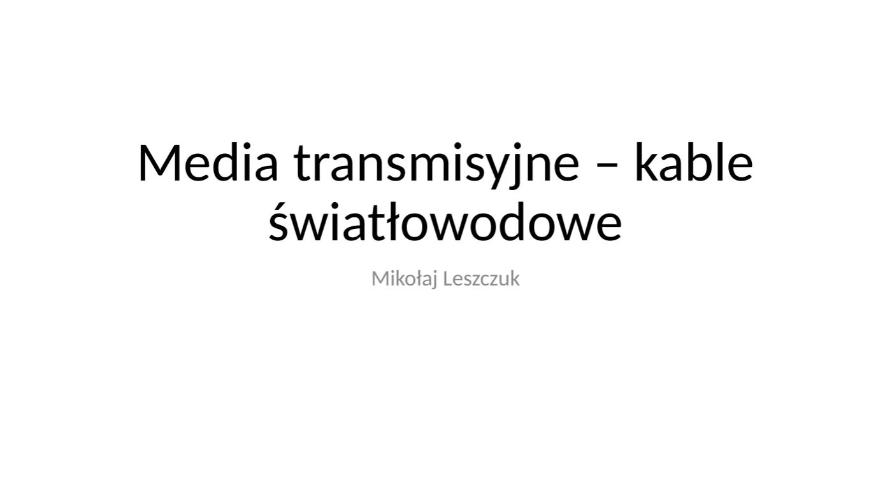

światłowodowe  
Mikołaj Leszczuk

### 2. Plan wykładu

Co  
to jest światłowód  
Światłowody wielomodowe  
Światłowody jednomodowe  
Straty w światłowodzie  
Podsumowanie o kablach światłowodowych  
Materiały dodatkowe o kablach  
światłowodowych  
19.11.2016  
2

### 3. Co to jest światłowód?

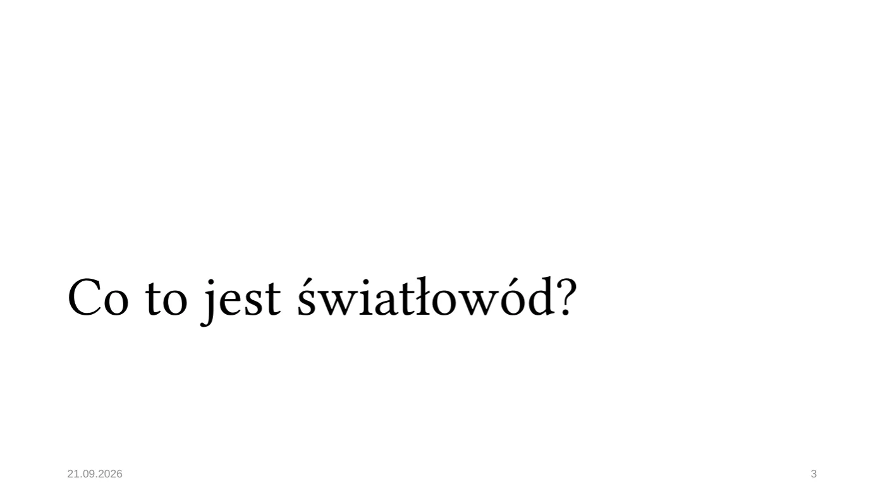

19.11.2016  
3

### 4. Co to jest światłowód?

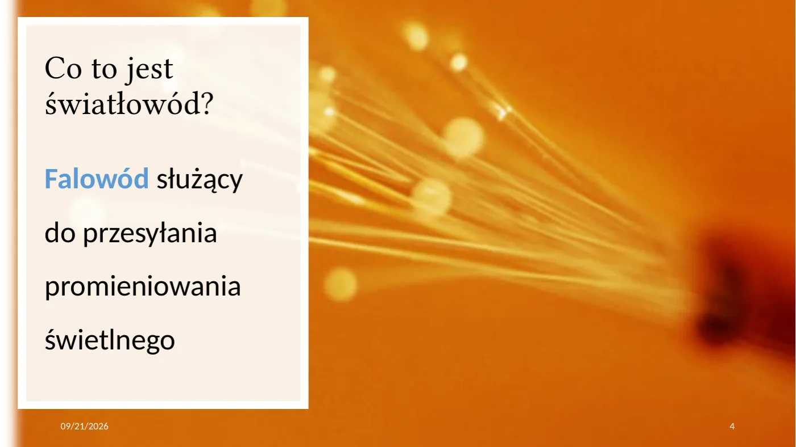

Falowód  
służący do przesyłania promieniowania świetlnego  
11/19/16  
4

### 5. Ewolucja światłowodów

Pierwotnie...  
Postać metalowych rurek o wypolerowanych ściankach  
Służących do przesyłania  
infra  
-red  
Obecnie...  
W formie włókien  
dielektrycznych  
Najczęściej szklanych  
Z otuliną z tworzywa sztucznego  
Mniejszym współczynnikiem załamania światła otuliny niż szkła  
19.11.2016  
5

### 6. Zalety światłowodu jako optycznego medium transmisyjnego

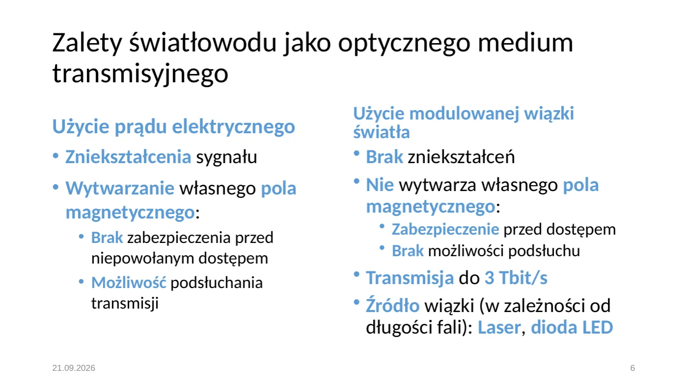

Użycie prądu elektrycznego  
Zniekształcenia  
sygnału  
Wytwarzanie  
własnego  
pola magnetycznego  
:  
Brak  
zabezpieczenia przed niepowołanym dostępem  
Możliwość  
podsłuchania transmisji  
Użycie modulowanej wiązki światła  
Brak  
zniekształceń  
Nie  
wytwarza własnego  
pola magnetycznego  
:  
Zabezpieczenie  
przed dostępem  
Brak  
możliwości podsłuchu  
Transmisja  
do  
3  
Tbit  
/s  
Źródło  
wiązki (w zależności od długości  
fali  
):  
Laser  
,  
dioda LED  
19.11.2016  
6

### 7. 19.11.2016

7

[Odtwórz materiał z tego slajdu](../web/media/05/slide-007-media1.mp4)

[Odtwórz materiał z tego slajdu](../web/media/05/slide-007-media1.mp4)

### 8. Laser jako źródło modulowanej wiązki światła

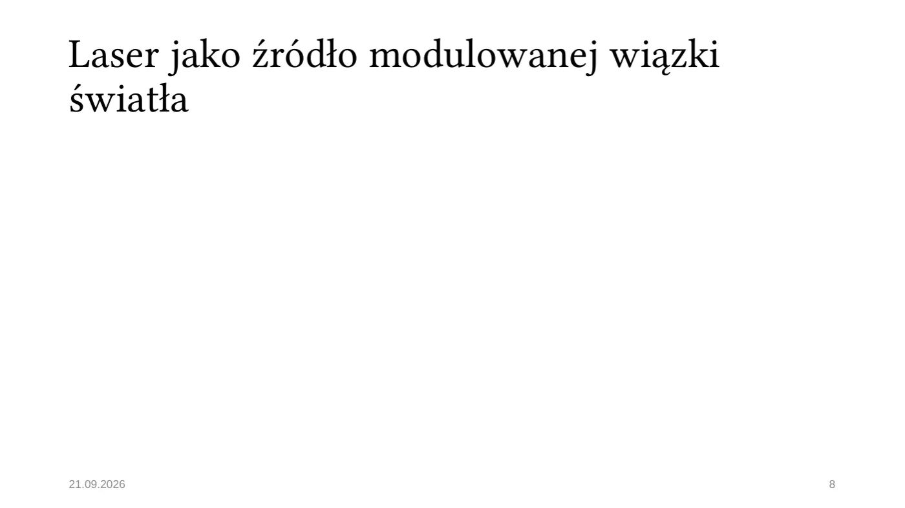

19.11.2016  
8

### 9. 19.11.2016

9

[Odtwórz materiał z tego slajdu](../web/media/05/slide-009-media2.mp4)

[Odtwórz materiał z tego slajdu](../web/media/05/slide-009-media2.mp4)

### 10. Odporność na błędy w światłowodzie

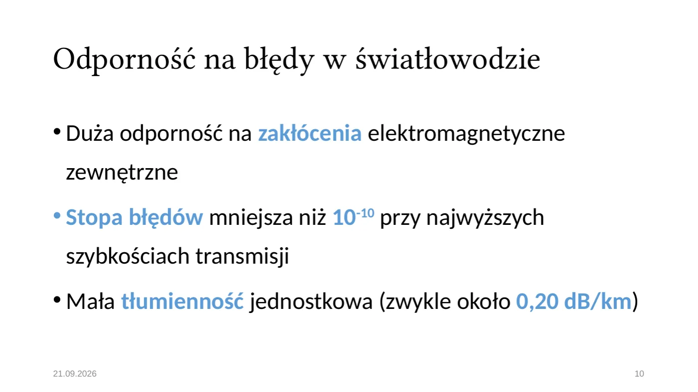

Duża odporność na  
zakłócenia  
elektromagnetyczne zewnętrzne  
Stopa błędów  
mniejsza niż  
10  
-10  
przy najwyższych szybkościach transmisji  
Mała  
tłumienność  
jednostkowa (zwykle około  
0,20  
dB  
/km  
)  
‏  
19.11.2016  
10

### 11. Inne zalety światłowodu

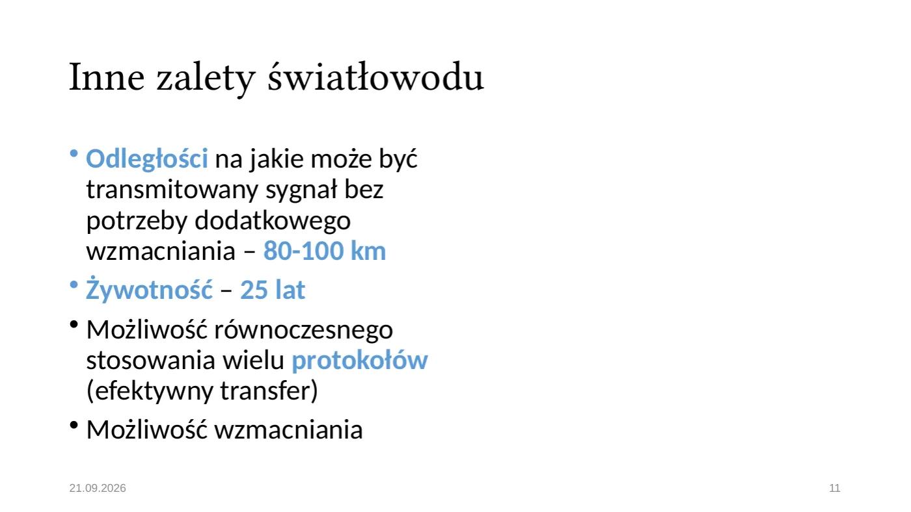

Odległości  
na jakie może być transmitowany sygnał bez potrzeby dodatkowego wzmacniania –  
80-100 km  
Żywotność  
–  
25 lat  
Możliwość równoczesnego stosowania wielu  
protokołów  
(efektywny transfer)  
Możliwość  
wzmacniania  
19.11.2016  
11

### 12. 19.11.2016

12

[Odtwórz materiał z tego slajdu](../web/media/05/slide-012-media3.mp4)

[Odtwórz materiał z tego slajdu](../web/media/05/slide-012-media3.mp4)

### 13. Podział światłowodów według liczby przesyłanych długości fali

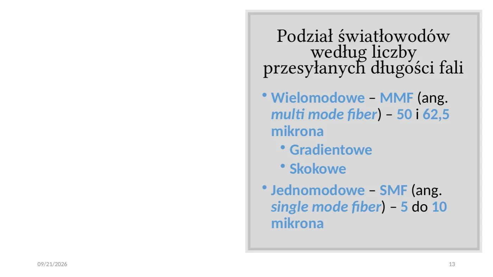

Wielomodowe  
–  
MMF  
(ang.  
multi  
mode  
fiber  
) –  
50  
i  
62,5 mikrona  
Gradientowe  
Skokowe  
Jednomodowe  
–  
SMF  
(ang.  
single  
mode  
fiber  
) –  
5  
do  
10 mikrona  
11/19/16  
13

### 14. Światłowody wielomodowe

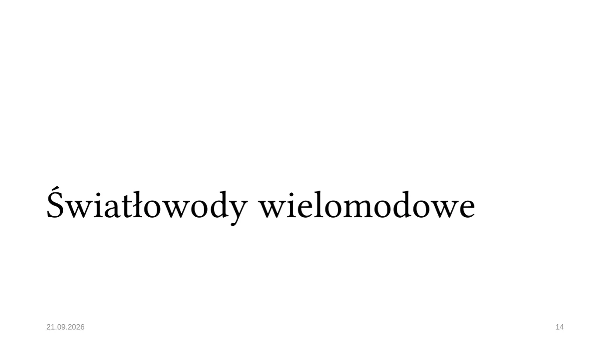

19.11.2016  
14

### 15. Schemat światłowodu wielomodowego

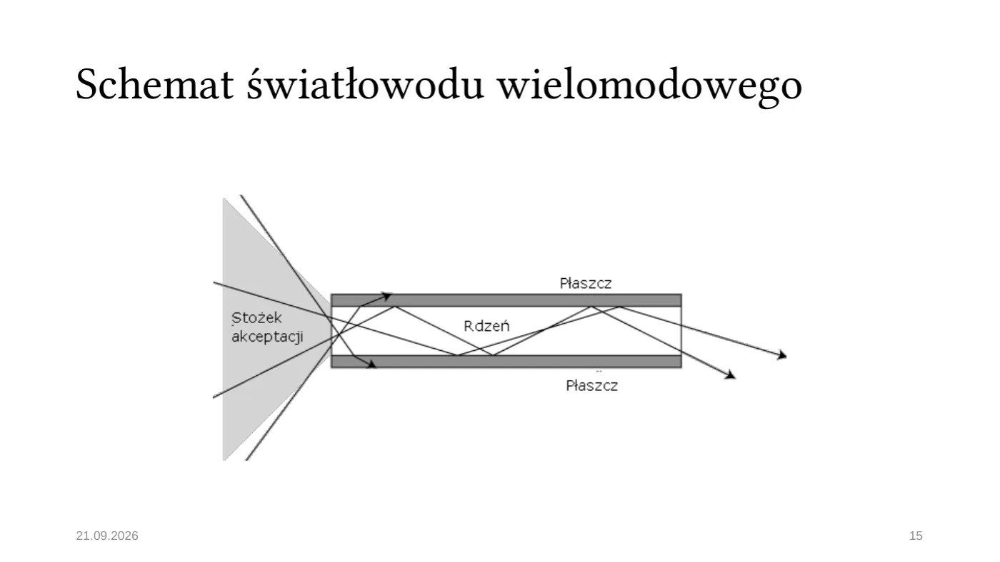

19.11.2016  
15

### 16. Wielomodowe światłowody gradientowe

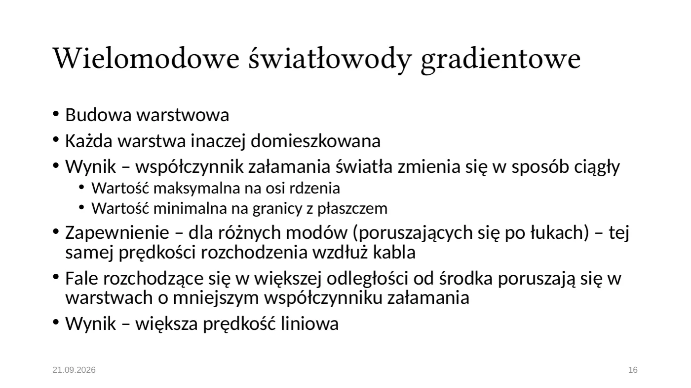

Budowa warstwowa  
Każda warstwa inaczej domieszkowana  
Wynik – współczynnik załamania światła zmienia się w sposób ciągły  
Wartość maksymalna na osi rdzenia  
Wartość minimalna na granicy z  
płaszczem  
Zapewnienie – dla różnych  
modów  
(poruszających się po łukach) – tej samej prędkości rozchodzenia wzdłuż kabla  
Fale rozchodzące się w większej odległości od środka poruszają się w warstwach o mniejszym współczynniku załamania  
Wynik – większa prędkość  
liniowa  
19.11.2016  
16

### 17. Przepływ strumieni świetlnych w światłowodzie wielomodowym gradientowym

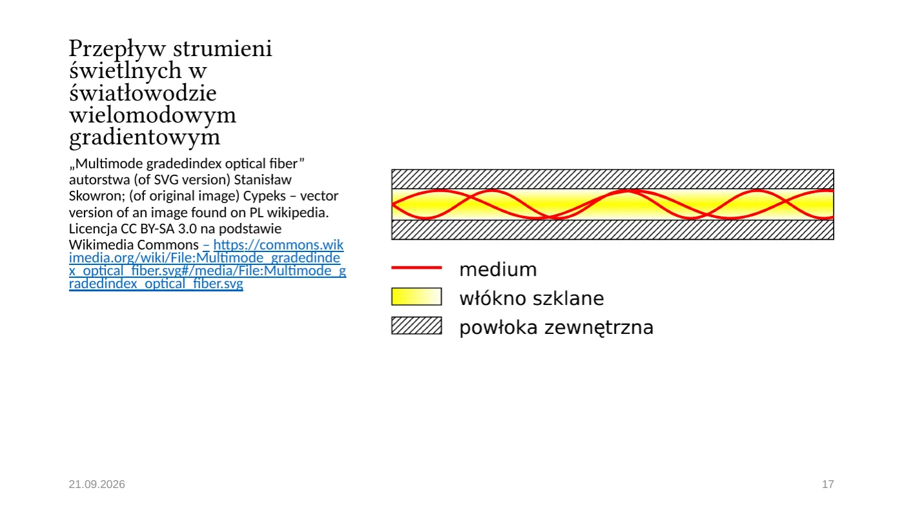

„  
Multimode  
gradedindex  
optical  
fiber  
” autorstwa (of SVG version) Stanisław Skowron; (of  
original  
image)  
Cypeks  
–  
vector  
version of  
an  
image  
found  
on PL  
wikipedia  
. Licencja CC BY-SA 3.0 na podstawie  
Wikimedia  
Commons  
–  
https  
://commons.wikimedia.org/wiki/File:Multimode_gradedindex_optical_fiber.svg#/  
media/File:Multimode_gradedindex_optical_fiber.svg  
19.11.2016  
17

### 18. Wielo-modowe światłowody skokowe‏

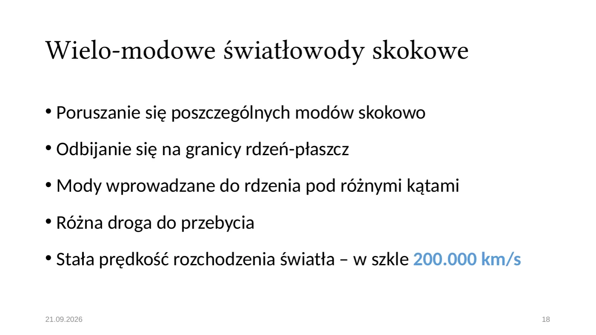

Poruszanie się poszczególnych  
modów  
skokowo  
Odbijanie się na granicy rdzeń-płaszcz  
Mody wprowadzane do rdzenia pod różnymi kątami  
Różna droga do przebycia  
Stała prędkość rozchodzenia światła – w szkle  
200.000  
km/s  
19.11.2016  
18

### 19. Wielo-modowe światłowody skokowe‏ – kontynuacja...

Różny czas przejścia promienia przez światłowód  
Powstawanie  
tzw. dyspersji między-modowej  
Efekt – poszerzenie impulsu docierającego na koniec światłowodu  
Konsekwencje – ograniczenie przepustowości i odległości, na jaką mogą być przesyłane sygnały  
19.11.2016  
19

### 20. Przepływ strumieni świetlnych w światłowodzie wielomodowym skokowym

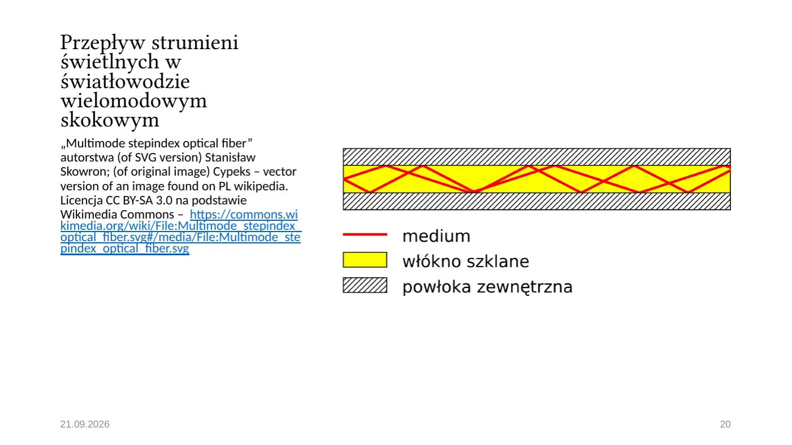

„  
Multimode  
stepindex  
optical  
fiber  
” autorstwa (of SVG version) Stanisław Skowron; (of  
original  
image)  
Cypeks  
–  
vector  
version of  
an  
image  
found  
on PL  
wikipedia  
. Licencja CC BY-SA 3.0 na podstawie  
Wikimedia  
Commons  
–  
https://commons.wikimedia.org/wiki/File:Multimode_stepindex_optical_fiber.svg#/  
media/File:Multimode_stepindex_optical_fiber.svg  
19.11.2016  
20

### 21. 19.11.2016

21

[Odtwórz materiał z tego slajdu](../web/media/05/slide-021-media4.mp4)

[Odtwórz materiał z tego slajdu](../web/media/05/slide-021-media4.mp4)

### 22. Światłowody jednomodowe

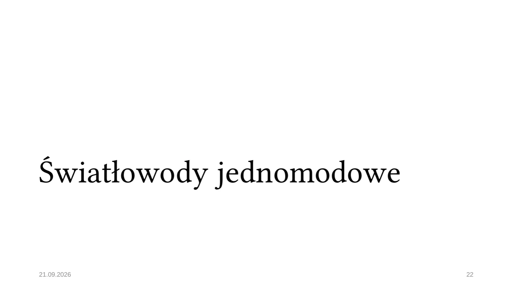

19.11.2016  
22

### 23. Światłowody jednomodowe (1/2)

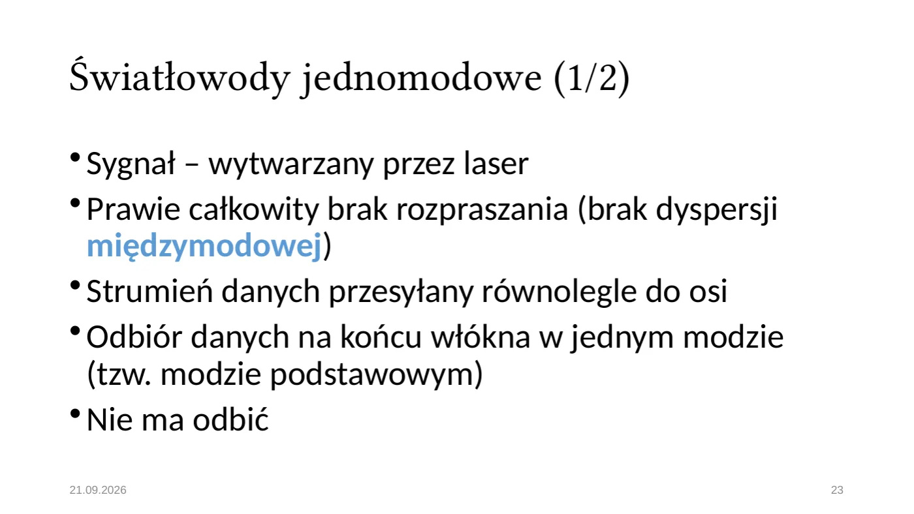

Sygnał – wytwarzany przez laser  
Prawie całkowity brak rozpraszania (brak dyspersji  
międzymodowej  
)‏  
Strumień danych przesyłany równolegle do osi  
Odbiór danych na końcu włókna w jednym modzie (tzw. modzie podstawowym)  
Nie ma  
odbić  
19.11.2016  
23

### 24. Światłowody jednomodowe (2/2)

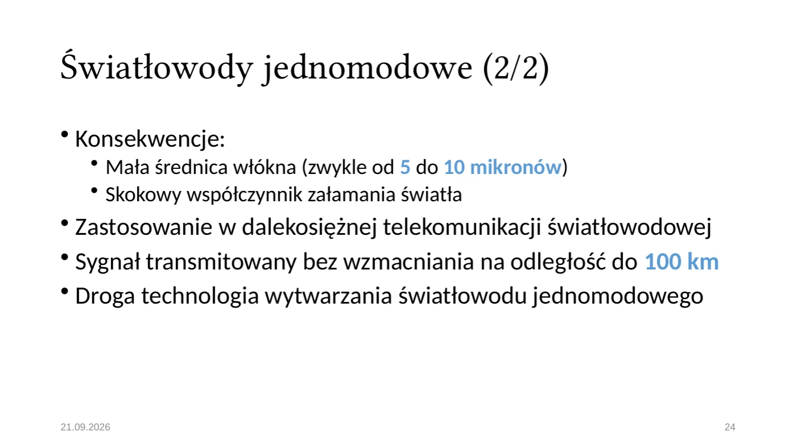

Konsekwencje:  
Mała średnica włókna (zwykle od  
5  
do  
10  
mikronów  
)  
Skokowy współczynnik załamania światła  
Zastosowanie w dalekosiężnej telekomunikacji światłowodowej  
Sygnał transmitowany bez wzmacniania na odległość do  
100 km  
Droga technologia wytwarzania światłowodu  
jednomodowego  
19.11.2016  
24

### 25. 19.11.2016

25

[Odtwórz materiał z tego slajdu](../web/media/05/slide-025-media5.mp4)

[Odtwórz materiał z tego slajdu](../web/media/05/slide-025-media5.mp4)

### 26. Straty w światłowodzie

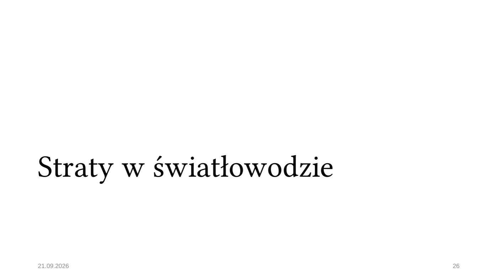

19.11.2016  
26

### 27. Straty w światłowodzie

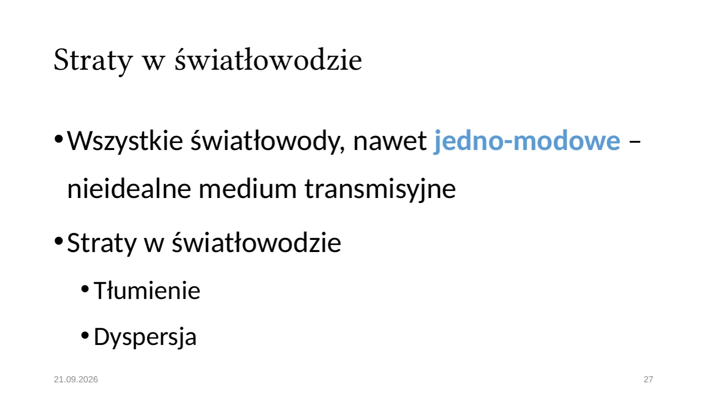

Wszystkie światłowody, nawet  
jedno-modowe  
– nieidealne medium transmisyjne  
Straty w światłowodzie  
Tłumienie  
Dyspersja  
19.11.2016  
27

### 28. Tłumienie sygnału

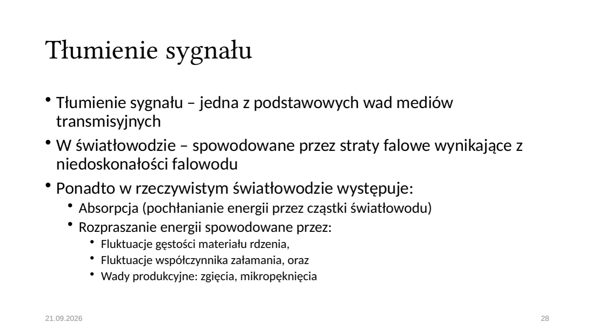

Tłumienie sygnału – jedna z podstawowych wad mediów transmisyjnych  
W światłowodzie – spowodowane przez straty falowe wynikające z niedoskonałości falowodu  
Ponadto w rzeczywistym światłowodzie występuje:  
Absorpcja (pochłanianie energii przez cząstki światłowodu)‏  
Rozpraszanie energii spowodowane przez:  
Fluktuacje gęstości materiału rdzenia,  
Fluktuacje współczynnika załamania, oraz  
Wady  
produkcyjne: zgięcia, mikropęknięcia  
19.11.2016  
28

### 29. Tłumienie sygnału

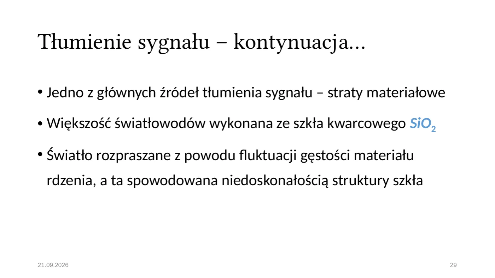

– kontynuacja  
...  
Jedno z głównych źródeł tłumienia sygnału – straty materiałowe  
Większość światłowodów wykonana ze szkła kwarcowego  
SiO  
2  
Światło rozpraszane z powodu fluktuacji gęstości materiału rdzenia, a ta spowodowana niedoskonałością struktury  
szkła  
19.11.2016  
29

### 30. Straty falowodowe

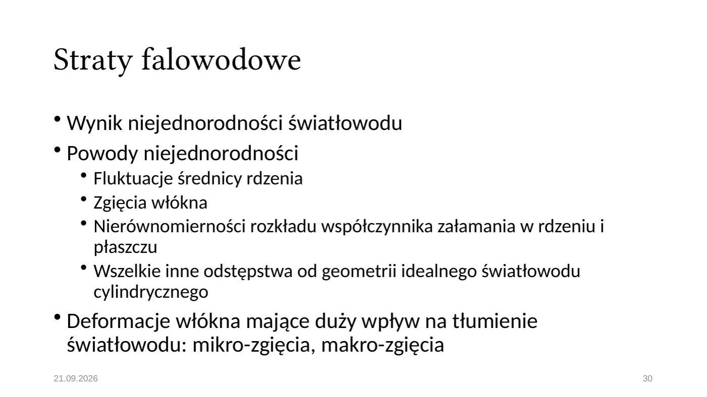

Wynik niejednorodności światłowodu  
Powody niejednorodności  
Fluktuacje średnicy rdzenia  
Zgięcia włókna  
Nierównomierności rozkładu współczynnika załamania w rdzeniu i płaszczu  
Wszelkie inne odstępstwa od geometrii idealnego światłowodu cylindrycznego  
Deformacje włókna mające duży wpływ na tłumienie  
światłowodu: mikro-zgięcia, makro-zgięcia  
19.11.2016  
30

### 31. 19.11.2016

31

[Odtwórz materiał z tego slajdu](../web/media/05/slide-031-media6.mp4)

[Odtwórz materiał z tego slajdu](../web/media/05/slide-031-media6.mp4)

### 32. Mikro-zgięcia

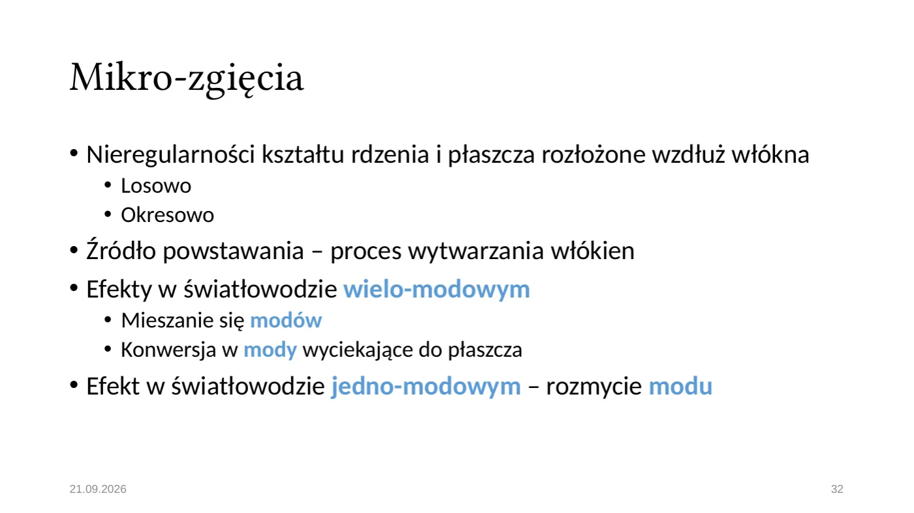

Nieregularności kształtu rdzenia i płaszcza rozłożone wzdłuż włókna  
Losowo  
Okresowo  
Źródło powstawania – proces wytwarzania włókien  
Efekty w światłowodzie  
wielo  
-modowym  
Mieszanie się  
modów  
Konwersja w  
mody  
wyciekające do płaszcza  
Efekt  
w światłowodzie  
jedno-modowym  
– rozmycie  
modu  
19.11.2016  
32

### 33. 19.11.2016

33

[Odtwórz materiał z tego slajdu](../web/media/05/slide-033-media7.mp4)

[Odtwórz materiał z tego slajdu](../web/media/05/slide-033-media7.mp4)

### 34. Makro-zgięcia

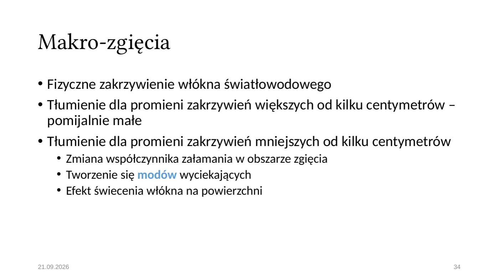

Fizyczne zakrzywienie włókna światłowodowego  
Tłumienie dla promieni zakrzywień większych od kilku  
centymetrów – pomijalnie  
małe  
Tłumienie dla promieni zakrzywień mniejszych od kilku centymetrów  
Zmiana współczynnika załamania w obszarze zgięcia  
Tworzenie się  
modów  
wyciekających  
Efekt świecenia włókna na  
powierzchni  
19.11.2016  
34

### 35. 19.11.2016

35

[Odtwórz materiał z tego slajdu](../web/media/05/slide-035-media8.mp4)

[Odtwórz materiał z tego slajdu](../web/media/05/slide-035-media8.mp4)

### 36. Inne przyczyny

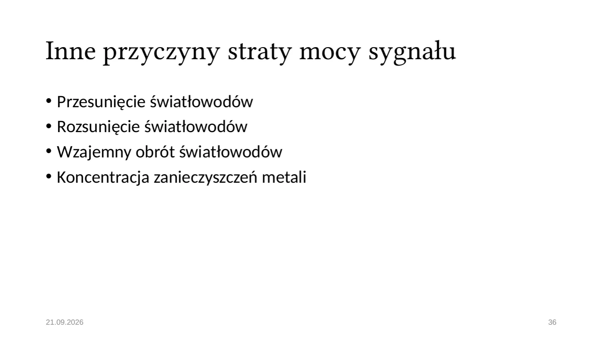

straty mocy  
sygnału  
Przesunięcie światłowodów  
Rozsunięcie światłowodów  
Wzajemny obrót światłowodów  
Koncentracja zanieczyszczeń  
metali  
19.11.2016  
36

### 37. Koncentracja zanieczyszczeń

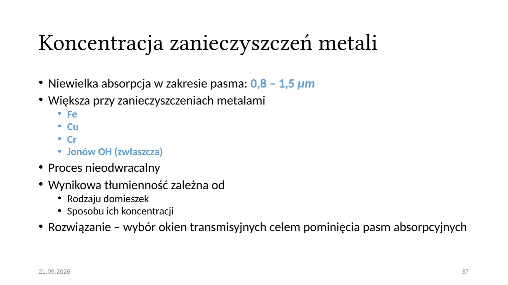

metali  
Niewielka absorpcja w zakresie  
pasma:  
0,8  
– 1,5  
µm  
Większa przy zanieczyszczeniach metalami  
Fe  
Cu  
Cr  
Jonów OH (zwłaszcza)  
Proces nieodwracalny  
Wynikowa tłumienność zależna od  
Rodzaju domieszek  
Sposobu ich koncentracji  
Rozwiązanie – wybór okien transmisyjnych celem pominięcia pasm  
absorpcyjnych  
19.11.2016  
37

### 38. Tłumienie sygnału dla

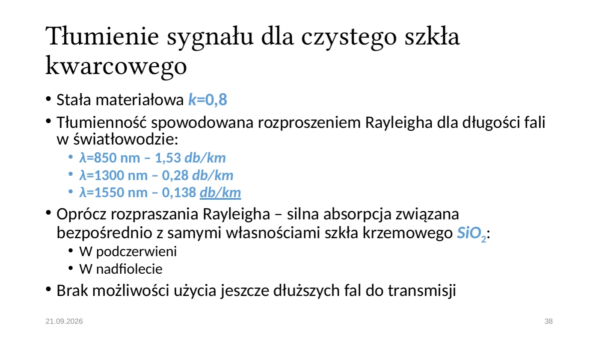

czystego szkła  
kwarcowego  
Stała materiałowa  
k  
=0,8  
Tłumienność spowodowana rozproszeniem Rayleigha dla długości fali w światłowodzie:  
λ  
=850  
nm  
– 1,53  
db  
/km  
λ  
=1300  
nm  
– 0,28  
db  
/km  
λ  
=1550  
nm  
– 0,138  
db  
/km  
Oprócz rozpraszania Rayleigha – silna absorpcja związana bezpośrednio z samymi własnościami szkła krzemowego  
SiO  
2  
:  
W podczerwieni  
W nadfiolecie  
Brak możliwości użycia jeszcze dłuższych fal do  
transmisji  
19.11.2016  
38

### 39. 19.11.2016

39

[Odtwórz materiał z tego slajdu](../web/media/05/slide-039-media9.mp4)

[Odtwórz materiał z tego slajdu](../web/media/05/slide-039-media9.mp4)

### 40. Dyspersja

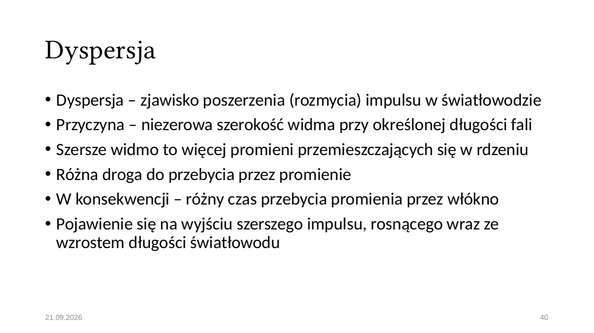

Dyspersja – zjawisko poszerzenia (rozmycia) impulsu w światłowodzie  
Przyczyna – niezerowa szerokość widma przy określonej długości fali  
Szersze widmo to więcej promieni przemieszczających się w rdzeniu  
Różna droga do przebycia przez promienie  
W konsekwencji – różny czas przebycia promienia przez włókno  
Pojawienie się na wyjściu szerszego impulsu, rosnącego wraz ze wzrostem długości światłowodu  
19.11.2016  
40

### 41. Dyspersja – kontunuacja...

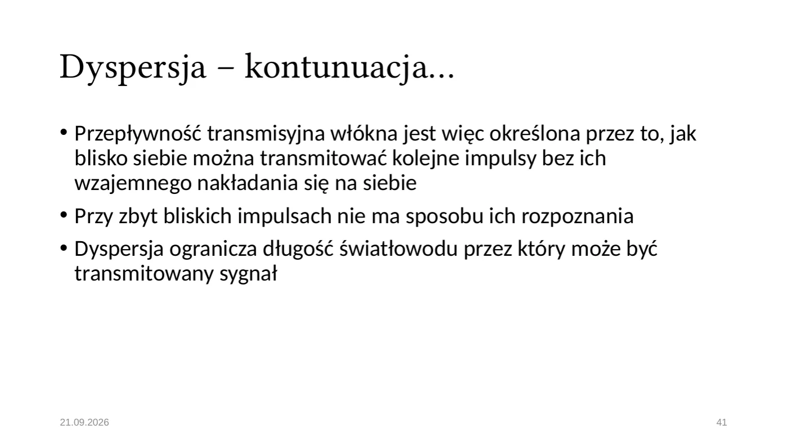

Przepływność transmisyjna włókna jest więc określona przez to, jak blisko siebie można transmitować kolejne impulsy bez ich wzajemnego nakładania się na siebie  
Przy zbyt bliskich impulsach nie ma sposobu ich rozpoznania‏  
Dyspersja ogranicza długość światłowodu przez który może być transmitowany sygnał  
19.11.2016  
41

### 42. Dwa rozróżniane typy dyspersji

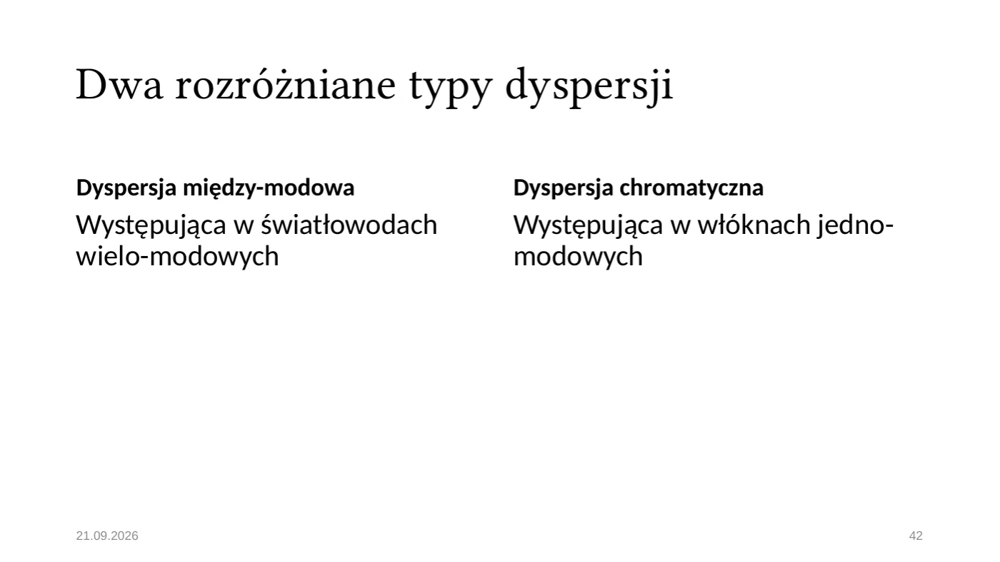

Dyspersja między-modowa  
Występująca w światłowodach  
wielo  
-modowych  
Dyspersja chromatyczna  
Występująca w włóknach jedno-modowych  
19.11.2016  
42

### 43. Dyspersja między-modowa

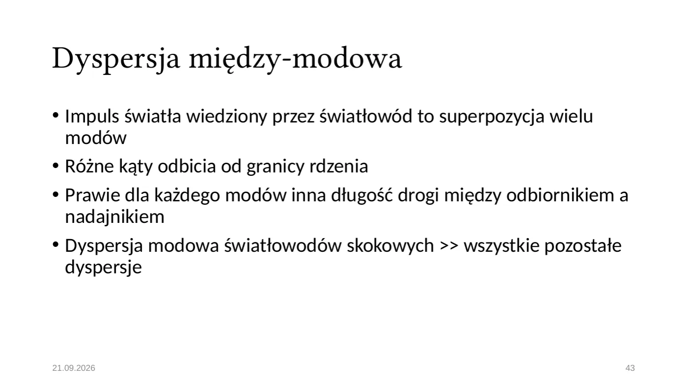

Impuls światła wiedziony przez światłowód to superpozycja wielu  
modów  
Różne kąty odbicia od granicy rdzenia  
Prawie dla każdego  
modów  
inna długość drogi między odbiornikiem a nadajnikiem  
Dyspersja modowa światłowodów skokowych >> wszystkie pozostałe dyspersje  
19.11.2016  
43

### 44. Dyspersja między-modowa – kontynuacja...

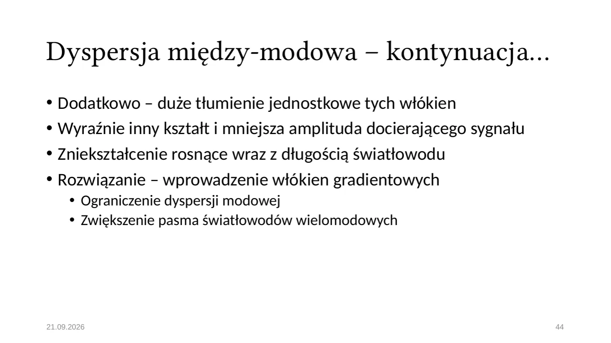

Dodatkowo – duże tłumienie jednostkowe tych włókien  
Wyraźnie inny kształt i mniejsza amplituda docierającego sygnału  
Zniekształcenie rosnące wraz z długością światłowodu  
Rozwiązanie – wprowadzenie włókien gradientowych  
Ograniczenie dyspersji modowej  
Zwiększenie pasma światłowodów wielomodowych  
19.11.2016  
44

### 45. Dyspersja chromatyczna

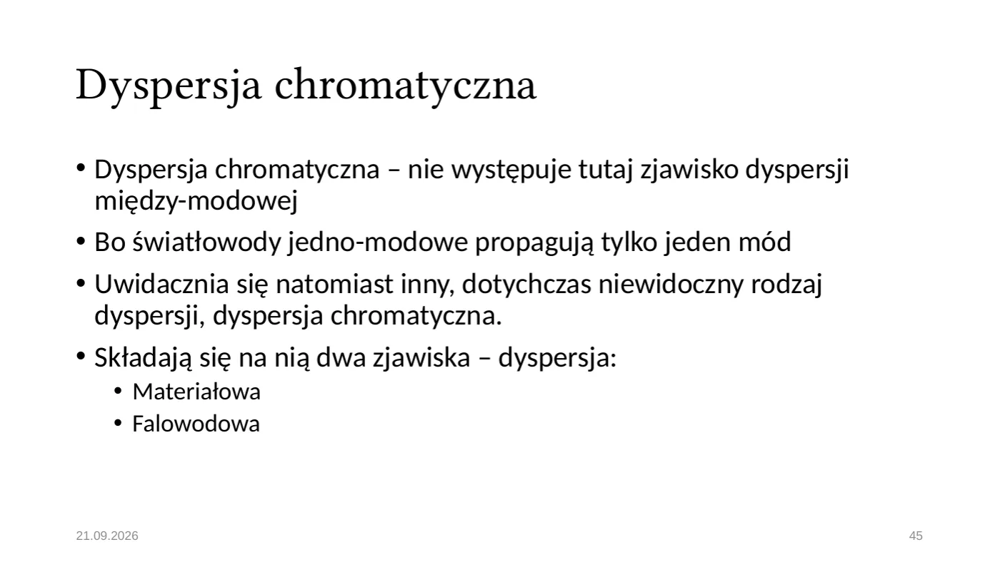

Dyspersja chromatyczna – nie występuje tutaj zjawisko dyspersji między-modowej  
Bo światłowody jedno-modowe propagują tylko jeden mód  
Uwidacznia się natomiast inny, dotychczas niewidoczny rodzaj dyspersji, dyspersja chromatyczna.  
Składają się na nią dwa zjawiska – dyspersja:  
Materiałowa  
Falowodowa  
19.11.2016  
45

### 46. Dyspersja materiałowa

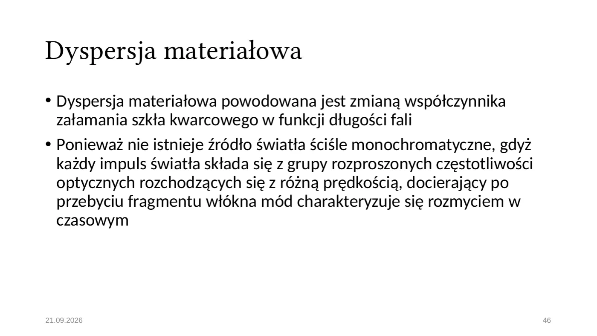

Dyspersja materiałowa powodowana jest zmianą współczynnika załamania szkła kwarcowego w funkcji długości fali  
Ponieważ nie istnieje źródło światła ściśle monochromatyczne, gdyż każdy impuls światła składa się z grupy rozproszonych częstotliwości optycznych rozchodzących się z różną prędkością, docierający po przebyciu fragmentu włókna mód charakteryzuje się rozmyciem w czasowym  
19.11.2016  
46

### 47. Dyspersja falowa

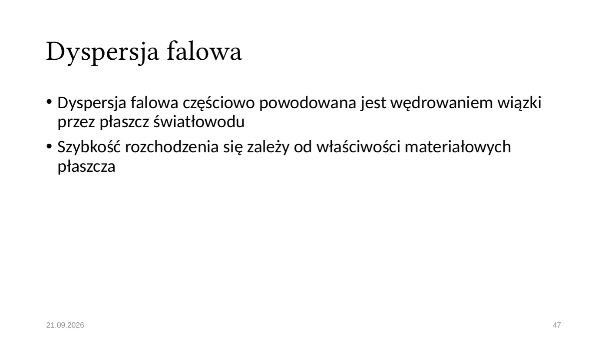

Dyspersja falowa częściowo powodowana jest wędrowaniem wiązki przez płaszcz światłowodu  
Szybkość rozchodzenia się zależy od właściwości materiałowych płaszcza  
19.11.2016  
47

### 48. Dyspersja

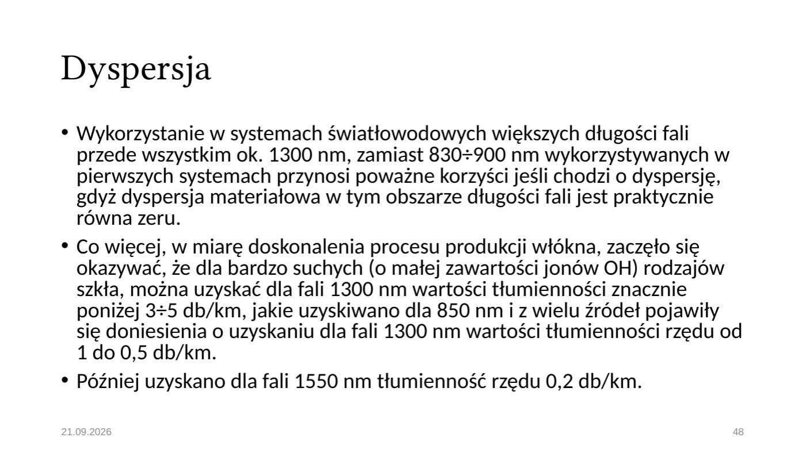

Wykorzystanie w systemach światłowodowych większych długości fali przede wszystkim ok. 1300  
nm  
, zamiast 830÷900  
nm  
wykorzystywanych w pierwszych systemach przynosi poważne korzyści jeśli chodzi o dyspersję, gdyż dyspersja materiałowa w tym obszarze długości fali jest praktycznie równa zeru.  
Co więcej, w miarę doskonalenia procesu produkcji włókna, zaczęło się okazywać, że dla bardzo suchych (o małej zawartości jonów OH) rodzajów szkła, można uzyskać dla fali 1300  
nm  
wartości tłumienności znacznie poniżej 3÷5  
db  
/km, jakie uzyskiwano dla 850  
nm  
i z wielu źródeł pojawiły się doniesienia o uzyskaniu dla fali 1300  
nm  
wartości tłumienności rzędu od 1 do 0,5  
db  
/km.  
Później uzyskano dla fali 1550  
nm  
tłumienność rzędu 0,2  
db  
/km  
.  
19.11.2016  
48

### 49. Dyspersja chromatyczna

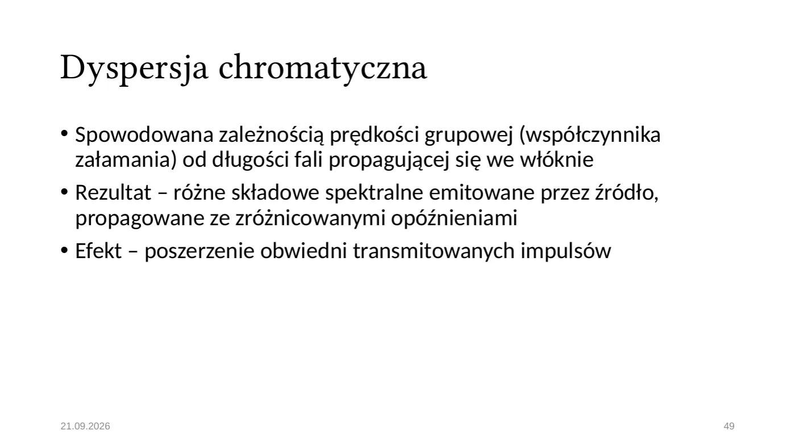

Spowodowana zależnością prędkości grupowej (współczynnika załamania) od długości fali propagującej się we włóknie  
Rezultat – różne składowe spektralne emitowane przez źródło, propagowane ze zróżnicowanymi opóźnieniami  
Efekt – poszerzenie obwiedni transmitowanych impulsów  
19.11.2016  
49

### 50. Dyspersja chromatyczna – kontynuacja...

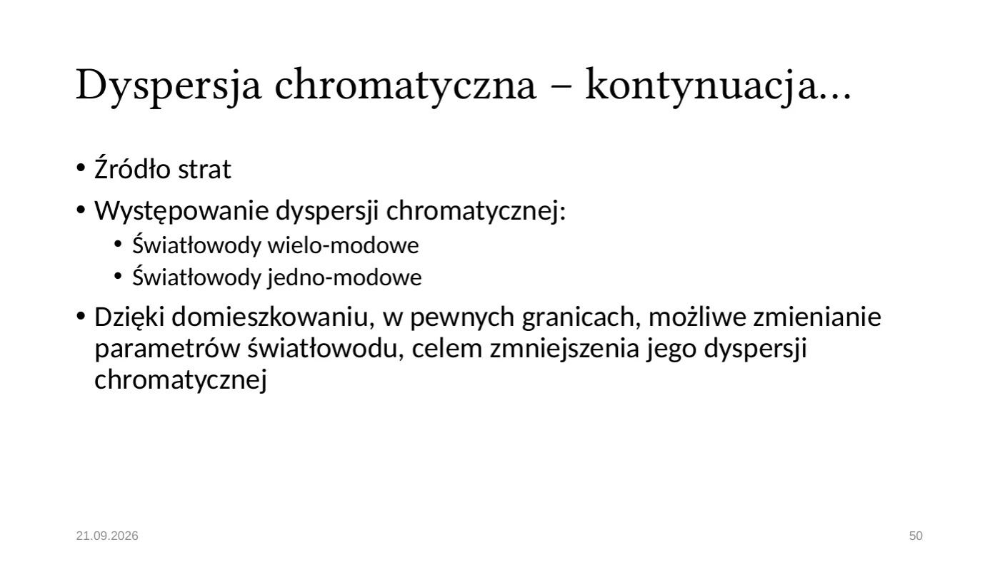

Źródło strat  
Występowanie dyspersji chromatycznej:  
Światłowody  
wielo  
-modowe  
Światłowody jedno-modowe  
Dzięki domieszkowaniu, w pewnych granicach, możliwe zmienianie parametrów światłowodu, celem zmniejszenia jego dyspersji chromatycznej  
19.11.2016  
50

### 51. 19.11.2016

51

[Odtwórz materiał z tego slajdu](../web/media/05/slide-051-media10.mp4)

[Odtwórz materiał z tego slajdu](../web/media/05/slide-051-media10.mp4)

### 52. 19.11.2016

52

[Odtwórz materiał z tego slajdu](../web/media/05/slide-052-media11.mp4)

[Odtwórz materiał z tego slajdu](../web/media/05/slide-052-media11.mp4)

### 53. Literatura

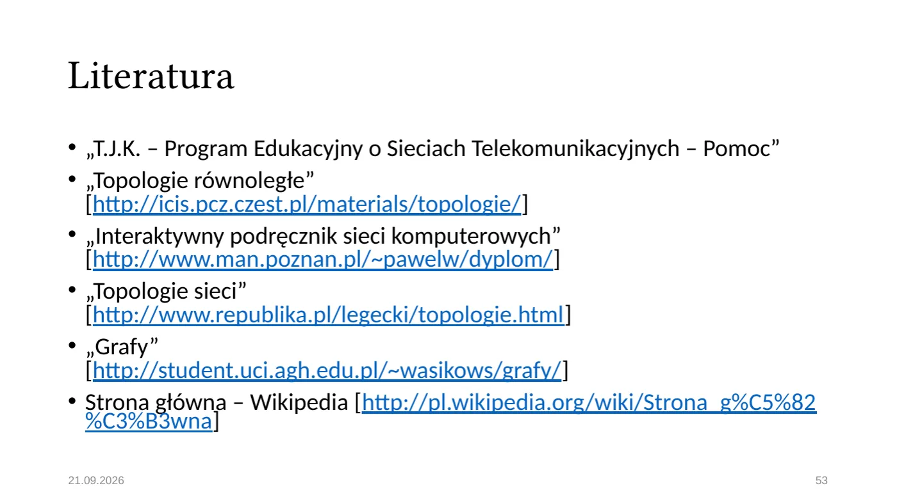

„T.J.K. – Program Edukacyjny o Sieciach Telekomunikacyjnych – Pomoc”  
„  
Topologie równoległe”  
[  
http://icis.pcz.czest.pl/materials/topologie/  
]  
„  
Interaktywny podręcznik sieci komputerowych”  
[  
http://www.man.poznan.pl/~pawelw/dyplom/  
]  
„  
Topologie sieci”  
[  
http://www.republika.pl/legecki/topologie.html  
]  
„Grafy”  
[  
http://student.uci.agh.edu.pl/~wasikows/grafy/  
]  
Strona główna –  
W  
ikipedia [  
http://pl.wikipedia.org/wiki/Strona_g%C5%82%C3%B3wna  
]  
19.11.2016  
53

### 54. Literatura

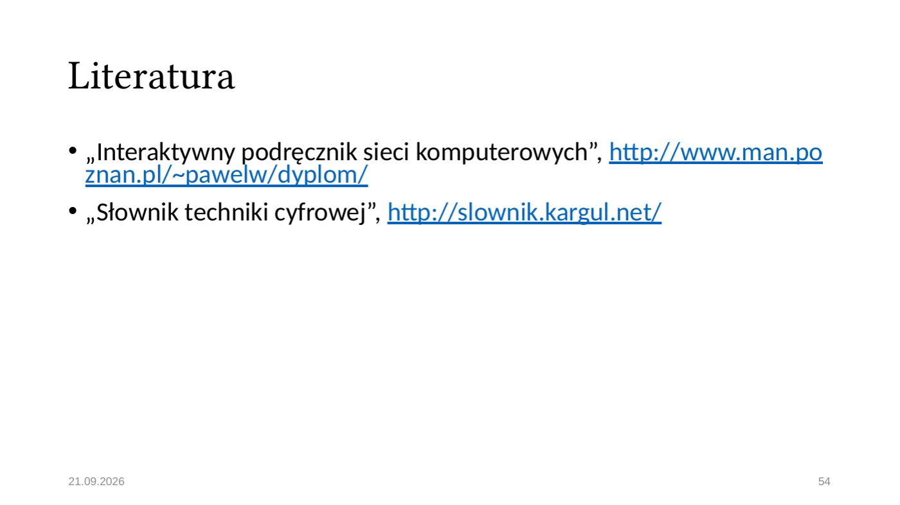

„Interaktywny podręcznik sieci komputerowych”,  
http://www.man.poznan.pl/~pawelw/dyplom/  
„Słownik techniki cyfrowej  
”  
,  
http://slownik.kargul.net/  
19.11.2016  
54

