# Media transmisyjne - transmisja bezprzewodowa

Oryginał: [06 Media transmisyjne - transmisja bezprzewodowa.pptx](../06%20Media%20transmisyjne%20-%20transmisja%20bezprzewodowa.pptx)

## Slajdy

### 1. Media transmisyjne – transmisja bezprzewodowa

Mikołaj Leszczuk

### 2. Plan wykładu

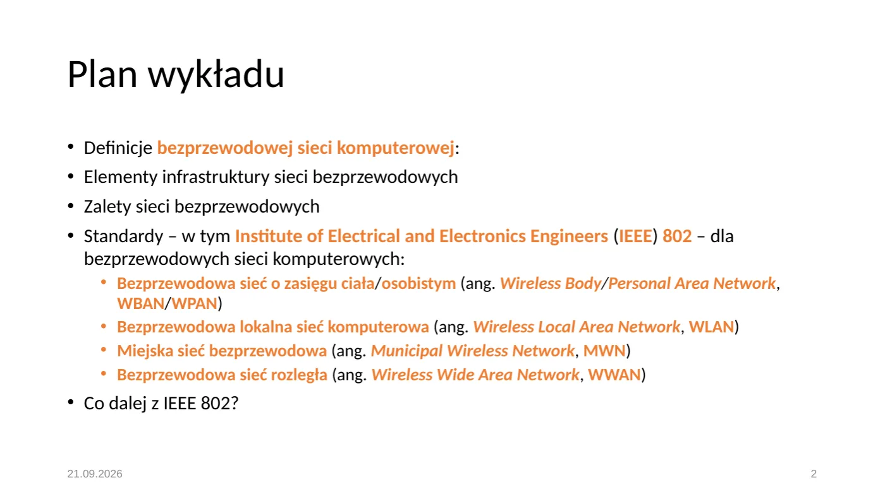

Definicje  
bezprzewodowej sieci komputerowej  
:  
Elementy infrastruktury sieci bezprzewodowych  
Zalety sieci bezprzewodowych  
Standardy – w tym  
Institute of Electrical and Electronics Engineers  
(  
IEEE  
)  
802  
– dla bezprzewodowych sieci komputerowych:  
Bezprzewodowa sieć o zasięgu ciała  
/  
osobistym  
(ang.  
Wireless Body  
/  
Personal Area Network  
,  
WBAN  
/  
WPAN  
)  
Bezprzewodowa lokalna sieć komputerowa  
(ang.  
Wireless Local Area Network  
,  
WLAN  
)  
Miejska sieć bezprzewodowa  
(ang.  
Municipal Wireless Network  
,  
MWN  
)  
Bezprzewodowa sieć rozległa  
(ang.  
Wireless Wide Area Network  
,  
WWAN  
)  
Co dalej z IEEE 802?  
06.12.2020  
2

### 3. Definicje

bezprzewodowej sieci komputerowej  
06.12.2020  
3

### 4. Definicja bezprzewodowej sieci komputerowej (1/2)

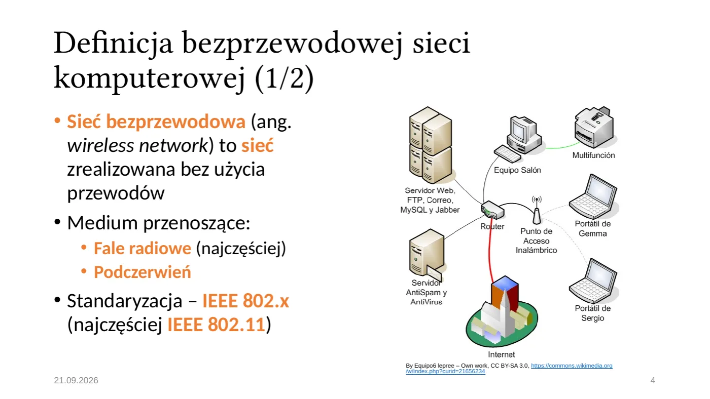

Sieć bezprzewodowa  
(ang.  
wireless network  
) to  
sieć  
zrealizowana bez użycia przewodów  
Medium przenoszące:  
Fale radiowe  
(najczęściej)  
Podczerwień  
Standaryzacja –  
IEEE 802.x  
(najczęściej  
IEEE 802.11  
)  
06.12.2020  
4  
By Equipo6  
lepree  
–  
Own work, CC BY-SA 3.0,  
https://commons.wikimedia.org/w/index.php?curid=21656234

### 5. Definicja bezprzewodowej sieci komputerowej (2/2)

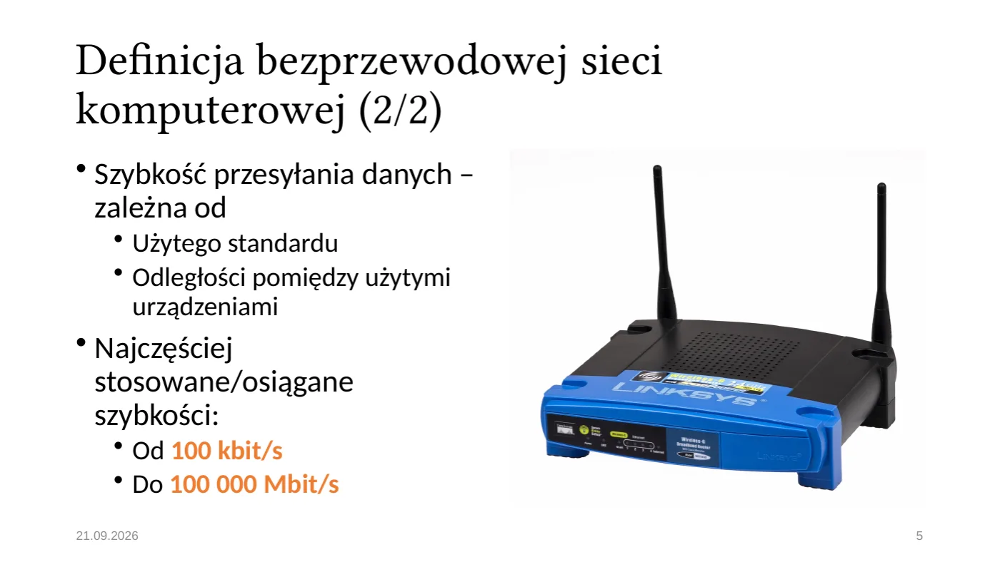

Szybkość przesyłania danych – zależna od  
Użytego standardu  
Odległości pomiędzy użytymi urządzeniami  
Najczęściej stosowane/osiągane szybkości:  
Od  
100 kbit/s  
Do  
100 000  
Mbit  
/s  
06.12.2020  
5

### 6. Elementy infrastruktury sieci bezprzewodowych

06.12.2020  
6

### 7. Elementy infrastruktury sieci bezprzewodowych

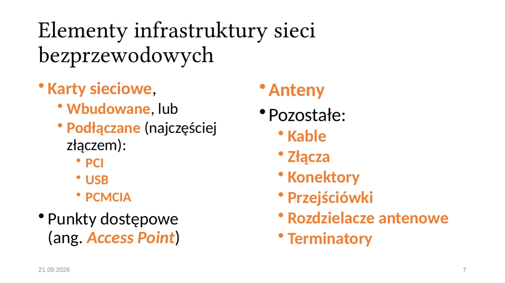

Karty sieciowe  
,  
Wbudowane  
, lub  
Podłączane  
(najczęściej złączem):  
PCI  
USB  
PCMCIA  
Punkty dostępowe  
(ang.  
Access Point  
)  
Anteny  
Pozostałe:  
Kable  
Złącza  
Konektory  
Przejściówki  
Rozdzielacze antenowe  
Terminatory  
06.12.2020  
7

### 8. Zalety sieci bezprzewodowych

06.12.2020  
8

### 9. Zalety sieci bezprzewodowych

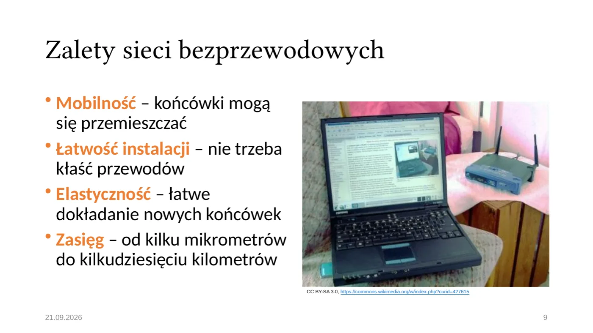

Mobilność  
– końcówki mogą się przemieszczać  
Łatwość instalacji  
– nie trzeba kłaść przewodów  
Elastyczność  
– łatwe dokładanie nowych końcówek  
Zasięg  
– od kilku mikrometrów do kilkudziesięciu kilometrów  
06.12.2020  
9  
CC BY-SA 3.0,  
https://commons.wikimedia.org/w/index.php?curid=427615

### 10. Standardy – w tym

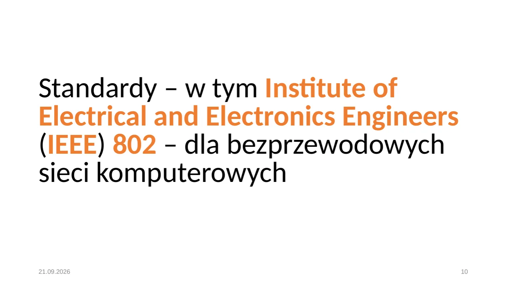

Institute of Electrical and Electronics Engineers  
(  
IEEE  
)  
802  
– dla bezprzewodowych sieci komputerowych  
06.12.2020  
10

### 11. Typy

sieci  
: LAN, WAN, PAN, CAN, MAN, SAN, WLAN  
12/6/20  
11

### 12. Typy sieci komputerowych

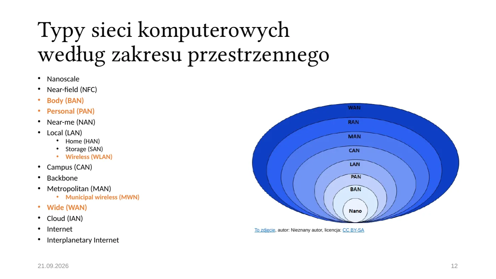

według zakresu przestrzennego  
Nanoscale  
Near  
-field (NFC)  
Body (BAN)  
Personal (PAN)  
Near  
-me (NAN)  
Local (LAN)  
Home (HAN)  
Storage (SAN)  
Wireless (WLAN)  
Campus (CAN)  
Backbone  
Metropolitan (MAN)  
Municipal wireless (MWN)  
Wide (WAN)  
Cloud (IAN)  
Internet  
Interplanetary  
Internet  
06.12.2020  
12  
To zdjęcie  
, autor: Nieznany autor, licencja:  
CC BY-SA

### 13. Standardy – w tym

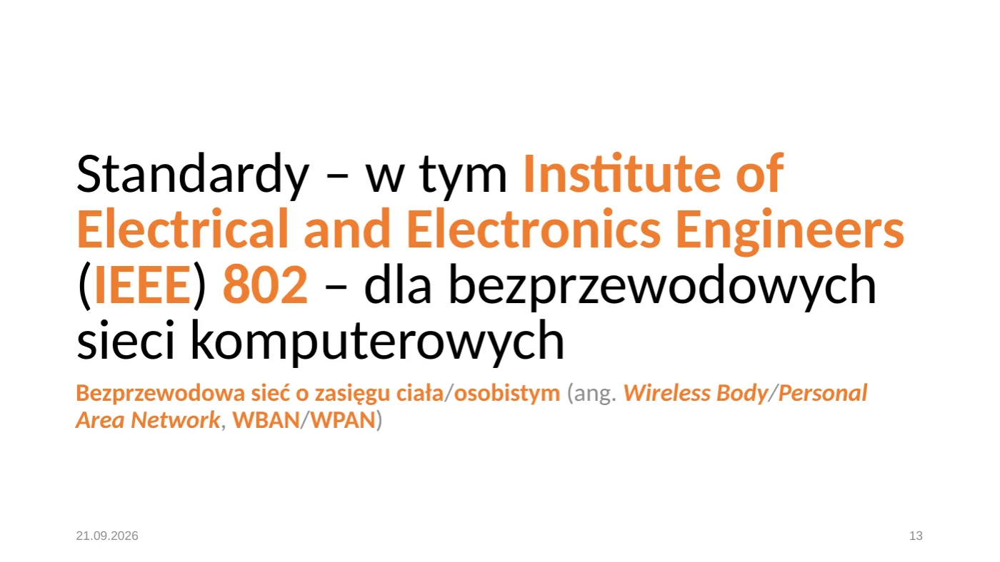

Institute of Electrical and Electronics Engineers  
(  
IEEE  
)  
802  
– dla bezprzewodowych sieci komputerowych  
Bezprzewodowa sieć o zasięgu ciała  
/  
osobistym  
(ang.  
Wireless Body  
/  
Personal Area Network  
,  
WBAN  
/  
WPAN  
)  
06.12.2020  
13

### 14. Bezprzewodowa sieć o zasięgu ciała/osobistym i Internet rzeczy

06.12.2020  
14

### 15. Wyjaśnienie węzłów czujników bezprzewodowych: Wi-Fi kontra ZigBee

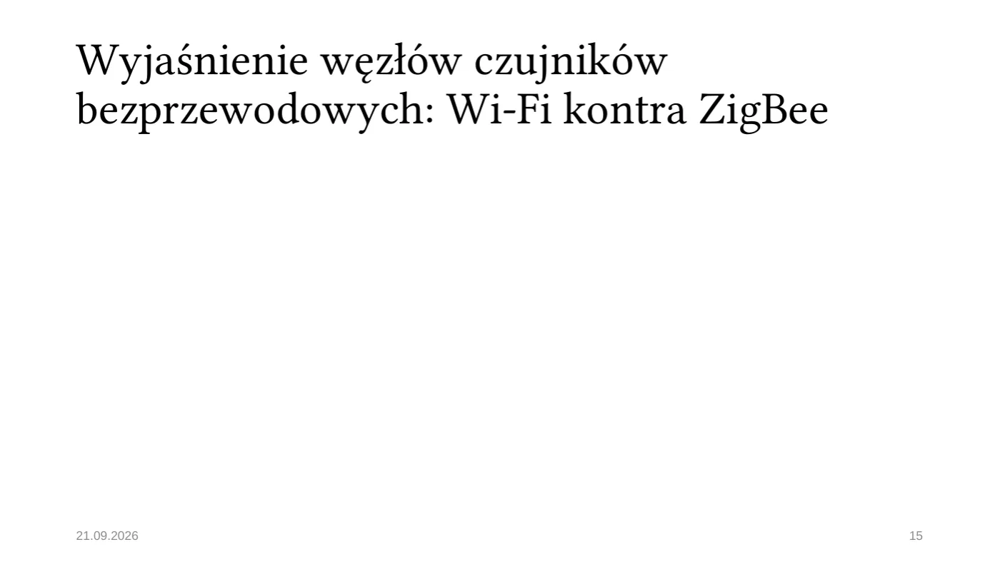

06.12.2020  
15

### 16. ZigBee (IEEE 802.15.2)

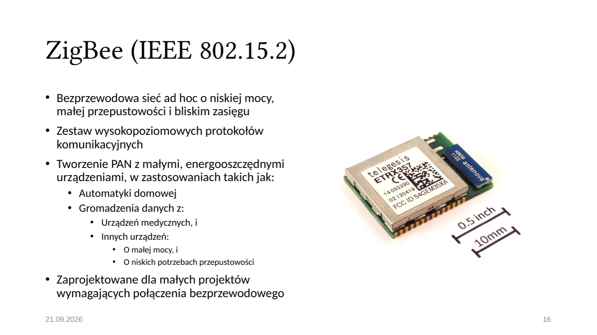

Bezprzewodowa sieć ad hoc o niskiej mocy, małej przepustowości i bliskim zasięgu  
Zestaw wysokopoziomowych protokołów komunikacyjnych  
Tworzenie PAN z małymi, energooszczędnymi urządzeniami, w zastosowaniach takich jak:  
Automatyki domowej  
Gromadzenia danych z:  
Urządzeń medycznych, i  
Innych urządzeń:  
O małej mocy, i  
O niskich potrzebach przepustowości  
Zaprojektowane dla małych projektów wymagających połączenia bezprzewodowego  
06.12.2020  
16

### 17. Z-Wave – co to jest?

06.12.2020  
17

### 18. Bluetooth (IEEE 802.15.1)

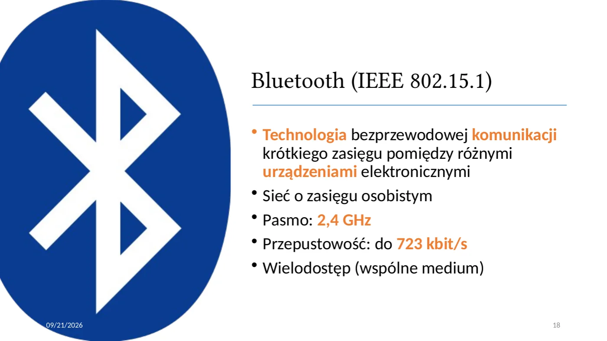

Technologia  
bezprzewodowej  
komunikacji  
krótkiego zasięgu pomiędzy różnymi  
urządzeniami  
elektronicznymi  
Sieć o zasięgu osobistym  
Pasmo:  
2,4 GHz  
Przepustowość: do  
723 kbit/s  
Wielodostęp (wspólne medium)  
12/6/20  
18

### 19. Z-Wave

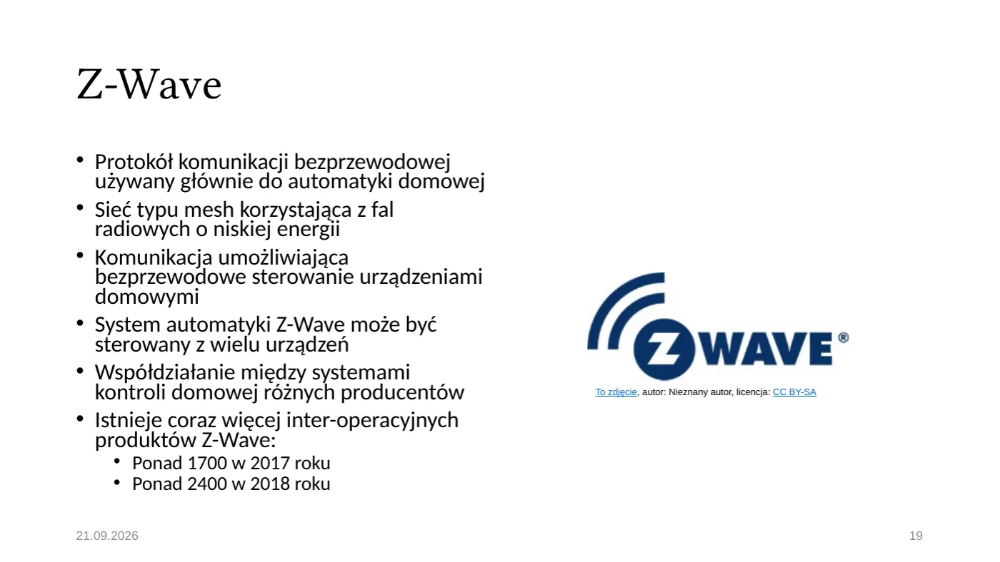

Protokół komunikacji bezprzewodowej używany głównie do automatyki domowej  
Sieć typu  
mesh  
korzystająca z fal radiowych o niskiej energii  
Komunikacja umożliwiająca bezprzewodowe sterowanie urządzeniami domowymi  
System automatyki Z-  
Wave  
może być sterowany z wielu urządzeń  
Współdziałanie między systemami kontroli domowej różnych producentów  
Istnieje coraz więcej inter-operacyjnych produktów Z-  
Wave  
:  
Ponad 1700 w 2017 roku  
Ponad 2400 w 2018 roku  
06.12.2020  
19  
To zdjęcie  
, autor: Nieznany autor, licencja:  
CC BY-SA

### 20. Thread – przyszłość komunikacji „każdy z każdym” (ang.

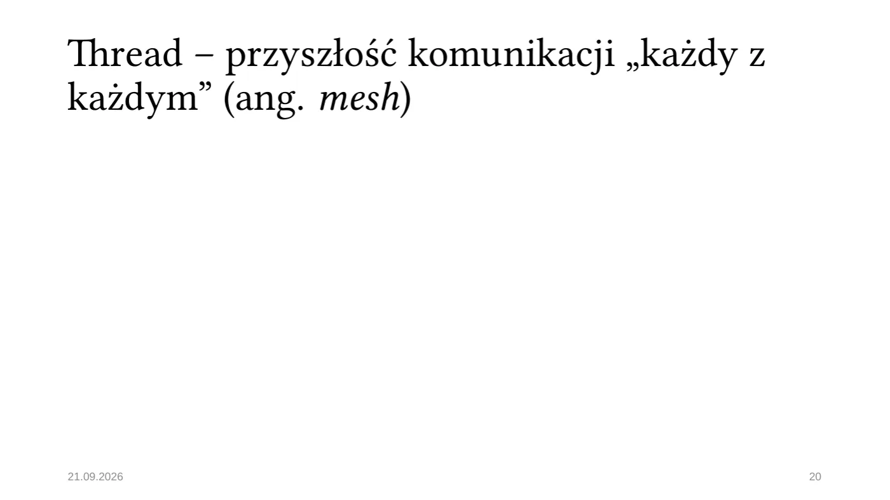

mesh  
)  
06.12.2020  
20

### 21. Thread (IEEE 802.15.4)

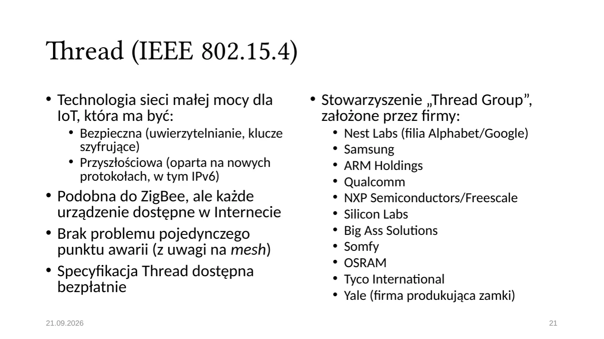

Technologia sieci małej mocy dla IoT, która ma być:  
Bezpieczna (uwierzytelnianie, klucze szyfrujące)  
Przyszłościowa (oparta na nowych protokołach, w tym IPv6)  
Podobna do ZigBee, ale każde urządzenie dostępne w Internecie  
Brak problemu pojedynczego punktu awarii (z uwagi na  
mesh  
)  
Specyfikacja Thread dostępna bezpłatnie  
Stowarzyszenie „Thread Group”, założone przez firmy:  
Nest  
Labs  
(filia  
Alphabet  
/Google)  
Samsung  
ARM Holdings  
Qualcomm  
NXP  
Semiconductors  
/  
Freescale  
Silicon  
Labs  
Big  
Ass  
Solutions  
Somfy  
OSRAM  
Tyco  
International  
Yale (firma produkująca zamki)  
06.12.2020  
21

### 22. Standardy – w tym

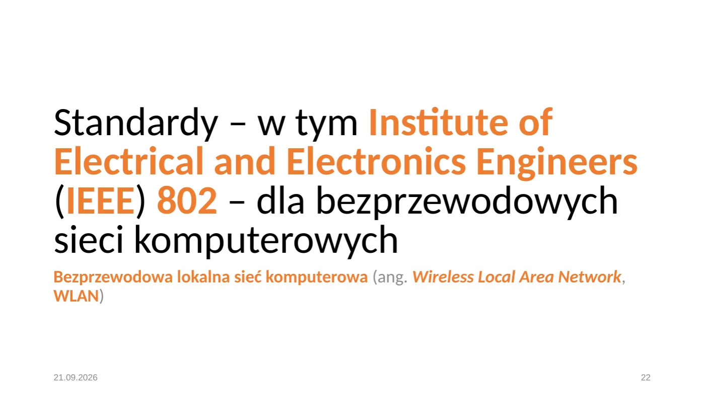

Institute of Electrical and Electronics Engineers  
(  
IEEE  
)  
802  
– dla bezprzewodowych sieci komputerowych  
Bezprzewodowa lokalna sieć komputerowa  
(ang.  
Wireless Local Area Network  
,  
WLAN  
)  
06.12.2020  
22

### 23. Co to jest WLAN?

06.12.2020  
23

### 24. IEEE 802 – standardy sieci LAN i MAN

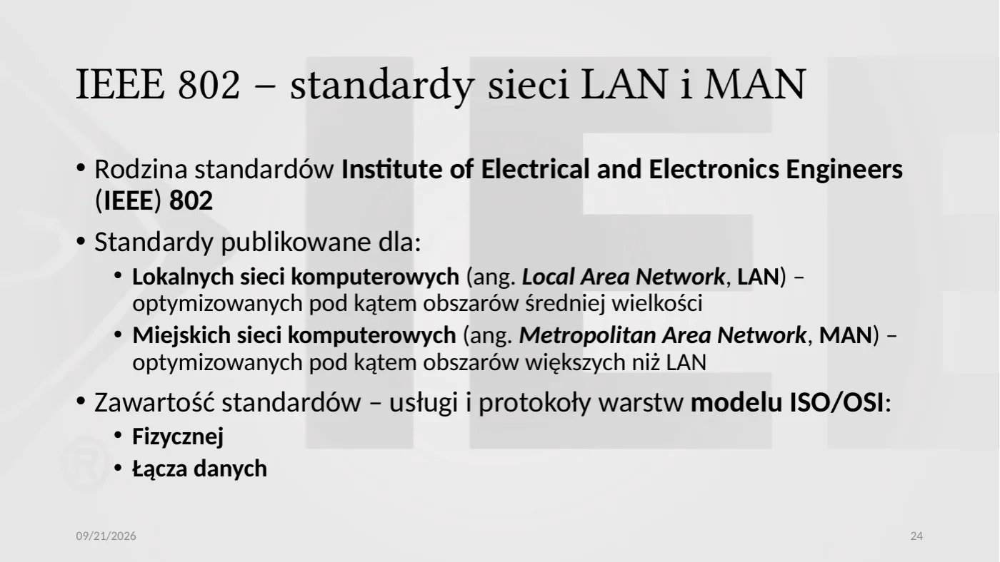

Rodzina standardów  
Institute of Electrical and Electronics Engineers  
(  
IEEE  
)  
802  
Standardy publikowane dla:  
Lokalnych sieci komputerowych  
(ang.  
Local Area Network  
,  
LAN  
)  
– optymizowanych pod kątem obszarów średniej wielkości  
‏  
Miejskich sieci komputerowych  
(ang.  
Metropolitan Area Network  
,  
MAN  
) – optymizowanych pod kątem obszarów większych niż LAN  
Zawartość standardów – usługi i protokoły warstw  
modelu ISO/OSI  
:  
Fizycznej  
Łącza danych  
12/6/20  
24

### 25. Wybrane (bezprzewodowe) grupy standardów IEEE 802

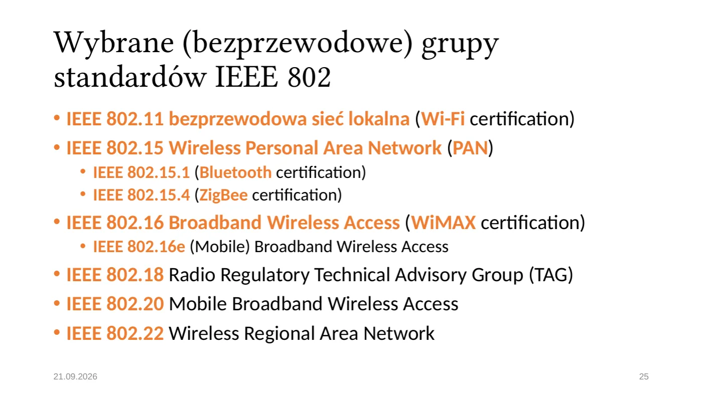

IEEE 802.11  
bezprzewodowa sieć lokalna  
(  
Wi-Fi  
certification  
)  
IEEE 802.15  
Wireless Personal Area Network  
(  
PAN  
)  
IEEE 802.15.1  
(  
Bluetooth  
certification  
)  
IEEE 802.15.4  
(  
ZigBee  
certification  
)  
IEEE 802.16  
Broadband Wireless Access  
(  
WiMAX  
certification  
)  
IEEE 802.16e  
(Mobile) Broadband Wireless Access  
IEEE 802.18  
Radio Regulatory Technical  
Advisory  
Group (TAG)  
IEEE 802.20  
Mobile Broadband Wireless Access  
IEEE 802.22  
Wireless  
Regional  
Area Network  
06.12.2020  
25

### 26. IEEE 802.11 (“Wireless

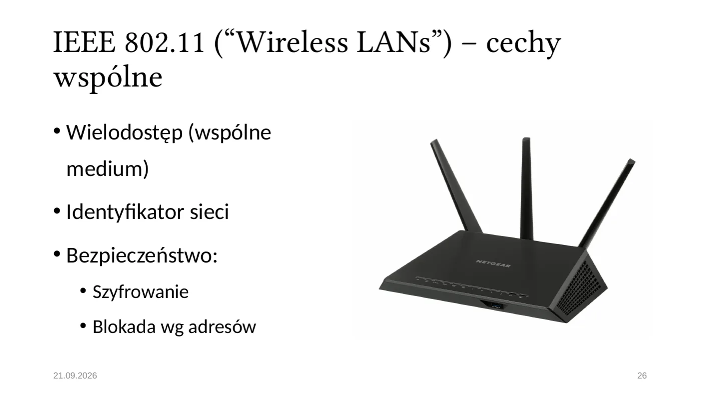

LANs  
”) – cechy wspólne  
Wielodostęp (wspólne medium)  
Identyfikator sieci  
Bezpieczeństwo:  
Szyfrowanie  
Blokada wg adresów  
06.12.2020  
26

### 27. Standardy IEEE 802.11

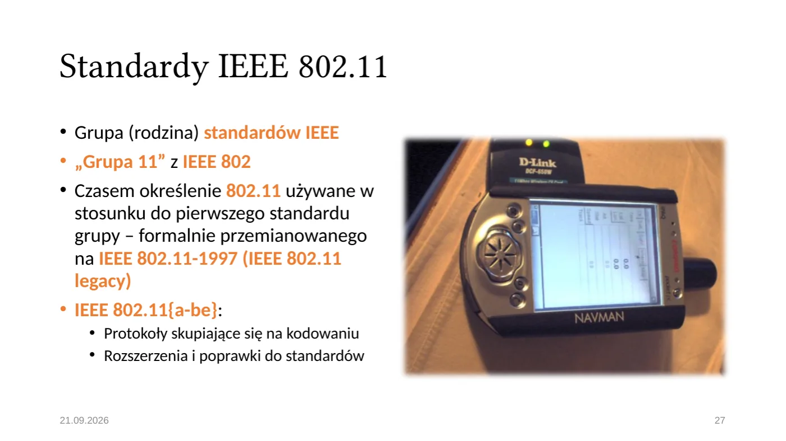

Grupa (rodzina)  
standardów IEEE  
„Grupa 11”  
z  
IEEE 802  
Czasem określenie  
802.11  
używane w stosunku do pierwszego standardu grupy  
–  
formalnie przemianowanego na  
IEEE 802.11-1997 (IEEE 802.11  
legacy  
)  
IEEE 802.11{a-be}  
:  
Protokoły skupiające się na kodowaniu  
Rozszerzenia i poprawki do standardów  
06.12.2020  
27

### 28. Zakres częstotliwości fal radiowych dla IEEE 802.11

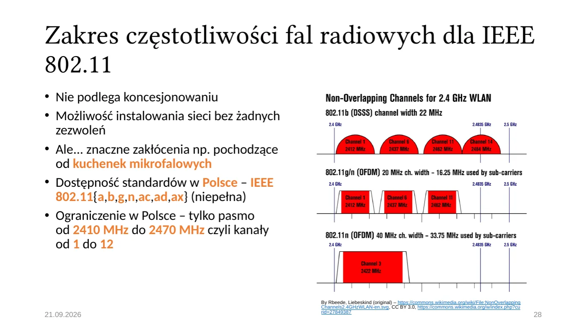

Nie podlega koncesjonowaniu  
Możliwość instalowania sieci bez żadnych zezwoleń  
Ale... znaczne zakłócenia np. pochodzące od  
kuchenek mikrofalowych  
Dostępność standardów w  
Polsce  
–  
IEEE 802.11  
{  
a  
,  
b  
,  
g  
,  
n  
,  
ac  
,  
ad  
,  
ax  
} (niepełna)  
Ograniczenie w Polsce – tylko pasmo  
od  
2410 MHz  
do  
2470 MHz  
czyli kanały od  
1  
do  
12  
06.12.2020  
28  
By  
Rbeede  
,  
Liebeskind  
(original)  
–  
https://commons.wikimedia.org/wiki/File:NonOverlappingChannels2.4GHzWLAN-en.svg  
, CC BY 3.0,  
https://commons.wikimedia.org/w/index.php?curid=27849387

### 29. Przegląd wybranych standardów IEEE 802.11 i ich daty publikacji

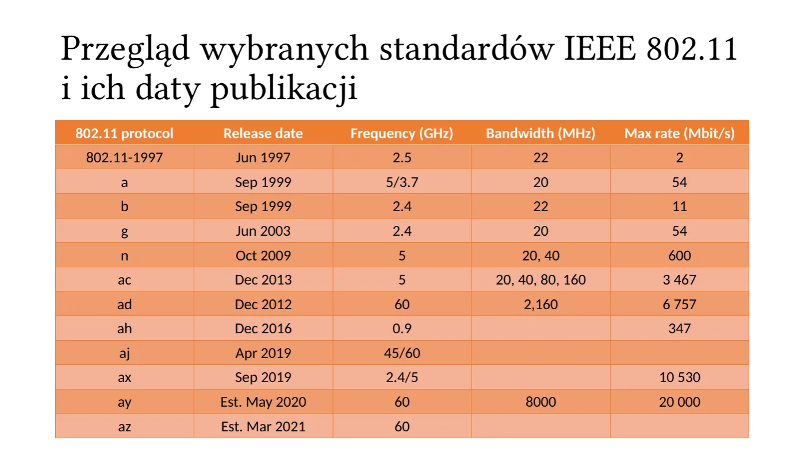

802.11 protocol  
Release date  
Frequency (GHz)  
Bandwidth (MHz)  
Max  
rate  
(Mbit/s)  
802.11-1997  
Jun 1997  
2.5  
22  
2  
a  
Sep 1999  
5/3.7  
20  
54  
b  
Sep 1999  
2.4  
22  
11  
g  
Jun 2003  
2.4  
20  
54  
n  
Oct 2009  
5  
20  
,  
40  
600  
ac  
Dec 2013  
5  
20,  
40, 80,  
160  
3 467  
ad  
Dec 2012  
60  
2,160  
6  
757  
ah  
Dec  
2016  
0.9  
347  
aj  
Apr  
201  
9  
45/60  
ax  
Sep  
201  
9  
2.4/5  
10  
530  
ay  
Est. May  
2020  
60  
8000  
20 000  
az  
Est. Mar 2021  
60

### 30. Różne prędkości Wi-Fi b g n na routerze WIFI

12/6/20  
30

### 31. IEEE 802.11 (IEEE 802.11 Legacy)

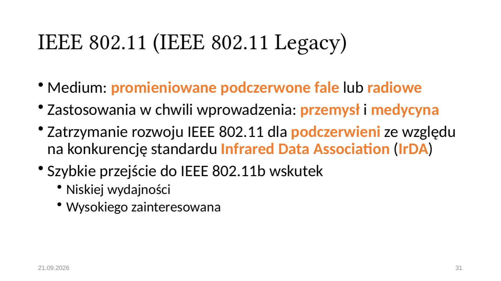

Medium:  
promieniowane podczerwone fale  
lub  
radiowe  
Zastosowania w chwili wprowadzenia:  
przemysł  
i  
medycyna  
Zatrzymanie rozwoju IEEE 802.11 dla  
podczerwieni  
ze względu na konkurencję standardu  
Infrared  
Data  
Association  
(  
IrDA  
)  
Szybkie przejście do IEEE 802.11b wskutek  
Niskiej wydajności  
Wysokiego zainteresowana  
06.12.2020  
31

### 32. IEEE 802.11b

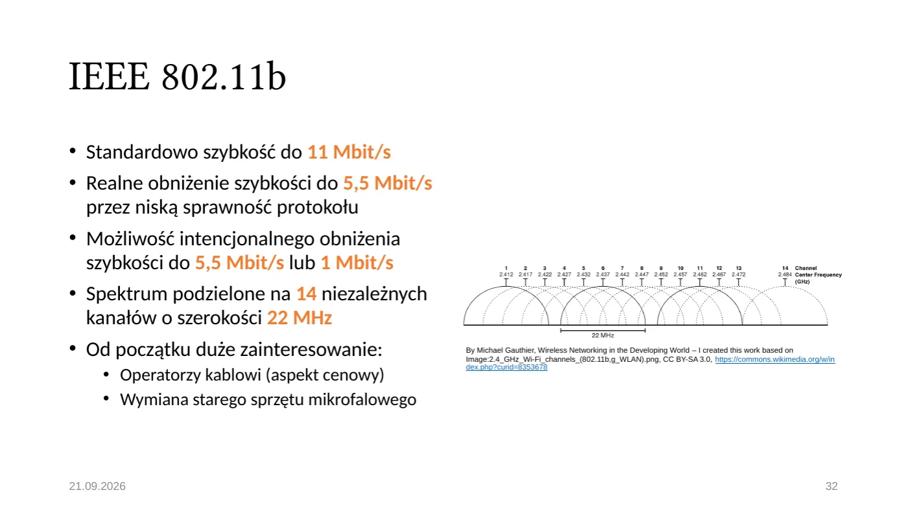

Standardowo szybkość do  
11  
Mbit  
/s  
Realne obniżenie szybkości do  
5,5  
Mbit  
/s  
przez niską sprawność protokołu  
Możliwość intencjonalnego obniżenia szybkości do  
5,5  
Mbit  
/s  
lub  
1  
Mbit  
/s  
Spektrum podzielone na  
14  
niezależnych kanałów o szerokości  
22 MHz  
Od początku duże zainteresowanie:  
Operatorzy kablowi (aspekt cenowy)  
Wymiana starego sprzętu mikrofalowego  
06.12.2020  
32  
By Michael Gauthier, Wireless Networking in the Developing World  
–  
I created this work based on Image:2.4_GHz_Wi-Fi_channels_(802.11b,g_WLAN).  
png  
, CC BY-SA 3.0,  
https://commons.wikimedia.org/w/index.php?curid=8353678

### 33. Zasięg IEEE 802.11b

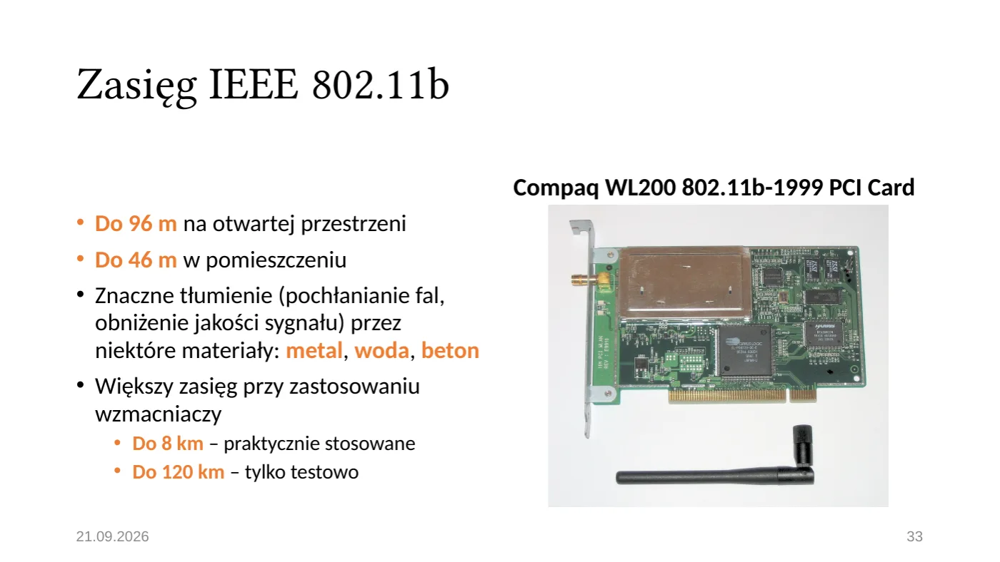

Do 96 m  
na otwartej przestrzeni  
Do 46 m  
w pomieszczeniu  
Znaczne tłumienie (pochłanianie fal, obniżenie jakości sygnału) przez niektóre materiały:  
metal  
,  
woda  
,  
beton  
Większy zasięg przy zastosowaniu wzmacniaczy  
Do 8 km  
– praktycznie stosowane  
Do 120 km  
– tylko testowo  
Compaq WL200 802.11b-1999 PCI  
Card  
06.12.2020  
33

### 34. 802.11b+ jako modyfikacja IEEE 802.11b

Własne produkty niektórych producentów osiągające szybkości...  
22  
Mbit  
/s  
33  
Mbit  
/s  
44  
Mbit  
/s  
Oparte na standardzie ale nigdy nie uznane jako standard przez  
IEEE  
06.12.2020  
34

### 35. Standard IEEE 802.11a

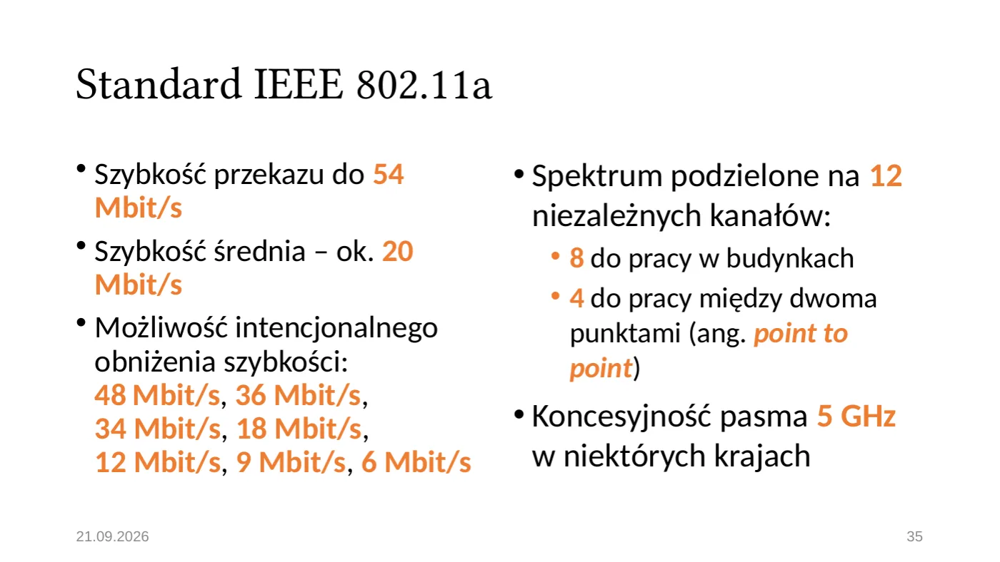

Szybkość przekazu do  
54  
Mbit  
/s  
Szybkość średnia – ok.  
20  
Mbit  
/s  
Możliwość intencjonalnego obniżenia szybkości:  
48  
Mbit  
/s  
,  
36  
Mbit  
/s  
,  
34  
Mbit  
/s  
,  
18  
Mbit  
/s  
,  
12  
Mbit  
/s  
,  
9  
Mbit  
/s  
,  
6  
Mbit  
/s  
Spektrum podzielone na  
12  
niezależnych kanałów:  
8  
do pracy w budynkach  
4  
do pracy między dwoma punktami (ang.  
point to point  
)  
Koncesyjność pasma  
5 GHz  
w niektórych krajach  
06.12.2020  
35

### 36. Popularność standardu IEEE 802.11a

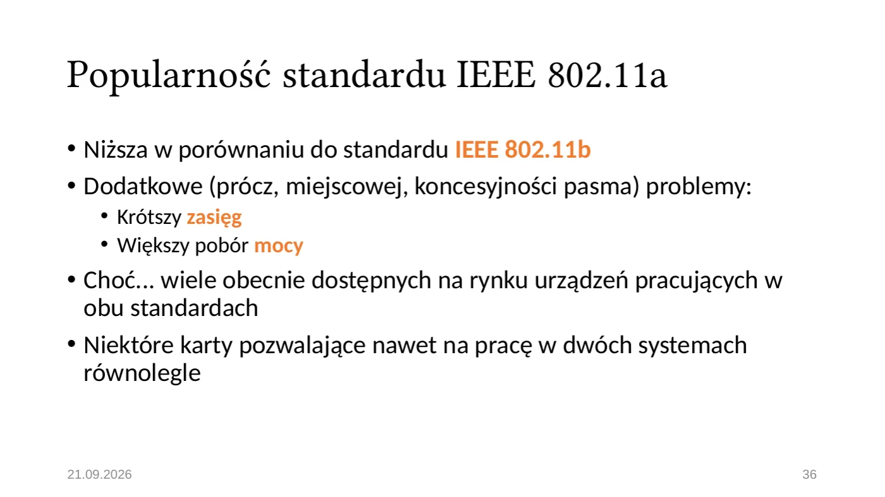

Niższa w porównaniu do standardu  
IEEE 802.11b  
Dodatkowe (prócz, miejscowej, koncesyjności pasma) problemy:  
Krótszy  
zasięg  
Większy pobór  
mocy  
Choć... wiele obecnie dostępnych na rynku urządzeń pracujących w obu standardach  
Niektóre karty pozwalające nawet na pracę w dwóch systemach równolegle  
06.12.2020  
36

### 37. Standard IEEE 802.11g

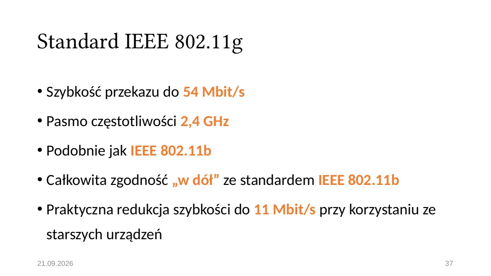

Szybkość przekazu do  
54  
Mbit  
/s  
Pasmo częstotliwości  
2,4 GHz  
Podobnie jak  
IEEE 802.11b  
Całkowita zgodność  
„w dół”  
ze standardem  
IEEE 802.11b  
Praktyczna redukcja szybkości do  
11  
Mbit  
/s  
przy korzystaniu ze starszych urządzeń  
06.12.2020  
37

### 38. Kompatybilność urządzeń IEEE 802.11g ze standardem

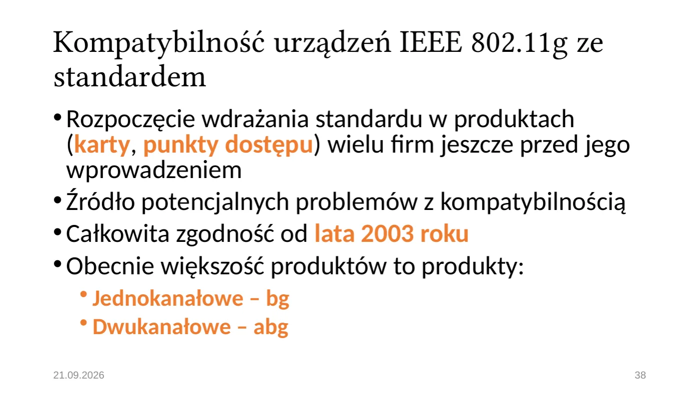

Rozpoczęcie wdrażania standardu w produktach (  
karty  
,  
punkty dostępu  
) wielu firm jeszcze przed jego wprowadzeniem  
Źródło potencjalnych problemów z kompatybilnością  
Całkowita zgodność od  
lata 2003 roku  
Obecnie większość produktów to produkty:  
Jednokanałowe –  
bg  
Dwukanałowe –  
abg  
06.12.2020  
38

### 39. 802.11 super G

Popularna opcja producencka  
Możliwość łączenia pasma kilku kanałów w jedno  
Szybkość przekazu do  
108  
Mbit  
/s  
Dodatkowo – poprawienie algorytmów zarządzania ruchem pakietów radiowych  
Wynik – poprawa sprawności protokołu  
Brak wsparcia i kompatybilności ze wszystkimi urządzeniami  
06.12.2020  
39

### 40. Standard IEEE 802.11n

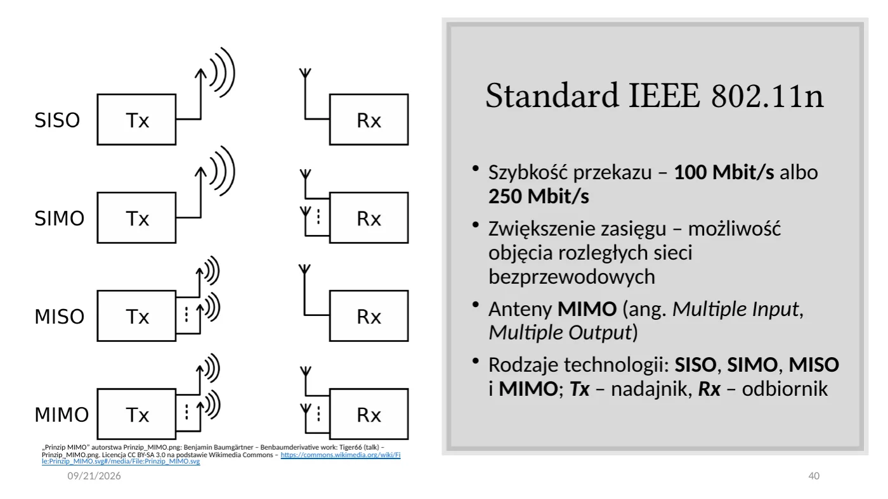

Szybkość przekazu –  
100  
Mbit  
/s  
albo  
250  
Mbit  
/s  
Zwiększenie zasięgu  
–  
możliwość objęcia rozległych sieci bezprzewodowych  
Anteny  
MIMO  
(ang.  
Multiple  
Input,  
Multiple  
Output  
)  
Rodzaje technologii:  
SISO  
,  
SIMO  
,  
MISO  
i  
MIMO  
;  
Tx  
– nadajnik,  
Rx  
– odbiornik  
12/6/20  
40  
„  
Prinzip  
MIMO” autorstwa  
Prinzip_MIMO.png  
: Benjamin  
Baumgärtner  
–  
Benbaumderivative  
work  
: Tiger66 (talk) –  
Prinzip_MIMO.png  
. Licencja CC BY-SA 3.0 na podstawie  
Wikimedia  
Commons  
–  
https://commons.wikimedia.org/wiki/File:Prinzip_MIMO.svg#/media/File:Prinzip_MIMO.svg

### 41. Standard IEEE 802.11ac

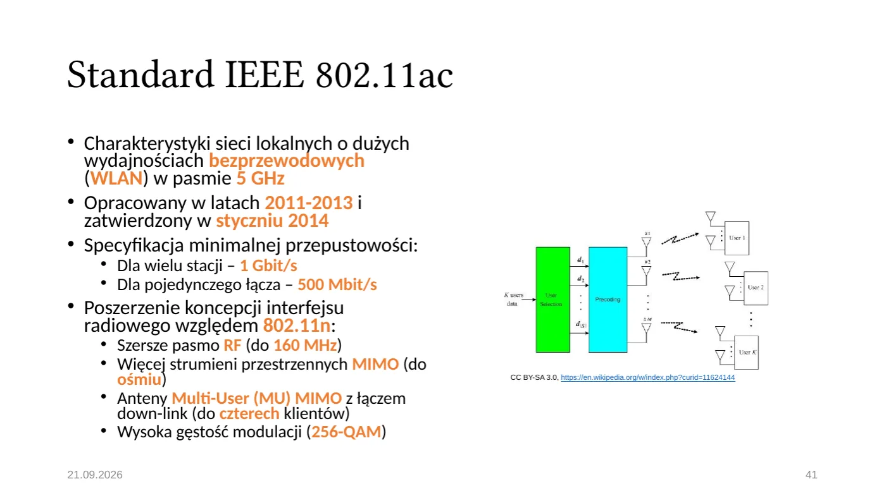

Charakterystyki sieci lokalnych o dużych wydajnościach  
bezprzewodowych  
(  
WLAN  
) w pasmie  
5 GHz  
Opracowany w latach  
2011-2013  
i zatwierdzony w  
styczniu 2014  
Specyfikacja minimalnej przepustowości:  
Dla wielu stacji –  
1  
Gbit  
/s  
Dla pojedynczego łącza –  
500  
Mbit  
/s  
Poszerzenie koncepcji interfejsu radiowego względem  
802.11n  
:  
Szersze pasmo  
RF  
(do  
160 MHz  
)  
Więcej strumieni przestrzennych  
MIMO  
(do  
ośmiu  
)  
Anteny  
Multi-User (MU) MIMO  
z łączem down-link (do  
czterech  
klientów)  
Wysoka gęstość modulacji (  
256-QAM  
)  
06.12.2020  
41  
CC BY-SA 3.0,  
https://en.wikipedia.org/w/index.php?curid=11624144

### 42. Jaka jest różnica między standardem 802.11n a 802.11ac?

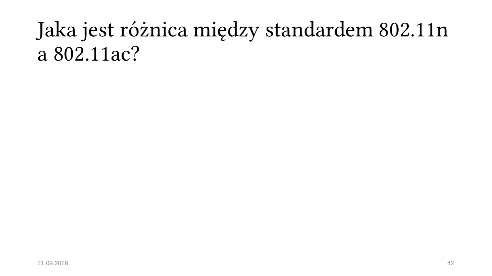

06.12.2020  
42

### 43. Wprowadzanie Wi-Fi w erę 5G z częstotliwością 60 GHz

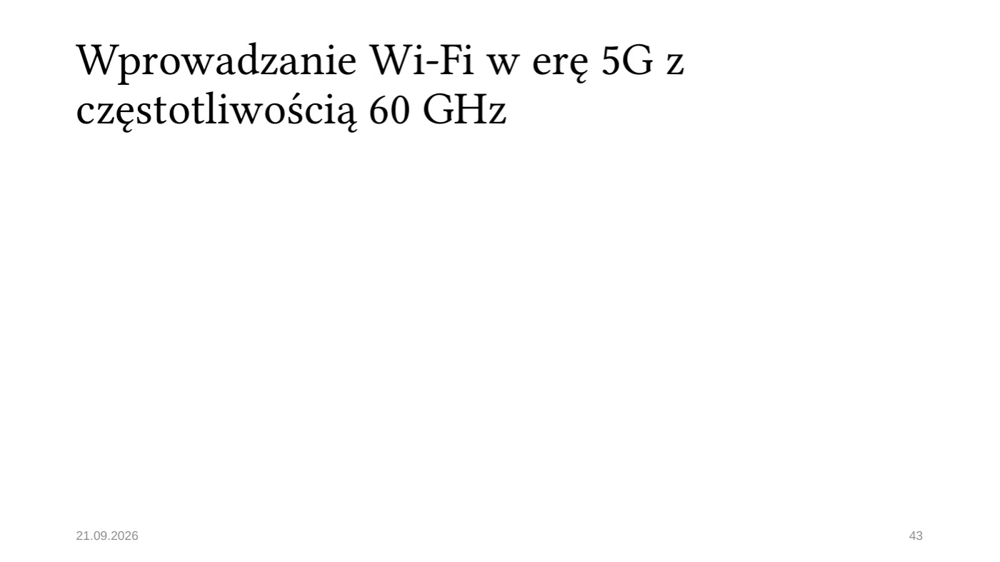

06.12.2020  
43

### 44. Standard IEEE 802.11ad

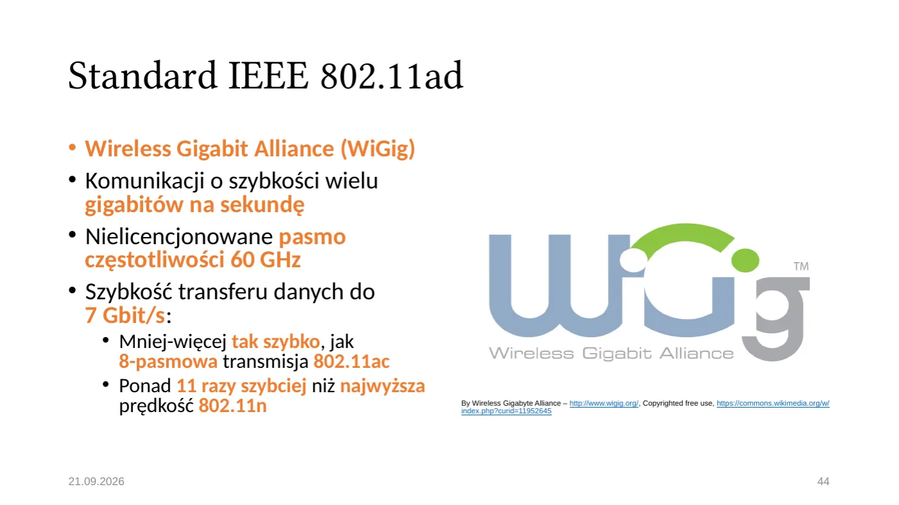

Wireless Gigabit Alliance (  
WiGig  
)  
Komunikacji o szybkości wielu  
gigabitów na sekundę  
Nielicencjonowane  
pasmo częstotliwości 60 GHz  
Szybkość transferu danych do  
7  
Gbit  
/s  
:  
Mniej-więcej  
tak szybko  
, jak  
8-pasmowa  
transmisja  
802.11ac  
Ponad  
11 razy szybciej  
niż  
najwyższa  
prędkość  
802.11n  
06.12.2020  
44  
By Wireless Gigabyte Alliance –  
http://www.wigig.org/  
, Copyrighted free use,  
https://commons.wikimedia.org/w/index.php?curid=11952645

### 45. Standard IEEE 802.11ah

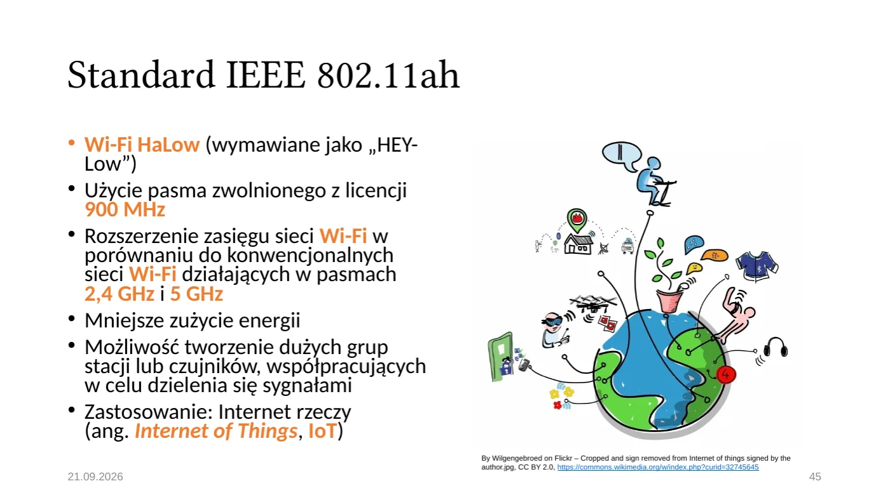

Wi-Fi  
HaLow  
(  
wymawiane jako „  
HEY-Low  
”  
)  
Użycie pasma zwolnionego z licencji  
900 MHz  
Rozszerzenie zasięgu sieci  
Wi-Fi  
w porównaniu do konwencjonalnych sieci  
Wi-Fi  
działających w pasmach  
2,4 GHz  
i  
5 GHz  
Mniejsze zużycie energii  
Możliwość tworzenie dużych grup stacji lub czujników, współpracujących w celu dzielenia się sygnałami  
Zastosowanie: Internet rzeczy  
(ang.  
Internet of  
Things  
,  
IoT  
)  
06.12.2020  
45  
By  
Wilgengebroed  
on Flickr – Cropped and sign removed from Internet of things signed by the  
author.jpg  
, CC BY 2.0,  
https://commons.wikimedia.org/w/index.php?curid=32745645

### 46. 802.11ax zapewnia bezprecedensową pojemność i wydajność Wi-Fi

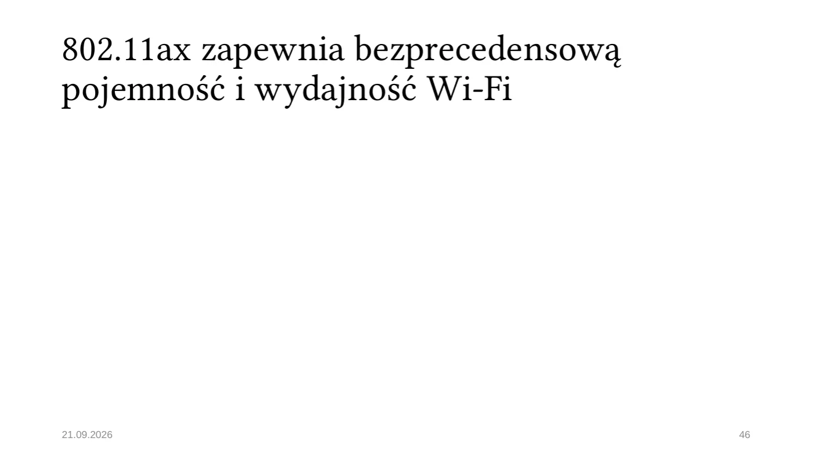

06.12.2020  
46

### 47. Standard IEEE 802.11ax

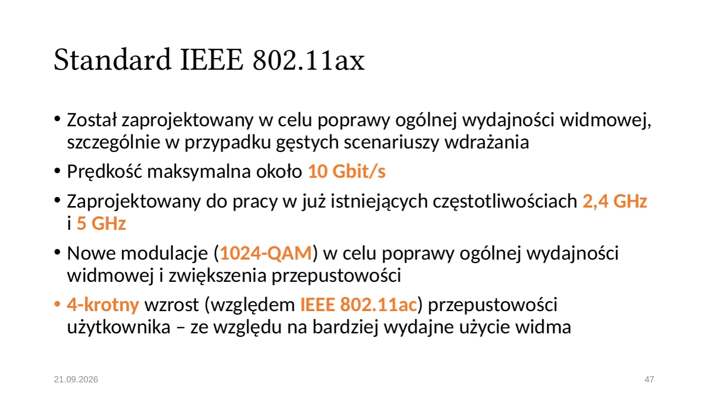

Został zaprojektowany w celu poprawy ogólnej wydajności widmowej, szczególnie w przypadku gęstych scenariuszy wdrażania  
Prędkość maksymalna około  
10  
Gbit  
/s  
Zaprojektowany do pracy w już istniejących częstotliwościach  
2,4 GHz  
i  
5 GHz  
Nowe modulacje (  
1024-QAM  
) w celu poprawy ogólnej wydajności widmowej i zwiększenia przepustowości  
4-krotny  
wzrost (względem  
IEEE 802.11ac  
) przepustowości użytkownika – ze względu na bardziej wydajne użycie widma  
06.12.2020  
47

### 48. Standard IEEE 802.11ay

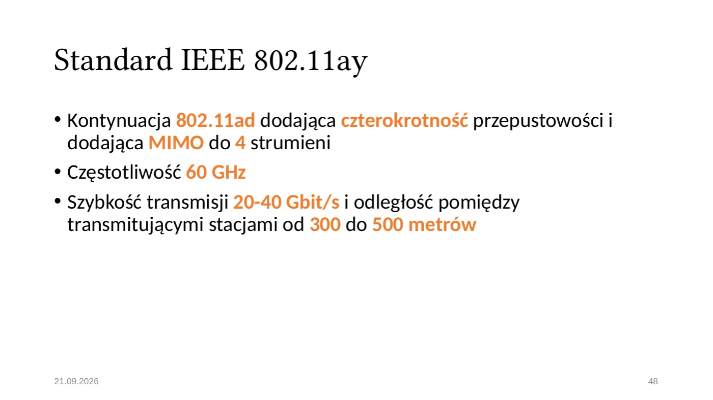

Kontynuacja  
802.11ad  
dodająca  
czterokrotność  
przepustowości i dodająca  
MIMO  
do  
4  
strumieni  
Częstotliwość  
60 GHz  
Szybkość transmisji  
20-40  
Gbit  
/s  
i odległość pomiędzy transmitującymi stacjami od  
300  
do  
500  
metrów  
06.12.2020  
48

### 49. Wybrane, inne standardy IEEE 802.11

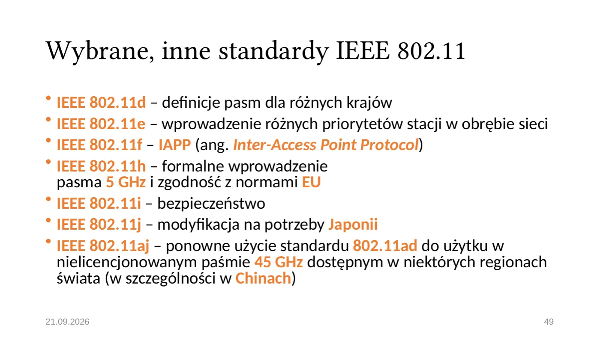

IEEE 802.11d  
– definicje pasm dla różnych krajów  
IEEE 802.11e  
– wprowadzenie różnych priorytetów stacji w obrębie sieci  
IEEE 802.11f  
–  
IAPP  
(ang.  
Inter-Access Point  
Protocol  
)  
IEEE 802.11h  
– formalne wprowadzenie  
pasma  
5 GHz  
i zgodność z normami  
EU  
IEEE 802.11i  
– bezpieczeństwo  
IEEE 802.11j  
– modyfikacja na potrzeby  
Japonii  
IEEE 802.11aj  
– ponowne użycie standardu  
802.11ad  
do użytku w nielicencjonowanym paśmie  
45 GHz  
dostępnym w niektórych regionach świata (w szczególności w  
Chinach  
)  
06.12.2020  
49

### 50. Problem kompatybilności urządzeń

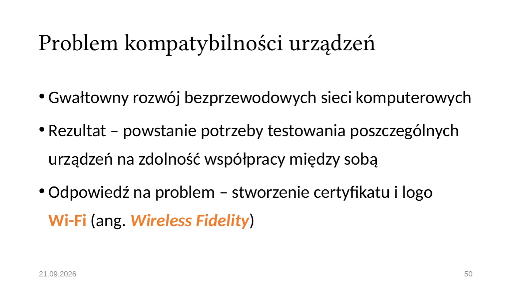

Gwałtowny rozwój bezprzewodowych sieci komputerowych  
Rezultat – powstanie potrzeby testowania poszczególnych urządzeń na zdolność współpracy między sobą  
Odpowiedź na problem – stworzenie certyfikatu i logo  
Wi-Fi  
(ang.  
Wireless  
Fidelity  
)  
06.12.2020  
50

### 51. Certyfikaty

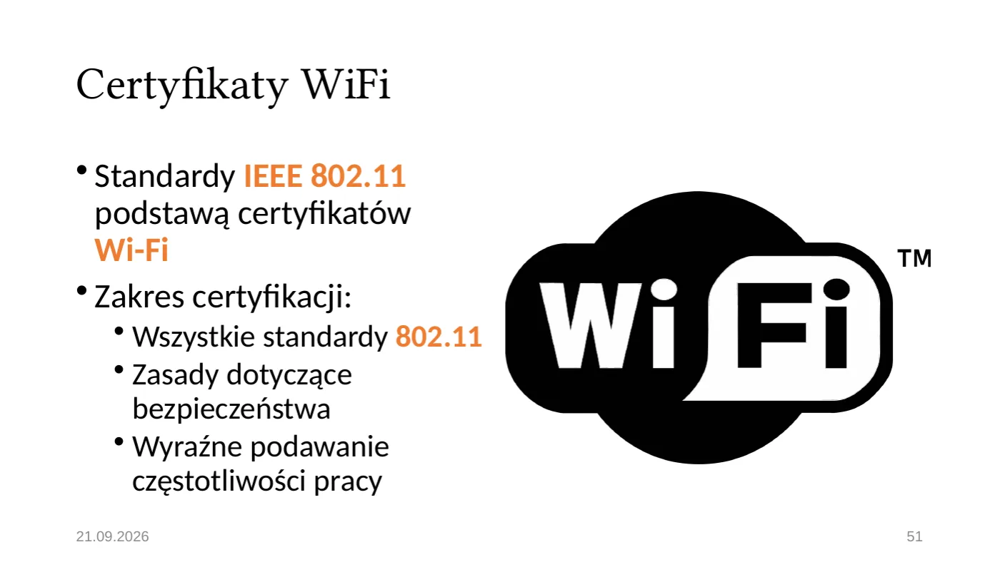

WiFi  
Standardy  
IEEE 802.11  
podstawą certyfikatów  
Wi-Fi  
Zakres certyfikacji:  
Wszystkie standardy  
802.11  
Zasady dotyczące bezpieczeństwa  
Wyraźne podawanie częstotliwości pracy  
06.12.2020  
51

### 52. Standardy – w tym

Institute of Electrical and Electronics Engineers  
(  
IEEE  
)  
802  
– dla bezprzewodowych sieci komputerowych  
Miejska sieć bezprzewodowa  
(ang.  
Municipal Wireless Network  
,  
MWN  
)  
06.12.2020  
52

### 53. Miejska sieć bezprzewodowa – co to jest WiMAX...

06.12.2020  
53

### 54. WiMAX (IEEE 802.16, “Broadband Wireless Metropolitan Area Networks”)

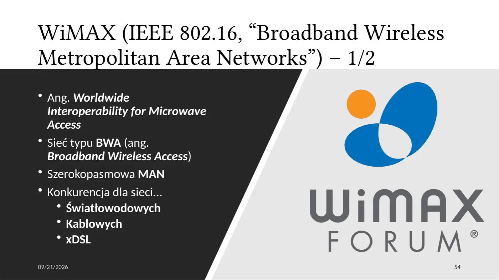

–  
1/2  
Ang.  
Worldwide  
Interoperability  
for  
Microwave  
Access  
Sieć typu  
BWA  
(ang.  
Broadband Wireless Access  
)  
Szerokopasmowa  
MAN  
Konkurencja dla sieci...  
Światłowodowych  
Kablowych  
xDSL  
12/6/20  
54

### 55. WiMAX (IEEE 802.16, “Broadband Wireless Metropolitan Area Networks”) – 2/2

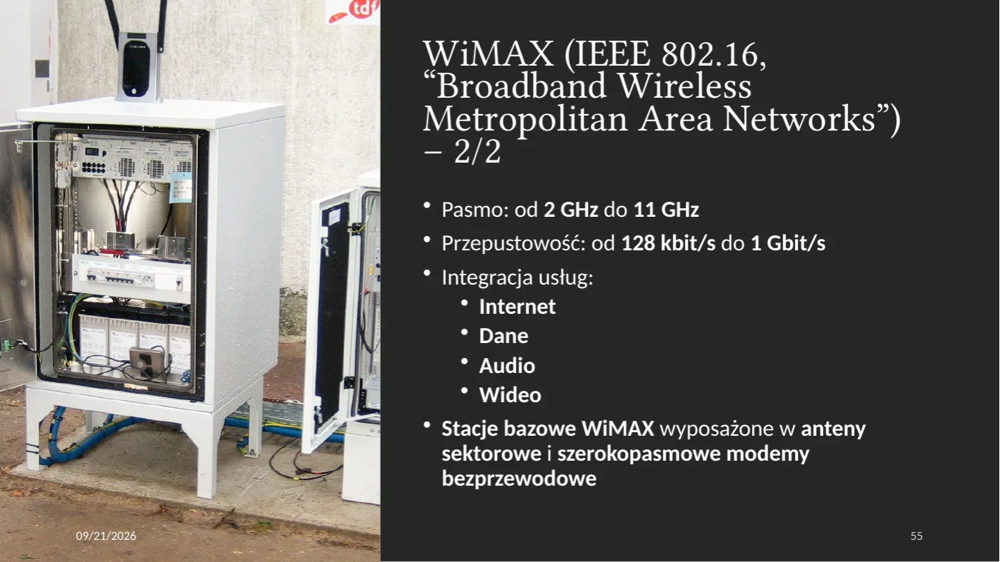

Pasmo: od  
2 GHz  
do  
11 GHz  
Przepustowość: od  
128 kbit/s  
do  
1 Gbit/s  
Integracja usług:  
Internet  
Dane  
Audio  
Wideo  
Stacje bazowe WiMAX  
wyposażone w  
anteny sektorowe  
i  
szerokopasmowe modemy bezprzewodowe  
12/6/20  
55

### 56. Standardy – w tym

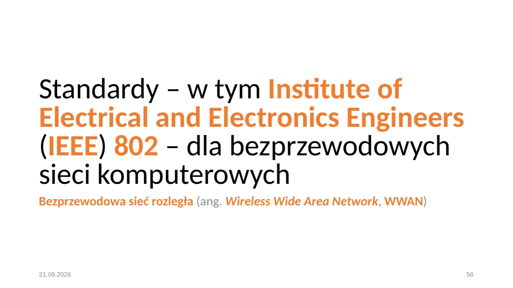

Institute of Electrical and Electronics Engineers  
(  
IEEE  
)  
802  
– dla bezprzewodowych sieci komputerowych  
Bezprzewodowa sieć rozległa  
(ang.  
Wireless Wide Area Network  
,  
WWAN  
)  
06.12.2020  
56

### 57. LoRa

(ang.  
Long  
Range  
) Alliance – Wprowadzenie  
06.12.2020  
57

### 58. LoRa

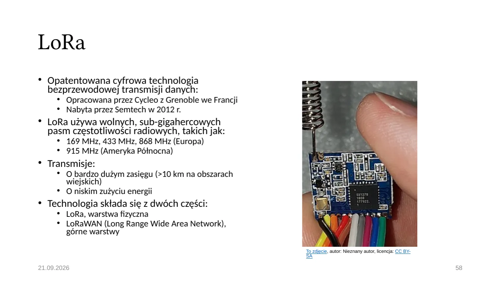

Opatentowana cyfrowa technologia bezprzewodowej transmisji danych:  
Opracowana przez  
Cycleo  
z Grenoble we Francji  
Nabyta przez  
Semtech  
w 2012 r.  
LoRa  
używa wolnych, sub-gigahercowych pasm częstotliwości radiowych, takich jak:  
169 MHz, 433 MHz, 868 MHz (Europa)  
915 MHz (Ameryka Północna)  
Transmisje:  
O bardzo dużym zasięgu (>10 km na obszarach wiejskich)  
O niskim zużyciu energii  
Technologia składa się z dwóch części:  
LoRa  
, warstwa fizyczna  
LoRaWAN  
(  
Long  
Range  
Wide Area Network), górne warstwy  
06.12.2020  
58  
To zdjęcie  
, autor: Nieznany autor, licencja:  
CC BY-SA

### 59. Co dalej z IEEE 802?

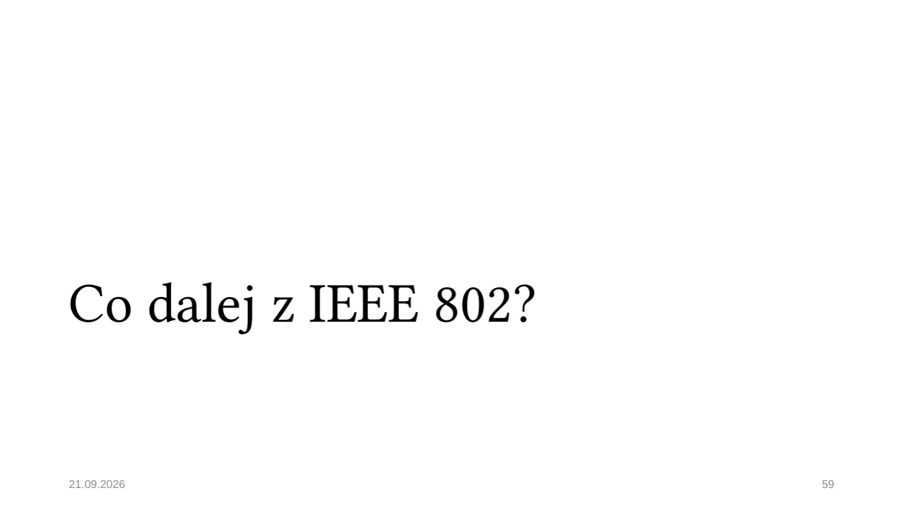

06.12.2020  
59

### 60. Przyszłość standardów IEEE 802

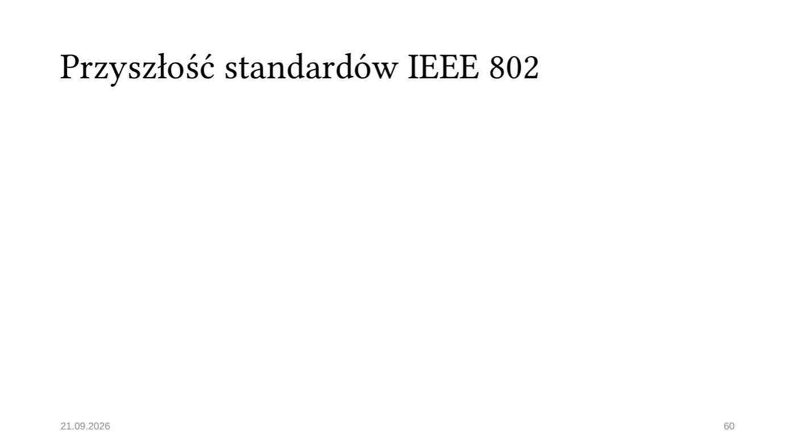

06.12.2020  
60

