# Transmisja sygnałów - systemy dostępu wielokrotnego

Oryginał: [07 Transmisja sygnałów - systemy dostępu wielokrotnego.pptx](../07%20Transmisja%20sygna%C5%82o%CC%81w%20-%20systemy%20doste%CC%A8pu%20wielokrotnego.pptx)

## Slajdy

### 1. Transmisja sygnałów w systemach dostępu wielokrotnego

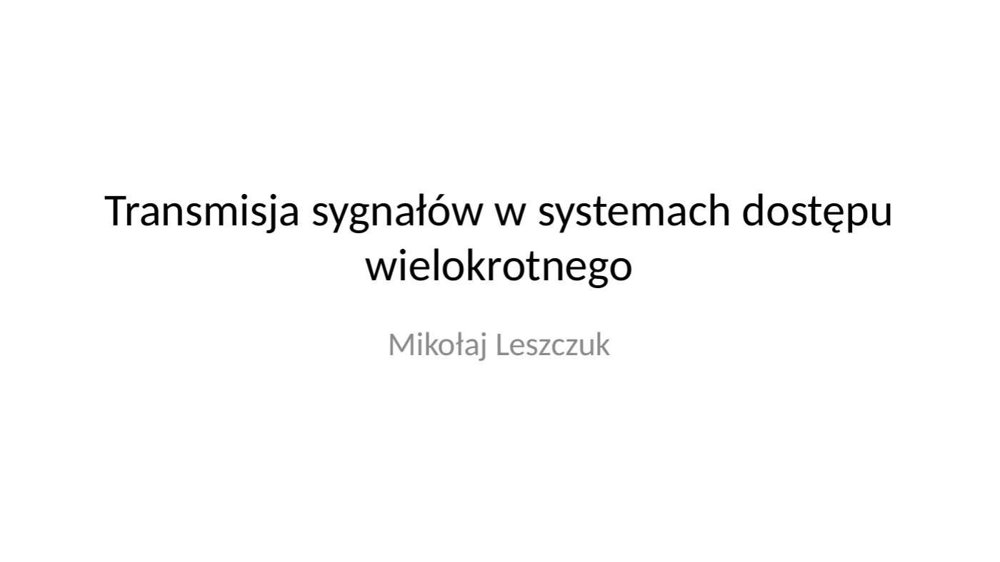

Mikołaj Leszczuk

### 2. Spis treści wykładu

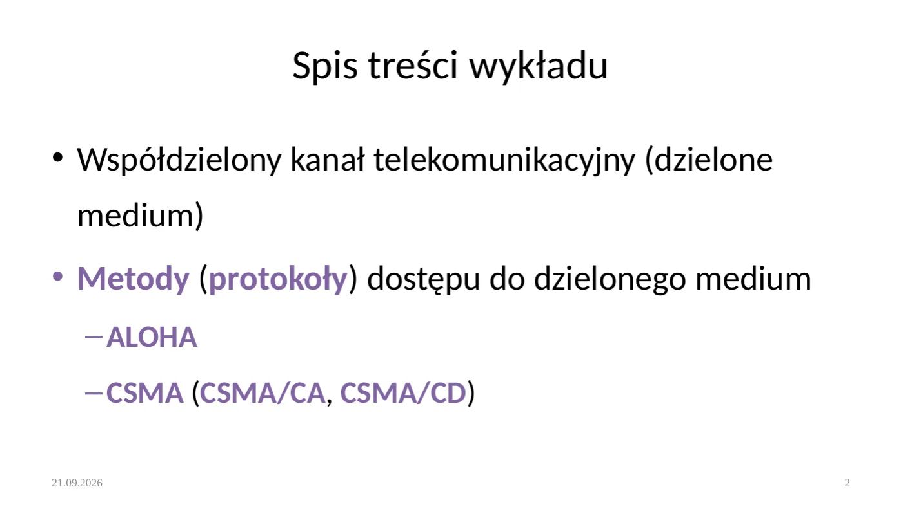

Współdzielony kanał telekomunikacyjny (dzielone medium)  
Metody  
(  
protokoły  
) dostępu do dzielonego medium  
ALOHA  
CSMA  
(  
CSMA/CA  
,  
CSMA/CD  
)  
21.12.2019  
2

### 3. kanał telekomunikacyjny i jego właściwości

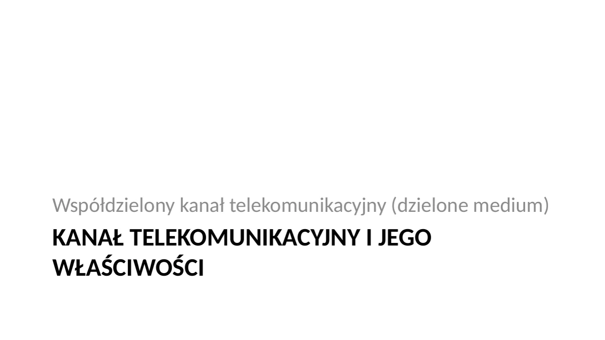

Współdzielony kanał telekomunikacyjny (dzielone medium)

### 4. Dzielone medium (1/2)‏

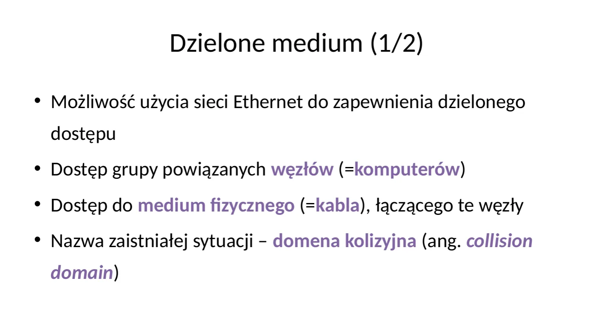

Możliwość użycia sieci Ethernet do zapewnienia dzielonego dostępu  
Dostęp grupy powiązanych  
węzłów  
(=  
komputerów  
)‏  
Dostęp do  
medium fizycznego  
(=  
kabla  
), łączącego te węzły  
Nazwa zaistniałej sytuacji –  
domena kolizyjna  
(ang.  
collision  
domain  
)‏

### 5. Dzielone medium (2/2)‏

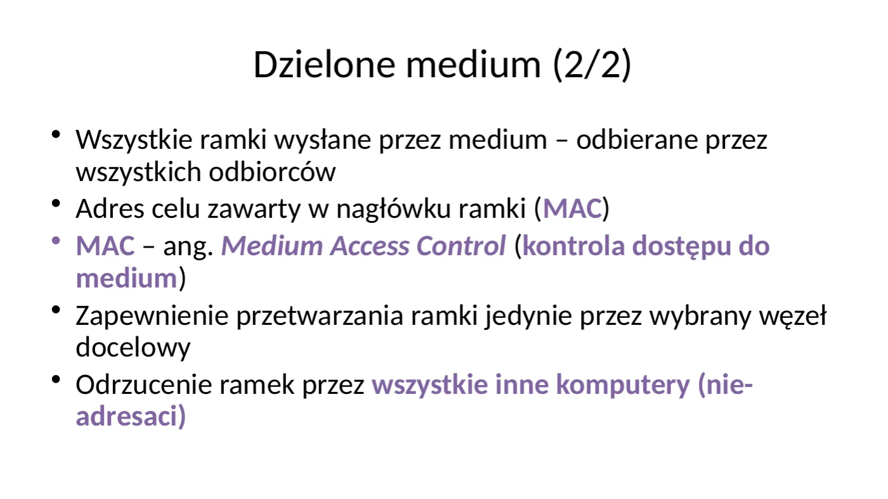

Wszystkie ramki wysłane przez medium – odbierane przez wszystkich odbiorców  
Adres celu zawarty w nagłówku ramki (  
MAC  
)  
MAC  
– ang.  
Medium Access Control  
(  
kontrola dostępu do medium  
)‏  
Zapewnienie przetwarzania ramki jedynie przez wybrany węzeł docelowy  
Odrzucenie ramek przez  
wszystkie inne komputery (nie-adresaci)

### 6. Przykład pracy w dzielonym medium (1/4)‏

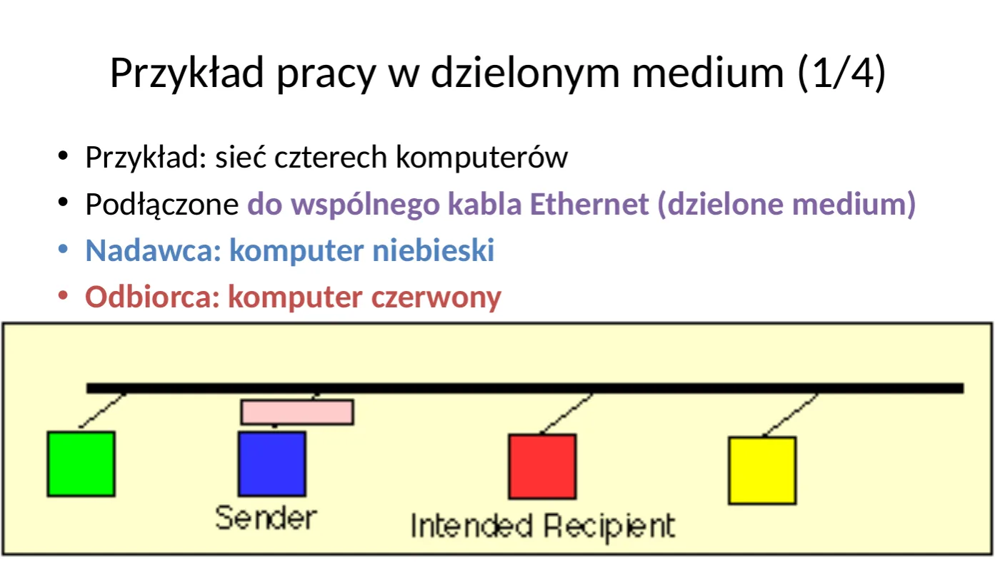

Przykład: sieć czterech komputerów  
Podłączone  
do  
wspólnego kabla Ethernet (dzielone medium)  
Nadawca: komputer niebieski  
Odbiorca: komputer czerwony

### 7. Przykład pracy w dzielonym medium (2/4)‏

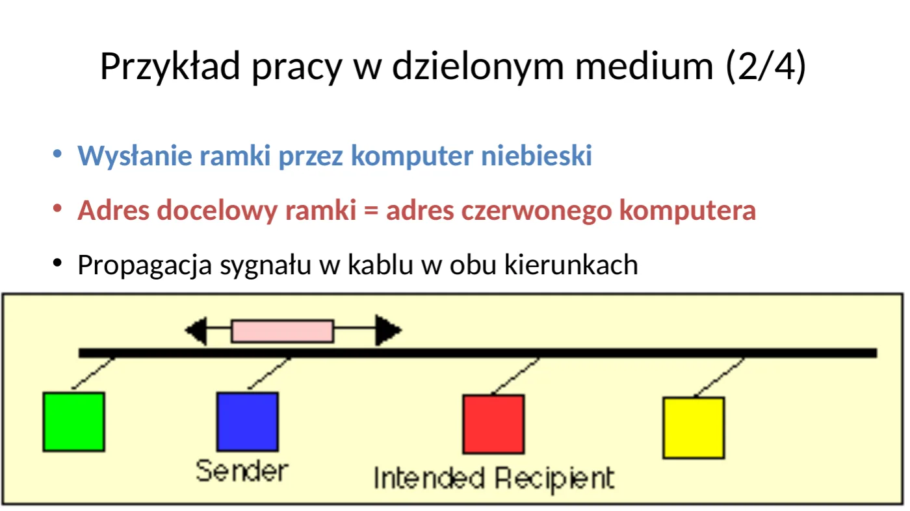

Wysłanie ramki przez komputer niebieski  
Adres docelowy ramki = adres czerwonego komputera  
Propagacja sygnału w kablu w obu kierunkach

### 8. Przykład pracy w dzielonym medium (3/4)‏

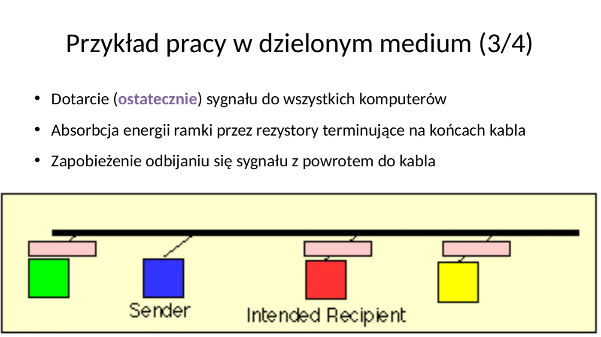

Dotarcie (  
ostatecznie  
) sygnału do wszystkich komputerów  
Absorbcja energii ramki przez rezystory terminujące na końcach kabla  
Zapobieżenie odbijaniu się sygnału z powrotem do kabla

### 9. Przykład pracy w dzielonym medium (4/4)‏

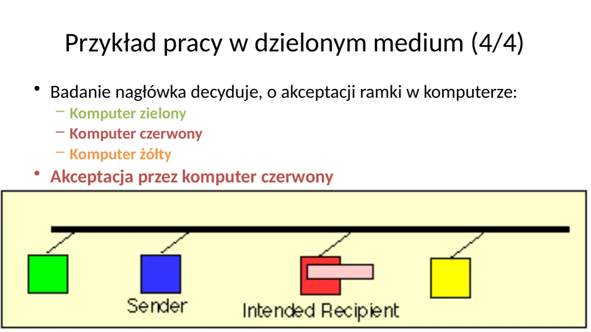

Badanie nagłówka decyduje, o akceptacji ramki w komputerze:  
Komputer zielony  
Komputer czerwony  
Komputer żółty  
Akceptacja przez komputer czerwony

### 10. METODY DOSTĘPU DO DZIELONEGO MEDIUM

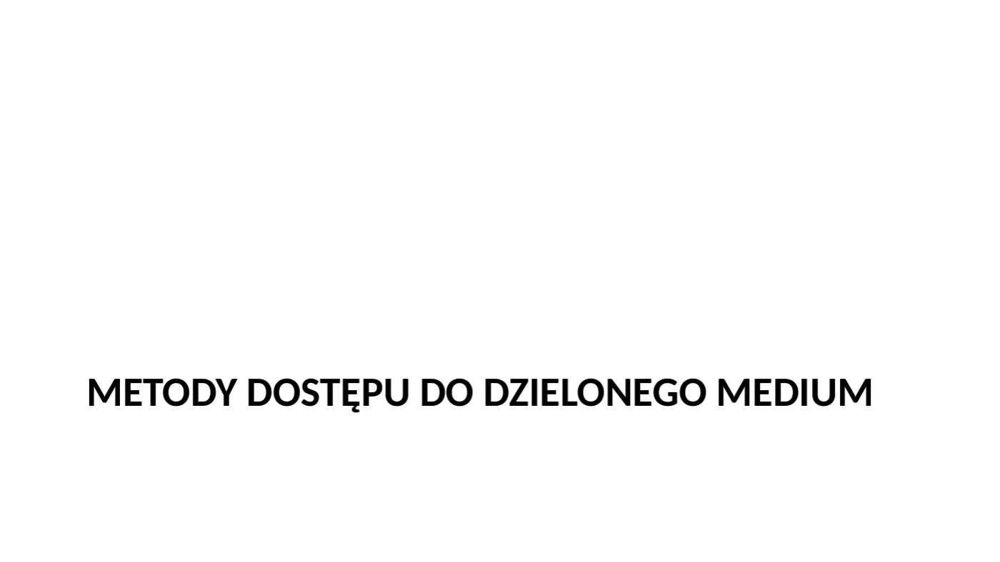

### 11. Metody dostępu do dzielonego medium

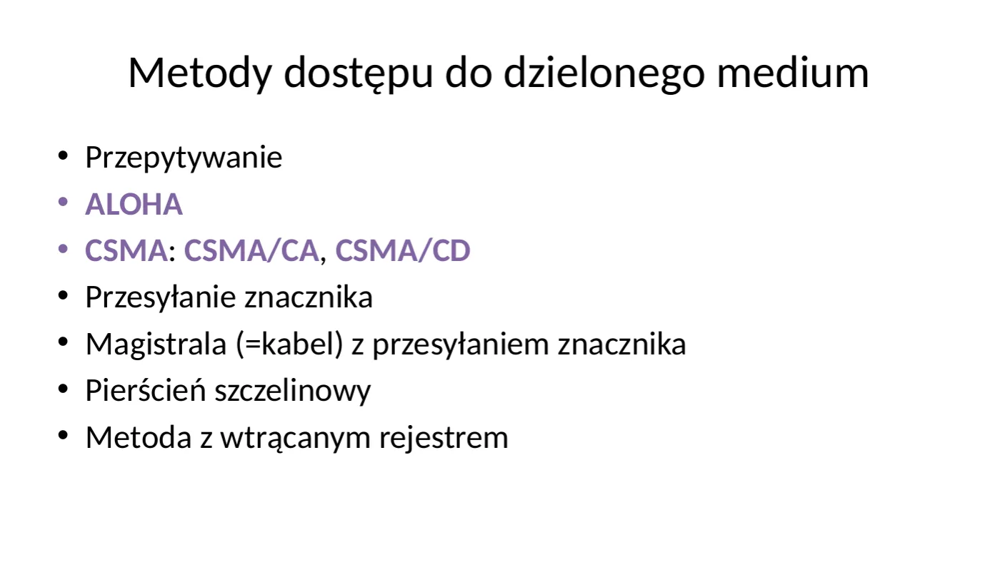

Przepytywanie  
ALOHA  
CSMA  
:  
CSMA/CA  
,  
CSMA/CD  
Przesyłanie znacznika  
Magistrala (=kabel) z przesyłaniem znacznika  
Pierścień szczelinowy  
Metoda z wtrącanym rejestrem

### 12. METODY DOSTĘPU DO DZIELONEGO MEDIUM

Protokół (metoda) ALOHA

### 13. Protokół

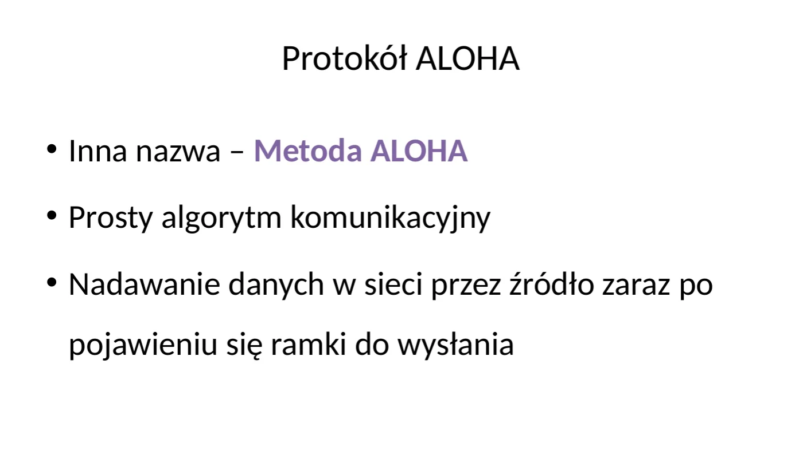

ALOHA  
Inna nazwa –  
Metoda ALOHA  
Prosty algorytm komunikacyjny  
Nadawanie danych w sieci przez źródło zaraz po pojawieniu się ramki do wysłania

### 14. Pierwsze zastosowanie

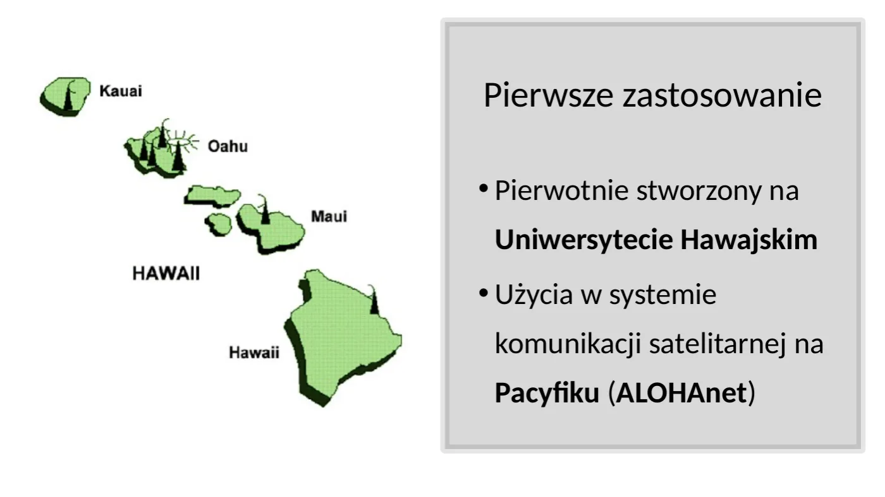

Pierwotnie stworzony na  
Uniwersytecie Hawajskim  
Użycia w systemie komunikacji satelitarnej na  
Pacyfiku  
(  
ALOHAnet  
)

### 15. Potwierdzenia ALOHA

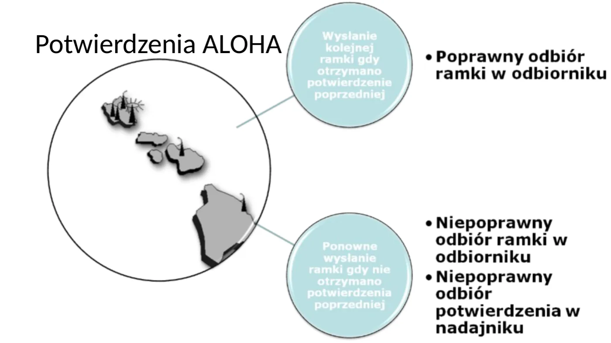

### 16. Powszechność powstawania kolizji w ALOHA (kolizje zaznaczono kolorem szarym)

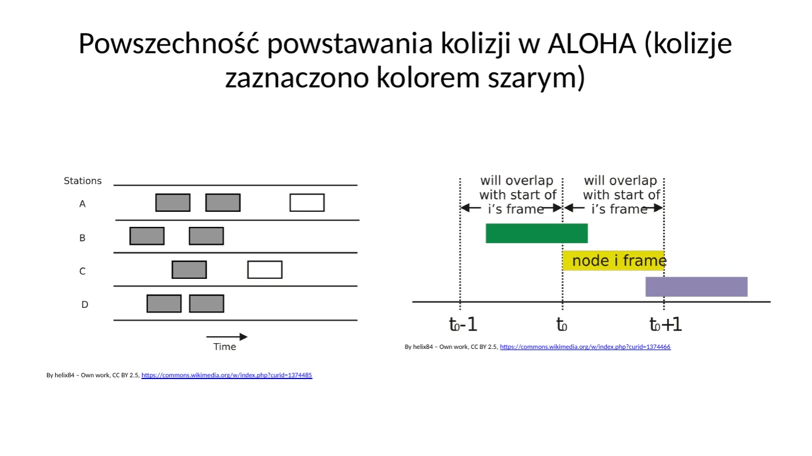

By helix84  
–  
Own work, CC BY 2.5,  
https://commons.wikimedia.org/w/index.php?curid=1374485  
By helix84  
–  
Own work, CC BY 2.5,  
https://commons.wikimedia.org/w/index.php?curid=1374466

### 17. Szczelinowy ALOHA jako ulepszenie zwykłego ALOHA

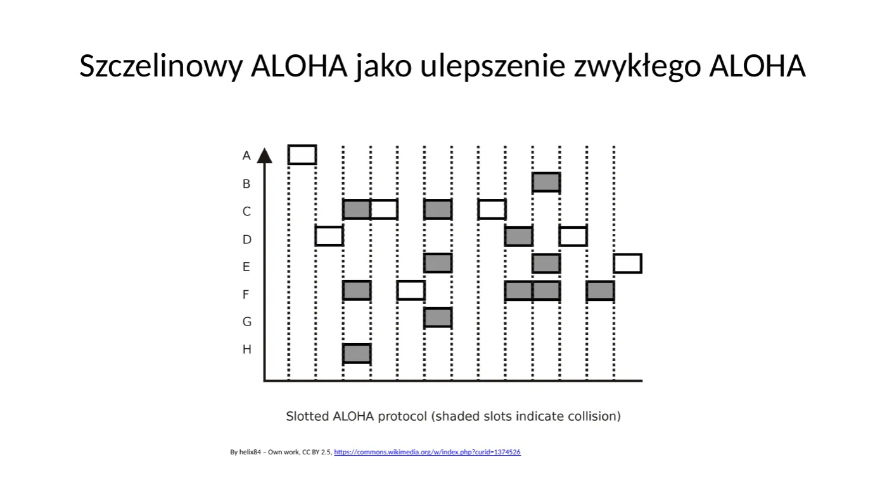

By helix84  
–  
Own work, CC BY 2.5,  
https://commons.wikimedia.org/w/index.php?curid=1374526

### 18. METODY DOSTĘPU DO DZIELONEGO MEDIUM

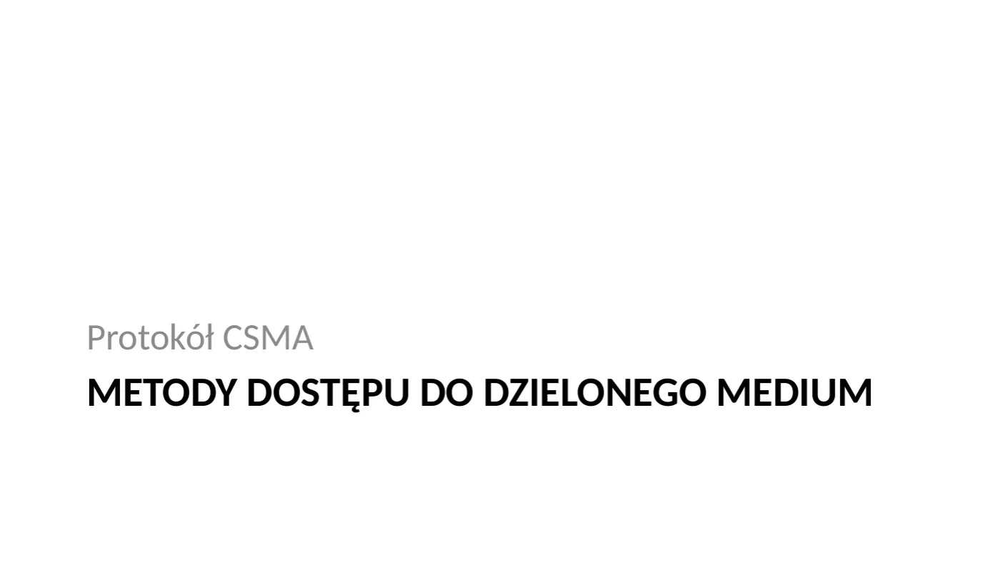

Protokół CSMA

### 19. Protokół CSMA‏

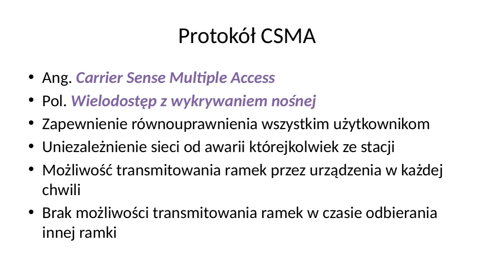

Ang.  
Carrier  
Sense  
Multiple  
Access  
Pol.  
Wielodostęp z wykrywaniem nośnej  
Zapewnienie równouprawnienia wszystkim użytkownikom  
Uniezależnienie sieci od awarii którejkolwiek ze stacji  
Możliwość transmitowania ramek przez urządzenia w każdej chwili  
Brak możliwości transmitowania ramek w czasie odbierania innej ramki

### 20. CSMA w sieciach LAN

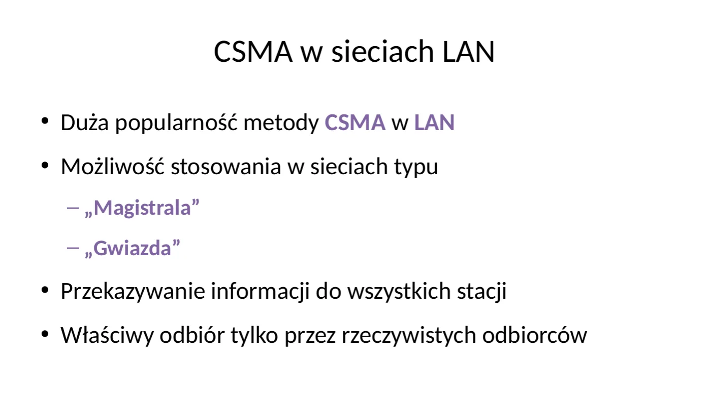

Duża popularność metody  
CSMA  
w  
LAN  
Możliwość stosowania w sieciach typu  
„Magistrala”  
„Gwiazda”  
Przekazywanie informacji do wszystkich stacji  
Właściwy odbiór tylko przez rzeczywistych odbiorców

### 21. CSMA w

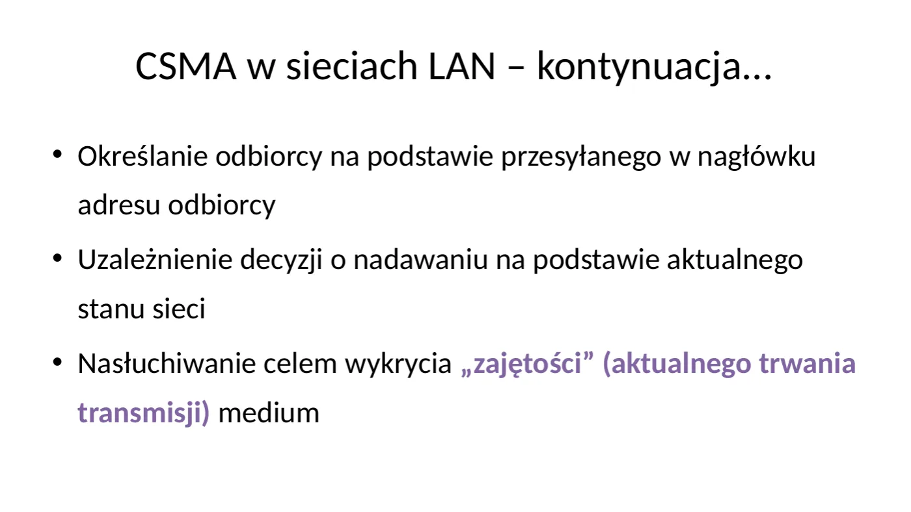

sieciach  
LAN –  
kontynuacja  
...  
Określanie odbiorcy na podstawie przesyłanego w nagłówku adresu odbiorcy  
Uzależnienie decyzji o nadawaniu na podstawie aktualnego stanu sieci  
Nasłuchiwanie celem wykrycia  
„zajętości” (aktualnego trwania transmisji)  
medium

### 22. Jednoczesna chęć nadawania

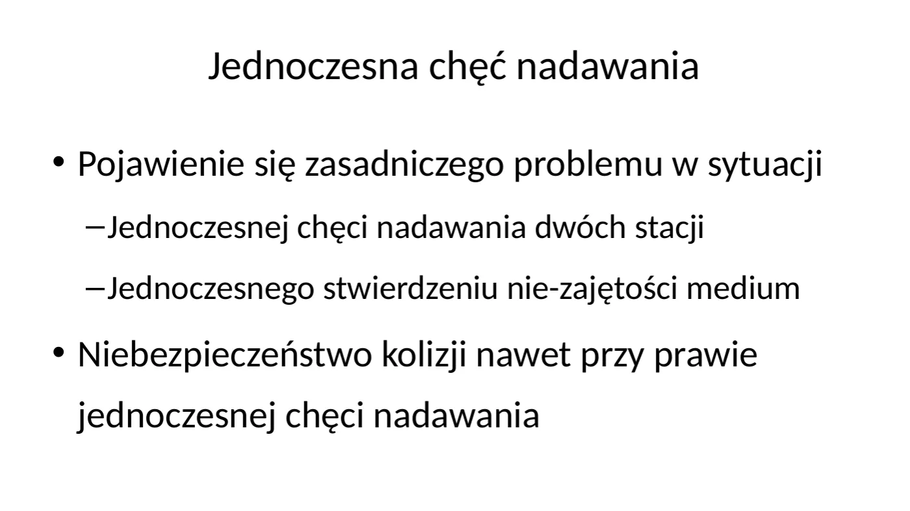

Pojawienie się zasadniczego problemu w sytuacji  
Jednoczesnej chęci nadawania dwóch stacji  
Jednoczesnego stwierdzeniu nie-zajętości medium  
Niebezpieczeństwo kolizji nawet przy prawie jednoczesnej chęci nadawania

### 23. Jednoczesna chęć nadawania – kontynuacja...

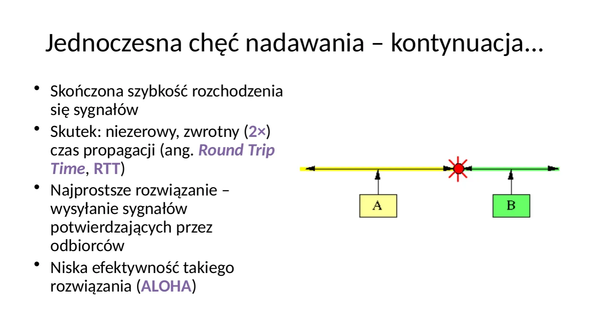

Skończona szybkość rozchodzenia się sygnałów  
Skutek: niezerowy, zwrotny (  
2×  
) czas propagacji (ang.  
Round  
Trip Time  
,  
RTT  
)  
Najprostsze rozwiązanie – wysyłanie sygnałów potwierdzających przez odbiorców  
Niska efektywność takiego rozwiązania (  
ALOHA  
)

### 24. Teoretyczne typy CSMA – w obu przypadkach protokół sporny (możliwość kolizji)

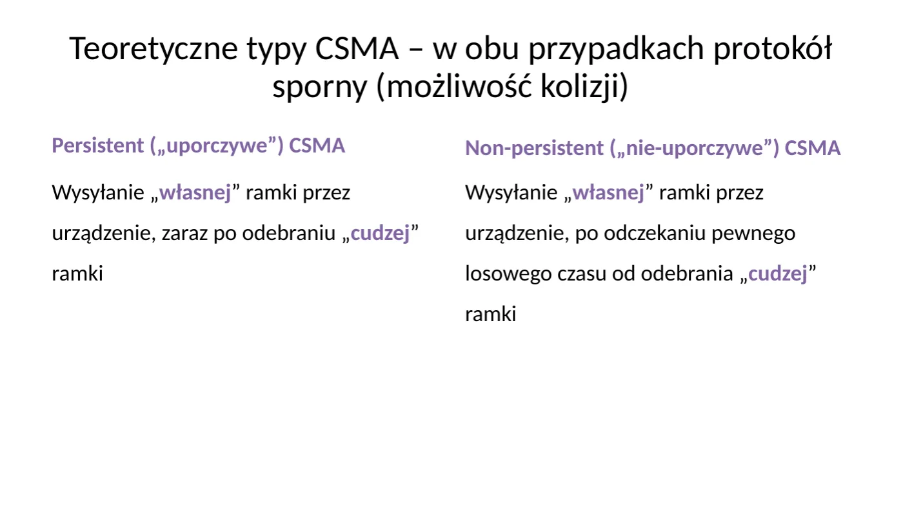

Persistent („  
uporczywe  
”) CSMA  
Wysyłanie „  
własnej  
” ramki przez urządzenie, zaraz po odebraniu „  
cudzej  
” ramki  
Non-persistent („  
nie-uporczywe  
”) CSMA  
Wysyłanie „  
własnej  
” ramki przez urządzenie, po odczekaniu pewnego losowego czasu od odebrania „  
cudzej  
” ramki

### 25. Dwie praktycznie stosowane metody zapobiegania konfliktom transmisji w CSMA

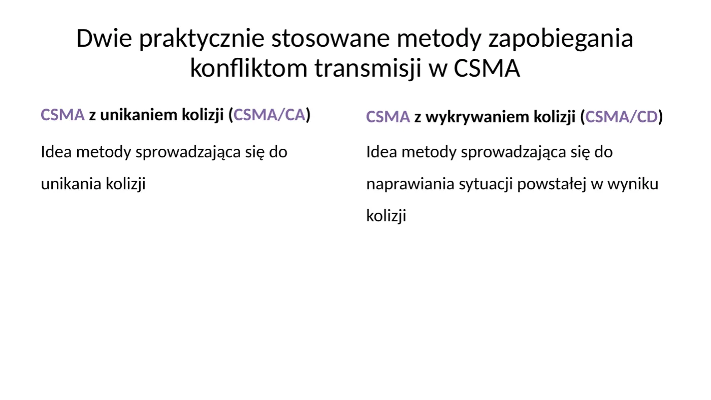

CSMA  
z unikaniem kolizji (  
CSMA/CA  
)‏  
Idea metody sprowadzająca się do unikania kolizji  
CSMA  
z wykrywaniem kolizji (  
CSMA/CD  
)  
Idea metody sprowadzająca się do naprawiania sytuacji powstałej w wyniku kolizji

### 26. METODY DOSTĘPU DO DZIELONEGO MEDIUM

Protokół CSMA/CA

### 27. Protokół

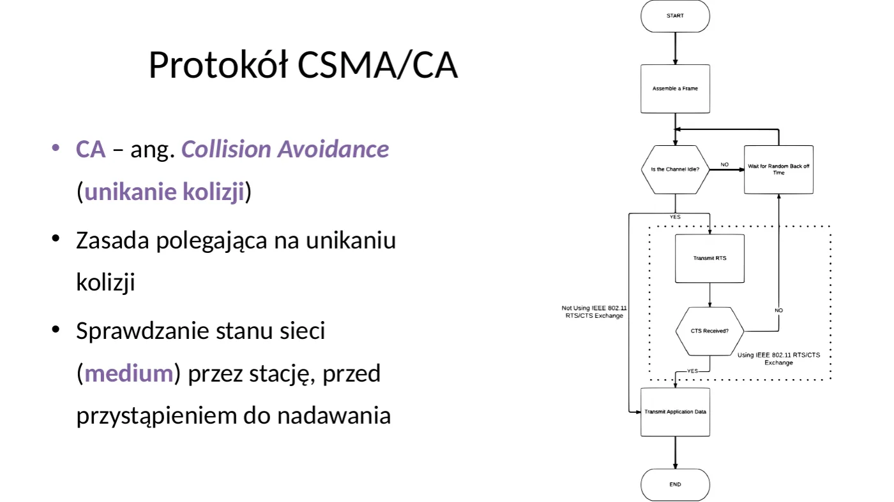

CSMA/CA‏  
CA  
– ang.  
Collision  
Avoidance  
(  
unikanie kolizji  
)  
Zasada polegająca na unikaniu kolizji  
Sprawdzanie stanu sieci (  
medium  
) przez stację, przed przystąpieniem do nadawania

### 28. Protokół CSMA/CA‏ - kontynuacja...

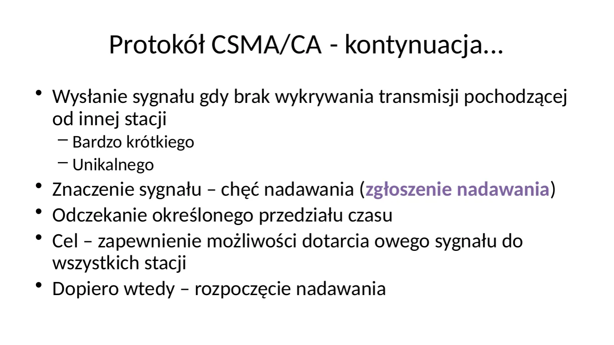

Wysłanie sygnału gdy brak wykrywania transmisji pochodzącej od innej stacji  
Bardzo krótkiego  
Unikalnego  
Znaczenie sygnału – chęć nadawania (  
zgłoszenie nadawania  
)  
Odczekanie określonego przedziału czasu  
Cel – zapewnienie możliwości dotarcia owego sygnału do wszystkich stacji  
Dopiero wtedy – rozpoczęcie nadawania

### 29. Kolizje

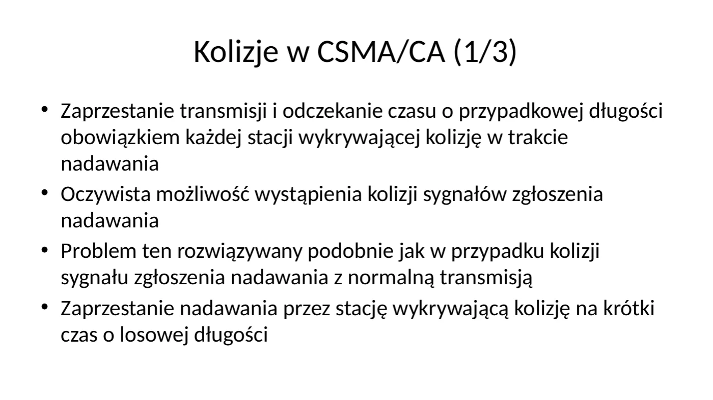

w CSMA/CA (1/3)‏  
Zaprzestanie transmisji i odczekanie czasu o przypadkowej długości obowiązkiem każdej stacji wykrywającej kolizję w trakcie nadawania  
Oczywista możliwość wystąpienia kolizji sygnałów zgłoszenia nadawania  
Problem ten rozwiązywany podobnie jak w przypadku kolizji sygnału zgłoszenia nadawania z normalną transmisją  
Zaprzestanie nadawania przez stację wykrywającą kolizję na krótki czas o losowej długości

### 30. Kolizje w CSMA/CA (2/3)

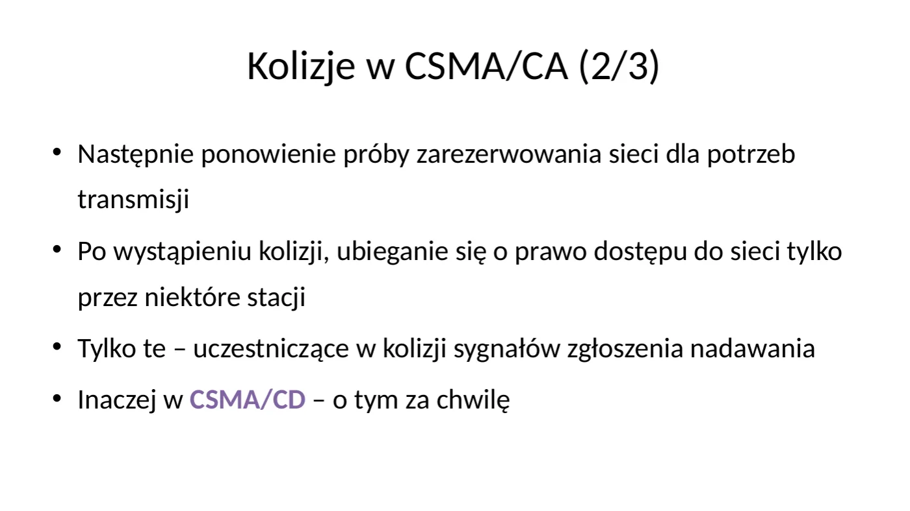

Następnie ponowienie próby zarezerwowania sieci dla potrzeb transmisji  
Po wystąpieniu kolizji, ubieganie się o prawo dostępu do sieci tylko przez niektóre stacji  
Tylko te – uczestniczące w kolizji sygnałów zgłoszenia nadawania  
Inaczej w  
CSMA/CD  
– o tym za chwilę‏

### 31. Kolizje w CSMA/CA (3/3)

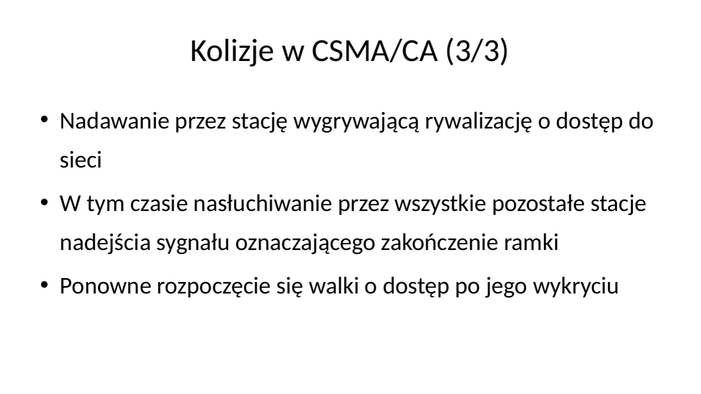

Nadawanie przez stację wygrywającą rywalizację o dostęp do sieci  
W tym czasie nasłuchiwanie przez wszystkie pozostałe stacje nadejścia sygnału oznaczającego zakończenie ramki  
Ponowne rozpoczęcie się walki o dostęp po jego wykryciu

### 32. METODY DOSTĘPU DO DZIELONEGO MEDIUM

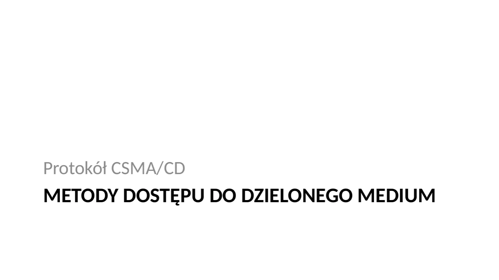

Protokół CSMA/CD

### 33. Protokół CSMA/CD‏

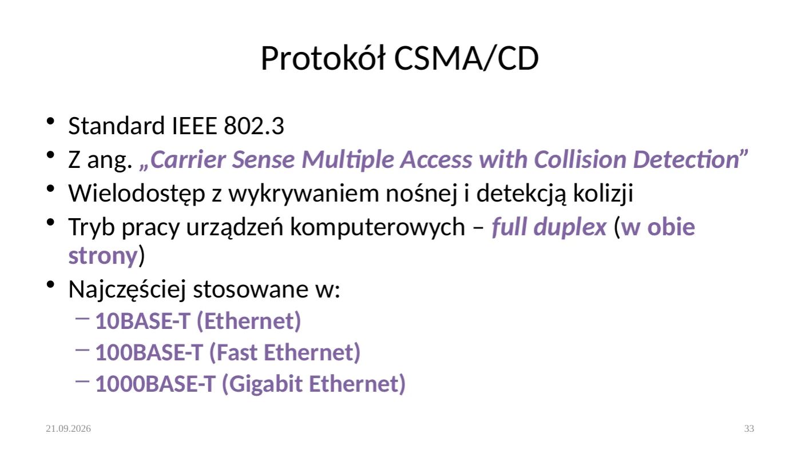

Standard IEEE 802.3  
Z ang.  
„Carrier Sense  
Multiple  
Access with  
Collision  
Detection”  
Wielodostęp z wykrywaniem nośnej i detekcją kolizji  
Tryb pracy urządzeń komputerowych –  
full  
duplex  
(  
w obie strony  
)  
Najczęściej stosowane w:  
10BASE-T (Ethernet)  
100BASE-T (Fast Ethernet)  
1000BASE-T (Gigabit Ethernet)‏  
21.12.2019  
33

### 34. Uproszczony algorytm CSMA/CD

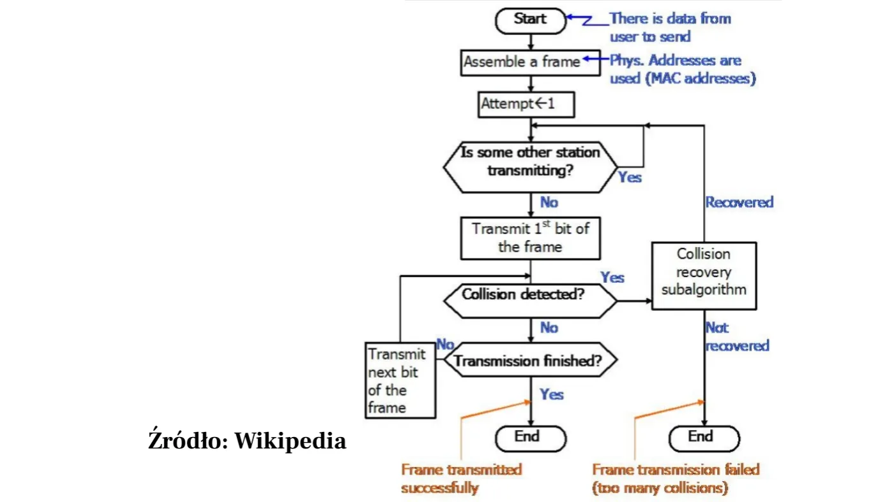

Źródło: Wikipedia

### 35. Sekwencja zagłuszająca

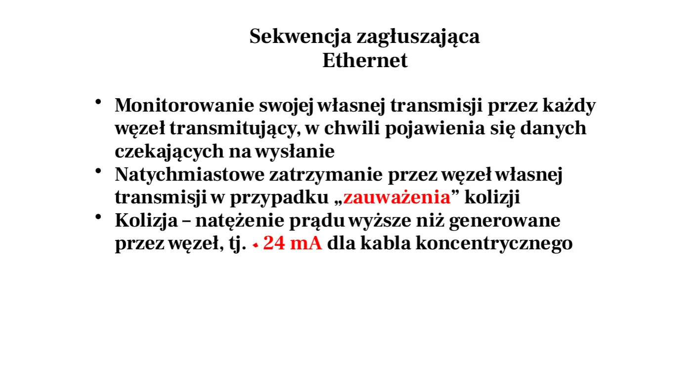

Ethernet  
Monitorowanie swojej własnej transmisji przez każdy węzeł transmitujący, w chwili pojawienia się danych czekających na wysłanie  
Natychmiastowe zatrzymanie przez węzeł własnej transmisji w przypadku „  
zauważenia  
” kolizji  
Kolizja – natężenie prądu wyższe niż generowane przez węzeł, tj.  
>24 mA  
dla kabla koncentrycznego

### 36. Sekwencja zagłuszająca

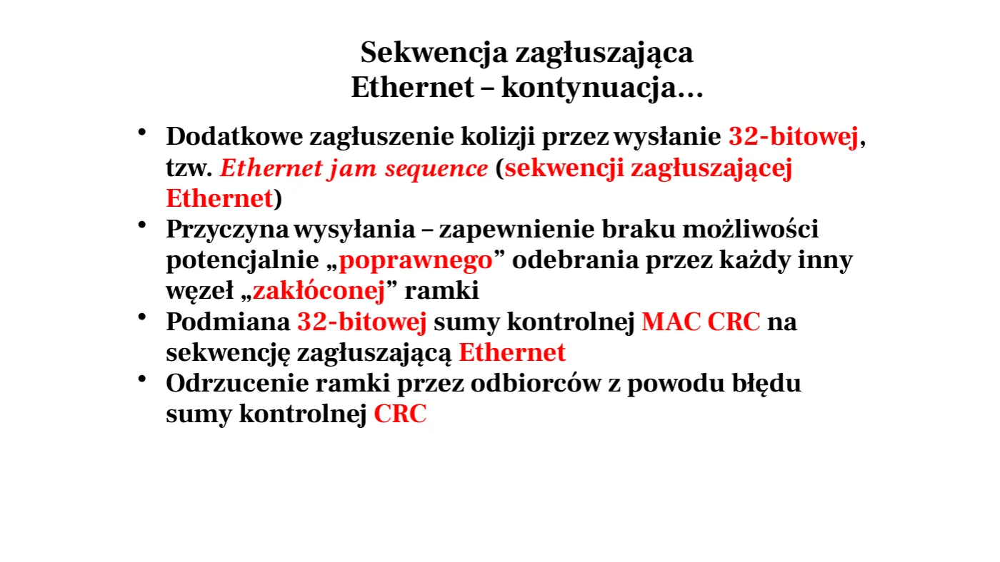

Ethernet – kontynuacja...  
Dodatkowe zagłuszenie kolizji przez wysłanie  
32-bitowej  
, tzw.  
Ethernet jam sequence  
(  
sekwencji zagłuszającej Ethernet  
)‏  
Przyczyna wysyłania – zapewnienie braku możliwości potencjalnie „  
poprawnego  
” odebrania przez każdy inny węzeł „  
zakłóconej  
” ramki  
Podmiana  
32-bitowej  
sumy kontrolnej  
MAC CRC  
na sekwencję zagłuszającą  
Ethernet  
Odrzucenie ramki przez odbiorców z powodu błędu sumy kontrolnej  
CRC

### 37. Minimalny rozmiar ramki CSMA/CD (1/2)

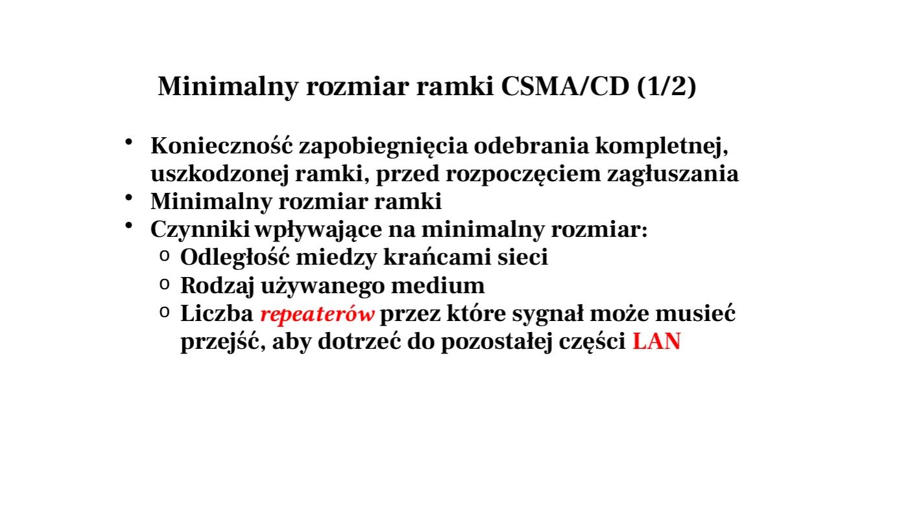

Konieczność zapobiegnięcia odebrania kompletnej, uszkodzonej ramki, przed rozpoczęciem zagłuszania  
Minimalny rozmiar ramki  
Czynniki wpływające na minimalny rozmiar:  
Odległość miedzy krańcami sieci  
Rodzaj używanego medium  
Liczba  
repeaterów  
przez które sygnał może musieć przejść, aby dotrzeć do pozostałej części  
LAN

### 38. Minimalny rozmiar ramki CSMA/CD (2/2)

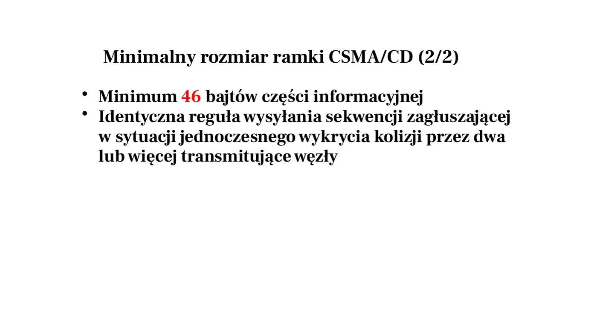

Minimum  
46  
bajtów części informacyjnej  
Identyczna reguła wysyłania sekwencji zagłuszającej w sytuacji jednoczesnego wykrycia kolizji przez dwa lub więcej transmitujące węzły

### 39. Kolizje w CSMA/CD (1/4)‏

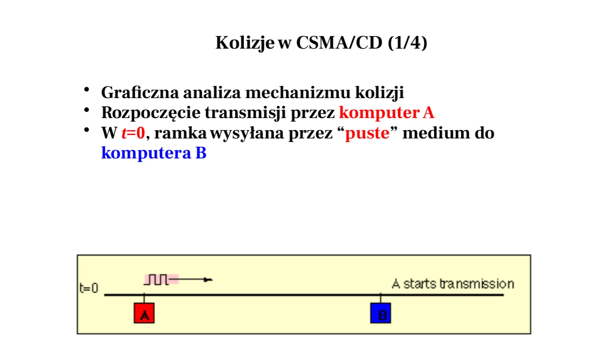

Graficzna analiza mechanizmu kolizji  
Rozpoczęcie transmisji przez  
komputer A  
W  
t  
=0  
, ramka wysyłana przez “  
puste  
” medium do  
komputera  
B

### 40. Kolizje w CSMA/CD (2/4)‏

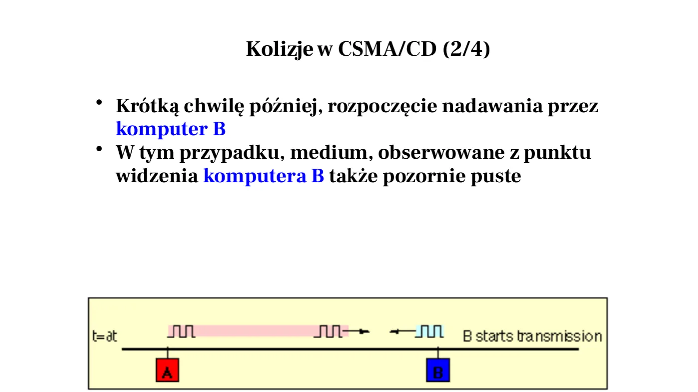

Krótką chwilę później, rozpoczęcie nadawania przez  
komputer B  
W tym przypadku, medium, obserwowane z punktu widzenia  
komputera B  
także pozornie puste

### 41. Kolizje w CSMA/CD (3/4)‏

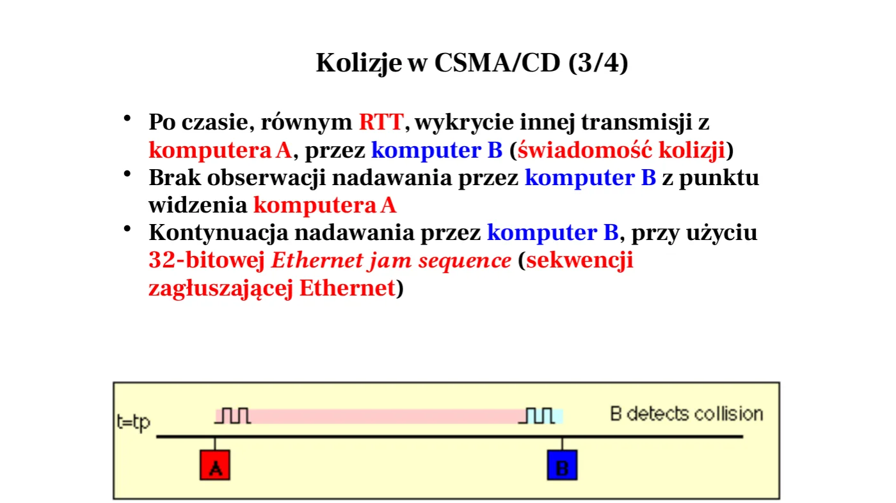

Po czasie, równym  
RTT  
, wykrycie innej transmisji z  
komputera A  
, przez  
komputer B  
(  
świadomość kolizji  
)  
Brak obserwacji nadawania przez  
komputer B  
z punktu widzenia  
komputera A  
Kontynuacja nadawania przez  
komputer B  
, przy użyciu  
32-bitowej  
Ethernet jam sequence  
(  
sekwencji zagłuszającej Ethernet  
)‏

### 42. Kolizje w CSMA/CD (4/4)‏

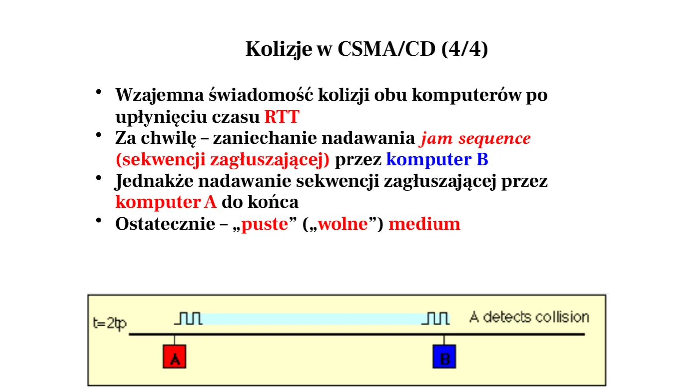

Wzajemna świadomość kolizji obu komputerów po upłynięciu czasu  
RTT  
Za chwilę – zaniechanie nadawania  
jam sequence  
(sekwencji zagłuszającej)  
przez  
komputer B  
Jednakże nadawanie sekwencji zagłuszającej przez  
komputer A  
do końca  
Ostatecznie – „  
puste  
” („  
wolne  
”)  
medium  
‏

### 43. Literatura

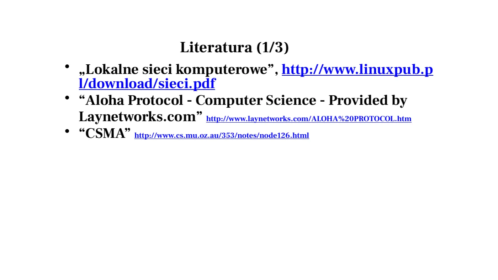

(1/  
3  
)  
„Lokalne sieci komputerowe”,  
http://www.linuxpub.pl/download/sieci.pdf  
“Aloha Protocol - Computer Science - Provided by Laynetworks.com”  
http://www.laynetworks.com/ALOHA%20PROTOCOL.htm  
“CSMA”  
http://www.cs.mu.oz.au/353/notes/node126.html

### 44. Literatura

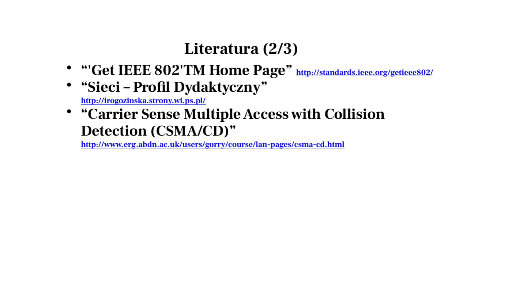

(2/  
3  
)  
“'Get IEEE 802'TM Home Page”  
http://standards.ieee.org/getieee802/  
“Sieci – Profil Dydaktyczny”  
http://irogozinska.strony.wi.ps.pl/  
“Carrier Sense Multiple Access with Collision Detection (CSMA/CD)”  
http://www.erg.abdn.ac.uk/users/gorry/course/lan-pages/csma-cd.html

### 45. Literatura (3/3)

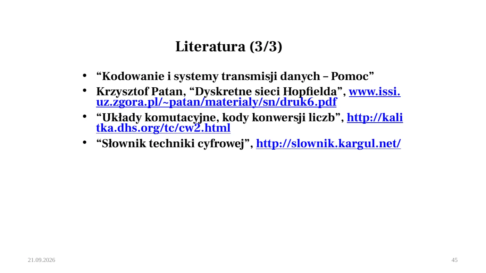

“Kodowanie i systemy transmisji danych – Pomoc”  
Krzysztof  
Patan  
, “Dyskretne sieci  
Hopfielda  
”,  
www.issi.uz.zgora.pl  
/~  
patan  
/  
materialy  
/  
sn  
/druk6.pdf  
“Układy komutacyjne, kody konwersji liczb”,  
http://kalitka.dhs.org/tc/cw2.html  
“Słownik techniki cyfrowej”,  
http://slownik.kargul.net/  
21.12.2019  
45

