# Kodowanie sygnałów

Oryginał: [08 Kodowanie sygnałów.pptx](../08%20Kodowanie%20sygna%C5%82o%CC%81w.pptx)

## Slajdy

### 1. Kodowanie sygnałów

Mikołaj Leszczuk

### 2. Spis treści wykładu

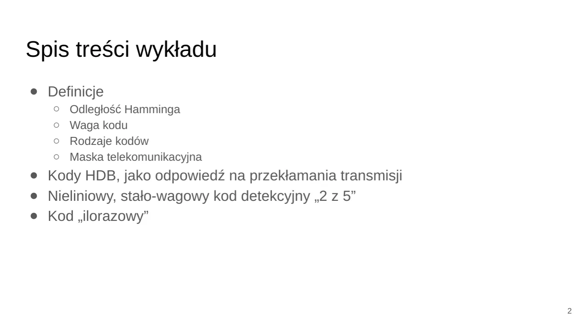

Definicje  
Odległość Hamminga  
Waga kodu  
Rodzaje kodów  
Maska telekomunikacyjna  
Kody HDB, jako odpowiedź na przekłamania transmisji  
Nieliniowy, stało-wagowy kod detekcyjny „2 z 5”  
Kod „ilorazowy”  
2

### 3. Definicje

3

### 4. Odległość Hamminga

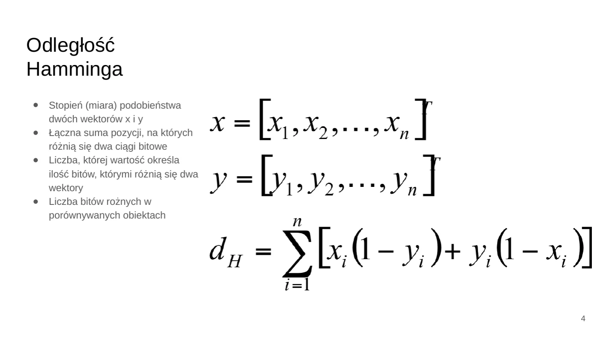

Stopień (miara) podobieństwa dwóch wektorów x i y  
Łączna suma pozycji, na których różnią się dwa ciągi bitowe  
Liczba, której wartość określa ilość bitów, którymi różnią się dwa wektory  
Liczba bitów rożnych w porównywanych obiektach  
4

### 5. 5

Jak obliczyć odległość Hamminga

### 6. Waga kodu

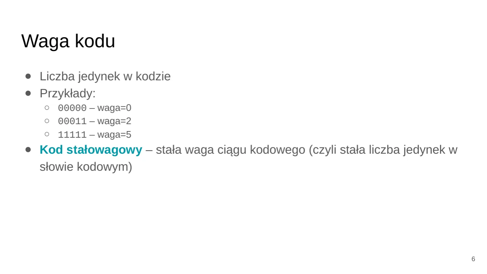

Liczba jedynek w kodzie  
Przykłady:  
00000  
– waga=0  
00011  
– waga=2  
11111  
– waga=5  
Kod stałowagowy  
– stała waga ciągu kodowego (czyli stała liczba jedynek w słowie kodowym)  
6

### 7. Kody systematyczne i niesystematyczne

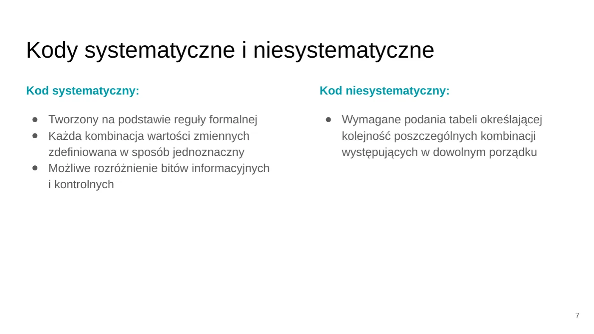

Kod systematyczny:  
Tworzony na podstawie reguły formalnej  
Każda kombinacja wartości zmiennych zdefiniowana w sposób jednoznaczny  
Możliwe rozróżnienie bitów informacyjnych i kontrolnych  
Kod niesystematyczny:  
Wymagane podania tabeli określającej kolejność poszczególnych kombinacji występujących w dowolnym porządku  
7

### 8. Maska telekomunikacyjna – definicja (1/2)

Konieczność zapewnienia ściśle określonego kształtu sygnału przenoszonego przez tor transmisyjny  
Przyczyna – możliwość niewłaściwego interpretowania danych przez odbiornik  
Zwykle – brak idealności kształtu odebranego impulsu  
8

### 9. Maska telekomunikacyjna – definicja (2/2)

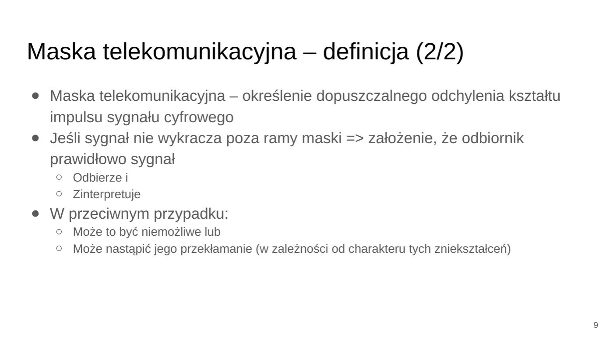

Maska telekomunikacyjna – określenie dopuszczalnego odchylenia kształtu impulsu sygnału cyfrowego  
Jeśli sygnał nie wykracza poza ramy maski => założenie, że odbiornik prawidłowo sygnał  
Odbierze i  
Zinterpretuje  
W przeciwnym przypadku:  
Może to być niemożliwe lub  
Może nastąpić jego przekłamanie (w zależności od charakteru tych zniekształceń)  
9

### 10. Maska telekomunikacyjna – wymagania

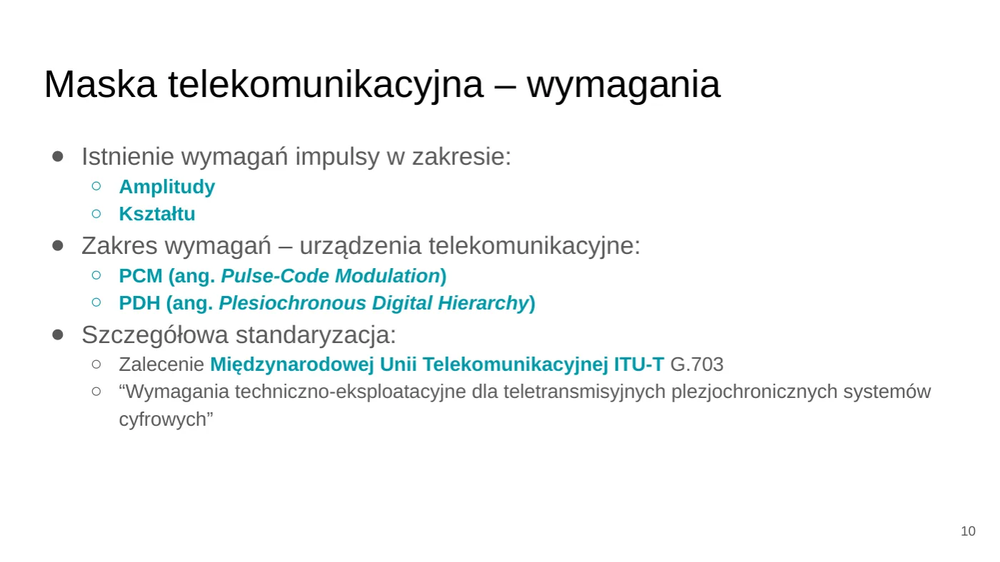

Istnienie wymagań impulsy w zakresie:  
Amplitudy  
Kształtu  
Zakres wymagań – urządzenia telekomunikacyjne:  
PCM (ang.  
Pulse-Code Modulation  
)  
PDH (ang.  
Plesiochronous Digital Hierarchy  
)  
Szczegółowa standaryzacja:  
Zalecenie  
Międzynarodowej Unii Telekomunikacyjnej ITU-T  
G.703  
“Wymagania techniczno-eksploatacyjne dla teletransmisyjnych plezjochronicznych systemów cyfrowych”  
10

### 11. 13

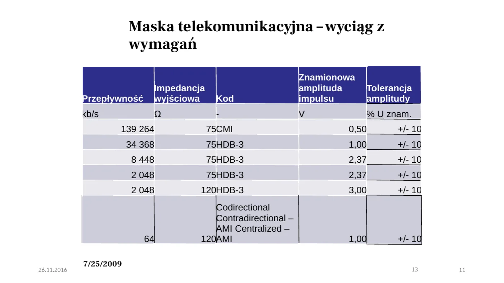

Maska telekomunikacyjna – wyciąg z wymagań  
Przepływność  
Impedancja wyjściowa  
Kod  
Znamionowa amplituda impulsu  
Tolerancja amplitudy  
kb/s  
Ω  
-  
V  
% U znam.  
139 264  
75  
CMI  
0,50  
+/- 10  
34 368  
75  
HDB-3  
1,00  
+/- 10  
8 448  
75  
HDB-3  
2,37  
+/- 10  
2 048  
75  
HDB-3  
2,37  
+/- 10  
2 048  
120  
HDB-3  
3,00  
+/- 10  
64  
120  
Codirectional Contradirectional – AMI Centralized – AMI  
1,00  
+/- 10  
7/25/2009  
26.11.2016  
11

### 12. Przykłady porównania przebiegów z maskami telekomunikacyjnymi, zmierzone przebiegi są prawidłowe (nie wykraczają poza ramy masek)

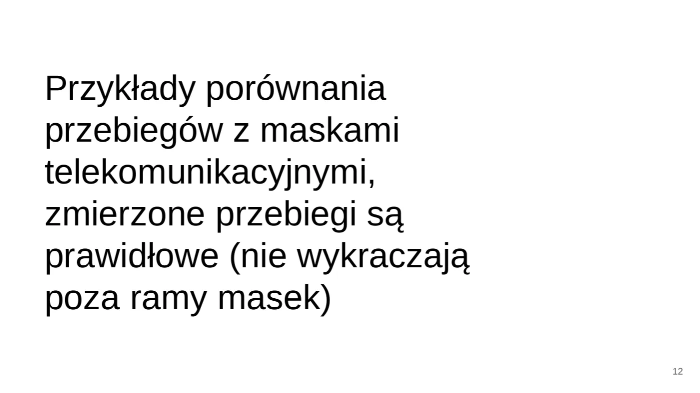

12

### 13. Przykład maski telekomunikacyjnej dla przebiegu PDH 140 Mbit/s

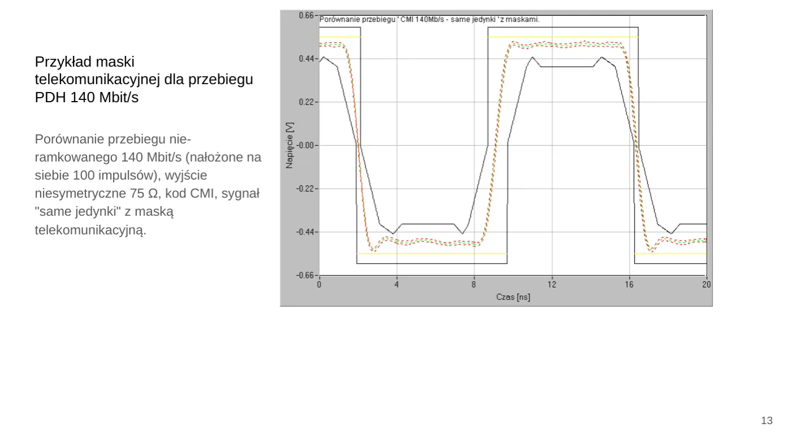

Porównanie przebiegu nie-ramkowanego 140 Mbit/s (nałożone na siebie 100 impulsów), wyjście niesymetryczne 75 Ω, kod CMI, sygnał "same jedynki" z maską telekomunikacyjną.  
13

### 14. Przykład maski telekomunikacyjnej dla przebiegu PCM 2 Mbit/s

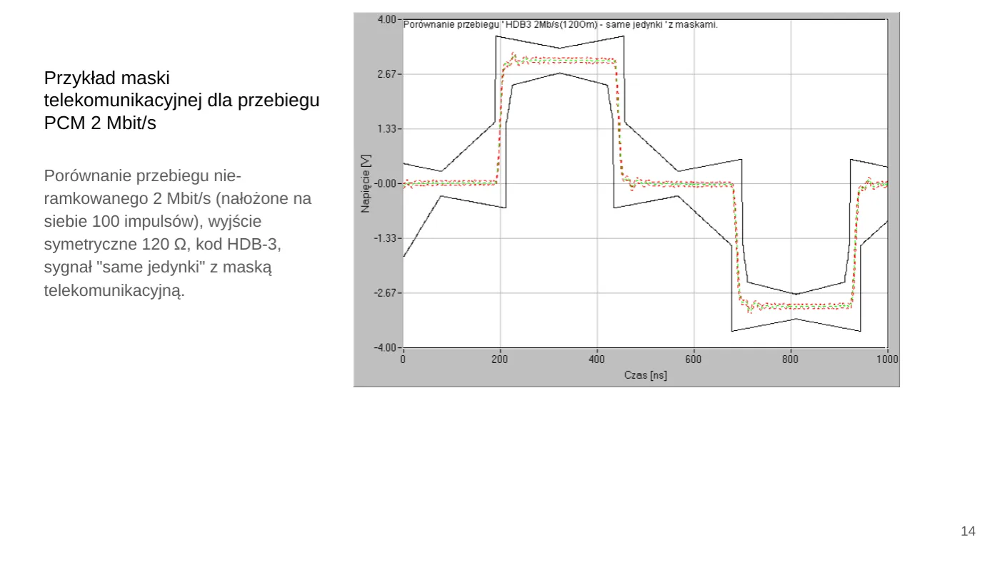

Porównanie przebiegu nie-ramkowanego 2 Mbit/s (nałożone na siebie 100 impulsów), wyjście symetryczne 120 Ω, kod HDB-3, sygnał "same jedynki" z maską telekomunikacyjną.  
14

### 15. Niepożądane zjawiska

Niepożądane zjawiska skutkujące modyfikacją sygnału względem wyjścia nadajnika:  
Odbicia  
Spadki:  
Napięcia  
Mocy  
Nieliniowość stopni mocy:  
Odbiorników  
Nadajników  
Fluktuacja fazy  
15

### 16. Kody HDB, jako odpowiedź na przekłamania transmisji

16

### 17. Kody HDB

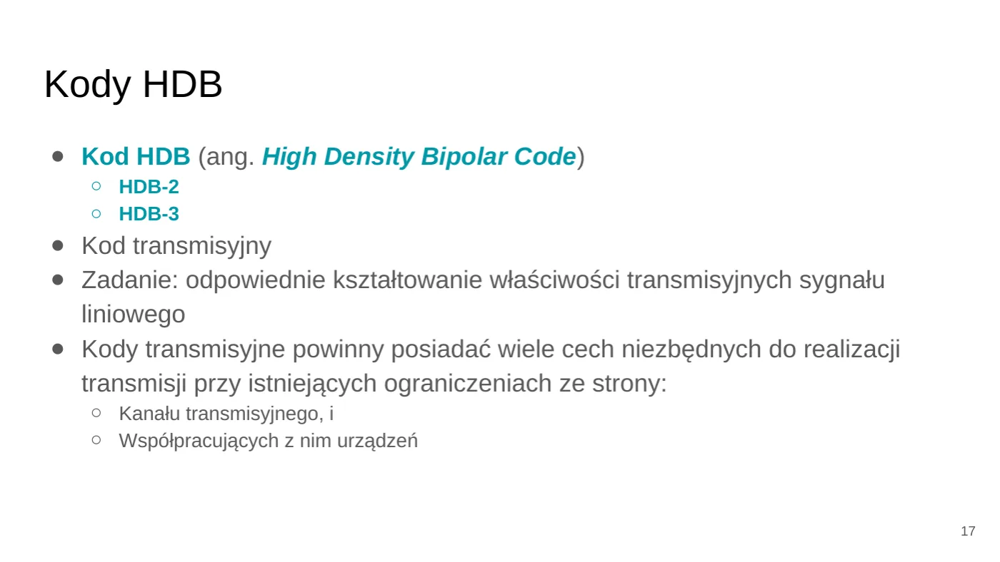

Kod HDB  
(ang.  
High Density Bipolar Code  
)  
HDB-2  
HDB-3  
Kod transmisyjny  
Zadanie: odpowiednie kształtowanie właściwości transmisyjnych sygnału liniowego  
Kody transmisyjne powinny posiadać wiele cech niezbędnych do realizacji transmisji przy istniejących ograniczeniach ze strony:  
Kanału transmisyjnego, i  
Współpracujących z nim urządzeń  
17

### 18. Najbardziej pożądane właściwości sygnału

Brak składowej stałej  
Niski poziom widma gęstości mocy w pobliżu częstotliwości  
f  
=0  
Koncentracja widma gęstości mocy w jak najwęższym paśmie  
Możliwość odtworzenia elementowej podstawy czasu  
Odporność na zakłócenia  
18

### 19. 21

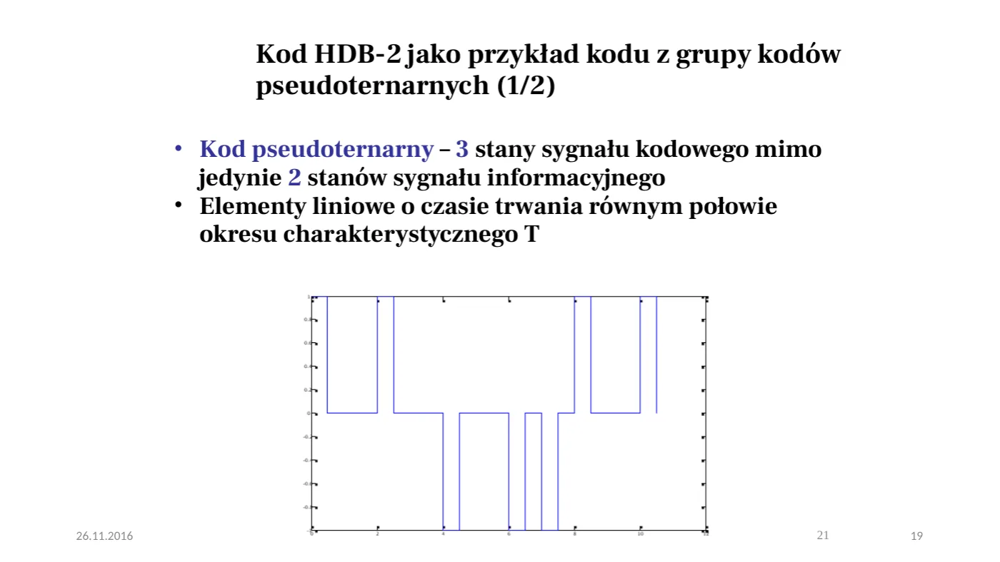

Kod HDB-2 jako przykład kodu z grupy kodów pseudoternarnych (1/2)  
Kod pseudoternarny  
–  
3  
stany sygnału kodowego mimo jedynie  
2  
stanów sygnału informacyjnego  
Elementy liniowe o czasie trwania równym połowie okresu charakterystycznego T  
26.11.2016  
19

### 20. 22

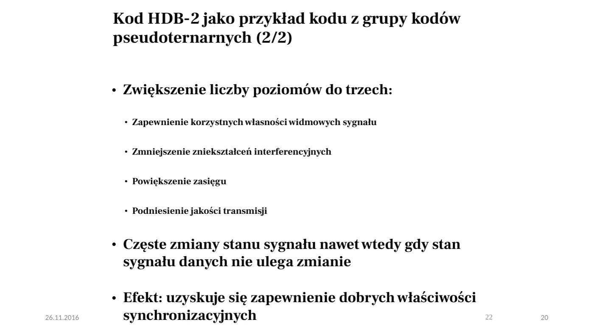

Kod HDB-2 jako przykład kodu z grupy kodów pseudoternarnych (2/2)  
Zwiększenie liczby poziomów do trzech:  
Zapewnienie korzystnych własności widmowych sygnału  
Zmniejszenie zniekształceń interferencyjnych  
Powiększenie zasięgu  
Podniesienie jakości transmisji  
Częste zmiany stanu sygnału nawet wtedy gdy stan sygnału danych nie ulega zmianie  
Efekt: uzyskuje się zapewnienie dobrych właściwości synchronizacyjnych  
26.11.2016  
20

### 21. 23

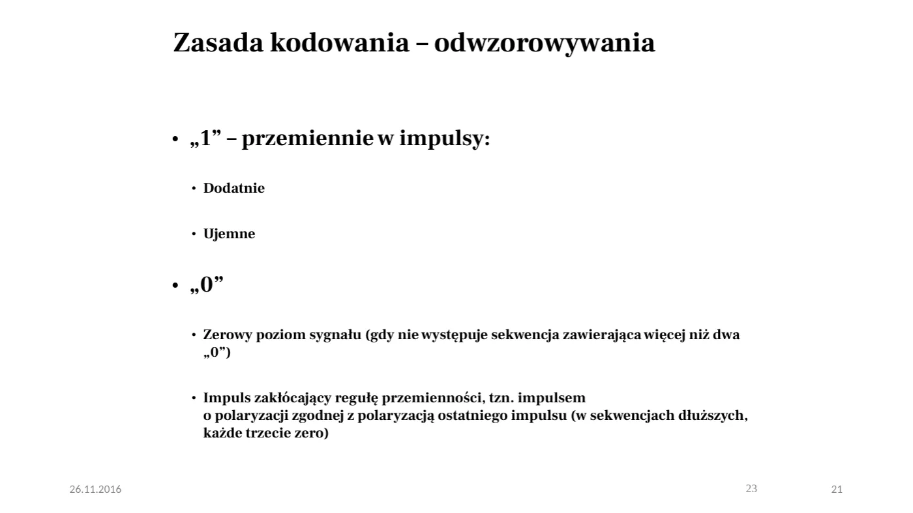

Zasada kodowania – odwzorowywania  
„1” – przemiennie w impulsy:  
Dodatnie  
Ujemne  
„0”  
Zerowy poziom sygnału (gdy nie występuje sekwencja zawierająca więcej niż dwa „0”)  
Impuls zakłócający regułę przemienności, tzn. impulsem  
o polaryzacji zgodnej z polaryzacją ostatniego impulsu (w sekwencjach dłuższych, każde trzecie zero)  
26.11.2016  
21

### 22. 24

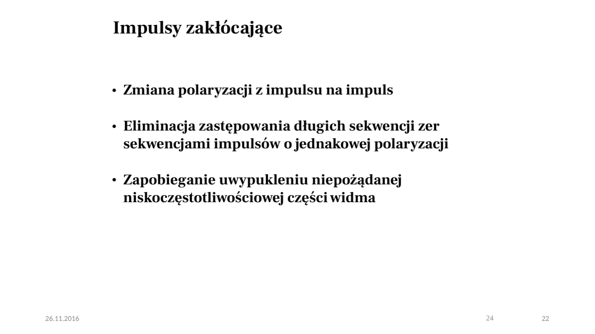

Impulsy zakłócające  
Zmiana polaryzacji z impulsu na impuls  
Eliminacja zastępowania długich sekwencji zer sekwencjami impulsów o jednakowej polaryzacji  
Zapobieganie uwypukleniu niepożądanej niskoczęstotliwościowej części widma  
26.11.2016  
22

### 23. 25

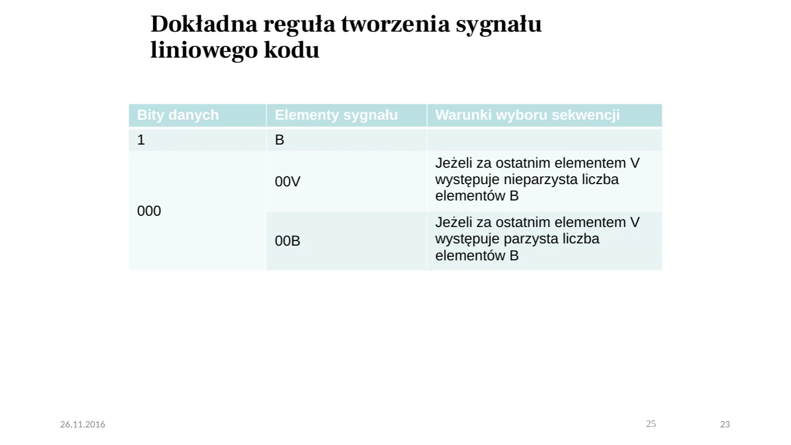

Dokładna reguła tworzenia sygnału liniowego kodu  
Bity danych  
Elementy sygnału  
Warunki wyboru sekwencji  
1  
B  
000  
00V  
Jeżeli za ostatnim elementem V występuje nieparzysta liczba elementów B  
00B  
Jeżeli za ostatnim elementem V występuje parzysta liczba elementów B  
26.11.2016  
23

### 24. 26

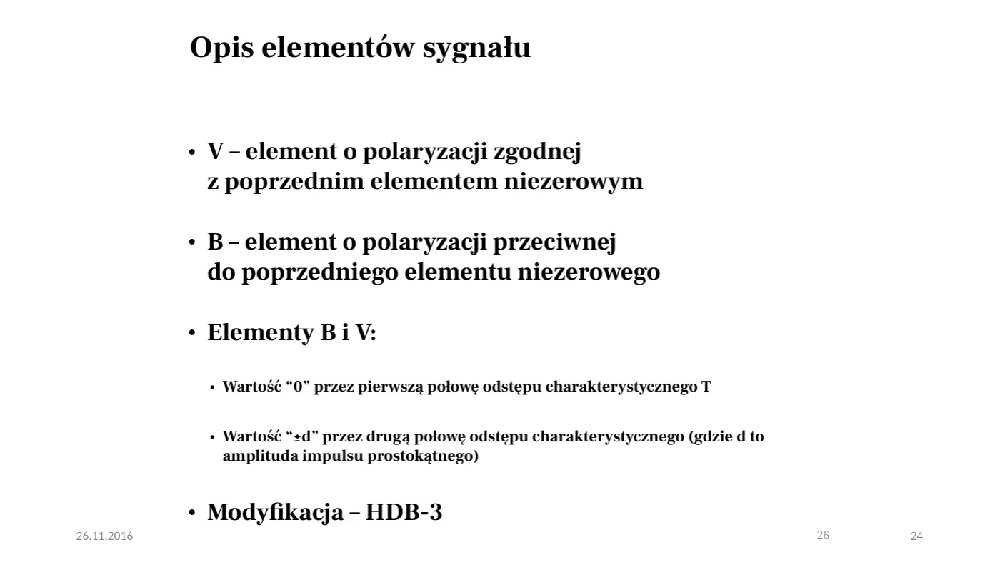

Opis elementów sygnału  
V – element o polaryzacji zgodnej  
z poprzednim elementem niezerowym  
B – element o polaryzacji przeciwnej  
do poprzedniego elementu niezerowego  
Elementy B i V:  
Wartość “0” przez pierwszą połowę odstępu charakterystycznego T  
Wartość “±d” przez drugą połowę odstępu charakterystycznego (gdzie d to amplituda impulsu prostokątnego)  
Modyfikacja – HDB-3  
26.11.2016  
24

### 25. 27

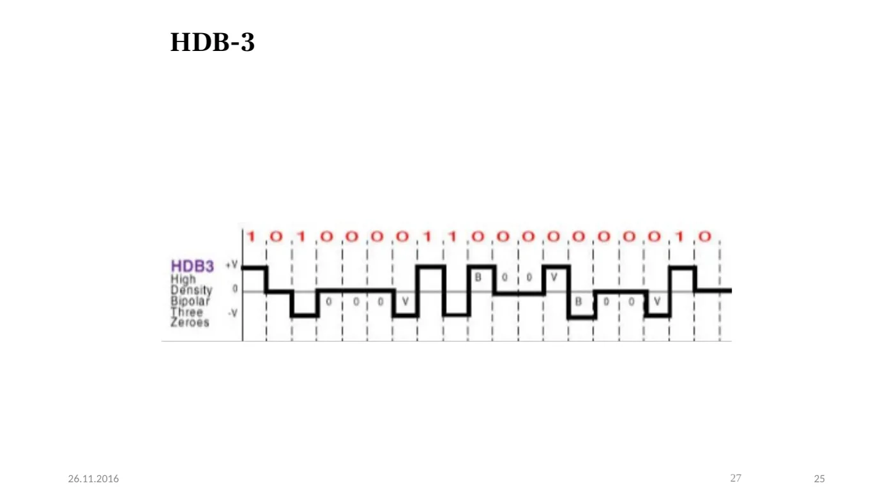

HDB-3  
26.11.2016  
25

### 26. Synchronizacja w HDB

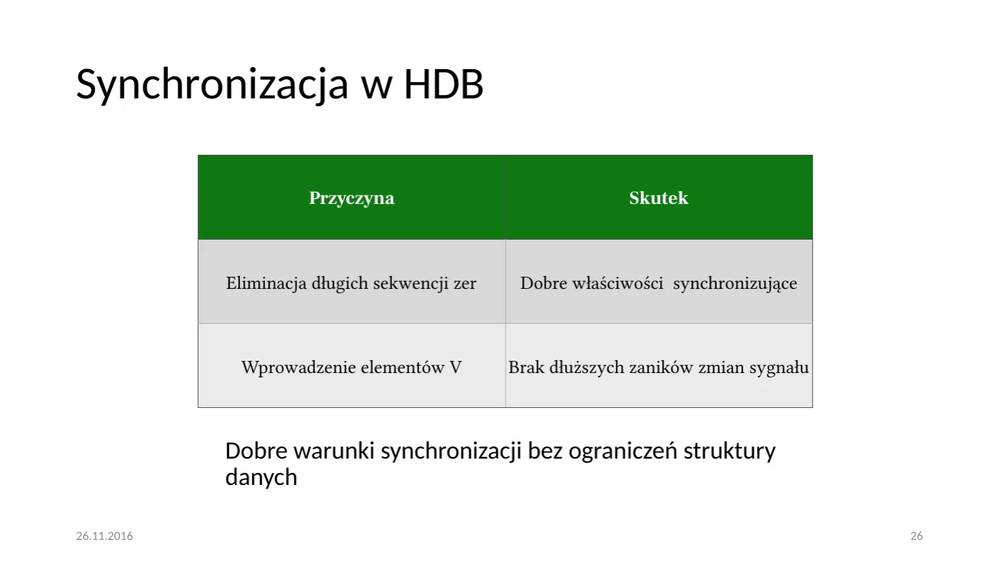

Dobre warunki synchronizacji bez ograniczeń struktury danych  
Przyczyna  
Skutek  
Eliminacja długich sekwencji zer  
Dobre właściwości  synchronizujące  
Wprowadzenie elementów V  
Brak dłuższych zaników zmian sygnału  
26.11.2016  
26

### 27. 29

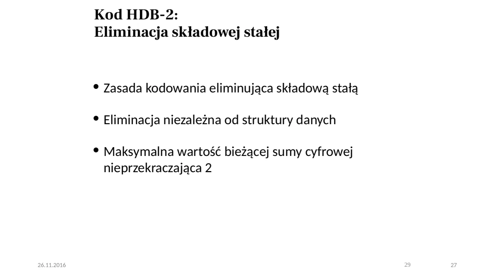

Kod HDB-2:  
Eliminacja składowej stałej  
Zasada kodowania eliminująca składową stałą  
Eliminacja niezależna od struktury danych  
Maksymalna wartość bieżącej sumy cyfrowej nieprzekraczająca 2  
26.11.2016  
27

### 28. 30

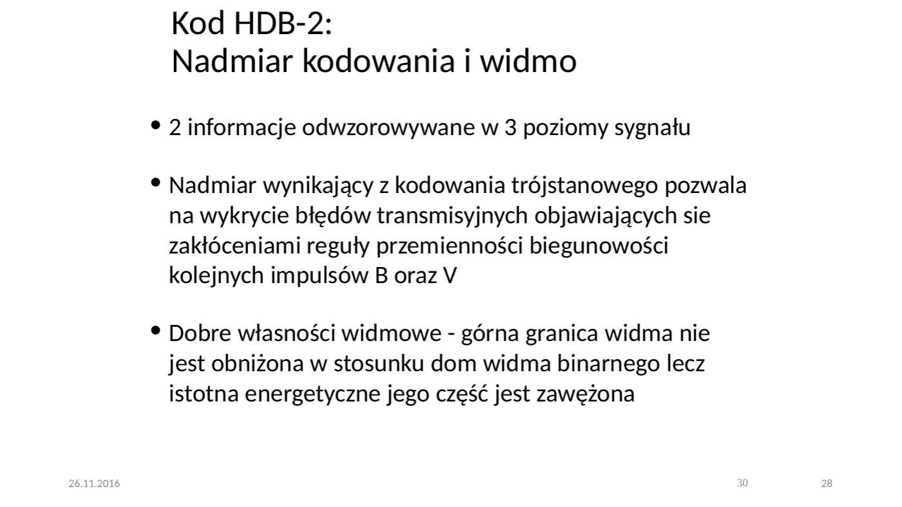

Kod HDB-2:  
Nadmiar kodowania i widmo  
2 informacje odwzorowywane w 3 poziomy sygnału  
Nadmiar wynikający z kodowania trójstanowego pozwala na wykrycie błędów transmisyjnych objawiających sie zakłóceniami reguły przemienności biegunowości kolejnych impulsów B oraz V  
Dobre własności widmowe - górna granica widma nie jest obniżona w stosunku dom widma binarnego lecz istotna energetyczne jego część jest zawężona  
26.11.2016  
28

### 29. 31

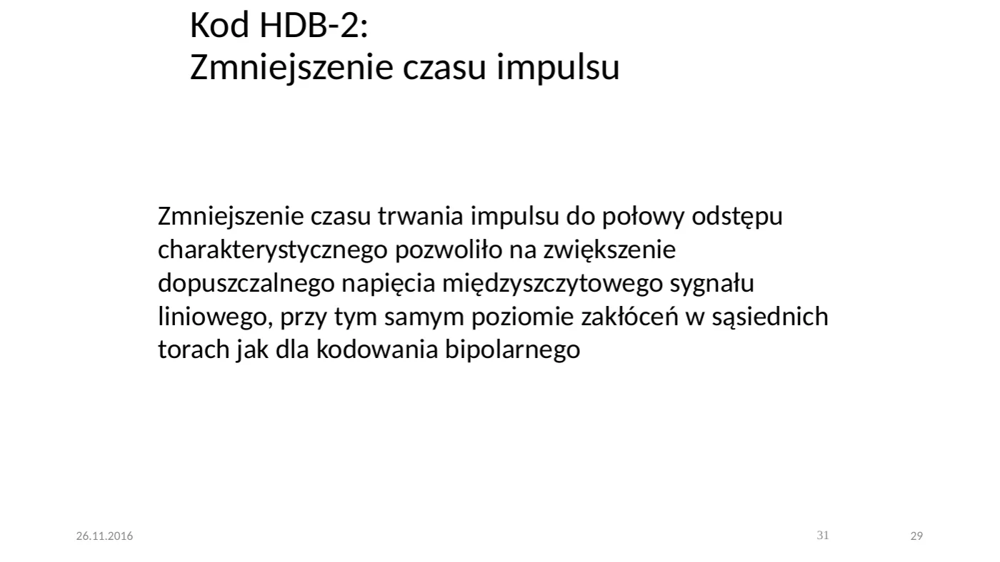

Kod HDB-2:  
Zmniejszenie czasu impulsu  
Zmniejszenie czasu trwania impulsu do połowy odstępu charakterystycznego pozwoliło na zwiększenie dopuszczalnego napięcia międzyszczytowego sygnału liniowego, przy tym samym poziomie zakłóceń w sąsiednich torach jak dla kodowania bipolarnego  
26.11.2016  
29

### 30. 32

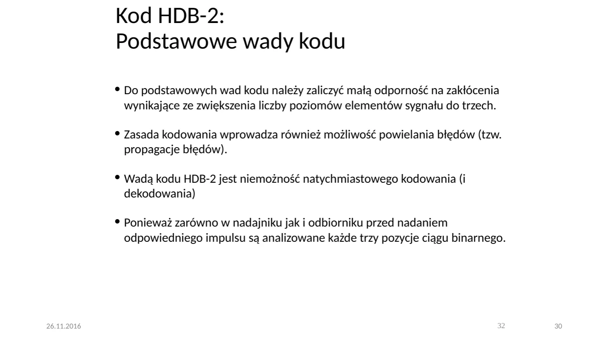

Kod HDB-2:  
Podstawowe wady kodu  
Do podstawowych wad kodu należy zaliczyć małą odporność na zakłócenia wynikające ze zwiększenia liczby poziomów elementów sygnału do trzech.  
Zasada kodowania wprowadza również możliwość powielania błędów (tzw. propagacje błędów).  
Wadą kodu HDB-2 jest niemożność natychmiastowego kodowania (i dekodowania)  
Ponieważ zarówno w nadajniku jak i odbiorniku przed nadaniem odpowiedniego impulsu są analizowane każde trzy pozycje ciągu binarnego.  
26.11.2016  
30

### 31. 33

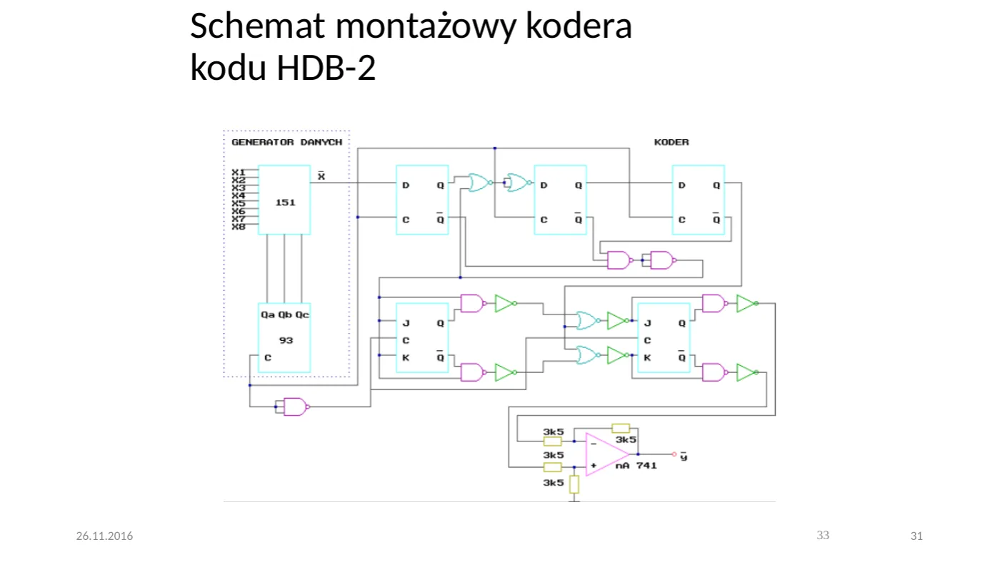

Schemat montażowy kodera  
kodu HDB-2  
26.11.2016  
31

### 32. Nieliniowy, stało-wagowy kod detekcyjny „2 z 5”

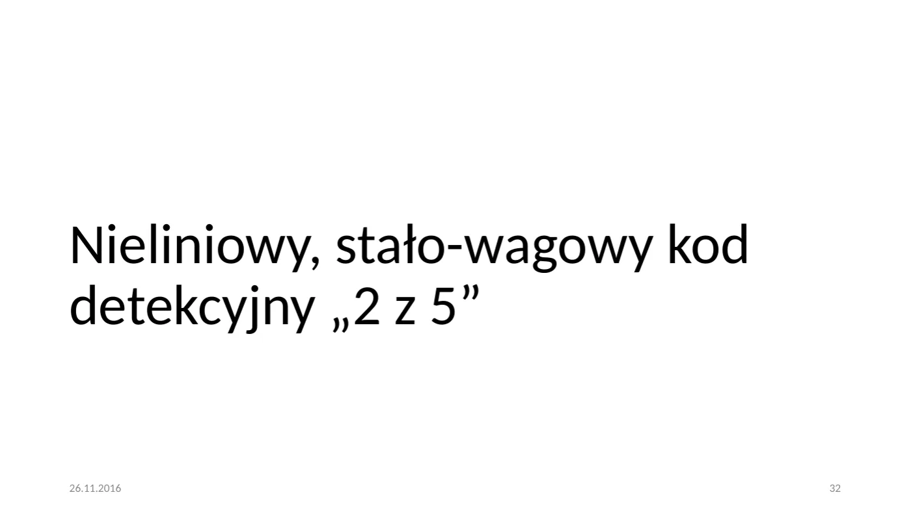

26.11.2016  
32

### 33. Stałowagowy kod „2 z 5”

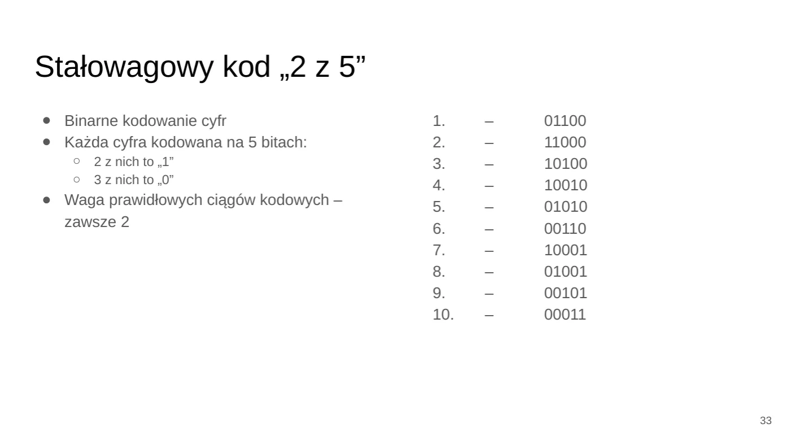

Binarne kodowanie cyfr  
Każda cyfra kodowana na 5 bitach:  
2 z nich to „1”  
3 z nich to „0”  
Waga prawidłowych ciągów kodowych – zawsze 2  
–	01100  
–	11000  
–	10100  
–	10010  
–	01010  
–	00110  
–	10001  
–	01001  
–	00101  
–	00011  
33

### 34. Odporność na błędy

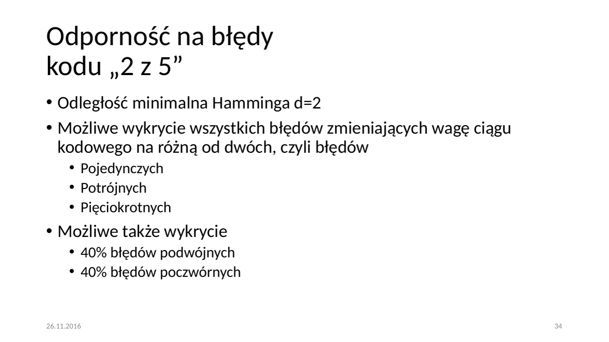

kodu „2 z 5”  
Odległość minimalna Hamminga d=2  
Możliwe wykrycie wszystkich błędów zmieniających wagę ciągu kodowego na różną od dwóch, czyli błędów  
Pojedynczych  
Potrójnych  
Pięciokrotnych  
Możliwe także wykrycie  
40% błędów podwójnych  
40% błędów poczwórnych  
26.11.2016  
34

### 35. Zastosowania kodu „2 z 5”

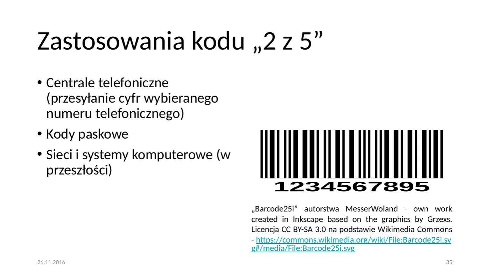

Centrale telefoniczne (przesyłanie cyfr wybieranego numeru telefonicznego)  
Kody paskowe  
Sieci i systemy komputerowe (w przeszłości)  
„Barcode25i” autorstwa MesserWoland - own work created in Inkscape based on the graphics by Grzexs. Licencja CC BY-SA 3.0 na podstawie Wikimedia Commons -  
https://commons.wikimedia.org/wiki/File:Barcode25i.svg#/media/File:Barcode25i.svg  
26.11.2016  
35

### 36. Zasada działania kodera i dekodera kodu „2 z 5”

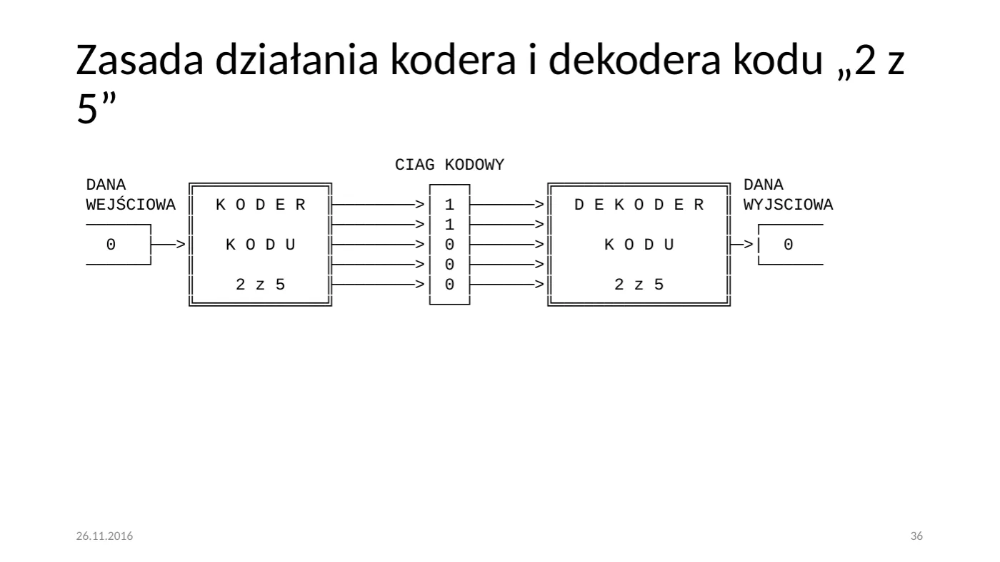

CIAG KODOWY  
DANA      ╔═════════════╗         ┌───┐       ╔═════════════════╗ DANA  
WEJŚCIOWA ║  K O D E R  ╟────────>│ 1 ├──────>║  D E K O D E R  ║ WYJSCIOWA  
──────┐   ║             ╟────────>│ 1 ├──────>║                 ║  ┌──────  
0   ├──>║   K O D U   ╟────────>│ 0 ├──────>║     K O D U     ╟─>|  0  
──────┘   ║             ╟────────>│ 0 ├──────>║                 ║  └──────  
║    2 z 5    ╟────────>│ 0 ├──────>║      2 z 5      ║  
╚═════════════╝         └───┘       ╚═════════════════╝  
26.11.2016  
36

### 37. Schemat logiczny kodera kodu „2 z 5”

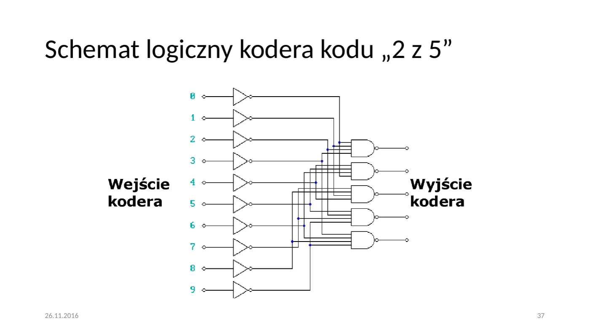

26.11.2016  
37

### 38. Schemat logiczny dekodera kodu „2 z 5”

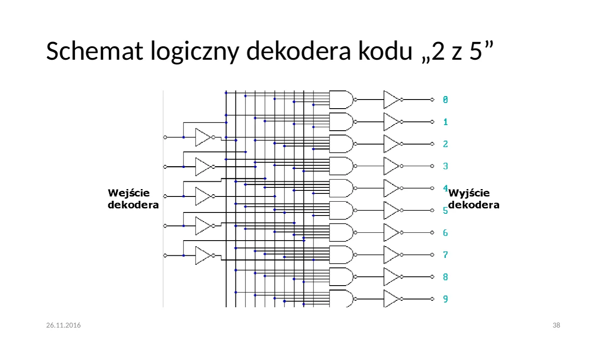

26.11.2016  
38

### 39. Kod „ilorazowy”

26.11.2016  
39

### 40. Idea kodowania ilorazowego

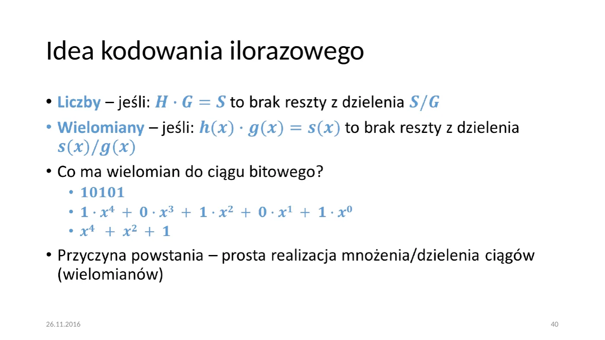

26.11.2016  
40

### 41. Kody ilorazowe – definicje

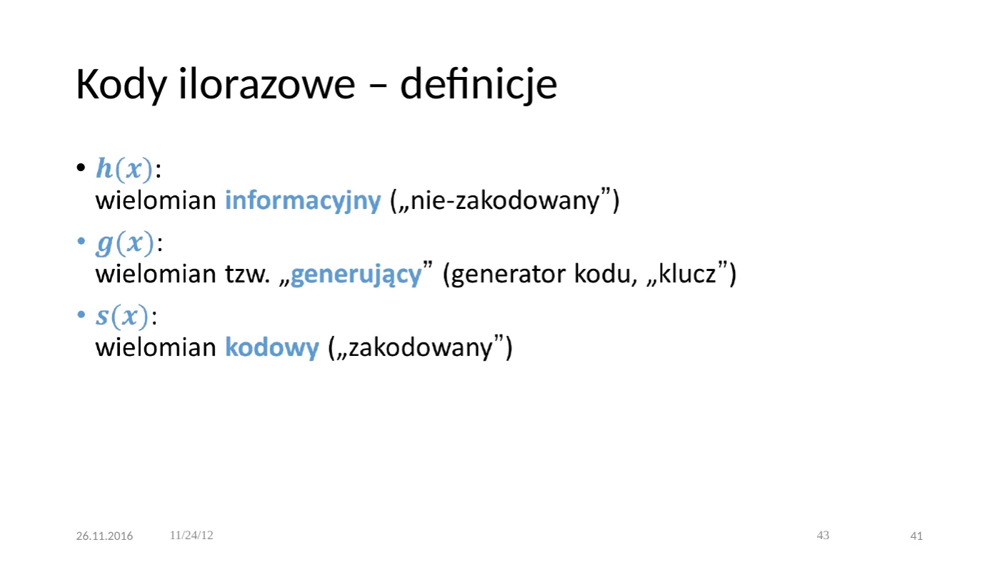

11/24/12  
43  
26.11.2016  
41

### 42. Kody ilorazowe – definicje – kontynuacja...

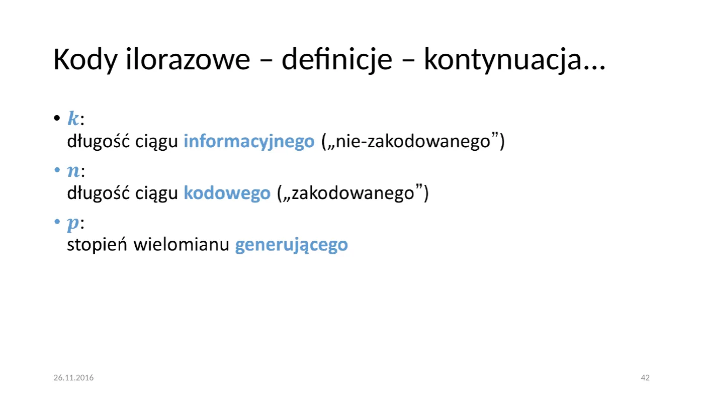

26.11.2016  
42

### 43. Niesystematyczne kodowanie ilorazowe

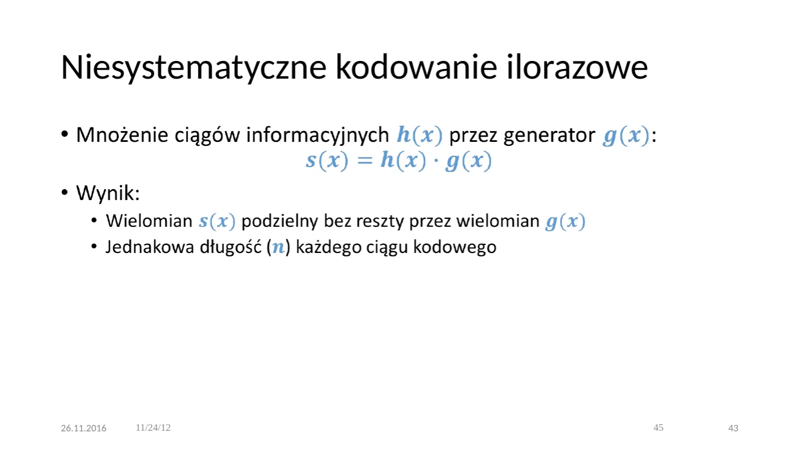

11/24/12  
45  
26.11.2016  
43

### 44. Niesystematyczne dekodowanie ilorazowe

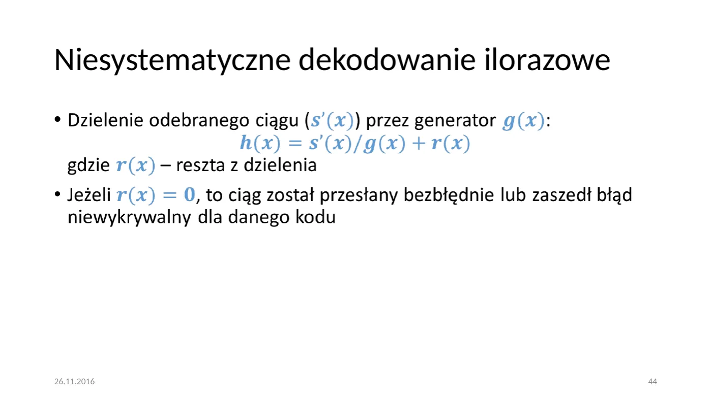

26.11.2016  
44

### 45. Schematy niesystematycznego kodera i dekodera ilorazowego

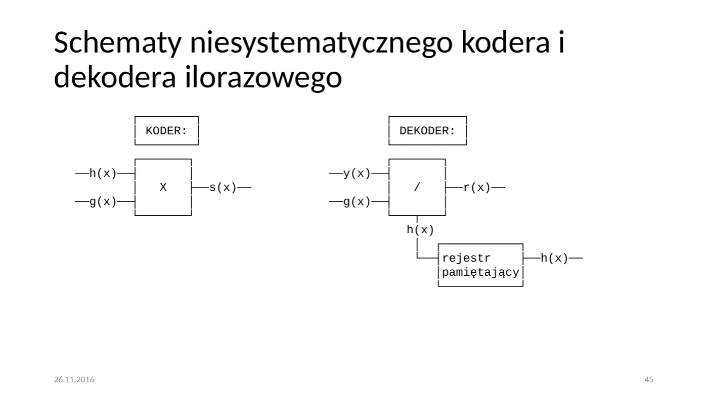

┌────────┐                          ┌──────────┐  
│ KODER: │                          │ DEKODER: │  
└────────┘                          └──────────┘  
┌───────┐                           ┌───────┐  
──h(x)──┤       │                   ──y(x)──┤       │  
│   X   ├──s(x)──                   │   /   ├──r(x)──  
──g(x)──┤       │                   ──g(x)──┤       │  
└───────┘                           └───┬───┘  
h(x)  
│  ┌───────────┐  
└──┤rejestr    ├──h(x)──  
│pamiętający│  
└───────────┘  
26.11.2016  
45

### 46. Kodowanie niesystematyczne i systematyczne

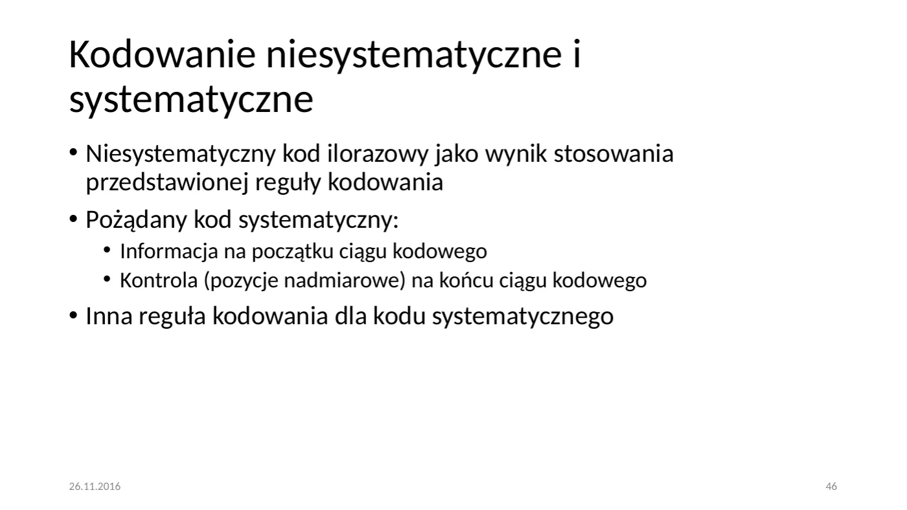

Niesystematyczny kod ilorazowy jako wynik stosowania przedstawionej reguły kodowania  
Pożądany kod systematyczny:  
Informacja na początku ciągu kodowego  
Kontrola (pozycje nadmiarowe) na końcu ciągu kodowego  
Inna reguła kodowania dla kodu systematycznego  
26.11.2016  
46

### 47. Systematyczne kodowanie ilorazowe

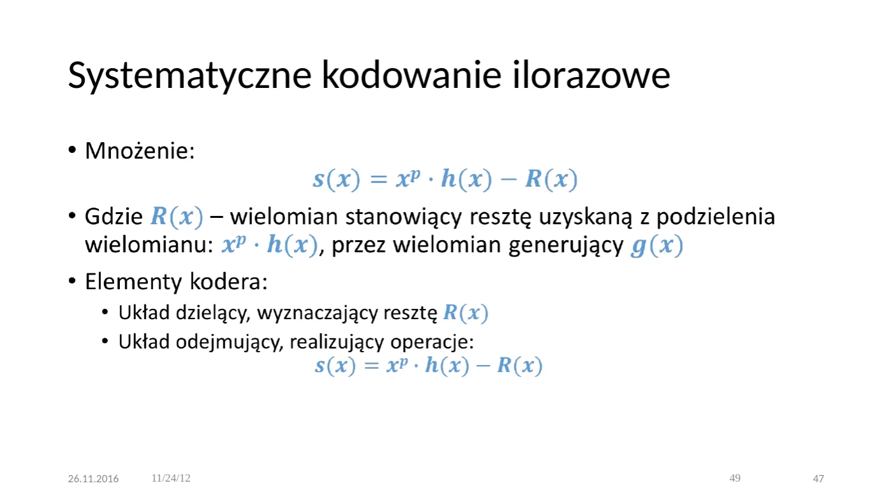

11/24/12  
49  
26.11.2016  
47

### 48. Systematyczne dekodowanie ilorazowe

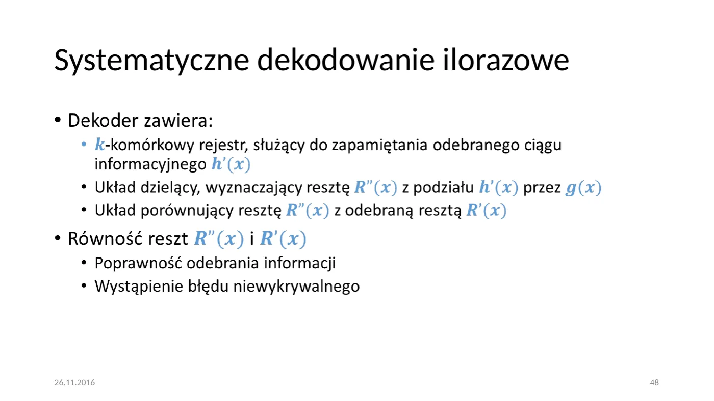

26.11.2016  
48

### 49. Schematy systematycznego kodera i dekodera ilorazowego

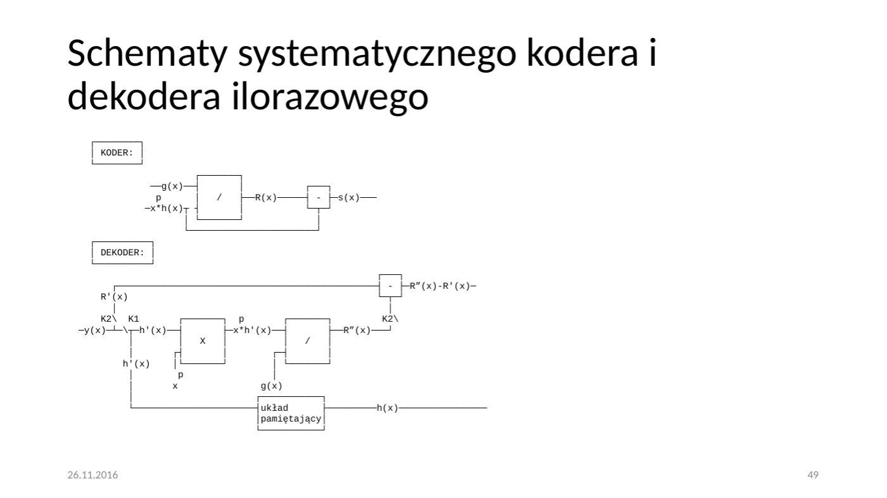

┌────────┐  
│ KODER: │  
└────────┘  
┌───────┐  
──g(x)──┤       │           ┌───┐  
p      │   /   ├──R(x)─────┤ - ├─s(x)───  
─x*h(x)┬ ┤       │           └─┬─┘  
│ └───────┘             │  
└───────────────────────┘  
┌──────────┐  
│ DEKODER: │  
└──────────┘  
┌───┐  
┌───────────────────────────────────────────────┤ - ├─R”(x)-R'(x)─  
R'(x)                                             └─┬─┘  
│                                                 │  
K2\  K1       ┌───────┐  p       ┌───────┐         K2\  
─y(x)─┴─\┬─h'(x)──┤       ├─x*h'(x)──┤       ├──R”(x)───┘  
│        │   X   │          │   /   │  
│       ┌┤       │        ┌─┤       │  
h'(x)    │└───────┘        │ └───────┘  
│        p                │  
│       x               g(x)  
│                      ┌───────────┐  
└──────────────────────┤układ      ├─────────h(x)────────────────  
│pamiętający│  
└───────────┘  
26.11.2016  
49

### 50. Literatura

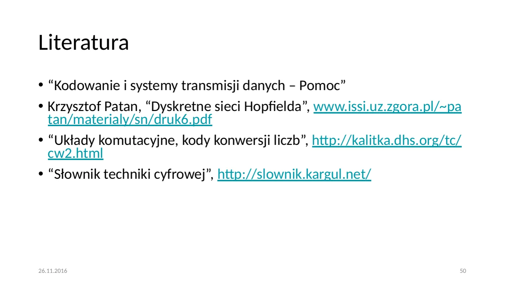

“Kodowanie i systemy transmisji danych – Pomoc”  
Krzysztof Patan, “Dyskretne sieci Hopfielda”,  
www.issi.uz.zgora.pl/~patan/materialy/sn/druk6.pdf  
“Układy komutacyjne, kody konwersji liczb”,  
http://kalitka.dhs.org/tc/cw2.html  
“Słownik techniki cyfrowej”,  
http://slownik.kargul.net/  
26.11.2016  
50

