# Podstawowe zagadnienia sieciowe

Oryginał: [09 Podstawowe zagadnienia sieciowe.pptx](../09%20Podstawowe%20zagadnienia%20sieciowe.pptx)

## Slajdy

### 1. Podstawowe zagadnienia sieciowe

Mikołaj Leszczuk

### 2. Plan wykładu

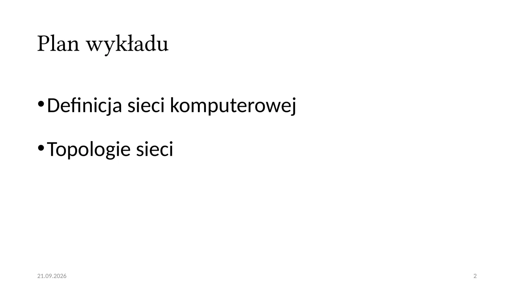

Definicja sieci komputerowej  
Topologie sieci  
20.12.2020  
2

### 3. Definicja sieci komputerowej

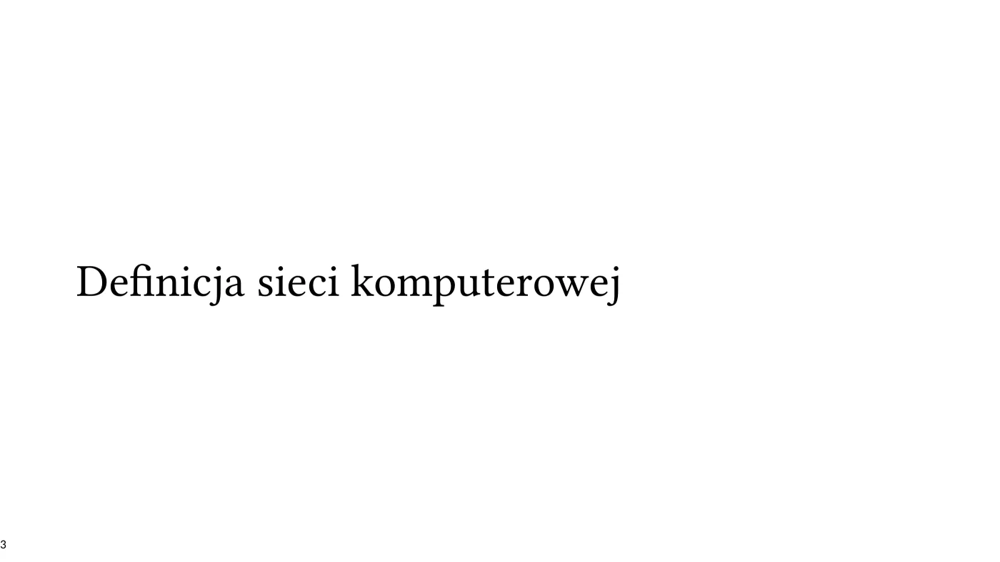

3

### 4. Sieć…

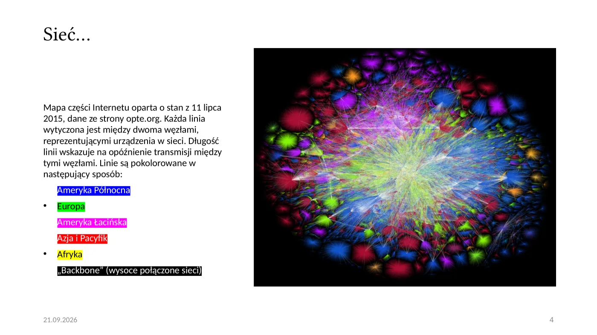

Mapa części Internetu oparta o stan z 11 lipca 2015, dane ze strony  
opte.org  
. Każda linia wytyczona jest między dwoma węzłami, reprezentującymi urządzenia w sieci. Długość linii wskazuje na opóźnienie transmisji między tymi węzłami. Linie są pokolorowane w następujący sposób:  
Ameryka Północna  
Europa  
Ameryka Łacińska  
Azja i Pacyfik  
Afryka  
„  
Backbone  
” (wysoce połączone sieci)  
20.12.2020  
4

### 5. Sieć komputerowa

Sieć komputerowa to grupa:  
Komputerów, lub  
Innych urządzeń  
Połączone ze sobą w celu:  
Wymiany danych, lub  
Współdzielenia zasobów  
20.12.2020  
5

### 6. Możliwości pracy komputerów w sieci:

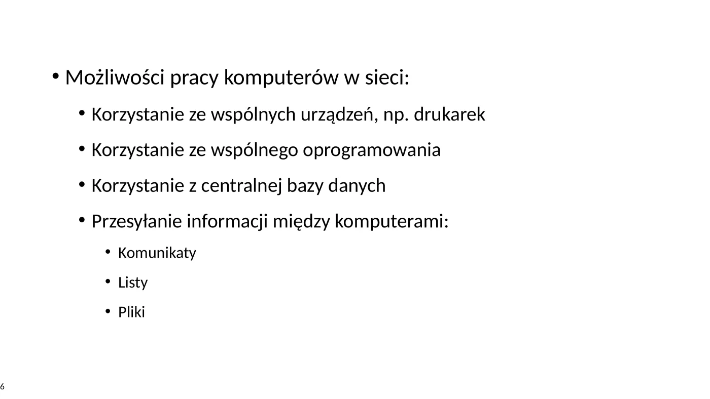

Korzystanie ze wspólnych urządzeń, np. drukarek  
Korzystanie ze wspólnego oprogramowania  
Korzystanie z centralnej bazy danych  
Przesyłanie informacji między komputerami:  
Komunikaty  
Listy  
Pliki  
6

### 7. Rodzaje sieci komputerowych

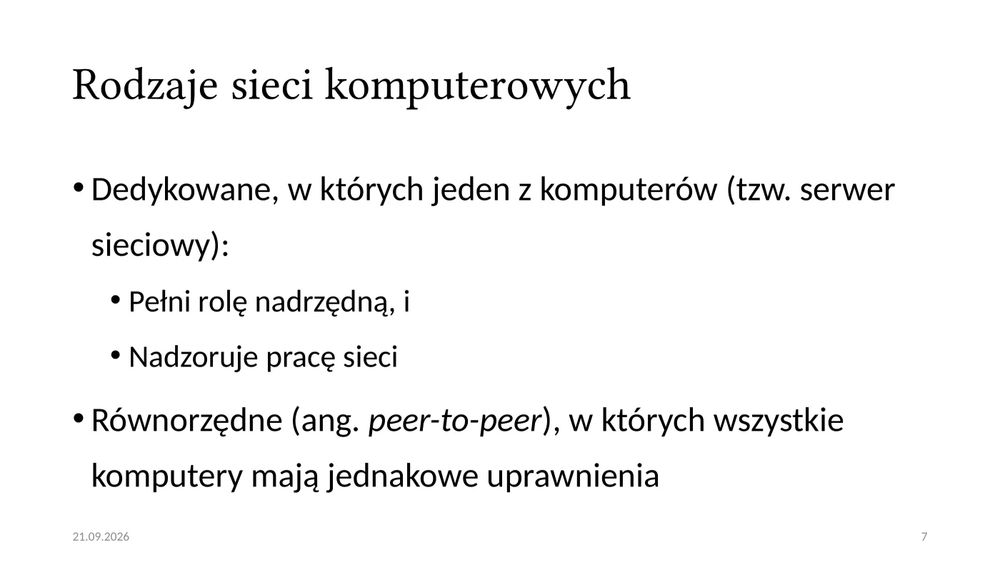

Dedykowane, w których jeden z komputerów (tzw. serwer sieciowy):  
Pełni rolę nadrzędną, i  
Nadzoruje pracę sieci  
Równorzędne (ang.  
peer  
-to-  
peer  
), w których wszystkie komputery mają jednakowe uprawnienia  
20.12.2020  
7

### 8. Topologie sieci

20.12.2020  
8

### 9. Topologie sieci

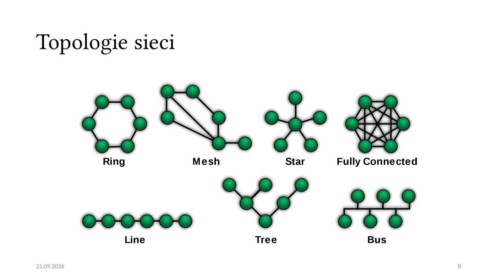

20.12.2020  
9

### 10. Topologia punkt-punkt

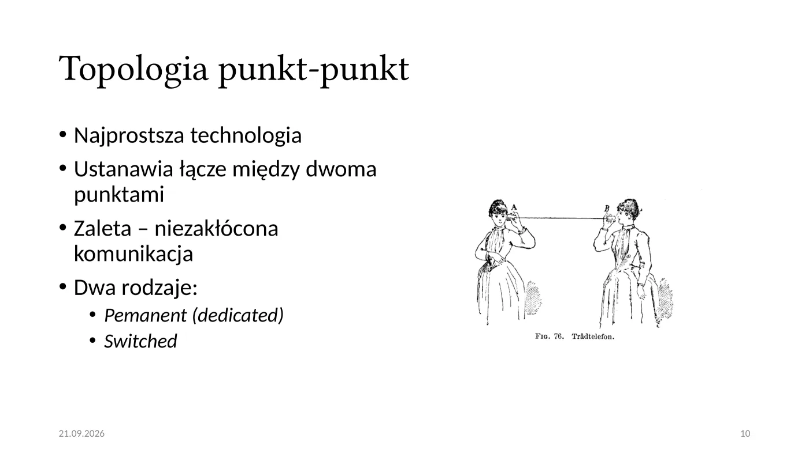

Najprostsza technologia  
Ustanawia łącze między dwoma punktami  
Zaleta – niezakłócona komunikacja  
Dwa rodzaje:  
Pemanent  
(  
dedicated  
)  
Switched  
20.12.2020  
10

### 11. Topologia punkt-punkt - permament (dedicated)

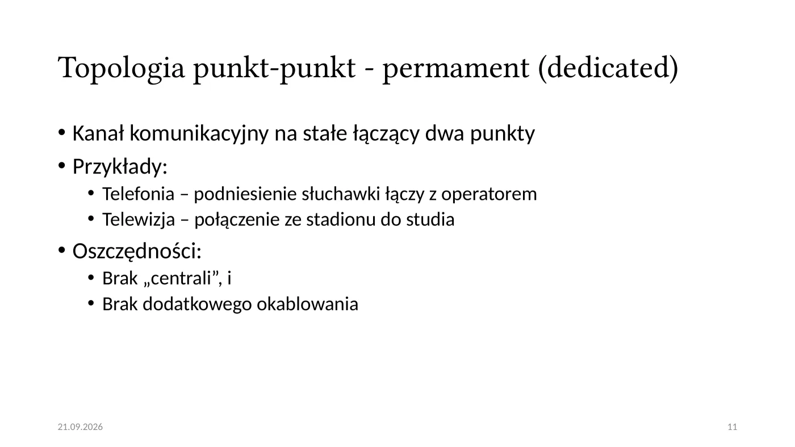

Kanał komunikacyjny na stałe łączący dwa punkty  
Przykłady:  
Telefonia – podniesienie słuchawki łączy z operatorem  
Telewizja – połączenie ze stadionu do studia  
Oszczędności:  
Brak „centrali”, i  
Brak dodatkowego okablowania  
20.12.2020  
11

### 12. Topologia punkt-punkt - switched

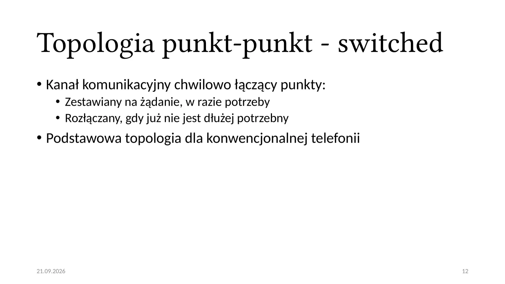

Kanał komunikacyjny chwilowo łączący punkty:  
Zestawiany na żądanie, w razie potrzeby  
Rozłączany, gdy już nie jest dłużej potrzebny  
Podstawowa topologia dla konwencjonalnej telefonii  
20.12.2020  
12

### 13. Topologia liniowa

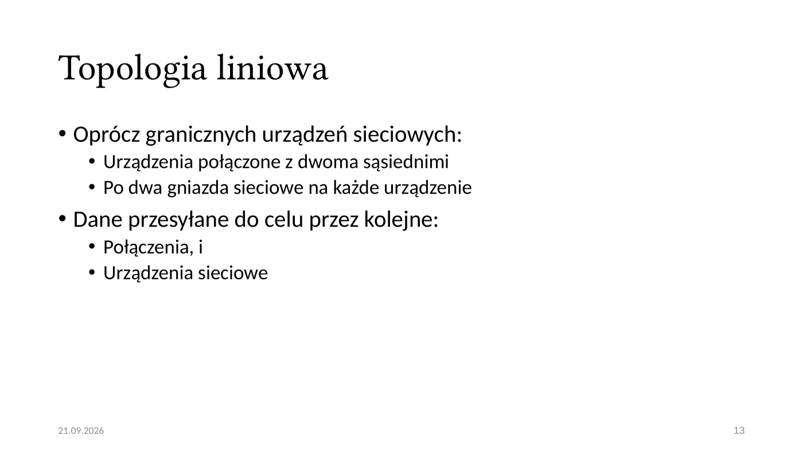

Oprócz granicznych urządzeń sieciowych:  
Urządzenia połączone z dwoma sąsiednimi  
Po dwa gniazda sieciowe na każde urządzenie  
Dane przesyłane do celu przez kolejne:  
Połączenia, i  
Urządzenia sieciowe  
20.12.2020  
13

### 14. Topologia liniowa

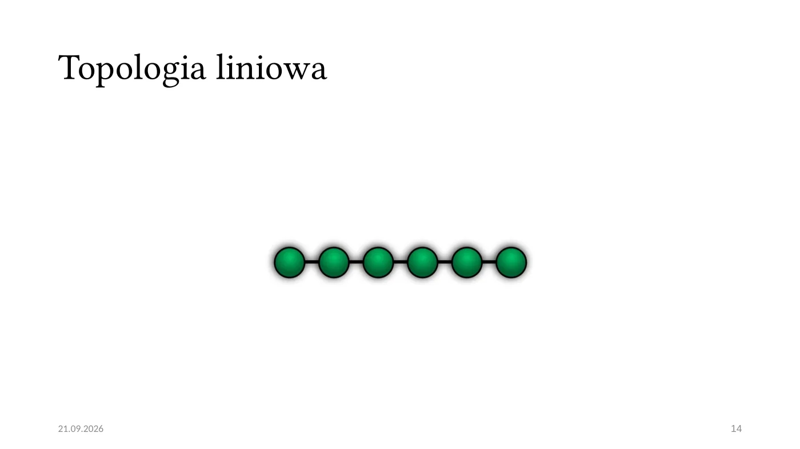

20.12.2020  
14

### 15. Topologia liniowa

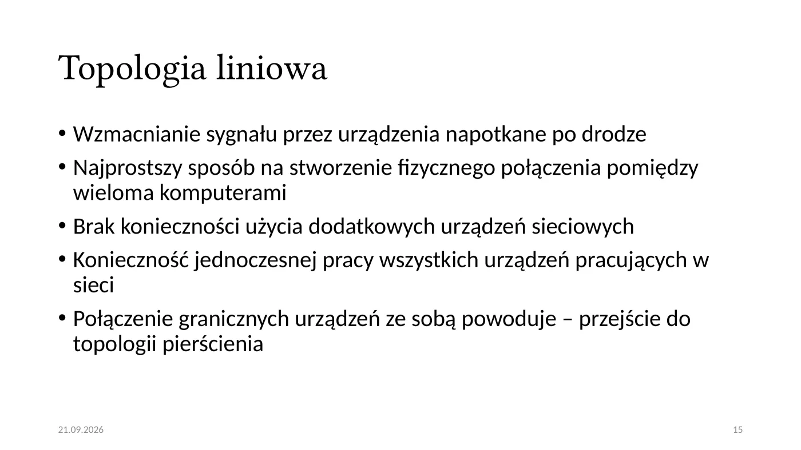

Wzmacnianie sygnału przez urządzenia napotkane po drodze  
Najprostszy sposób na stworzenie fizycznego połączenia pomiędzy wieloma komputerami  
Brak konieczności użycia dodatkowych urządzeń sieciowych  
Konieczność jednoczesnej pracy wszystkich urządzeń pracujących w sieci  
Połączenie granicznych urządzeń ze sobą powoduje – przejście do topologii pierścienia  
20.12.2020  
15

### 16. Topologia liniowa

Zalety:  
Małe zużycie przewodów  
Wady:  
Przerwanie pracy w razie awarii pojedynczego:  
Przewodu,  
Urządzenia sieciowego, lub  
Komputera  
Niska skalowalność  
20.12.2020  
16

### 17. Topologia magistrali

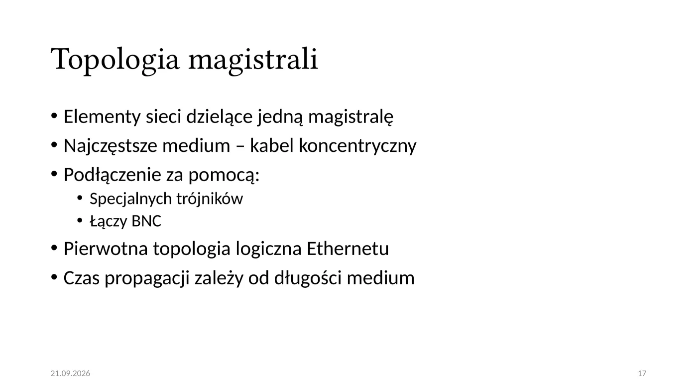

Elementy sieci dzielące jedną magistralę  
Najczęstsze medium – kabel koncentryczny  
Podłączenie za pomocą:  
Specjalnych trójników  
Łączy BNC  
Pierwotna topologia logiczna Ethernetu  
Czas propagacji zależy od długości medium  
20.12.2020  
17

### 18. Topologia magistrali

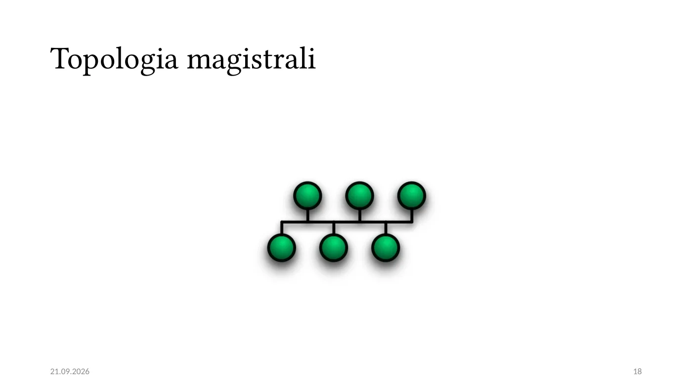

20.12.2020  
18

### 19. Topologia magistrali

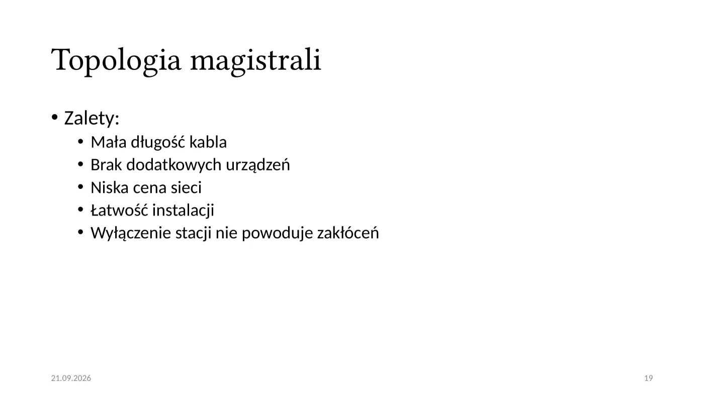

Zalety:  
Mała długość kabla  
Brak dodatkowych urządzeń  
Niska cena sieci  
Łatwość instalacji  
Wyłączenie stacji nie powoduje zakłóceń  
20.12.2020  
19

### 20. Topologia magistrali

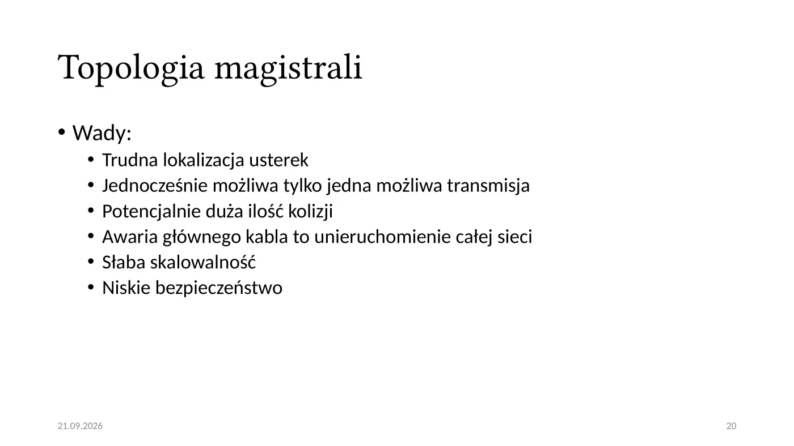

Wady:  
Trudna lokalizacja usterek  
Jednocześnie możliwa tylko jedna możliwa transmisja  
Potencjalnie duża ilość kolizji  
Awaria głównego kabla to unieruchomienie całej sieci  
Słaba skalowalność  
Niskie bezpieczeństwo  
20.12.2020  
20

### 21. Topologia magistrali

http://youtu.be/oVOeNcJJYos  
20.12.2020  
21

[Odtwórz materiał z tego slajdu](../web/media/09/slide-021-media1.mp4)

[Odtwórz materiał z tego slajdu](../web/media/09/slide-021-media1.mp4)

### 22. Pierścień

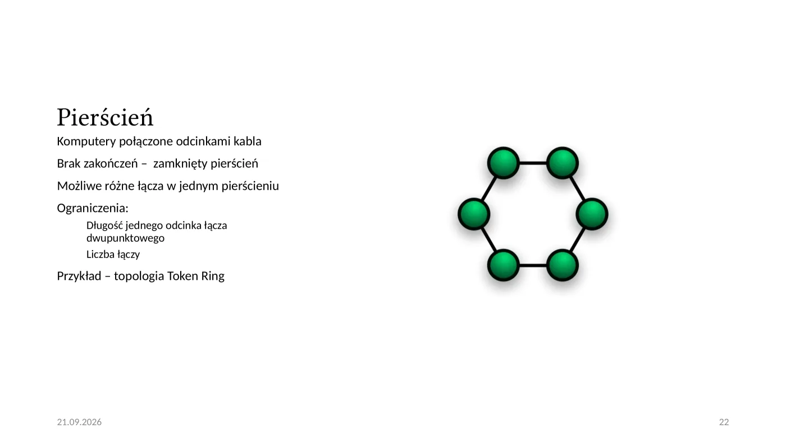

Komputery połączone odcinkami kabla  
Brak zakończeń –  zamknięty pierścień  
Możliwe różne łącza w jednym pierścieniu  
Ograniczenia:  
Długość jednego odcinka łącza dwupunktowego  
Liczba łączy  
Przykład – topologia Token Ring  
20.12.2020  
22

### 23. Pierścień

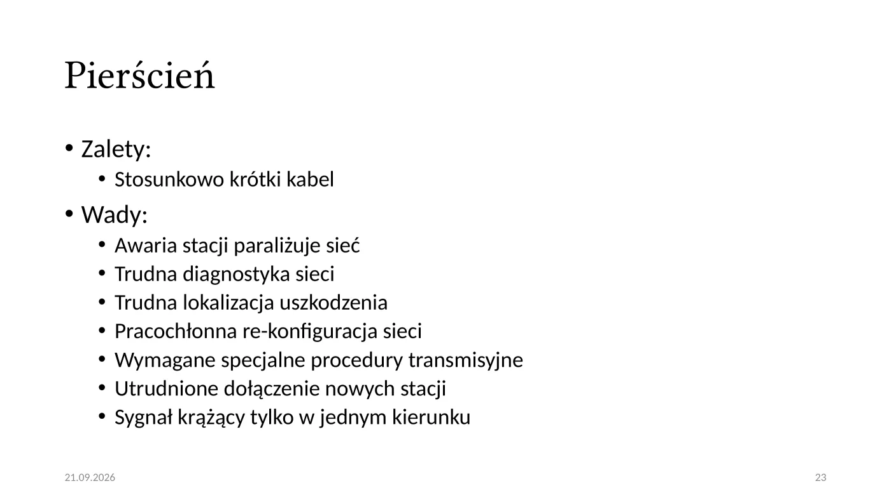

Zalety:  
Stosunkowo krótki kabel  
Wady:  
Awaria stacji paraliżuje sieć  
Trudna diagnostyka sieci  
Trudna lokalizacja uszkodzenia  
Pracochłonna re-konfiguracja sieci  
Wymagane specjalne procedury transmisyjne  
Utrudnione dołączenie nowych stacji  
Sygnał krążący tylko w jednym kierunku  
20.12.2020  
23

### 24. Topologia pierścienia

http://youtu.be/U6TX4Zbu2ao  
20.12.2020  
24

[Odtwórz materiał z tego slajdu](../web/media/09/slide-024-media2.mp4)

[Odtwórz materiał z tego slajdu](../web/media/09/slide-024-media2.mp4)

### 25. Topologia pierścienia podwójnego

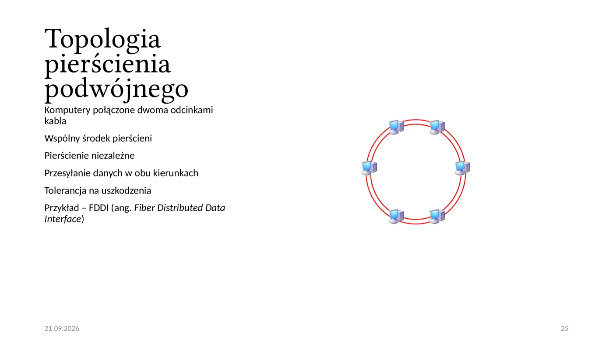

Komputery połączone dwoma odcinkami kabla  
Wspólny środek pierścieni  
Pierścienie niezależne  
Przesyłanie danych w obu kierunkach  
Tolerancja na uszkodzenia  
Przykład – FDDI (ang.  
Fiber  
Distributed Data Interface  
)  
20.12.2020  
25

### 26. Topologia pierścienia podwójnego

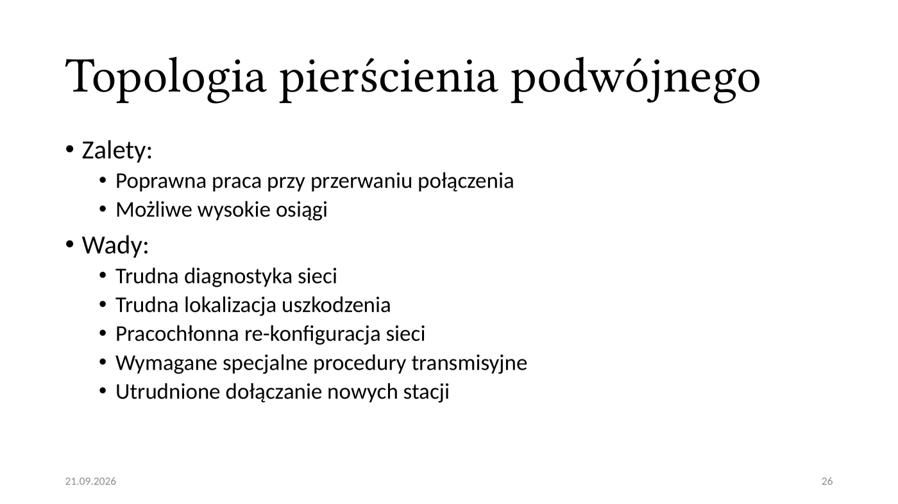

Zalety:  
Poprawna praca przy przerwaniu połączenia  
Możliwe wysokie osiągi  
Wady:  
Trudna diagnostyka sieci  
Trudna lokalizacja uszkodzenia  
Pracochłonna re-konfiguracja sieci  
Wymagane specjalne procedury transmisyjne  
Utrudnione dołączanie nowych stacji  
20.12.2020  
26

### 27. Topologia gwiazdy

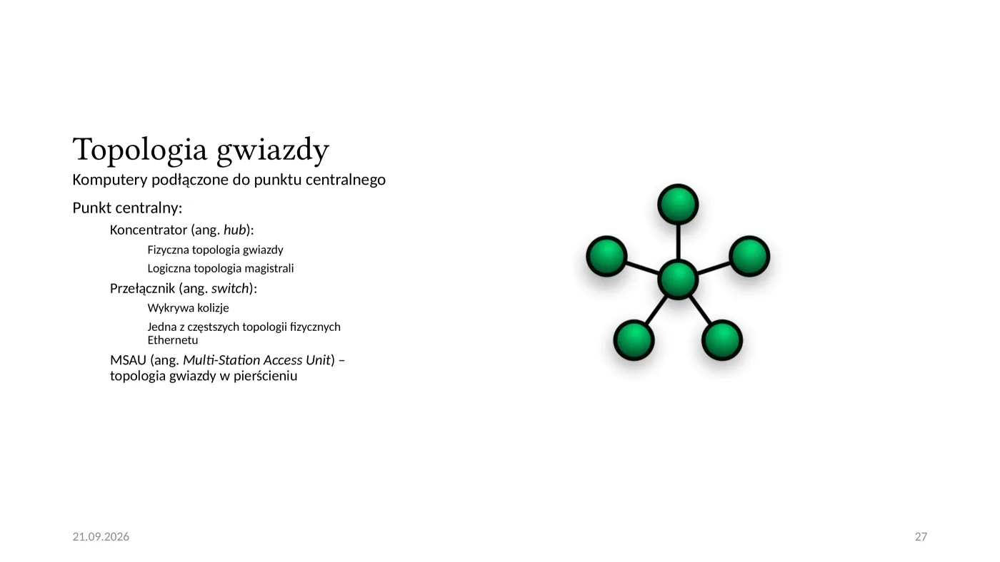

Komputery podłączone do punktu centralnego  
Punkt centralny:  
Koncentrator (ang.  
hub  
):  
Fizyczna topologia gwiazdy  
Logiczna topologia magistrali  
Przełącznik (ang.  
switch  
):  
Wykrywa kolizje  
Jedna z częstszych topologii fizycznych Ethernetu  
MSAU (ang.  
Multi-Station Access Unit  
) – topologia gwiazdy w pierścieniu  
20.12.2020  
27

### 28. Topologia gwiazdy

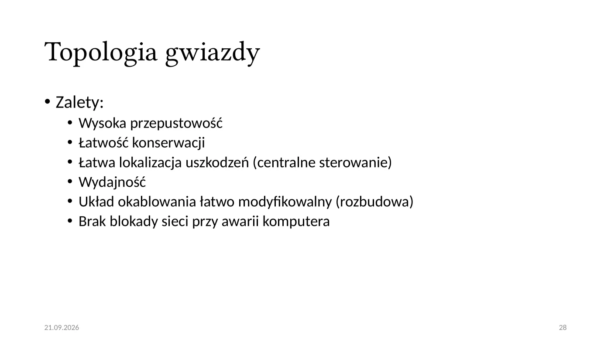

Zalety:  
Wysoka przepustowość  
Łatwość konserwacji  
Łatwa lokalizacja uszkodzeń (centralne sterowanie)  
Wydajność  
Układ okablowania łatwo modyfikowalny (rozbudowa)  
Brak blokady sieci przy awarii komputera  
20.12.2020  
28

### 29. Topologia gwiazdy

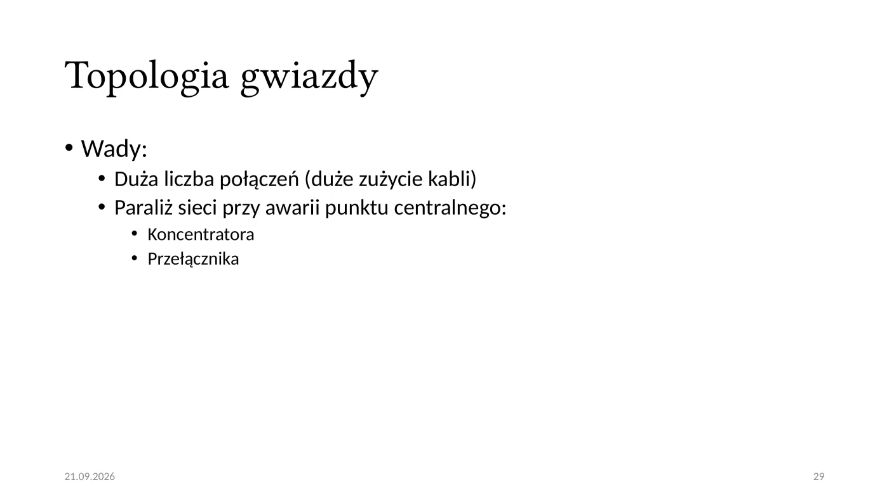

Wady:  
Duża liczba połączeń (duże zużycie kabli)  
Paraliż sieci przy awarii punktu centralnego:  
Koncentratora  
Przełącznika  
20.12.2020  
29

### 30. Topologia gwiazdy z koncentratorem

http://youtu.be/sIkCwoEJyCE  
20.12.2020  
30

[Odtwórz materiał z tego slajdu](../web/media/09/slide-030-media3.mp4)

[Odtwórz materiał z tego slajdu](../web/media/09/slide-030-media3.mp4)

### 31. Topologia gwiazdy z przełącznikiem

http://youtu.be/aNxxrawNu48  
20.12.2020  
31

[Odtwórz materiał z tego slajdu](../web/media/09/slide-031-media4.mp4)

[Odtwórz materiał z tego slajdu](../web/media/09/slide-031-media4.mp4)

### 32. Topologia gwiazdy z MSAU

http://youtu.be/HabhhF3tYyY  
20.12.2020  
32

[Odtwórz materiał z tego slajdu](../web/media/09/slide-032-media5.mp4)

[Odtwórz materiał z tego slajdu](../web/media/09/slide-032-media5.mp4)

### 33. Topologia hierarchiczna

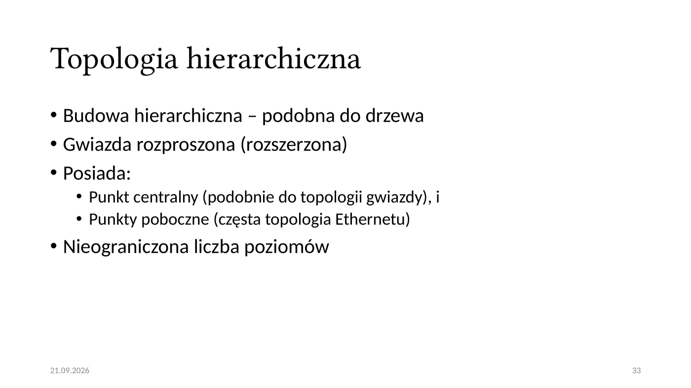

Budowa hierarchiczna – podobna do drzewa  
Gwiazda rozproszona (rozszerzona)  
Posiada:  
Punkt centralny (podobnie do topologii gwiazdy), i  
Punkty poboczne (częsta topologia Ethernetu)  
Nieograniczona liczba poziomów  
20.12.2020  
33

### 34. Topologia hierarchiczna

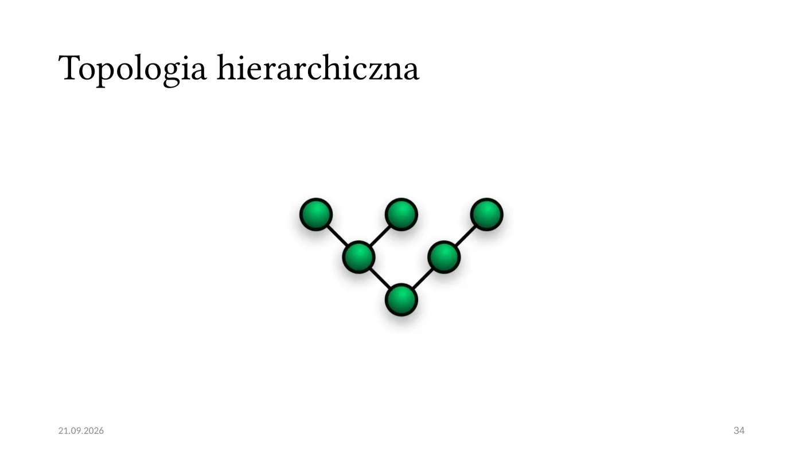

20.12.2020  
34

### 35. Topologia hierarchiczna

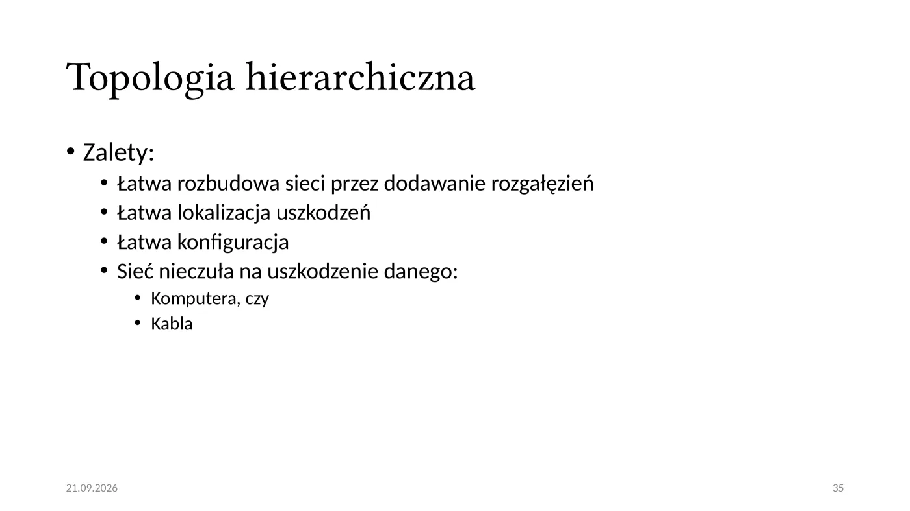

Zalety:  
Łatwa rozbudowa sieci przez dodawanie rozgałęzień  
Łatwa lokalizacja uszkodzeń  
Łatwa konfiguracja  
Sieć nieczuła na uszkodzenie danego:  
Komputera, czy  
Kabla  
20.12.2020  
35

### 36. Topologia hierarchiczna

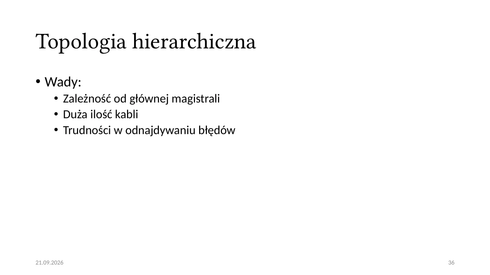

Wady:  
Zależność od głównej magistrali  
Duża ilość kabli  
Trudności w odnajdywaniu błędów  
20.12.2020  
36

### 37. Topologia hierarchiczna pierścień-gwiazda

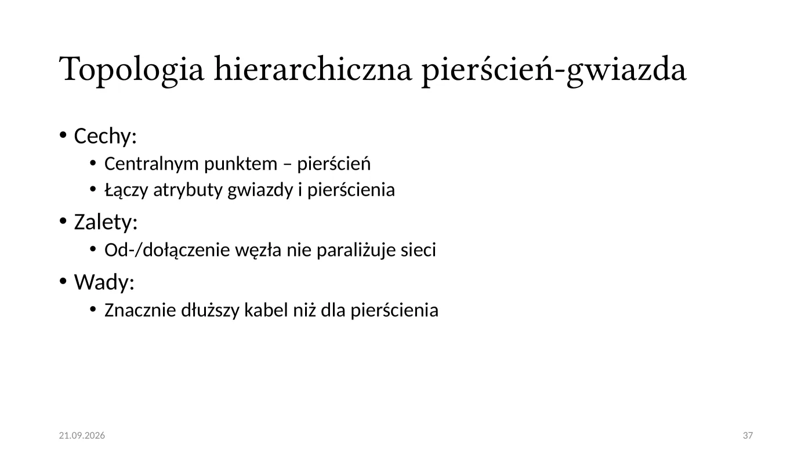

Cechy:  
Centralnym punktem – pierścień  
Łączy atrybuty gwiazdy i pierścienia  
Zalety:  
Od-/dołączenie węzła nie paraliżuje sieci  
Wady:  
Znacznie dłuższy kabel niż dla pierścienia  
20.12.2020  
37

### 38. Topologia hierarchiczna pierścień-gwiazda

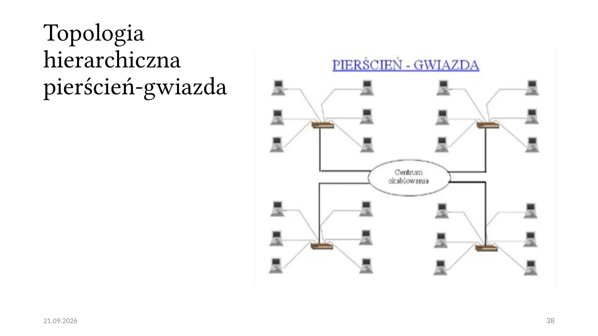

20.12.2020  
38

### 39. Topologia hierarchiczna gwiazda-magistrala

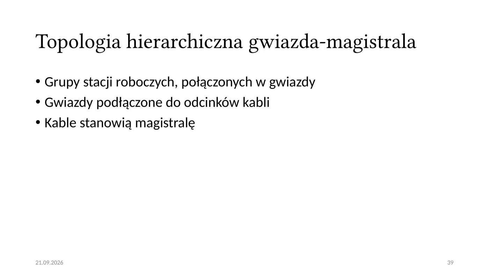

Grupy stacji roboczych, połączonych w gwiazdy  
Gwiazdy podłączone do odcinków kabli  
Kable stanowią magistralę  
20.12.2020  
39

### 40. Topologia hierarchiczna gwiazda-magistrala

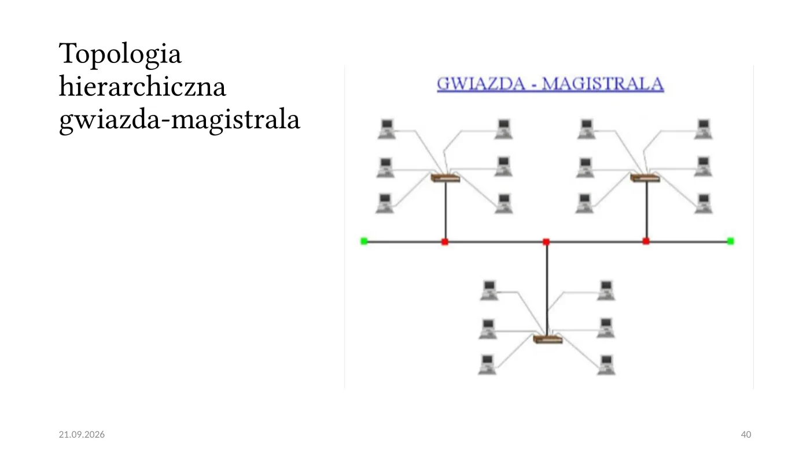

20.12.2020  
40

### 41. Topologia hierarchiczna magistrala-drzewo

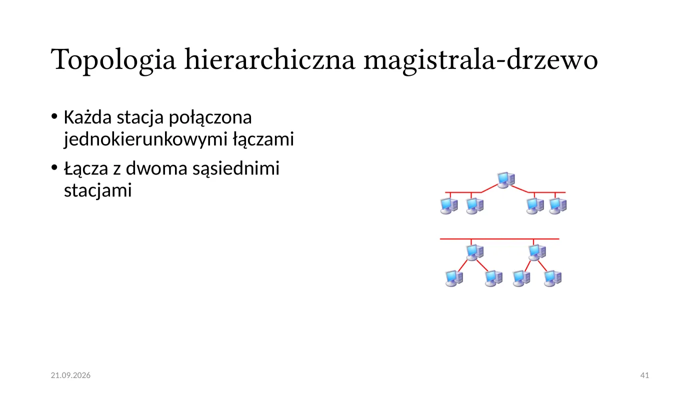

Każda stacja połączona jednokierunkowymi łączami  
Łącza z dwoma sąsiednimi stacjami  
20.12.2020  
41

### 42. Sieć oczkowa

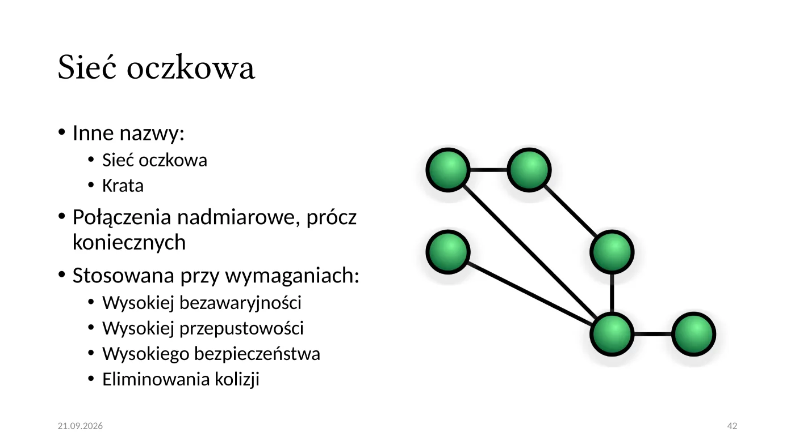

Inne nazwy:  
Sieć oczkowa  
Krata  
Połączenia nadmiarowe, prócz koniecznych  
Stosowana przy wymaganiach:  
Wysokiej bezawaryjności  
Wysokiej przepustowości  
Wysokiego bezpieczeństwa  
Eliminowania kolizji  
20.12.2020  
42

### 43. Sieć oczkowa

Zalety:  
Wysoka niezawodność  
Ograniczony wpływ uszkodzonego węzła  
W razie awarii dane płyną innym węzłem  
Ograniczona ilość kolizji  
Możliwa dla sieci bezprzewodowych  
20.12.2020  
43

### 44. Sieć oczkowa

Wady:  
Dużo kabli/portów  
Wysoki koszt  
Skomplikowana budowa  
20.12.2020  
44

### 45. Sieć oczkowa każdy-z-każdym (pełna siatka)

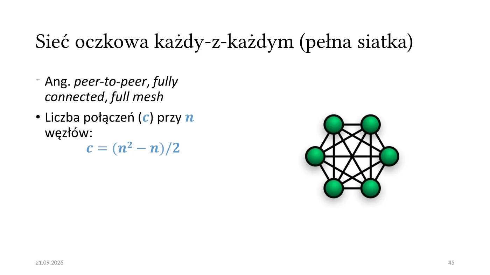

Ang.  
peer  
-to-  
peer  
,  
fully  
connected  
,  
full  
mesh  
Liczba połączeń (  
) przy  
węzłów:  
20.12.2020  
45

### 46. Podsumowanie wykładu

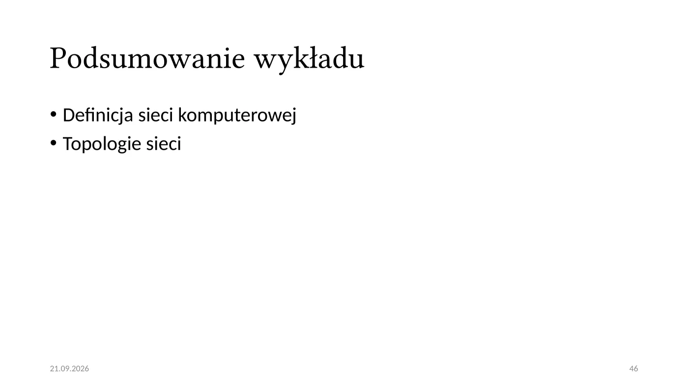

Definicja  
sieci komputerowej  
Topologie sieci  
20.12.2020  
46

