# Ruting - algorytmy

Oryginał: [10 Ruting - algorytmy.pptx](../10%20Ruting%20-%20algorytmy.pptx)

## Slajdy

### 1. Ruting – algorytmy

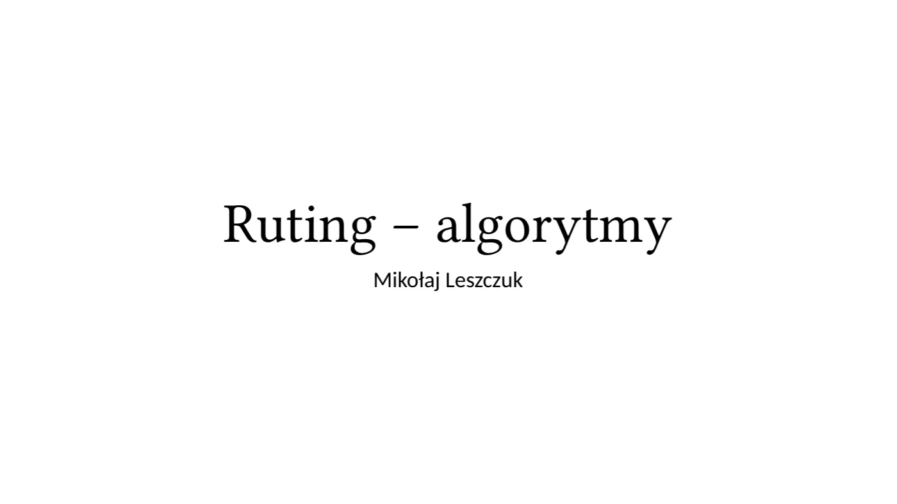

Mikołaj Leszczuk

### 2. Plan

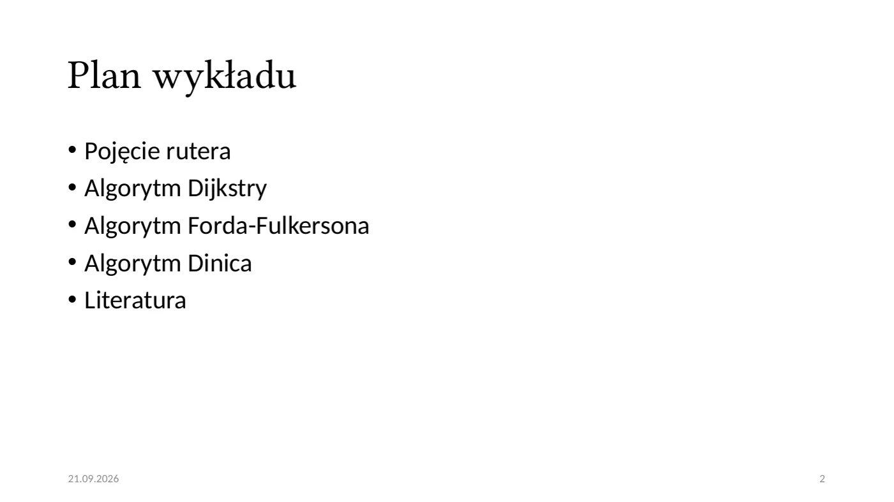

wykładu  
Pojęcie rutera  
Algorytm Dijkstry  
Algorytm Forda-  
Fulkersona  
Algorytm  
Dinica  
Literatura  
16.01.2021  
2

### 3. Pojęcie rutingu i rutera

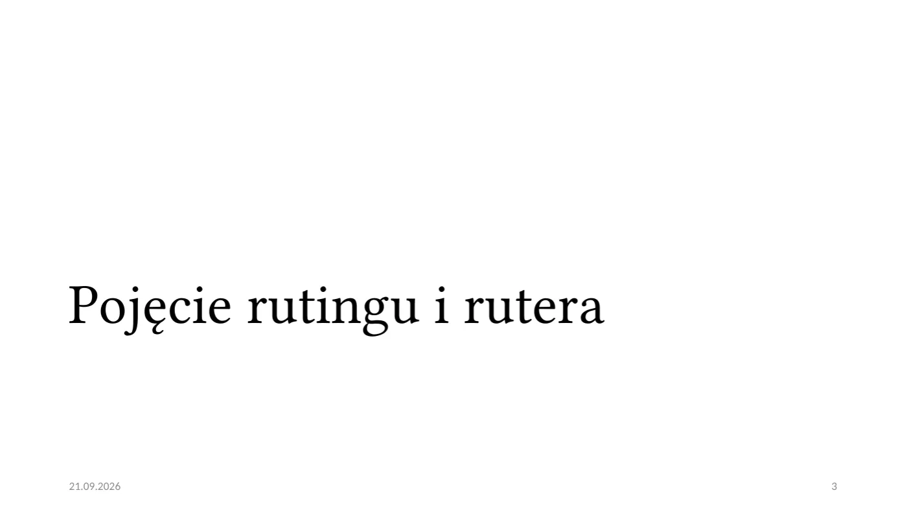

16.01.2021  
3

### 4. Warstwa sieciowa (1/2)‏

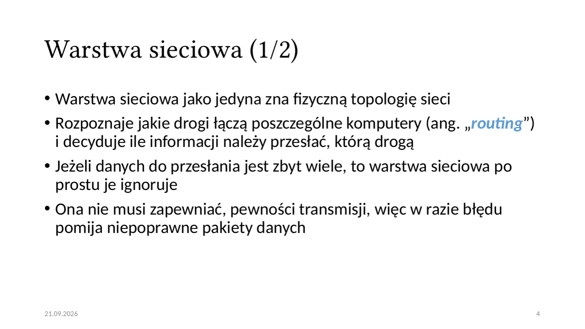

Warstwa sieciowa jako jedyna zna fizyczną topologię sieci  
Rozpoznaje jakie drogi łączą poszczególne komputery (ang. „  
routing  
”) i decyduje ile informacji należy przesłać, którą drogą  
Jeżeli danych do przesłania jest zbyt wiele, to warstwa sieciowa po prostu je ignoruje  
Ona nie musi zapewniać, pewności transmisji, więc w razie błędu pomija niepoprawne pakiety danych  
16.01.2021  
4

### 5. Warstwa sieciowa (2/2)‏

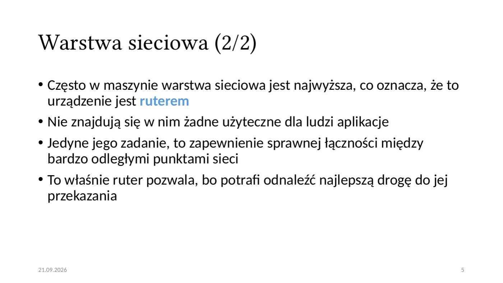

Często w maszynie warstwa sieciowa jest najwyższa, co oznacza, że to urządzenie jest  
ruterem  
Nie znajdują się w nim żadne użyteczne dla ludzi aplikacje  
Jedyne jego zadanie, to zapewnienie sprawnej łączności między bardzo odległymi punktami sieci  
To właśnie ruter pozwala, bo potrafi odnaleźć najlepszą drogę do jej przekazania  
16.01.2021  
5

### 6. Ruter (1/4)‏

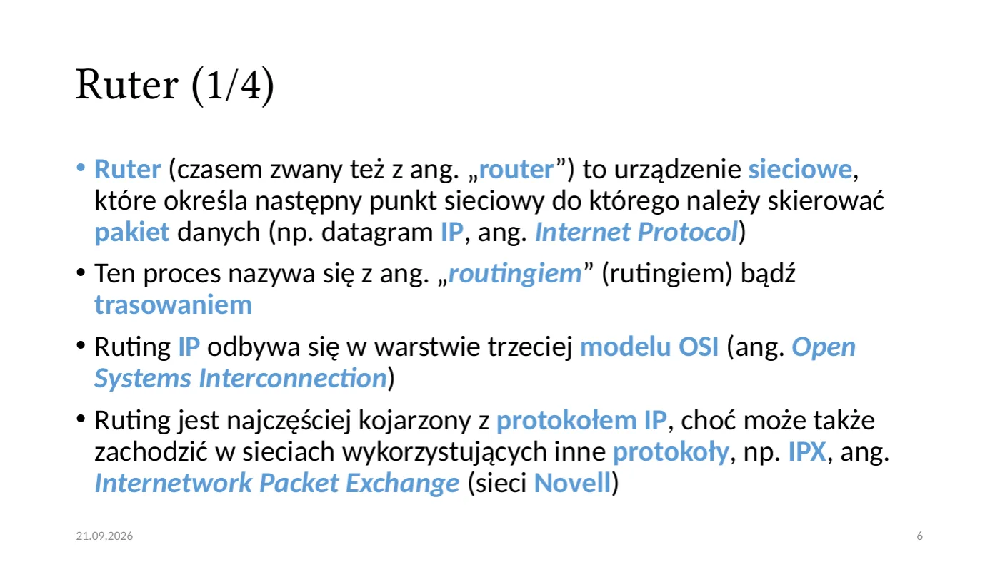

Ruter  
(czasem zwany też z ang. „  
router  
”) to urządzenie  
sieciowe  
, które określa następny punkt sieciowy do którego należy skierować  
pakiet  
danych (np. datagram  
IP  
, ang.  
Internet Protocol  
)  
Ten proces nazywa się z ang. „  
routingiem  
” (rutingiem) bądź  
trasowaniem  
Ruting  
IP  
odbywa się w warstwie trzeciej  
modelu OSI  
(ang.  
Open Systems Interconnection  
)  
Ruting jest najczęściej kojarzony z  
protokołem IP  
, choć może także zachodzić w sieciach wykorzystujących inne  
protokoły  
, np.  
IPX  
, ang.  
Internetwork Packet Exchange  
(sieci  
Novell  
)‏  
16.01.2021  
6

### 7. Ruter (2/4)‏

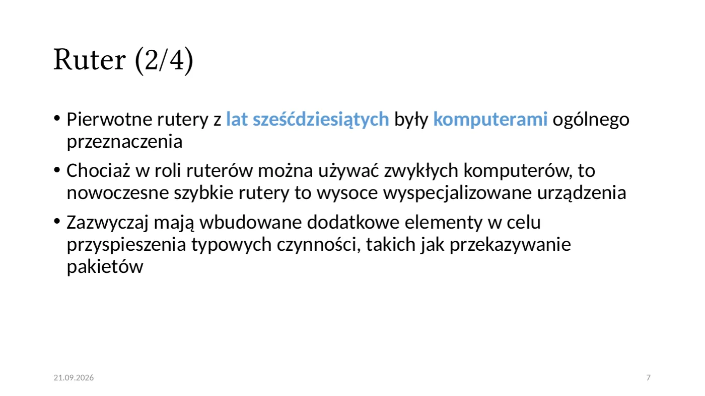

Pierwotne rutery z  
lat sześćdziesiątych  
były  
komputerami  
ogólnego przeznaczenia  
Chociaż w roli ruterów można używać zwykłych komputerów, to nowoczesne szybkie rutery to wysoce wyspecjalizowane urządzenia  
Zazwyczaj mają wbudowane dodatkowe elementy w celu przyspieszenia typowych czynności, takich jak przekazywanie pakietów  
16.01.2021  
7

### 8. Ruter (3/4)‏

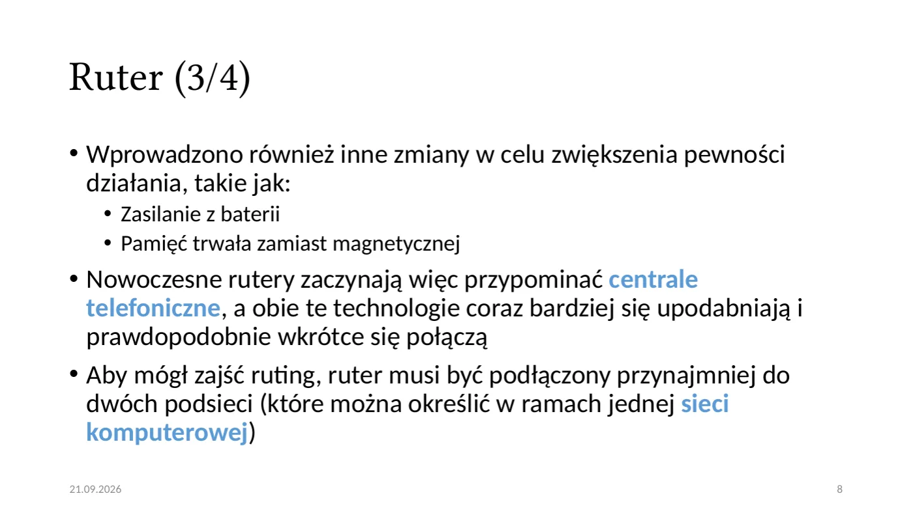

Wprowadzono również inne zmiany w celu zwiększenia pewności działania, takie jak:  
Zasilanie z baterii  
Pamięć trwała zamiast magnetycznej  
Nowoczesne rutery zaczynają więc przypominać  
centrale telefoniczne  
, a obie te technologie coraz bardziej się upodabniają i prawdopodobnie wkrótce się połączą  
Aby mógł zajść ruting, ruter musi być podłączony przynajmniej do dwóch podsieci (które można określić w ramach jednej  
sieci komputerowej  
)  
16.01.2021  
8

### 9. Ruter (4/4)‏

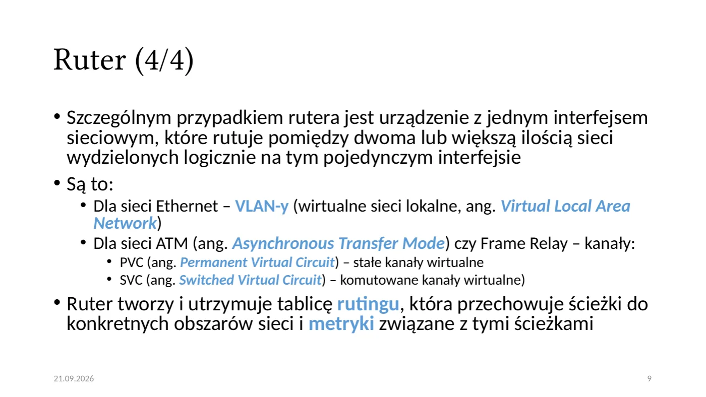

Szczególnym przypadkiem rutera jest urządzenie z jednym interfejsem sieciowym, które rutuje pomiędzy dwoma lub większą ilością sieci wydzielonych logicznie na tym pojedynczym interfejsie  
Są to:  
Dla sieci Ethernet –  
VLAN-y  
(wirtualne sieci lokalne, ang.  
Virtual Local Area Network  
)  
Dla sieci ATM (ang.  
Asynchronous  
Transfer  
Mode  
) czy Frame  
Relay  
– kanały:  
PVC (ang.  
Permanent Virtual  
Circuit  
) – stałe kanały wirtualne  
SVC (ang.  
Switched  
Virtual  
Circuit  
) – komutowane kanały wirtualne)  
Ruter tworzy i utrzymuje tablicę  
rutingu  
, która przechowuje ścieżki do konkretnych obszarów sieci i  
metryki  
związane z tymi ścieżkami  
16.01.2021  
9

### 10. Możliwości rutera (1/2)‏

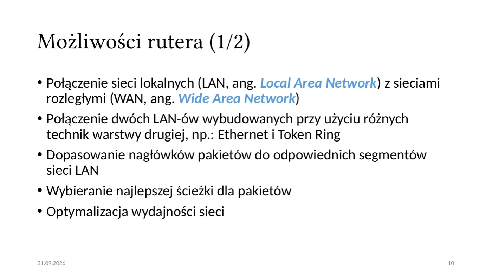

Połączenie sieci lokalnych (LAN, ang.  
Local Area Network  
) z sieciami rozległymi (WAN, ang.  
Wide Area Network  
)‏  
Połączenie dwóch LAN-ów wybudowanych przy użyciu różnych technik warstwy drugiej, np.: Ethernet i  
Token  
Ring  
Dopasowanie nagłówków pakietów do odpowiednich segmentów sieci LAN  
Wybieranie najlepszej ścieżki dla pakietów  
Optymalizacja wydajności sieci  
16.01.2021  
10

### 11. Możliwości rutera (2/2)‏

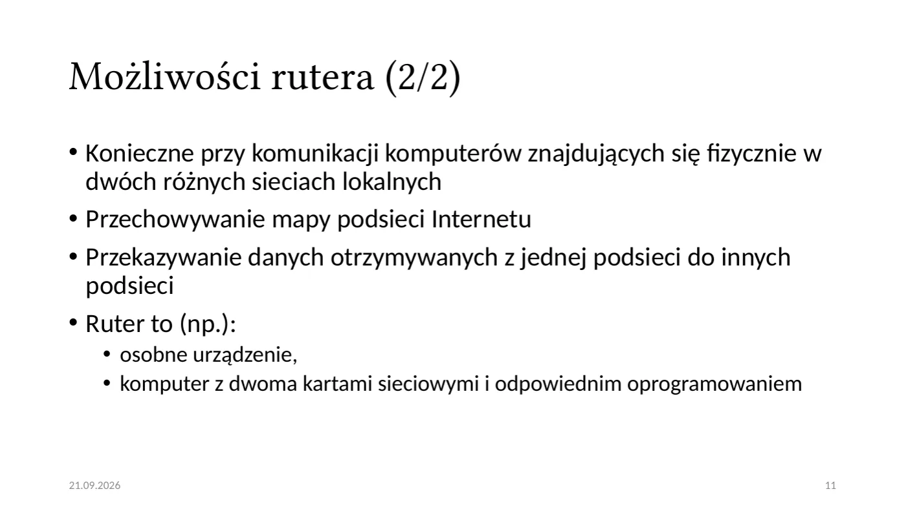

Konieczne przy komunikacji komputerów znajdujących się fizycznie w dwóch różnych sieciach lokalnych  
Przechowywanie mapy podsieci Internetu  
Przekazywanie danych otrzymywanych z jednej podsieci do innych podsieci  
Ruter to (np.):  
osobne urządzenie,  
komputer z dwoma kartami sieciowymi i odpowiednim oprogramowaniem  
16.01.2021  
11

### 12. Ruting (1/5)‏

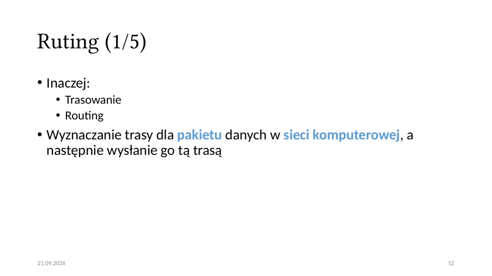

Inaczej:  
Trasowanie  
Routing  
Wyznaczanie trasy dla  
pakietu  
danych w  
sieci komputerowej  
, a następnie wysłanie go tą trasą  
16.01.2021  
12

### 13. Ruting (2/5)‏

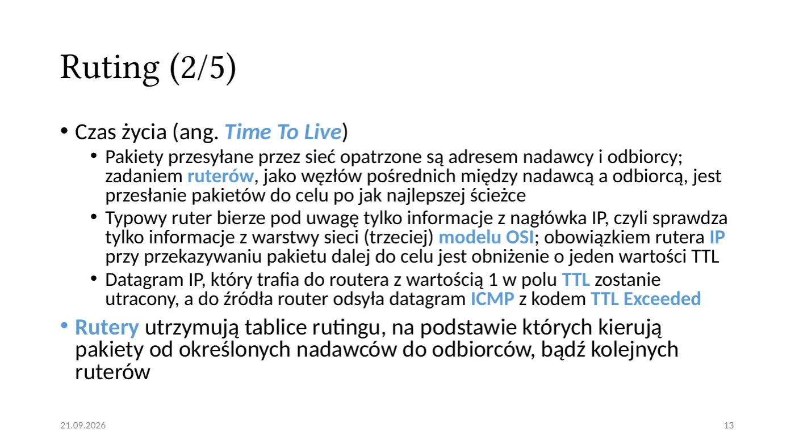

Czas życia (ang.  
Time To Live  
)  
Pakiety przesyłane przez sieć opatrzone są adresem nadawcy i odbiorcy; zadaniem  
ruterów  
, jako węzłów pośrednich między nadawcą a odbiorcą, jest przesłanie pakietów do celu po jak najlepszej ścieżce  
Typowy ruter bierze pod uwagę tylko informacje z nagłówka IP, czyli sprawdza tylko informacje z warstwy sieci (trzeciej)  
modelu OSI  
; obowiązkiem rutera  
IP  
przy przekazywaniu pakietu dalej do celu jest obniżenie o jeden wartości TTL  
Datagram IP, który trafia do routera z wartością 1 w polu  
TTL  
zostanie utracony, a do źródła router odsyła datagram  
ICMP  
z kodem  
TTL  
Exceeded  
Rutery  
utrzymują tablice rutingu, na podstawie których kierują pakiety od określonych nadawców do odbiorców, bądź kolejnych ruterów  
16.01.2021  
13

### 14. Ruting (3/5)

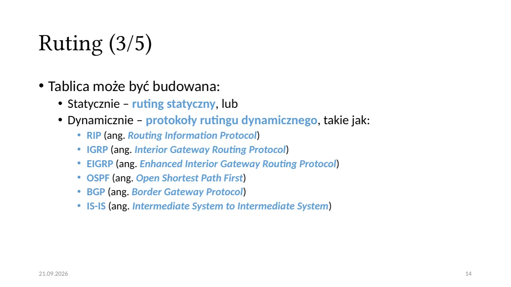

Tablica może być budowana:  
Statycznie –  
ruting statyczny  
, lub  
Dynamicznie –  
protokoły rutingu dynamicznego  
, takie jak:  
RIP  
(ang.  
Routing Information Protocol  
)  
IGRP  
(ang.  
Interior Gateway Routing Protocol  
)  
EIGRP  
(ang.  
Enhanced  
Interior Gateway Routing Protocol  
)  
OSPF  
(ang.  
Open Shortest Path First  
)  
BGP  
(ang.  
Border Gateway Protocol  
)  
IS-IS  
(ang.  
Intermediate System to Intermediate System  
)  
16.01.2021  
14

### 15. Ruting (4/5)

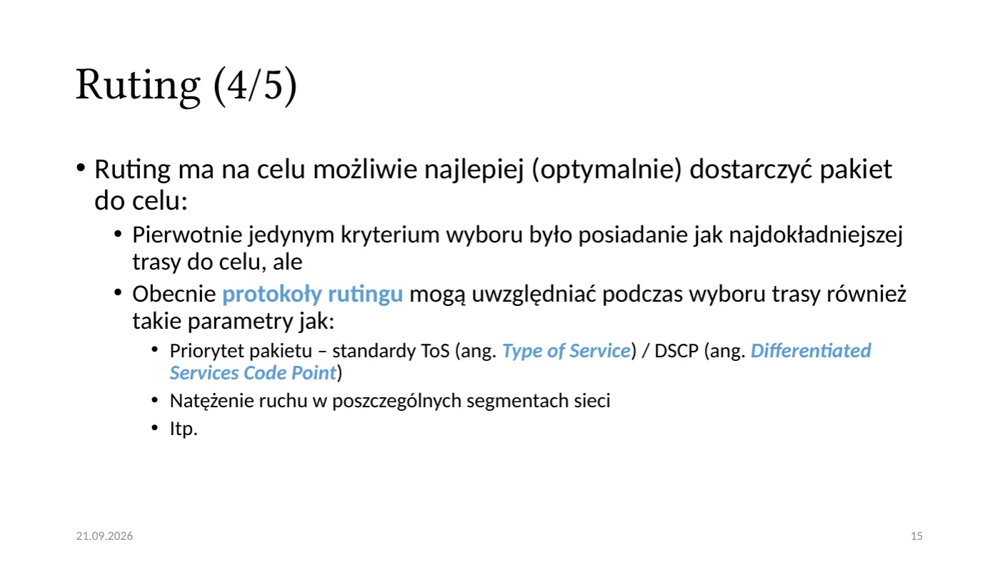

Ruting ma na celu możliwie najlepiej (optymalnie) dostarczyć pakiet do celu:  
Pierwotnie jedynym kryterium wyboru było posiadanie jak najdokładniejszej trasy do celu, ale  
Obecnie  
protokoły rutingu  
mogą uwzględniać podczas wyboru trasy również takie parametry jak:  
Priorytet pakietu – standardy  
ToS  
(ang.  
Type of Service  
) / DSCP (ang.  
Differentiated Services Code Point  
)  
Natężenie ruchu w poszczególnych segmentach sieci  
Itp.  
16.01.2021  
15

### 16. Ruting (5/5)

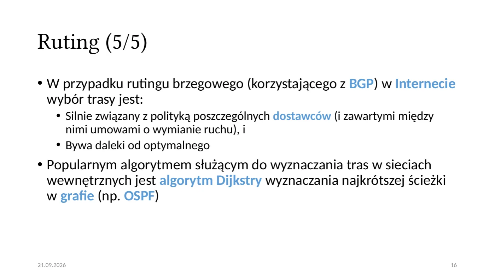

W przypadku rutingu brzegowego (korzystającego z  
BGP  
) w  
Internecie  
wybór trasy jest:  
Silnie związany z polityką poszczególnych  
dostawców  
(i zawartymi między nimi umowami o wymianie ruchu), i  
Bywa daleki od optymalnego  
Popularnym algorytmem służącym do wyznaczania tras w sieciach wewnętrznych jest  
algorytm Dijkstry  
wyznaczania najkrótszej ścieżki w  
grafie  
(np.  
OSPF  
)‏  
16.01.2021  
16

### 17. Algorytm

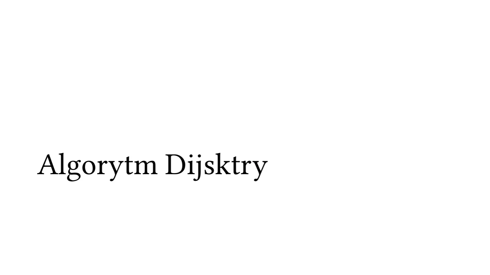

Dijsktry

### 18. Edsger

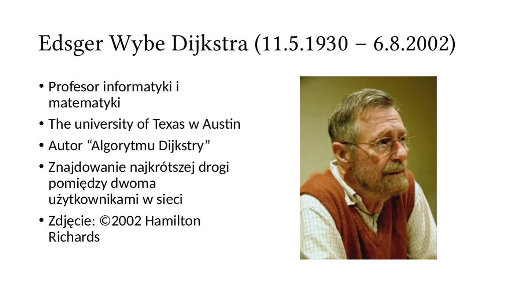

Wybe  
Dijkstra  
(11.5.1930 – 6.8.2002)  
Profesor informatyki i matematyki  
The  
university  
of Texas w Austin  
Autor “Algorytmu Dijkstry”  
Znajdowanie najkrótszej drogi pomiędzy dwoma użytkownikami w sieci  
Zdjęcie: ©2002 Hamilton Richards

### 19. Algorytm Dijkstry – wprowadzenie (1/2)‏

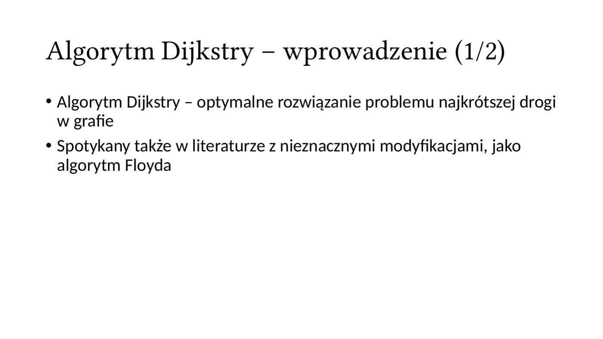

Algorytm Dijkstry – optymalne rozwiązanie problemu najkrótszej drogi w grafie  
Spotykany także w literaturze z nieznacznymi modyfikacjami, jako algorytm Floyda

### 20. Algorytm Dijkstry – wprowadzenie (2/2)‏

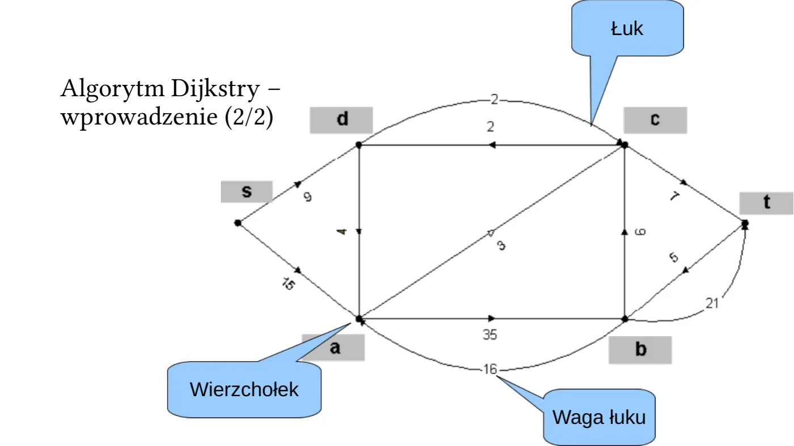

Łuk  
Waga łuku  
Wierzchołek

### 21. Algorytm Dijkstry – przykładowa sieć

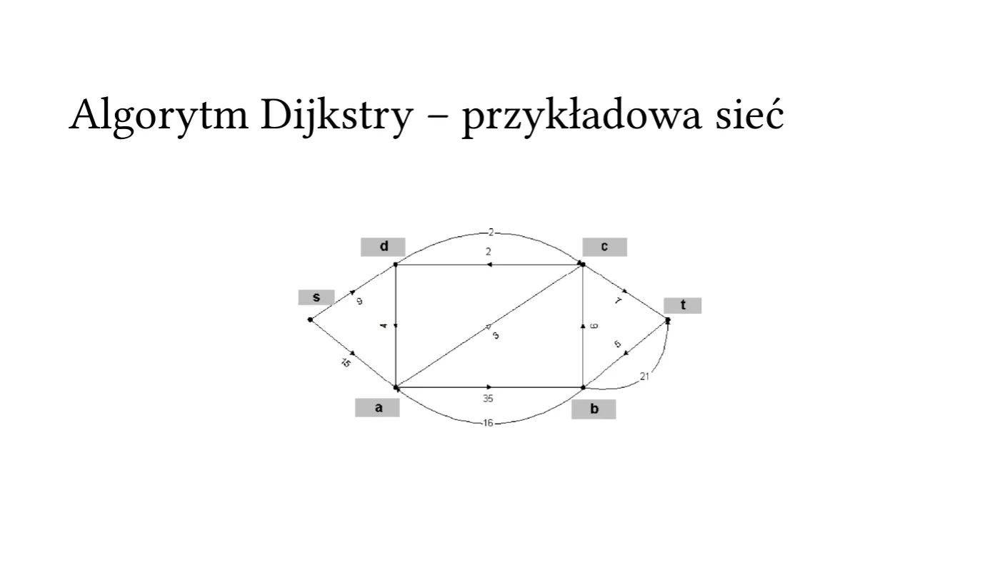

### 22. Algorytm Dijkstry – założenia (1/2)

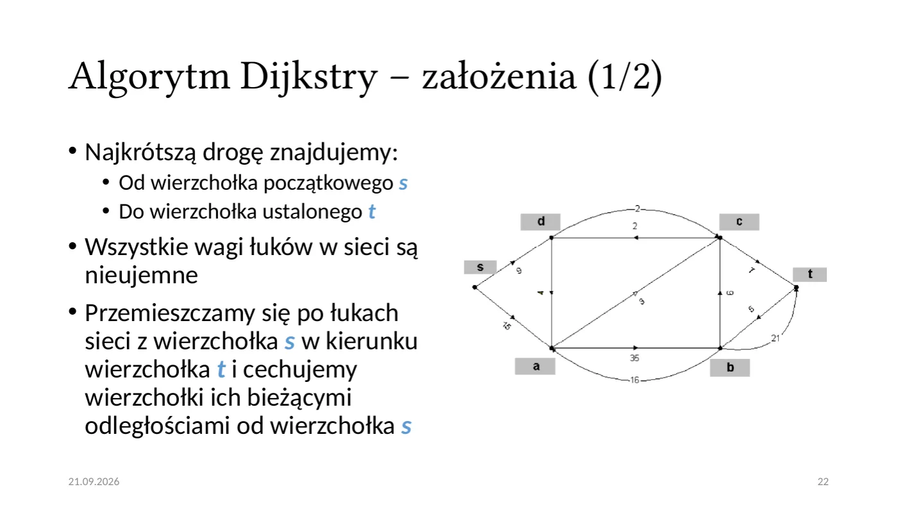

Najkrótszą drogę znajdujemy:  
Od wierzchołka początkowego  
s  
Do wierzchołka ustalonego  
t  
Wszystkie wagi łuków w sieci są nieujemne  
Przemieszczamy się po łukach sieci z wierzchołka  
s  
w kierunku wierzchołka  
t  
i cechujemy wierzchołki ich bieżącymi odległościami od wierzchołka  
s  
16.01.2021  
22

### 23. Algorytm Dijkstry – założenia (2/2)

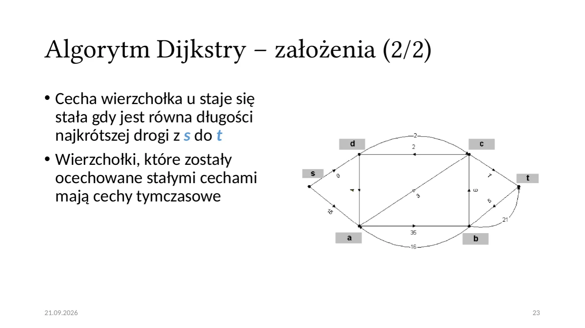

Cecha wierzchołka u staje się stała gdy jest równa długości najkrótszej drogi z  
s  
do  
t  
Wierzchołki, które zostały ocechowane stałymi cechami mają cechy tymczasowe  
16.01.2021  
23

### 24. Algorytm Dijkstry – działanie (1/5)‏

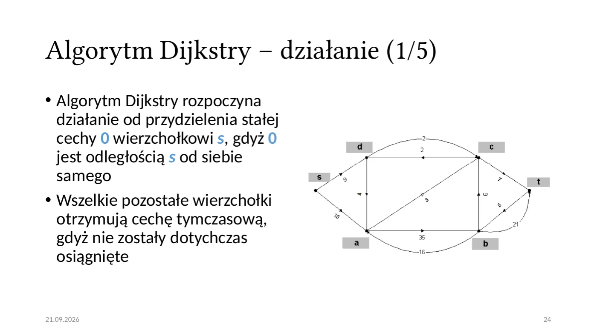

Algorytm Dijkstry rozpoczyna działanie od przydzielenia stałej cechy  
0  
wierzchołkowi  
s  
, gdyż  
0  
jest odległością  
s  
od siebie samego  
Wszelkie pozostałe wierzchołki otrzymują cechę tymczasową, gdyż nie zostały dotychczas osiągnięte  
16.01.2021  
24

### 25. Algorytm Dijkstry – działanie (2/5)‏

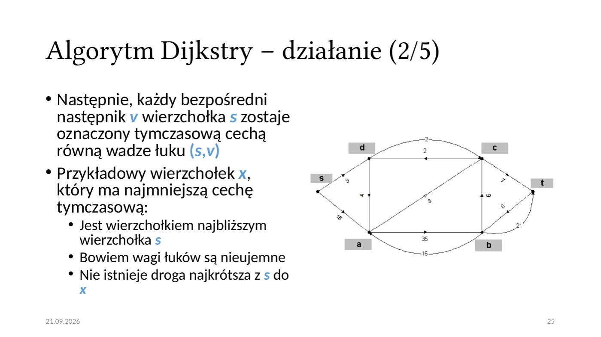

Następnie, każdy bezpośredni następnik  
v  
wierzchołka  
s  
zostaje oznaczony tymczasową cechą równą wadze łuku  
(  
s  
,  
v  
)  
Przykładowy wierzchołek  
x  
, który ma najmniejszą cechę tymczasową:  
Jest wierzchołkiem najbliższym wierzchołka  
s  
Bowiem wagi łuków są nieujemne  
Nie istnieje droga najkrótsza z  
s  
do  
x  
16.01.2021  
25

### 26. Algorytm Dijkstry – działanie (3/5)‏

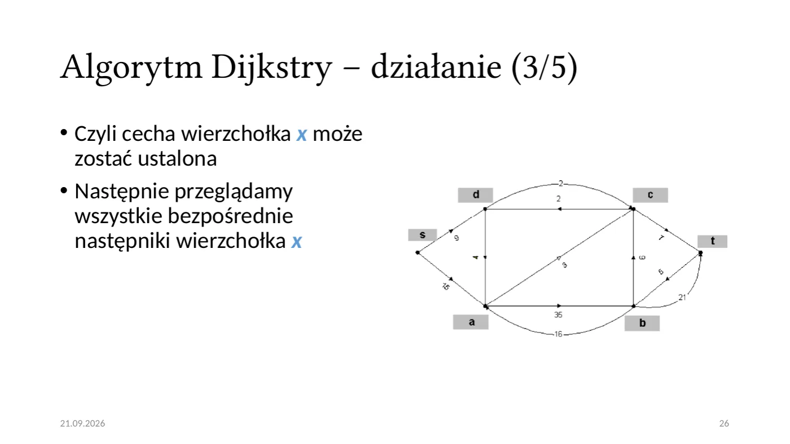

Czyli cecha wierzchołka  
x  
może zostać ustalona  
Następnie przeglądamy wszystkie bezpośrednie następniki wierzchołka  
x  
16.01.2021  
26

### 27. Algorytm Dijkstry – działanie (4/5)‏

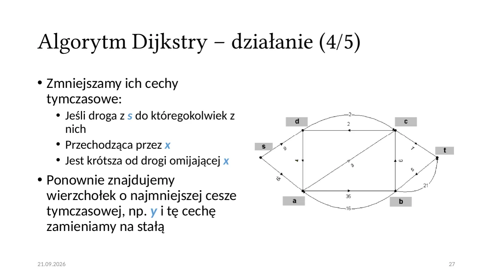

Zmniejszamy ich cechy tymczasowe:  
Jeśli droga z  
s  
do któregokolwiek z nich  
Przechodząca przez  
x  
Jest krótsza od drogi omijającej  
x  
Ponownie znajdujemy wierzchołek o najmniejszej cesze tymczasowej, np.  
y  
i tę cechę zamieniamy na stałą  
16.01.2021  
27

### 28. Algorytm Dijkstry – działanie (5/5)‏

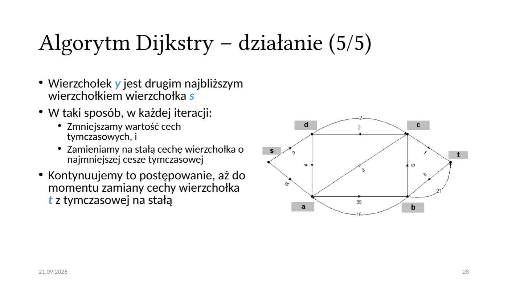

Wierzchołek  
y  
jest drugim najbliższym wierzchołkiem wierzchołka  
s  
W taki sposób, w każdej iteracji:  
Zmniejszamy wartość cech tymczasowych, i  
Zamieniamy na stałą cechę wierzchołka o najmniejszej cesze tymczasowej  
Kontynuujemy to postępowanie, aż do momentu zamiany cechy wierzchołka  
t  
z tymczasowej na stałą  
16.01.2021  
28

### 29. Algorytm Dijkstry – zasada działania – najkrótsza droga z

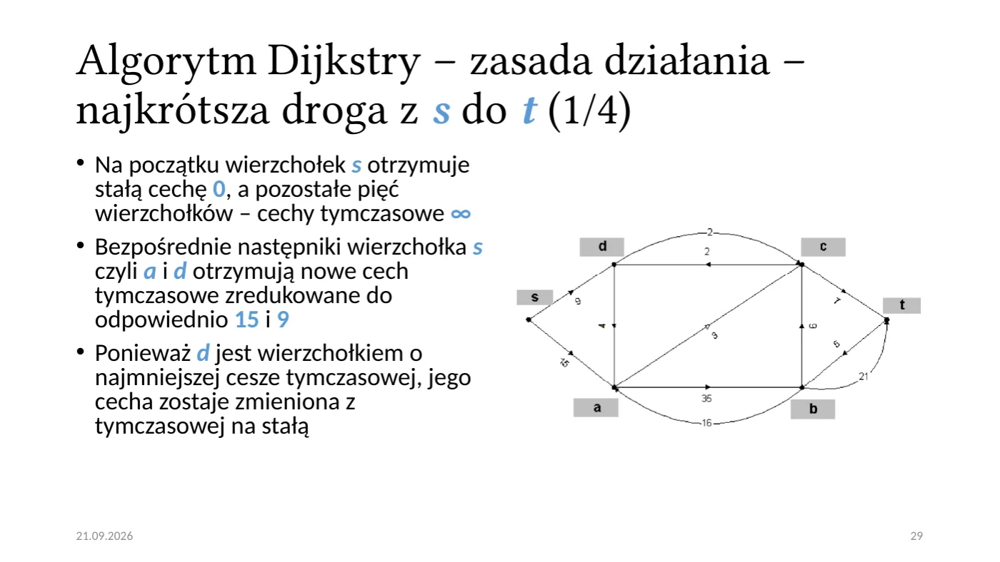

s  
do  
t  
(1/4)‏  
Na początku wierzchołek  
s  
otrzymuje stałą cechę  
0  
, a pozostałe pięć wierzchołków – cechy tymczasowe  
∞  
Bezpośrednie następniki wierzchołka  
s  
czyli  
a  
i  
d  
otrzymują nowe cech tymczasowe zredukowane do odpowiednio  
15  
i  
9  
Ponieważ  
d  
jest wierzchołkiem o najmniejszej cesze tymczasowej, jego cecha zostaje zmieniona z tymczasowej na stałą  
16.01.2021  
29

### 30. Algorytm Dijkstry – zasada działania – najkrótsza droga z

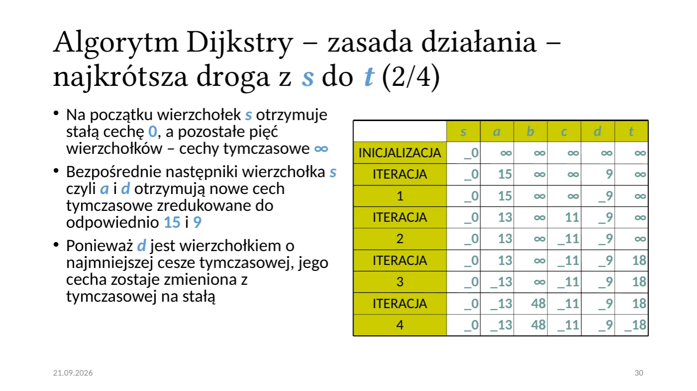

s  
do  
t  
(2/4)‏  
Na początku wierzchołek  
s  
otrzymuje stałą cechę  
0  
, a pozostałe pięć wierzchołków – cechy tymczasowe  
∞  
Bezpośrednie następniki wierzchołka  
s  
czyli  
a  
i  
d  
otrzymują nowe cech tymczasowe zredukowane do odpowiednio  
15  
i  
9  
Ponieważ  
d  
jest wierzchołkiem o najmniejszej cesze tymczasowej, jego cecha zostaje zmieniona z tymczasowej na stałą  
16.01.2021  
30  
_18  
_9  
_11  
48  
_13  
_0  
4  
18  
_9  
_11  
48  
_13  
_0  
ITERACJA  
18  
_9  
_11  
∞  
_13  
_0  
3  
18  
_9  
_11  
∞  
13  
_0  
ITERACJA  
∞  
_9  
_11  
∞  
13  
_0  
2  
∞  
_9  
11  
∞  
13  
_0  
ITERACJA  
∞  
_9  
∞  
∞  
15  
_0  
1  
∞  
9  
∞  
∞  
15  
_0  
ITERACJA  
∞  
∞  
∞  
∞  
∞  
_0  
INICJALIZACJA  
t  
d  
c  
b  
a  
s

### 31. Algorytm Dijkstry – zasada działania – najkrótsza droga z

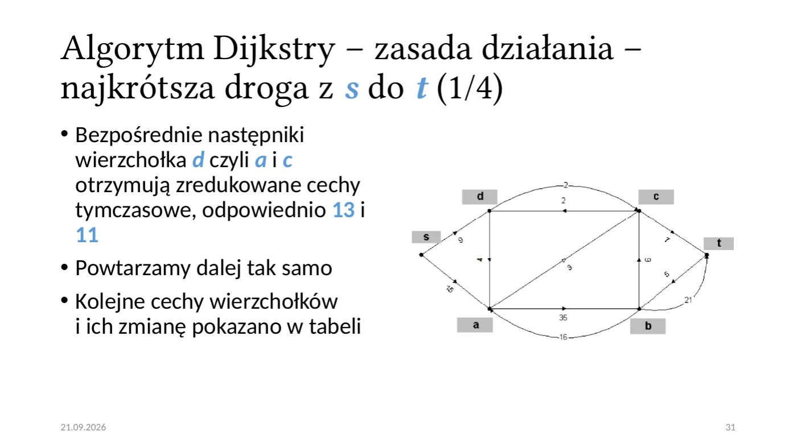

s  
do  
t  
(1/4)‏  
Bezpośrednie następniki wierzchołka  
d  
czyli  
a  
i  
c  
otrzymują zredukowane cechy tymczasowe, odpowiednio  
13  
i  
11  
Powtarzamy dalej tak samo  
Kolejne cechy wierzchołków  
i ich zmianę pokazano w tabeli  
16.01.2021  
31

### 32. Algorytm Dijkstry – zasada działania – najkrótsza droga z

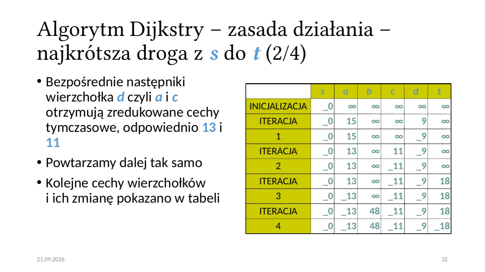

s  
do  
t  
(2/4)‏  
Bezpośrednie następniki wierzchołka  
d  
czyli  
a  
i  
c  
otrzymują zredukowane cechy tymczasowe, odpowiednio  
13  
i  
11  
Powtarzamy dalej tak samo  
Kolejne cechy wierzchołków  
i ich zmianę pokazano w tabeli  
16.01.2021  
32  
_18  
_9  
_11  
48  
_13  
_0  
4  
18  
_9  
_11  
48  
_13  
_0  
ITERACJA  
18  
_9  
_11  
∞  
_13  
_0  
3  
18  
_9  
_11  
∞  
13  
_0  
ITERACJA  
∞  
_9  
_11  
∞  
13  
_0  
2  
∞  
_9  
11  
∞  
13  
_0  
ITERACJA  
∞  
_9  
∞  
∞  
15  
_0  
1  
∞  
9  
∞  
∞  
15  
_0  
ITERACJA  
∞  
∞  
∞  
∞  
∞  
_0  
INICJALIZACJA  
t  
d  
c  
b  
a  
s

### 33. Algorytm Forda-

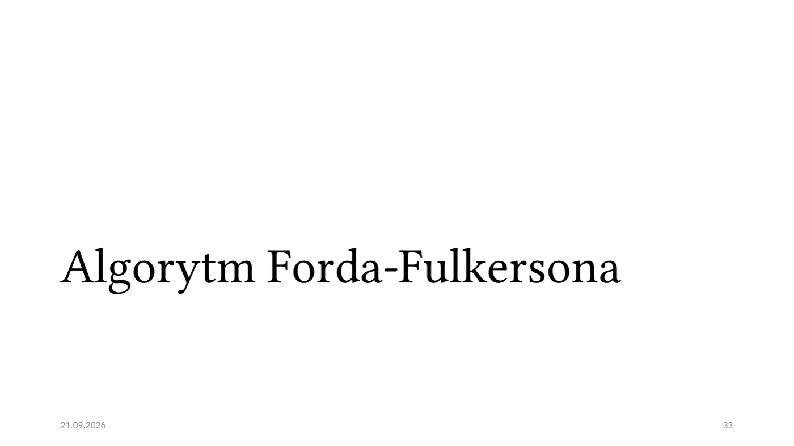

Fulkersona  
16.01.2021  
33

### 34. Algorytm Forda-

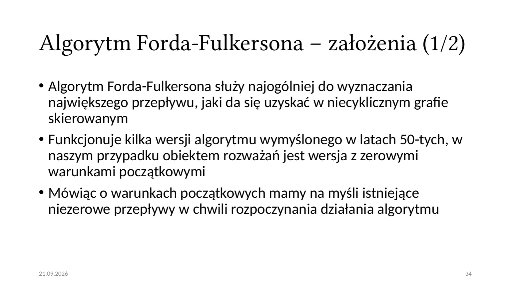

Fulkersona  
– założenia (1/2)‏  
Algorytm Forda-  
Fulkersona  
służy najogólniej do wyznaczania największego przepływu, jaki da się uzyskać w niecyklicznym grafie skierowanym  
Funkcjonuje kilka wersji algorytmu wymyślonego w latach 50-tych, w naszym przypadku obiektem rozważań jest wersja z zerowymi warunkami początkowymi  
Mówiąc o warunkach początkowych mamy na myśli istniejące niezerowe przepływy w chwili rozpoczynania działania algorytmu  
16.01.2021  
34

### 35. Algorytm Forda-

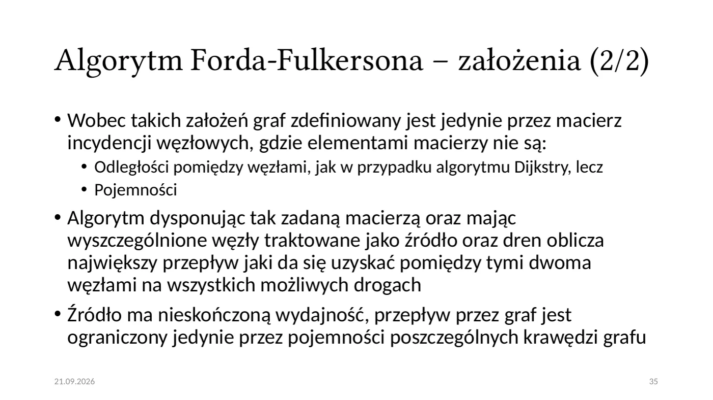

Fulkersona  
– założenia (2/2)‏  
Wobec takich założeń graf zdefiniowany jest jedynie przez macierz incydencji węzłowych, gdzie elementami macierzy nie są:  
Odległości pomiędzy węzłami, jak w przypadku algorytmu Dijkstry, lecz  
Pojemności  
Algorytm dysponując tak zadaną macierzą oraz mając wyszczególnione węzły traktowane jako źródło oraz dren oblicza największy przepływ jaki da się uzyskać pomiędzy tymi dwoma węzłami na wszystkich możliwych drogach  
Źródło ma nieskończoną wydajność, przepływ przez graf jest ograniczony jedynie przez pojemności poszczególnych krawędzi grafu  
16.01.2021  
35

### 36. Algorytm Forda-

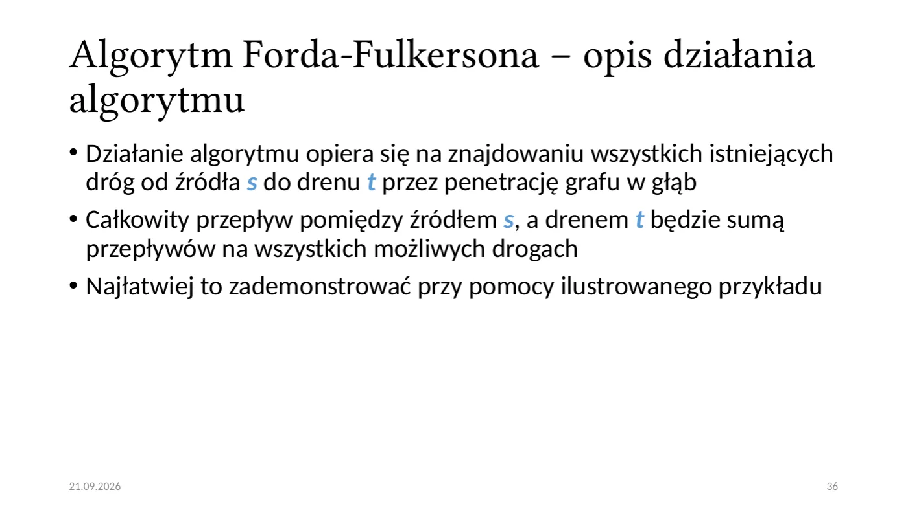

Fulkersona  
– opis działania algorytmu  
Działanie algorytmu opiera się na znajdowaniu wszystkich istniejących dróg od źródła  
s  
do drenu  
t  
przez penetrację grafu w głąb  
Całkowity przepływ pomiędzy źródłem  
s  
, a drenem  
t  
będzie sumą przepływów na wszystkich możliwych drogach  
Najłatwiej to zademonstrować przy pomocy ilustrowanego przykładu  
16.01.2021  
36

### 37. Algorytm Forda-

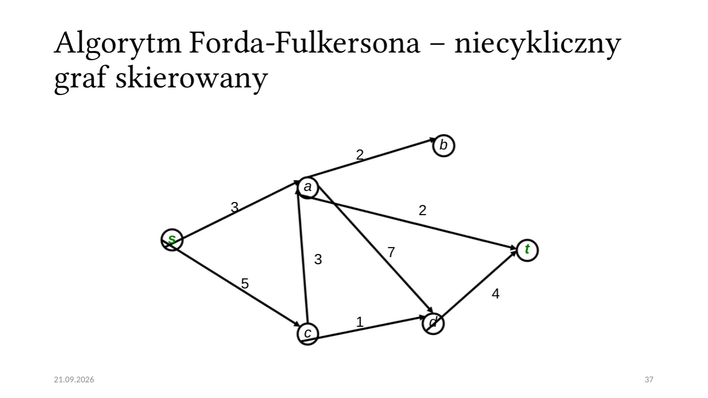

Fulkersona  
– niecykliczny graf skierowany  
16.01.2021  
37  
s  
a  
b  
c  
d  
t  
3  
2  
3  
5  
1  
4  
7  
2

### 38. Algorytm Forda-

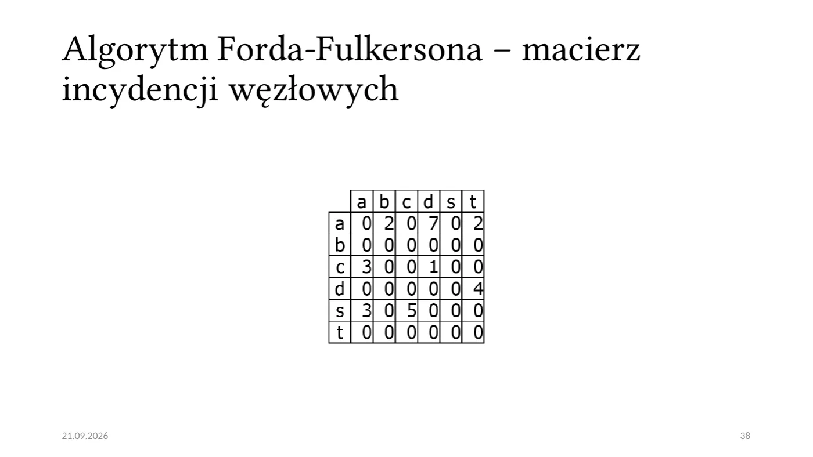

Fulkersona  
– macierz incydencji węzłowych  
16.01.2021  
38

### 39. Algorytm Forda-Fulkersona:

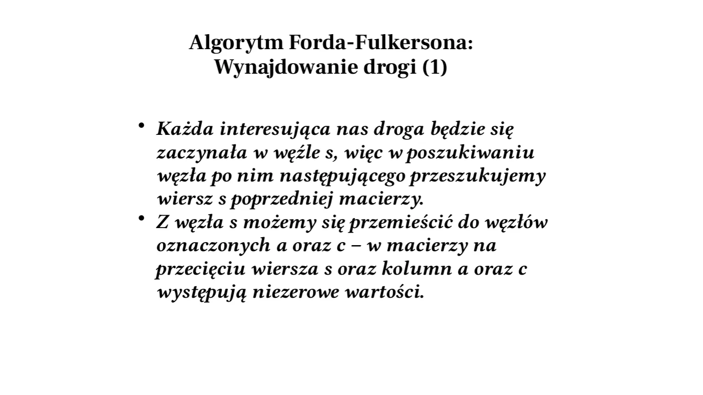

Wynajdowanie drogi (1)‏  
Każda interesująca nas droga będzie się zaczynała w węźle s, więc w poszukiwaniu węzła po nim następującego przeszukujemy wiersz s poprzedniej macierzy.  
Z węzła s możemy się przemieścić do węzłów oznaczonych a oraz c – w macierzy na przecięciu wiersza s oraz kolumn a oraz c występują niezerowe wartości.

### 40. Algorytm Forda-Fulkersona:

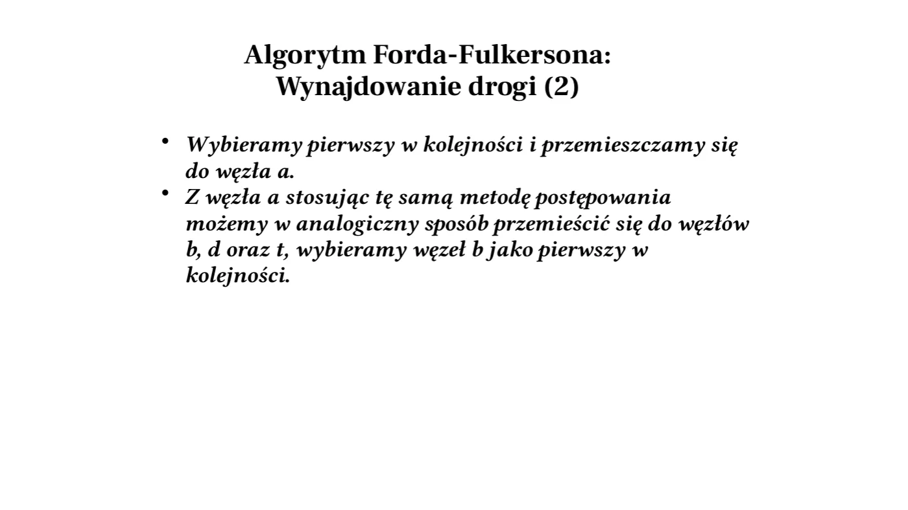

Wynajdowanie drogi (2)‏  
Wybieramy pierwszy w kolejności i przemieszczamy się do węzła a.  
Z węzła a stosując tę samą metodę postępowania możemy w analogiczny sposób przemieścić się do węzłów b, d oraz t, wybieramy węzeł b jako pierwszy w kolejności.

### 41. Algorytm Forda-Fulkersona:

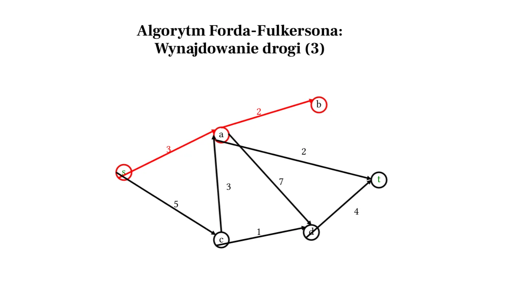

Wynajdowanie drogi (3)‏  
s  
a  
b  
c  
d  
t  
3  
2  
3  
5  
1  
4  
7  
2

### 42. Algorytm Forda-Fulkersona:

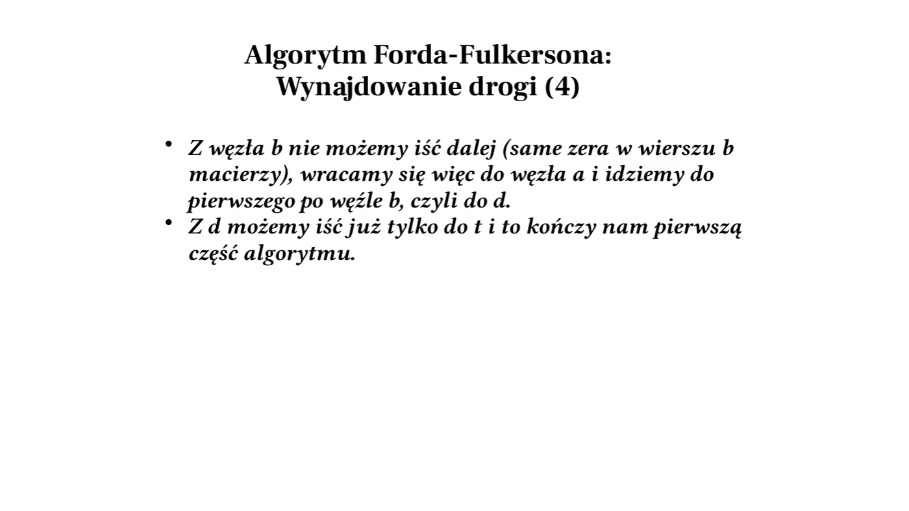

Wynajdowanie drogi (4)‏  
Z węzła b nie możemy iść dalej (same zera w wierszu b macierzy), wracamy się więc do węzła a i idziemy do pierwszego po węźle b, czyli do d.  
Z d możemy iść już tylko do t i to kończy nam pierwszą część algorytmu.

### 43. Algorytm Forda-Fulkersona:

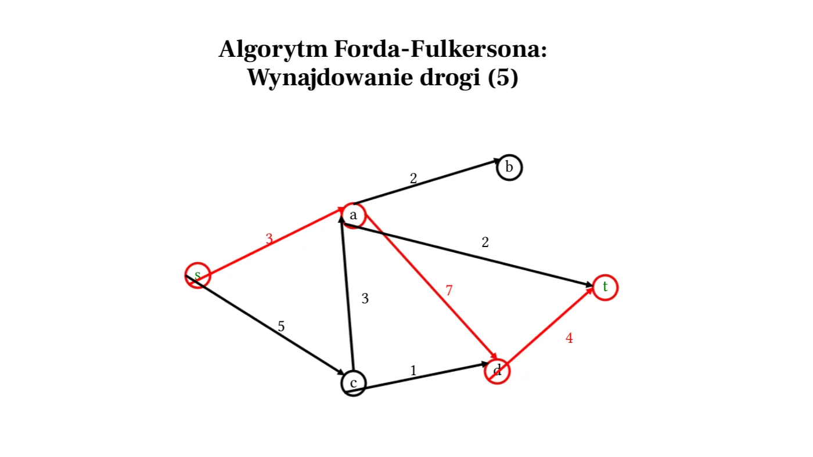

Wynajdowanie drogi (5)‏  
s  
a  
b  
c  
d  
t  
3  
2  
3  
5  
1  
4  
7  
2

### 44. Algorytm Forda-Fulkersona:

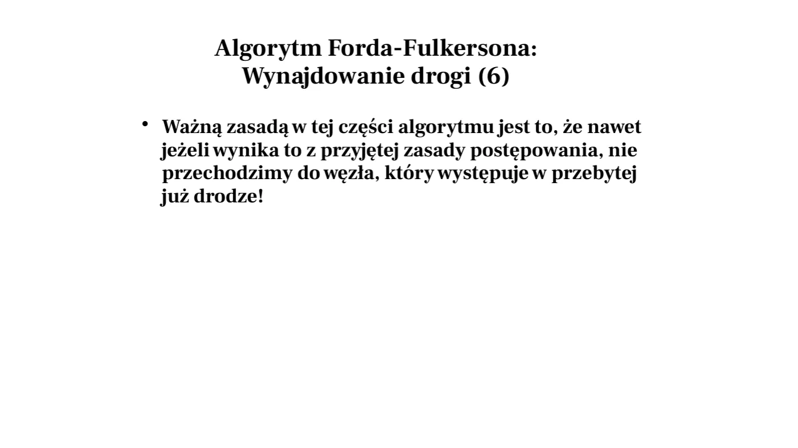

Wynajdowanie drogi (6)‏  
Ważną zasadą w tej części algorytmu jest to, że nawet jeżeli wynika to z przyjętej zasady postępowania, nie przechodzimy do węzła, który występuje w przebytej już drodze!

### 45. Algorytm Forda-Fulkersona:

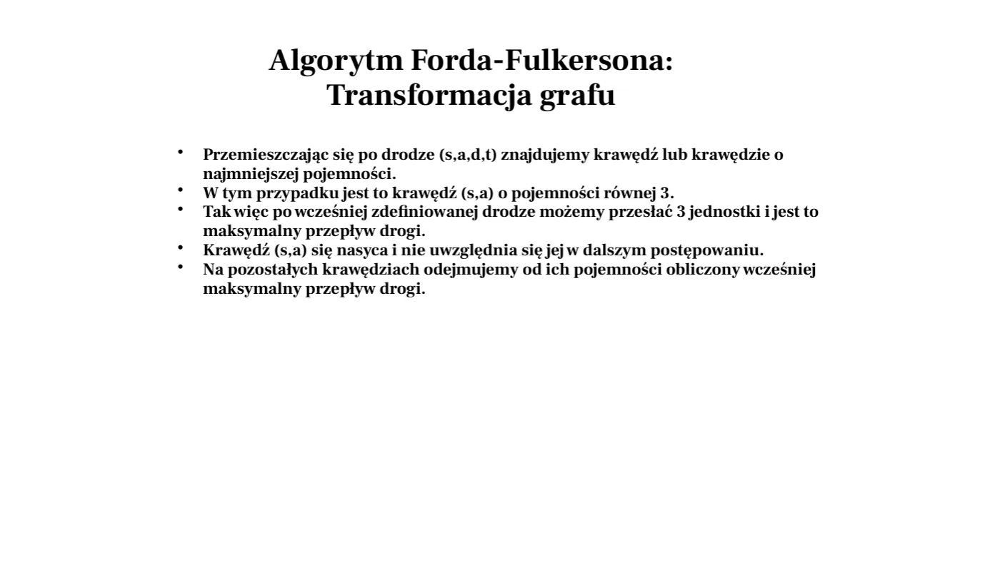

Transformacja grafu  
Przemieszczając  
się  
po  
drodze  
(  
s,a,d,t  
)  
znajdujemy  
krawędź  
lub  
krawędzie  
o  
najmniejszej  
pojemności  
.  
W  
tym  
przypadku  
jest to  
krawędź  
(  
s,a  
) o  
pojemności  
równej  
3.  
Tak  
więc  
po  
wcześniej  
zdefiniowanej  
drodze  
możemy  
przesłać  
3  
jednostki  
i jest to  
maksymalny  
przepływ  
drogi  
.  
Krawędź  
(  
s,a  
)  
się  
nasyca  
i  
nie  
uwzględnia  
się  
jej  
w  
dalszym  
postępowaniu  
.  
Na pozostałych  
krawędziach  
odejmujemy  
od  
ich  
pojemności  
obliczony  
wcześniej  
maksymalny  
przepływ  
drogi  
.

### 46. Algorytm Forda-Fulkersona:

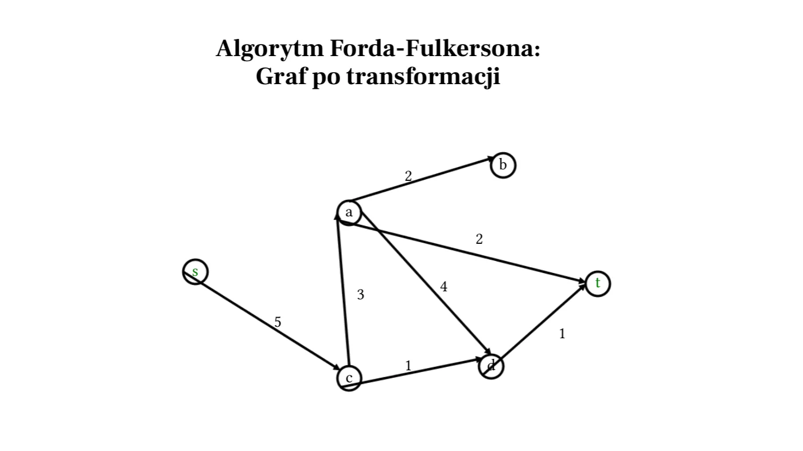

Graf po transformacji  
s  
a  
b  
c  
d  
t  
2  
3  
5  
1  
1  
4  
2

### 47. Algorytm Forda-Fulkersona:

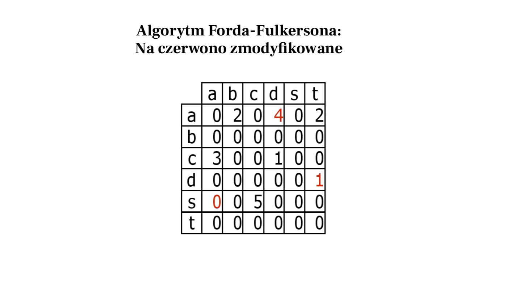

Na czerwono zmodyfikowane

### 48. Algorytm Forda-Fulkersona:

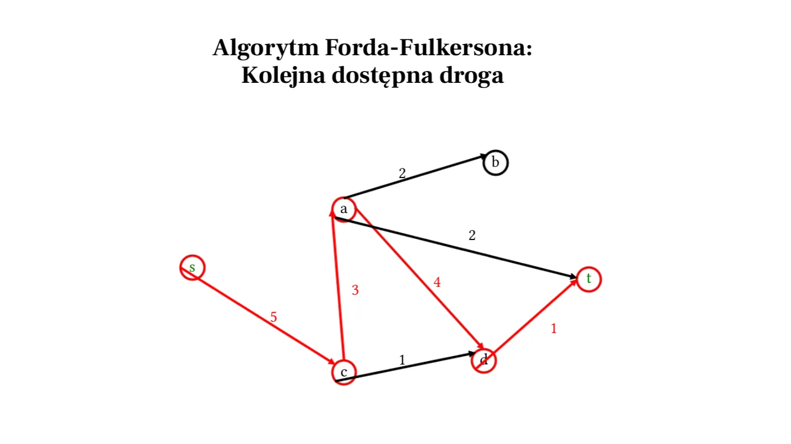

Kolejna dostępna droga  
s  
a  
b  
c  
d  
t  
2  
3  
5  
1  
1  
4  
2

### 49. Algorytm Forda-Fulkersona:

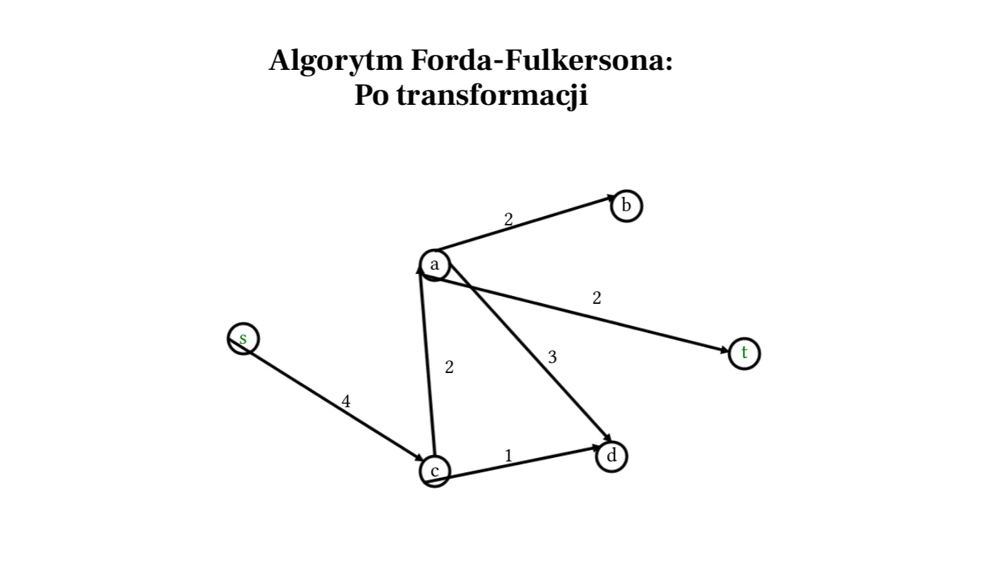

Po transformacji  
s  
a  
b  
c  
d  
t  
2  
2  
4  
1  
3  
2

### 50. Algorytm Forda-Fulkersona:

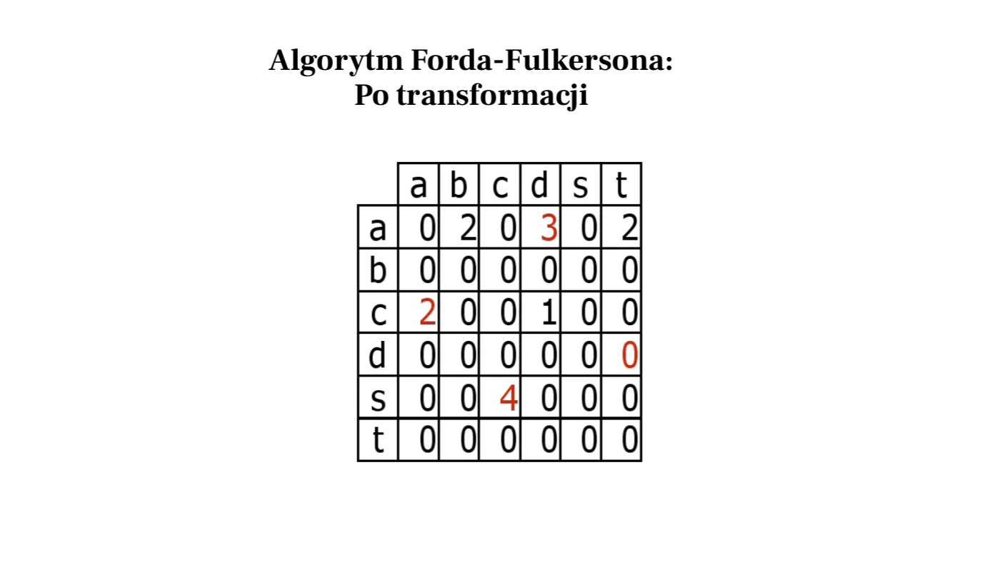

Po transformacji

### 51. Algorytm Dinica:

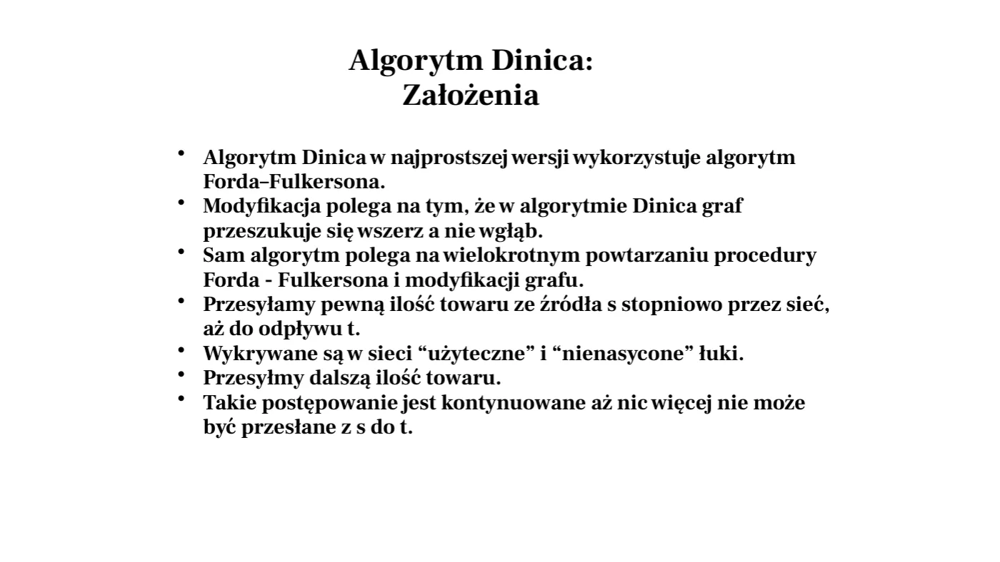

Założenia  
Algorytm Dinica w najprostszej wersji wykorzystuje algorytm Forda–Fulkersona.  
Modyfikacja polega na tym, że w algorytmie Dinica graf przeszukuje się wszerz a nie wgłąb.  
Sam algorytm polega na wielokrotnym powtarzaniu procedury Forda - Fulkersona i modyfikacji grafu.  
Przesyłamy pewną ilość towaru ze źródła s stopniowo przez sieć, aż do odpływu t.  
Wykrywane są w sieci “użyteczne” i “nienasycone” łuki.  
Przesyłmy dalszą ilość towaru.  
Takie postępowanie jest kontynuowane aż nic więcej nie może być przesłane z s do t.

### 52. Algorytm Dinica:

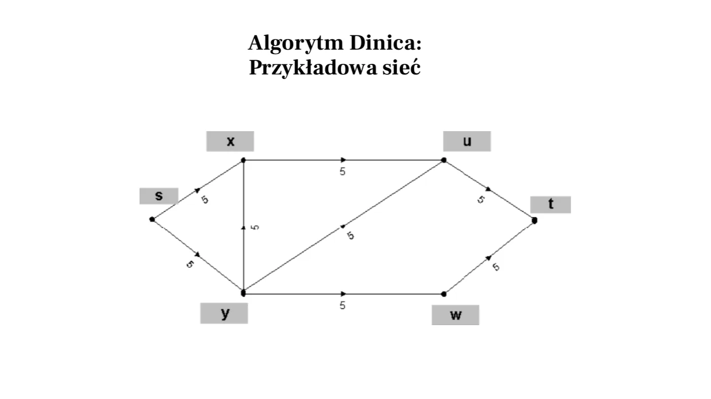

Przykładowa sieć

### 53. Algorytm Dinica:

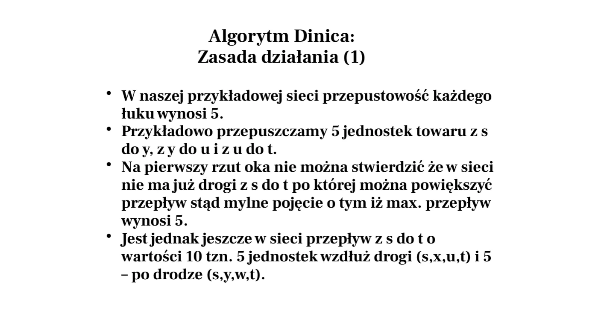

Zasada działania (1)‏  
W  
naszej  
przykładowej  
sieci  
przepustowość  
każdego  
łuku  
wynosi  
5.  
Przykładowo  
przepuszczamy  
5  
jednostek  
towaru  
z s do y, z y do u i z u do t.  
Na  
pierwszy  
rzut  
oka  
nie  
można  
stwierdzić  
że  
w  
sieci  
nie  
ma  
już  
drogi  
z s do t  
po  
której  
można  
powiększyć  
przepływ  
stąd  
mylne  
pojęcie  
o  
tym  
iż  
max.  
przepływ  
wynosi  
5.  
Jest  
jednak  
jeszcze  
w  
sieci  
przepływ  
z s do t o  
wartości  
10  
tzn  
. 5  
jednostek  
wzdłuż  
drogi  
(  
s,x,u,t  
) i 5 –  
po  
drodze  
(  
s,y,w,t  
).

### 54. Algorytm Dinica:

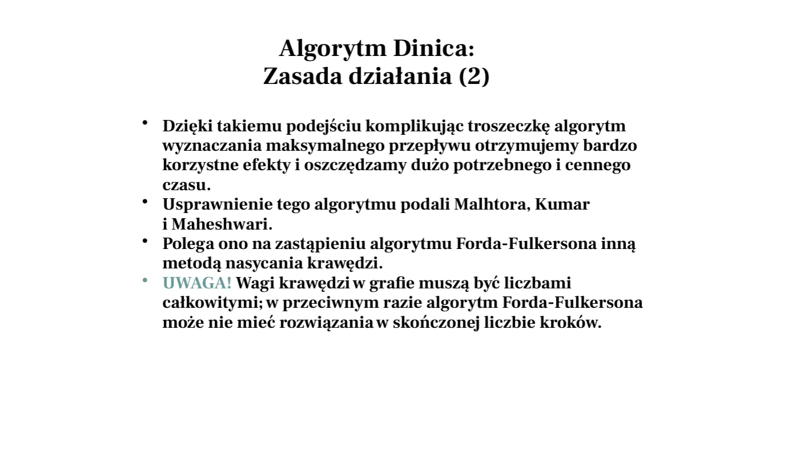

Zasada działania (2)‏  
Dzięki takiemu podejściu komplikując troszeczkę algorytm wyznaczania maksymalnego przepływu otrzymujemy bardzo korzystne efekty i oszczędzamy dużo potrzebnego i cennego czasu.  
Usprawnienie tego algorytmu podali Malhtora, Kumar  
i Maheshwari.  
Polega ono na zastąpieniu algorytmu Forda-Fulkersona inną metodą nasycania krawędzi.  
UWAGA!  
Wagi krawędzi w grafie muszą być liczbami całkowitymi; w przeciwnym razie algorytm Forda-Fulkersona może nie mieć rozwiązania w skończonej liczbie kroków.

### 55. Protokoły warstwy trzeciej (sieciowej)

16.01.2021  
55

### 56. Protokoły warstwy

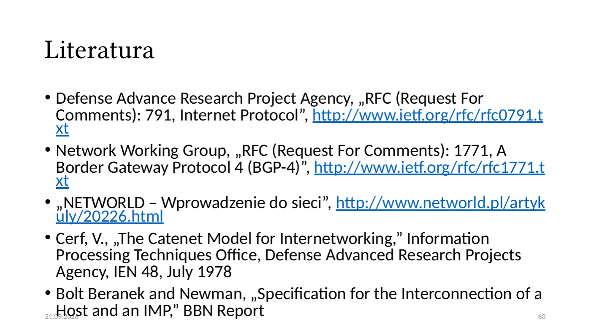

trzeciej  
(sieciowej)‏  
Najpopularniejsze: IPX, IP, ATM (ten ostatni to warstwa 2+3)‏  
Podstawowa jednostka – pakiet, składający się z: nagłówka, danych i końcówki  
Nagłówek i końcówka to informacje sterujące przeznaczone dla warstwy 3 w stacji odbiorczej  
16.01.2021  
56

