# Ruting - protokoły

Oryginał: [11 Ruting - protokoły.pptx](../11%20Ruting%20-%20protoko%C5%82y.pptx)

## Slajdy

### 1. Ruting – protokoły

Mikołaj Leszczuk

### 2. Plan

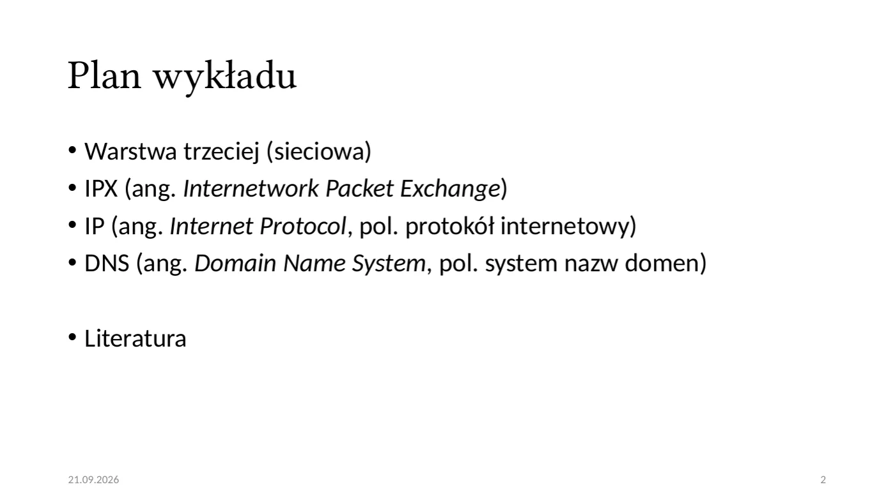

wykładu  
Warstwa trzeciej (sieciowa)  
IPX (ang.  
Internetwork Packet Exchange  
)  
IP (ang.  
Internet Protocol  
, pol. protokół internetowy)  
DNS (ang.  
Domain Name System  
, pol. system nazw domen)  
Protokół BGP-4  
Literatura  
16.01.2021  
2

### 3. Warstwa trzecia (sieciowa)

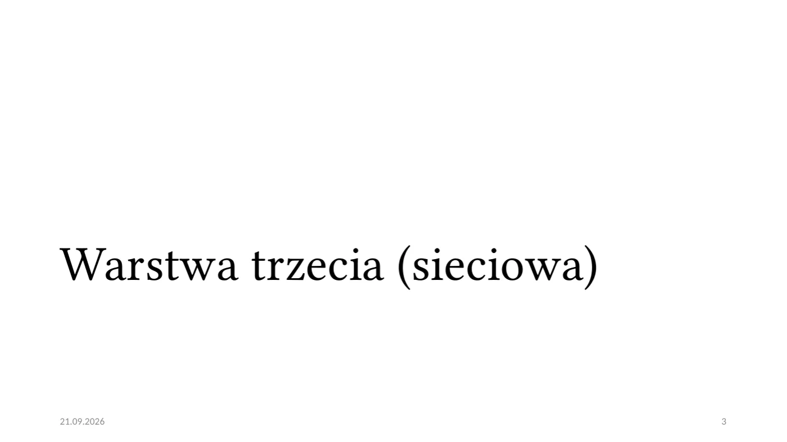

16.01.2021  
3

### 4. Protokoły warstwy

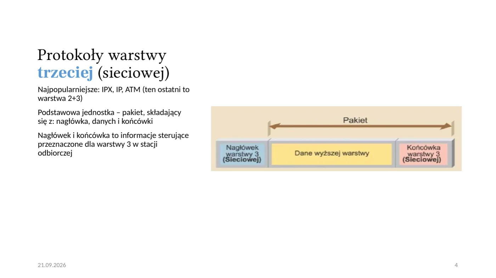

trzeciej  
(sieciowej)‏  
Najpopularniejsze: IPX, IP, ATM (ten ostatni to warstwa 2+3)‏  
Podstawowa jednostka – pakiet, składający się z: nagłówka, danych i końcówki  
Nagłówek i końcówka to informacje sterujące przeznaczone dla warstwy 3 w stacji odbiorczej  
16.01.2021  
4

### 5. IPX (ang.

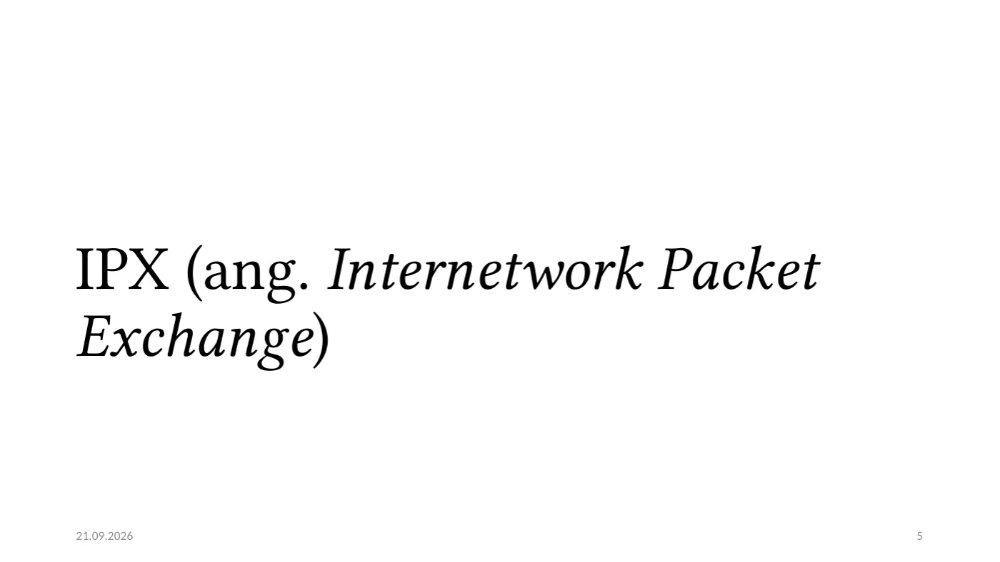

Internetwork Packet Exchange  
)  
16.01.2021  
5

### 6. Protokół IPX

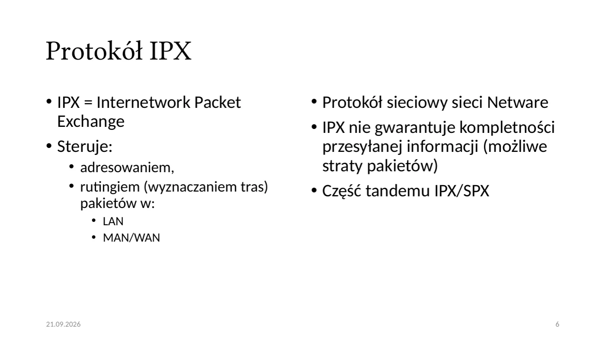

IPX =  
Internetwork  
Packet  
Exchange  
Steruje:  
adresowaniem,  
rutingiem  
(wyznaczaniem tras) pakietów w:  
LAN  
MAN/WAN  
Protokół sieciowy sieci Netware  
IPX nie gwarantuje kompletności przesyłanej informacji (możliwe straty pakietów)‏  
Część tandemu IPX/SPX  
16.01.2021  
6

### 7. IP (ang.

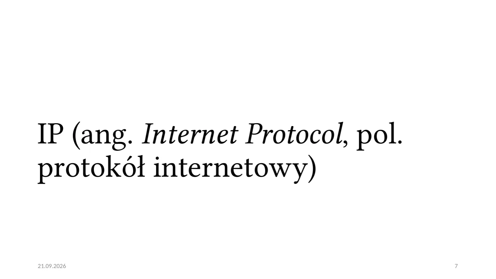

Internet Protocol  
, pol. protokół internetowy)  
16.01.2021  
7

### 8. Protokół IP – podstawowe zadania‏

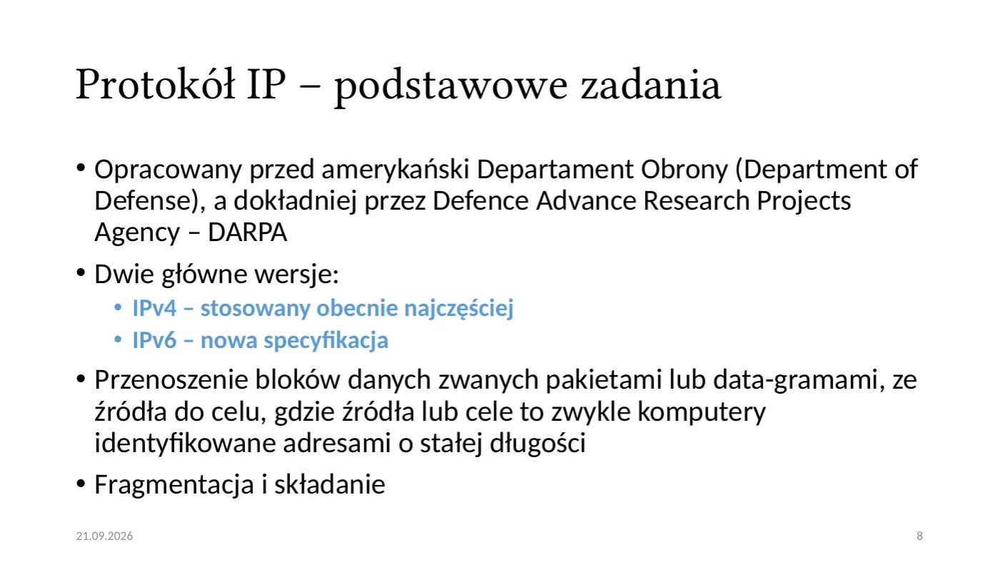

Opracowany przed amerykański Departament Obrony (  
Department  
of  
Defense  
), a dokładniej przez  
Defence  
Advance  
Research  
Projects  
Agency  
– DARPA  
Dwie główne wersje:  
IPv4 – stosowany obecnie najczęściej  
IPv6 – nowa specyfikacja  
Przenoszenie bloków danych zwanych pakietami lub data-gramami, ze źródła do celu, gdzie źródła lub cele to zwykle komputery identyfikowane adresami o stałej długości  
Fragmentacja i składanie  
16.01.2021  
8

### 9. Protokół IP – zakres działania

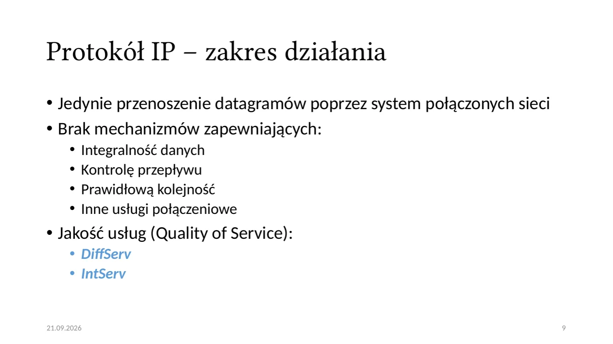

Jedynie przenoszenie  
datagramów  
poprzez system połączonych sieci  
Brak mechanizmów zapewniających:  
Integralność danych  
Kontrolę przepływu  
Prawidłową kolejność  
Inne usługi połączeniowe  
Jakość usług (Quality of Service):  
DiffServ  
IntServ  
16.01.2021  
9

### 10. Protokół IP – podstawowe cechy

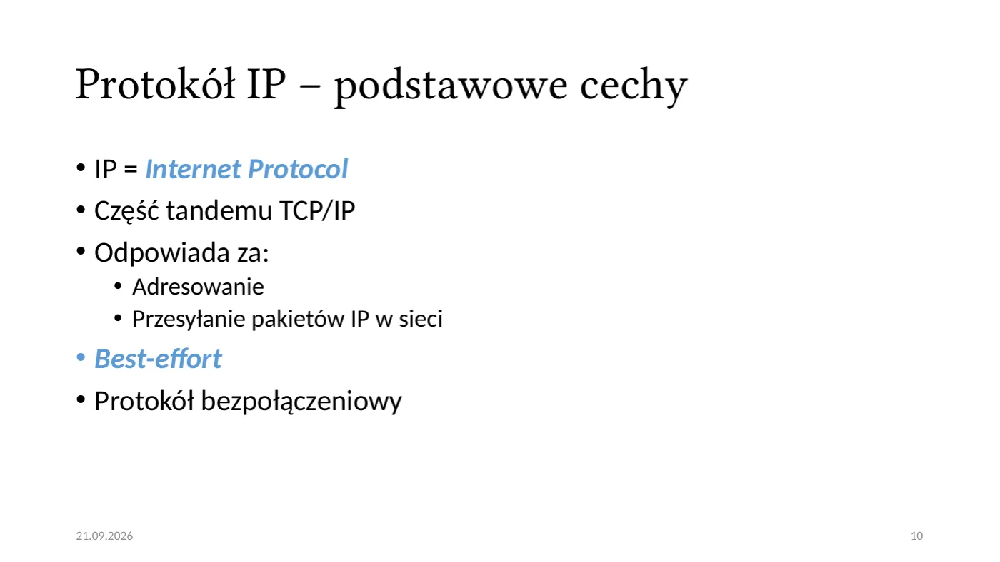

IP =  
Internet  
Protocol  
Część tandemu TCP/IP  
Odpowiada za:  
Adresowanie  
Przesyłanie pakietów IP w sieci  
Best-  
effort  
Protokół bezpołączeniowy  
16.01.2021  
10

### 11. Protokół IP – interfejsy

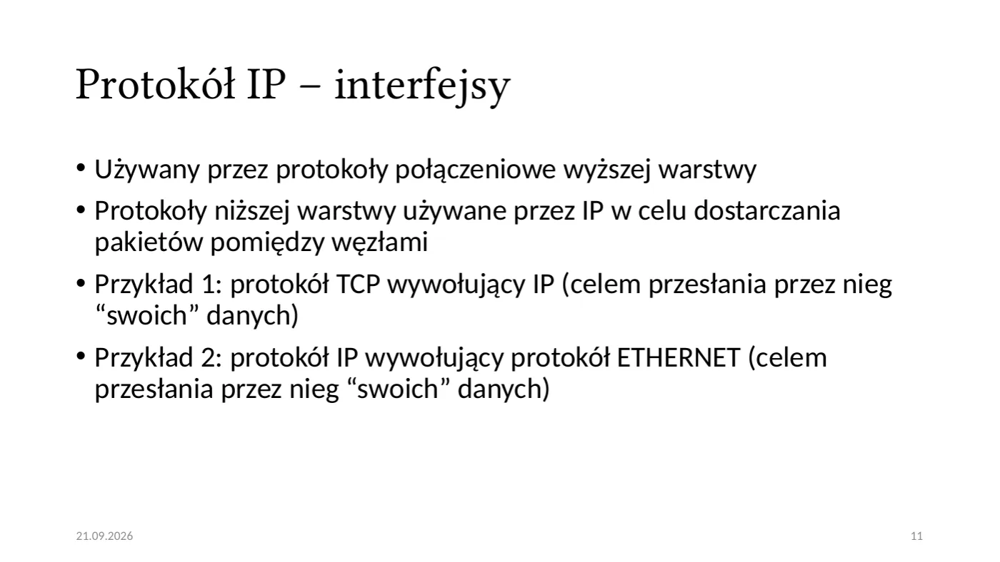

Używany przez protokoły połączeniowe wyższej warstwy  
Protokoły niższej warstwy używane przez IP w celu dostarczania pakietów pomiędzy węzłami  
Przykład 1: protokół TCP wywołujący IP (celem przesłania przez  
nieg  
“swoich” danych)‏  
Przykład 2: protokół IP wywołujący protokół ETHERNET (celem przesłania przez  
nieg  
“swoich” danych)‏  
16.01.2021  
11

### 12. Protokół IP – współdziałanie protokołów

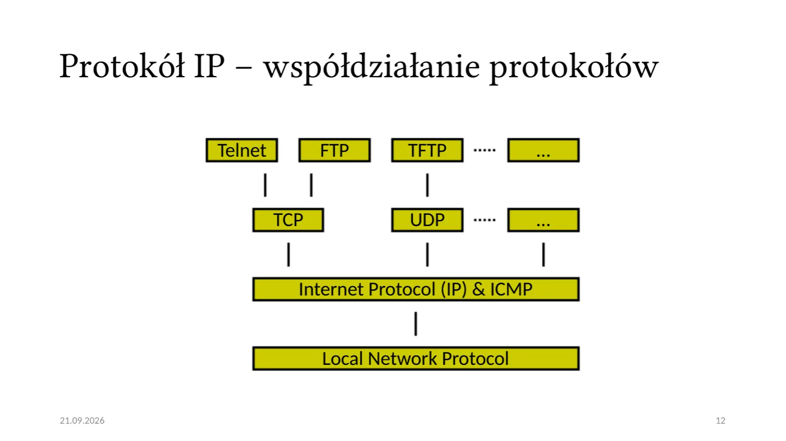

16.01.2021  
12  
Telnet  
FTP  
TFTP  
...  
TCP  
UDP  
Internet Protocol (IP) & ICMP  
...  
Local Network Protocol

### 13. Protokół IP – format nagłówka (1/4)‏

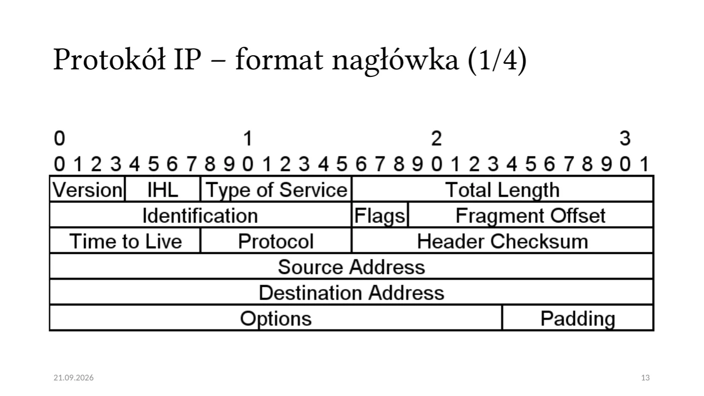

16.01.2021  
13

### 14. Protokół IP – format nagłówka (2/4)‏

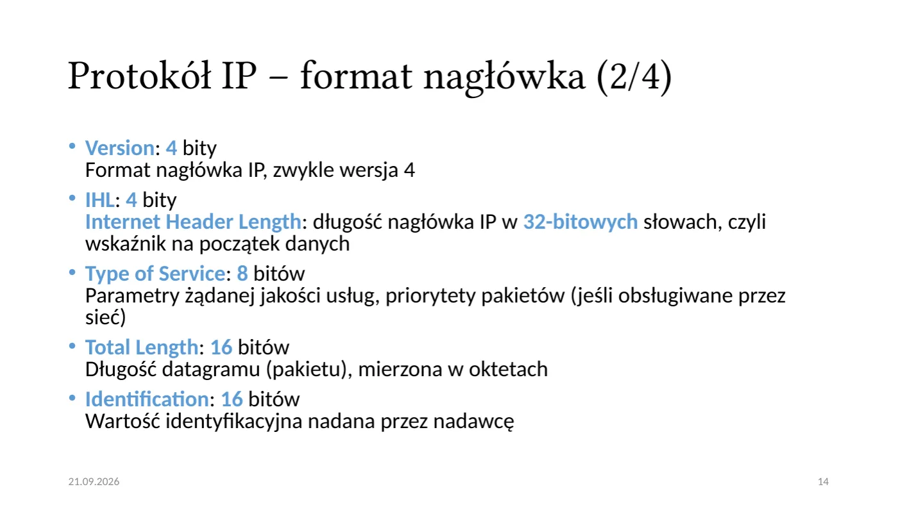

Version  
:  
4  
bity  
Format nagłówka IP, zwykle wersja 4  
IHL  
:  
4  
bity  
Internet  
Header  
Length  
: długość nagłówka IP w  
32-bitowych  
słowach, czyli wskaźnik na początek danych  
Type  
of Service  
:  
8  
bitów  
Parametry żądanej jakości usług, priorytety pakietów (jeśli obsługiwane przez sieć)‏  
Total  
Length  
:  
16  
bitów  
Długość  
datagramu  
(pakietu), mierzona w oktetach  
Identification  
:  
16  
bitów  
Wartość identyfikacyjna nadana przez nadawcę  
16.01.2021  
14

### 15. Protokół IP – format nagłówka (3/4)‏

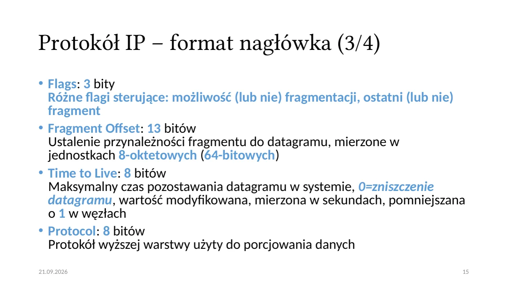

Flags  
:  
3  
bity  
Różne flagi sterujące: możliwość (lub nie) fragmentacji, ostatni (lub nie) fragment  
Fragment Offset  
:  
13  
bitów  
Ustalenie przynależności fragmentu do  
datagramu  
, mierzone w jednostkach  
8-oktetowych  
(  
64-bitowych  
)‏  
Time to Live  
:  
8  
bitów  
Maksymalny czas pozostawania  
datagramu  
w systemie,  
0=zniszczenie  
datagramu  
, wartość modyfikowana, mierzona w sekundach, pomniejszana o  
1  
w węzłach  
Protocol  
:  
8  
bitów  
Protokół wyższej warstwy użyty do porcjowania danych  
16.01.2021  
15

### 16. Protokół IP – format nagłówka (4/4)‏

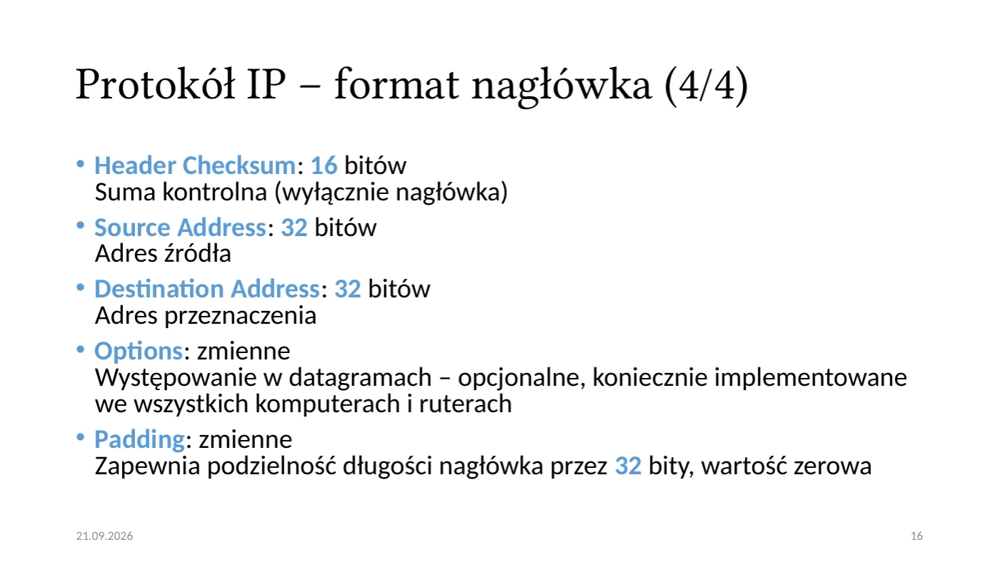

Header  
Checksum  
:  
16  
bitów  
Suma kontrolna (wyłącznie nagłówka)‏  
Source  
Address  
:  
32  
bitów  
Adres źródła  
Destination  
Address  
:  
32  
bitów  
Adres przeznaczenia  
Options  
: zmienne  
Występowanie w  
datagramach  
– opcjonalne, koniecznie implementowane we wszystkich komputerach i ruterach  
Padding  
: zmienne  
Zapewnia podzielność długości nagłówka przez  
32  
bity, wartość zerowa  
16.01.2021  
16

### 17. Pola modyfikowane przez fragmentację

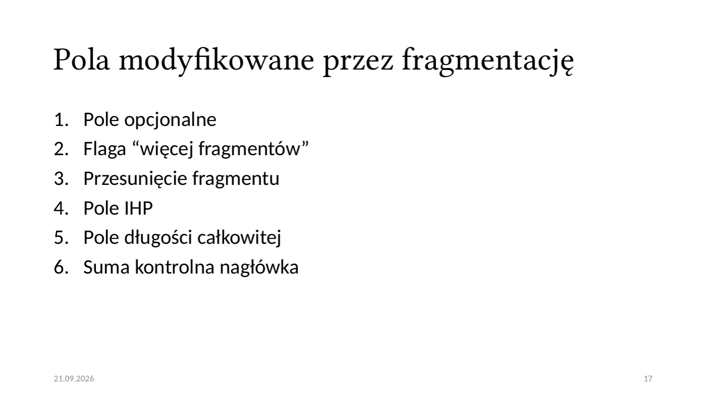

Pole opcjonalne  
Flaga “więcej fragmentów”  
Przesunięcie fragmentu  
Pole IHP  
Pole długości całkowitej  
Suma kontrolna nagłówka  
16.01.2021  
17

### 18. Przykład

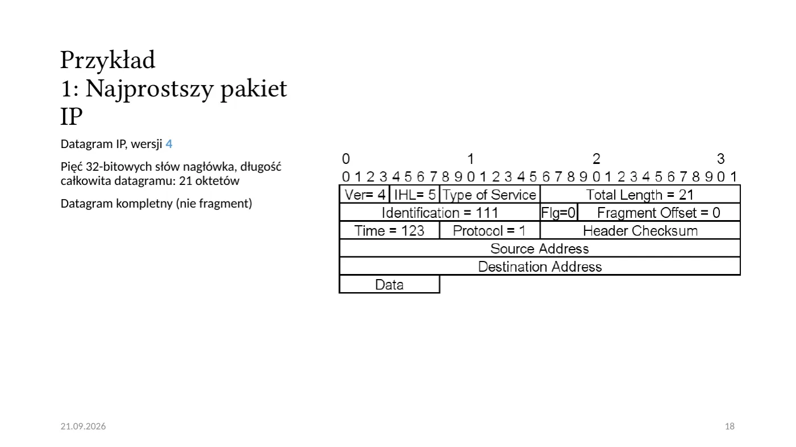

1: Najprostszy pakiet IP  
Datagram  
IP, wersji  
4  
Pięć 32-bitowych słów nagłówka, długość całkowita  
datagramu  
: 21 oktetów  
Datagram  
kompletny (nie fragment)‏  
16.01.2021  
18

### 19. Przykład

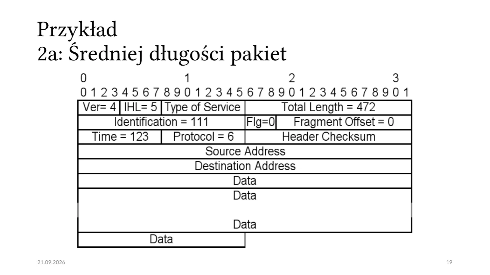

2a: Średniej długości pakiet  
16.01.2021  
19

### 20. Przykład

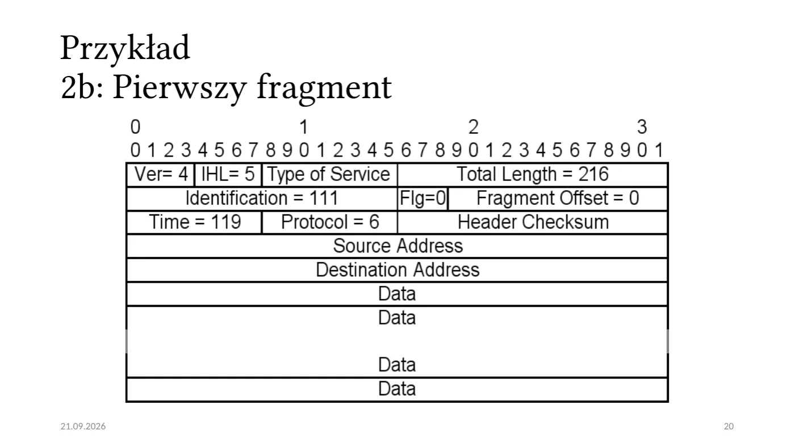

2b: Pierwszy fragment  
16.01.2021  
20

### 21. Przykład

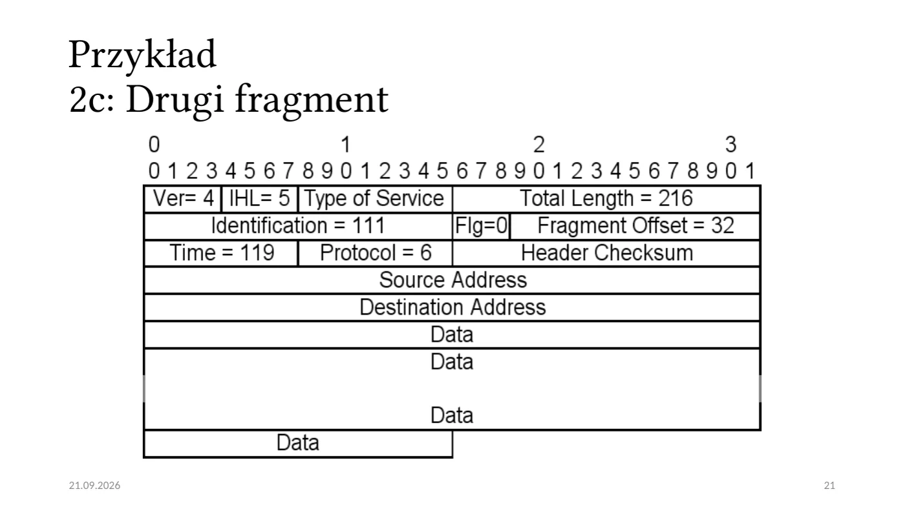

2c: Drugi fragment  
16.01.2021  
21

### 22. Przykład

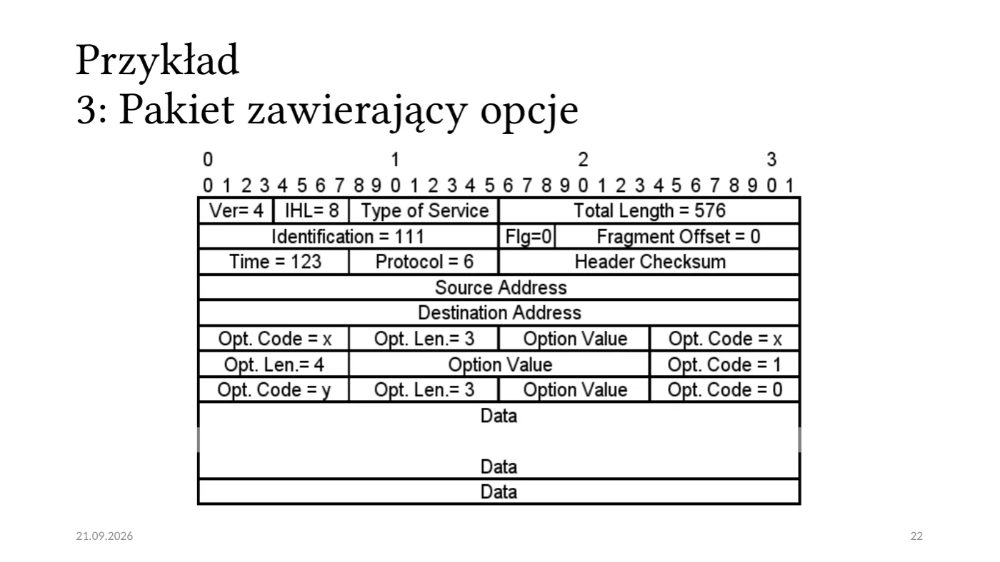

3: Pakiet zawierający opcje  
16.01.2021  
22

### 23. Kolejność transmisji danych

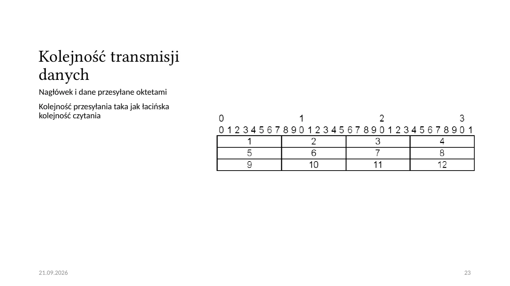

Nagłówek i dane przesyłane oktetami  
Kolejność przesyłania taka jak łacińska kolejność czytania  
16.01.2021  
23

### 24. Znaczenie bitów

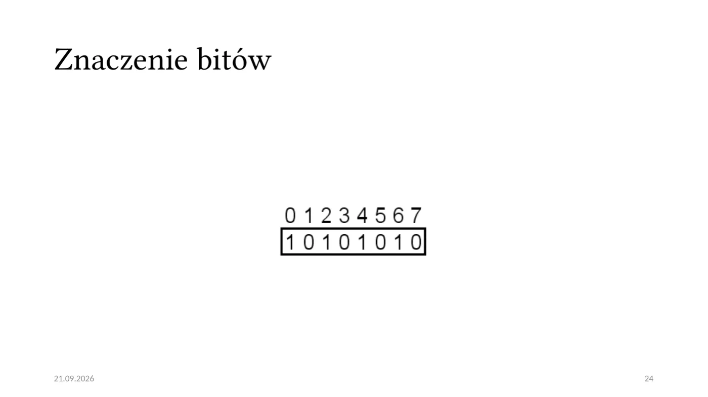

16.01.2021  
24

### 25. Adres IP

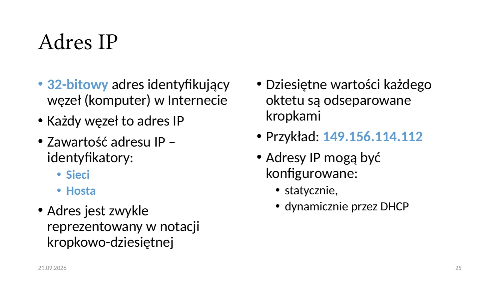

32-bitowy  
adres identyfikujący węzeł (komputer) w Internecie  
Każdy węzeł to adres IP  
Zawartość adresu IP – identyfikatory:  
Sieci  
Hosta  
Adres jest zwykle reprezentowany w notacji kropkowo-dziesiętnej  
Dziesiętne wartości każdego oktetu są odseparowane kropkami  
Przykład:  
149.156.114.112  
Adresy IP mogą być konfigurowane:  
statycznie,  
dynamicznie przez DHCP  
16.01.2021  
25

### 26. Adresowanie i formaty adresów

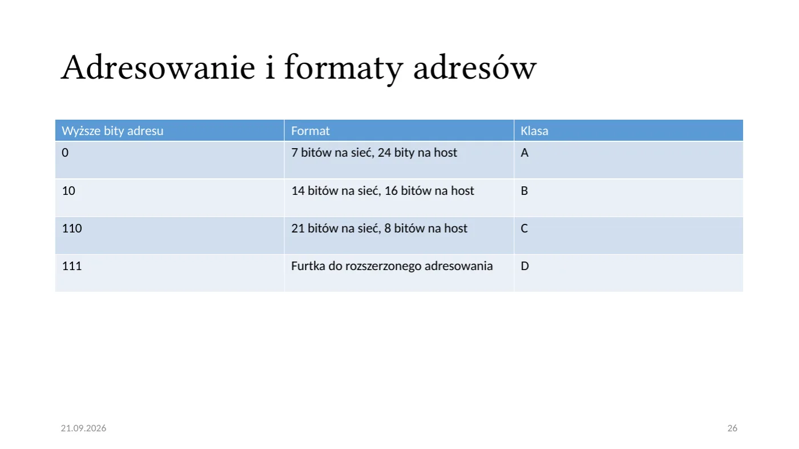

Wyższe bity adresu  
Format  
Klasa  
0  
7 bitów na sieć, 24 bity na host  
A  
10  
14 bitów na sieć, 16 bitów na host  
B  
110  
21 bitów na sieć, 8 bitów na host  
C  
111  
Furtka do rozszerzonego adresowania  
D  
16.01.2021  
26

### 27. Konfiguracja urządzeń w sieci – pojęcia podstawowe (1/2)‏

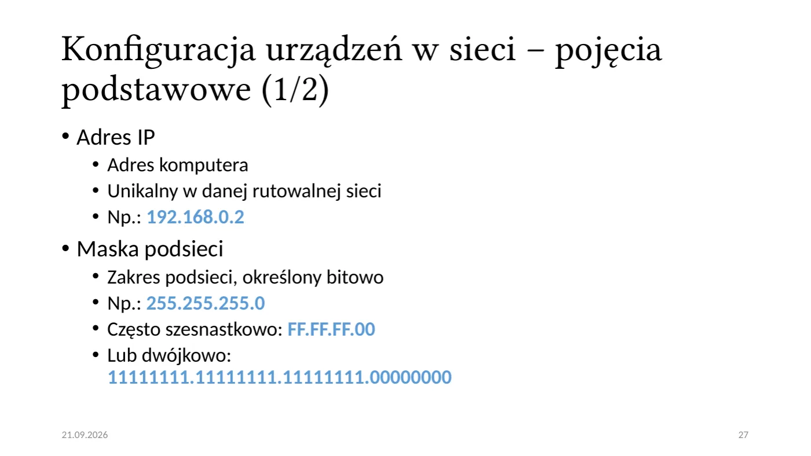

Adres IP  
Adres komputera  
Unikalny w danej  
rutowalnej  
sieci  
Np.:  
192.168.0.2  
Maska podsieci  
Zakres podsieci, określony bitowo  
Np.:  
255.255.255.0  
Często szesnastkowo:  
FF.FF.FF.00  
Lub dwójkowo:  
11111111.11111111.11111111.00000000  
16.01.2021  
27

### 28. Konfiguracja urządzeń w sieci – pojęcia podstawowe (2/2)‏

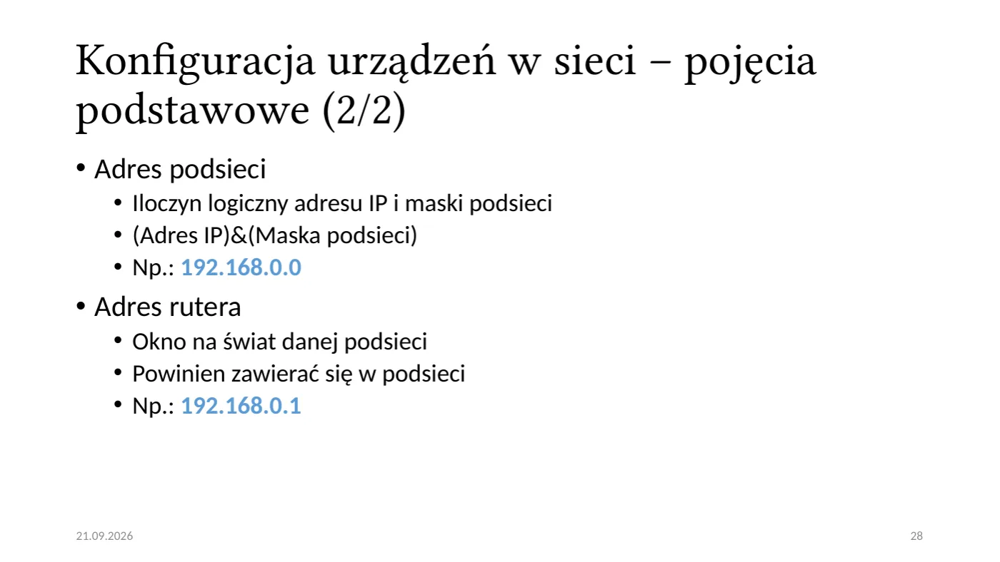

Adres podsieci  
Iloczyn logiczny adresu IP i maski podsieci  
(Adres IP)&(Maska podsieci)  
Np.:  
192.168.0.0  
Adres rutera  
Okno na świat danej podsieci  
Powinien zawierać się w podsieci  
Np.:  
192.168.0.1  
16.01.2021  
28

### 29. Konfiguracja urządzeń w sieci – adresy IP i klasy (1/2)‏

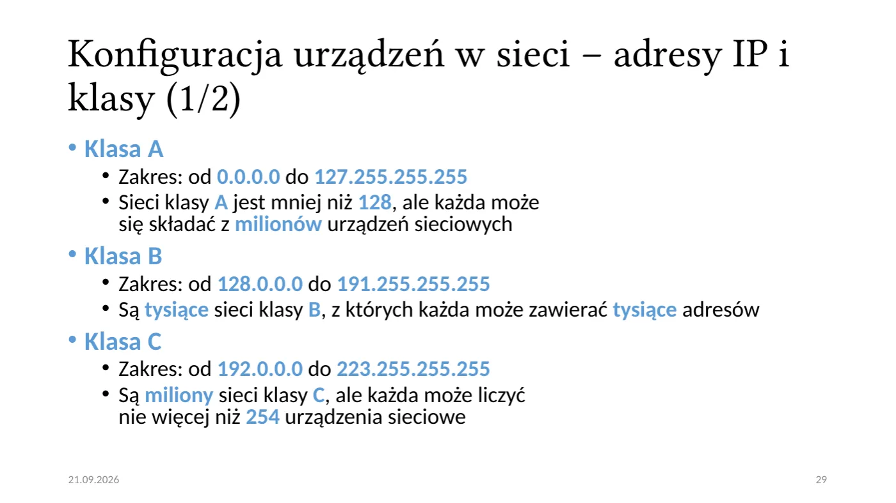

Klasa  
A  
Zakres: od  
0.0.0.0  
do  
127.255.255.255  
Sieci klasy  
A  
jest mniej niż  
128  
, ale każda może  
się składać z  
milionów  
urządzeń sieciowych  
Klasa  
B  
Zakres: od  
128.0.0.0  
do  
191.255.255.255  
Są  
tysiące  
sieci klasy  
B  
, z których każda może zawierać  
tysiące  
adresów  
Klasa  
C  
Zakres: od  
192.0.0.0  
do  
223.255.255.255  
Są  
miliony  
sieci klasy  
C  
, ale każda może liczyć  
nie więcej niż  
254  
urządzenia sieciowe  
16.01.2021  
29

### 30. Konfiguracja urządzeń w sieci – adresy IP i klasy (2/2)‏

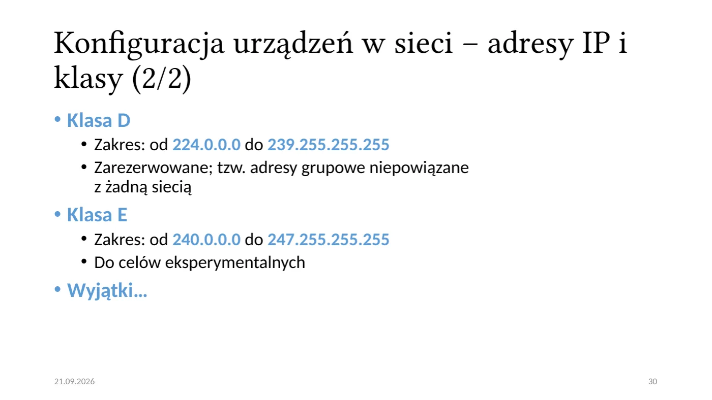

Klasa  
D  
Zakres: od  
224.0.0.0  
do  
239.255.255.255  
Zarezerwowane; tzw. adresy grupowe niepowiązane  
z żadną siecią  
Klasa  
E  
Zakres: od  
240.0.0.0  
do  
247.255.255.255  
Do celów eksperymentalnych  
Wyjątki…  
16.01.2021  
30

### 31. Konfiguracja urządzeń w sieci

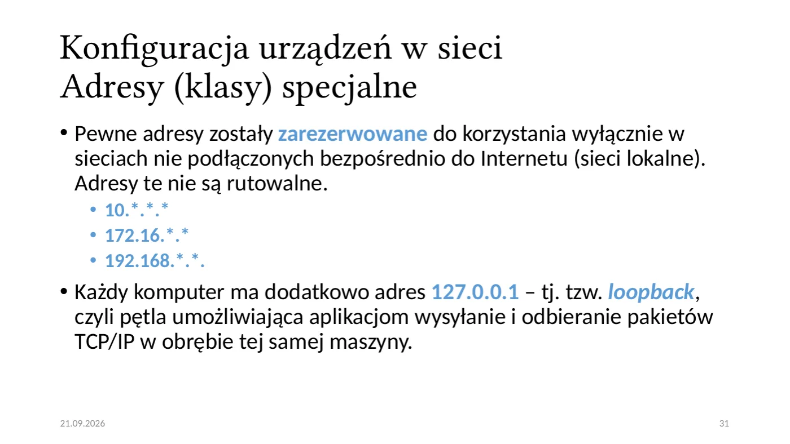

Adresy (klasy) specjalne  
Pewne adresy zostały  
zarezerwowane  
do korzystania wyłącznie w sieciach nie podłączonych bezpośrednio do Internetu (sieci lokalne). Adresy te nie są  
rutowalne  
.  
10.*.*.*  
172.16.*.*  
192.168.*.*.  
Każdy komputer ma dodatkowo adres  
127.0.0.1  
– tj. tzw.  
loopback  
, czyli pętla umożliwiająca aplikacjom wysyłanie i odbieranie pakietów TCP/IP w obrębie tej samej maszyny.  
16.01.2021  
31

### 32. Konfiguracja urządzeń w sieci

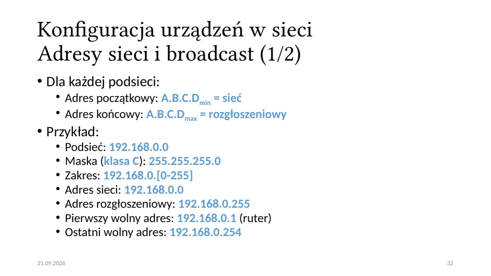

Adresy sieci i broadcast (1/2)‏  
Dla każdej podsieci:  
Adres początkowy:  
A.B.C.D  
min  
= sieć  
Adres końcowy:  
A.B.C.D  
max  
= rozgłoszeniowy  
Przykład:  
Podsieć:  
192.168.0.0  
Maska (  
klasa  
C  
):  
255.255.255.0  
Zakres:  
192.168.0.[0-255]  
Adres sieci:  
192.168.0.0  
Adres rozgłoszeniowy:  
192.168.0.255  
Pierwszy wolny adres:  
192.168.0.1  
(ruter)‏  
Ostatni wolny adres:  
192.168.0.254  
16.01.2021  
32

### 33. Konfiguracja urządzeń w sieci

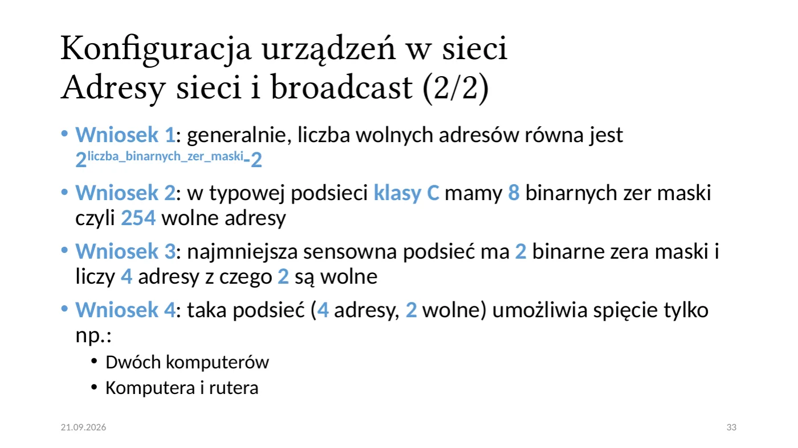

Adresy sieci i broadcast (2/2)‏  
Wniosek 1  
: generalnie, liczba wolnych adresów równa jest  
2  
liczba_binarnych_zer_maski  
-2  
Wniosek 2  
: w typowej podsieci  
klasy C  
mamy  
8  
binarnych zer maski czyli  
254  
wolne adresy  
Wniosek 3  
: najmniejsza sensowna podsieć ma  
2  
binarne zera maski i liczy  
4  
adresy z czego  
2  
są wolne  
Wniosek 4  
: taka podsieć (  
4  
adresy,  
2  
wolne) umożliwia spięcie tylko np.:  
Dwóch komputerów  
Komputera i rutera  
16.01.2021  
33

### 34. Konfiguracja urządzeń w sieci

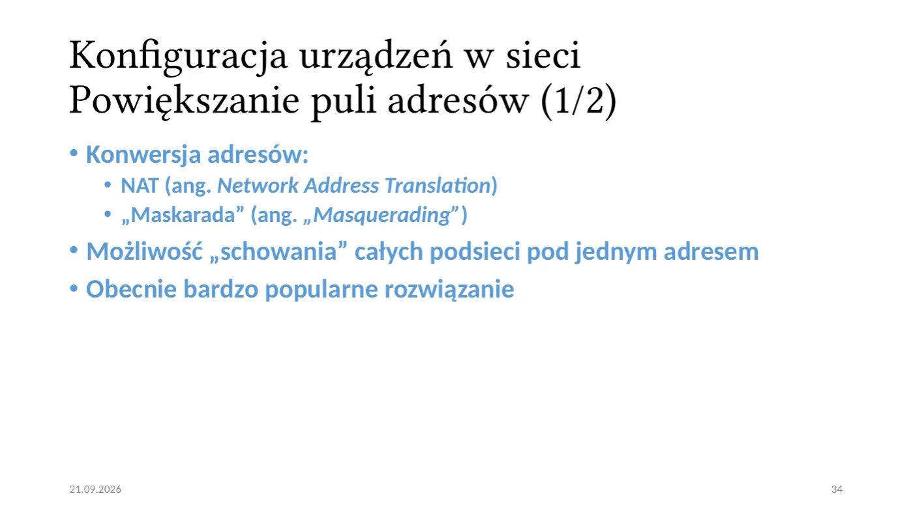

Powiększanie puli adresów (1/2)‏  
Konwersja adresów:  
NAT (ang.  
Network  
Address  
Translation  
)‏  
„Maskarada” (ang.  
„  
Masquerading  
”  
)‏  
Możliwość „schowania” całych podsieci pod jednym adresem  
Obecnie bardzo popularne rozwiązanie  
16.01.2021  
34

### 35. Konfiguracja urządzeń w sieci

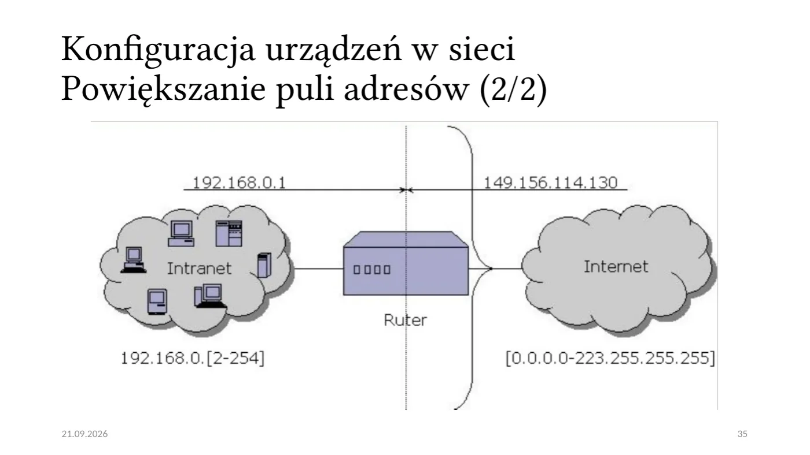

Powiększanie puli adresów (2/2)‏  
16.01.2021  
35

### 36. Konfiguracja urządzeń w sieci

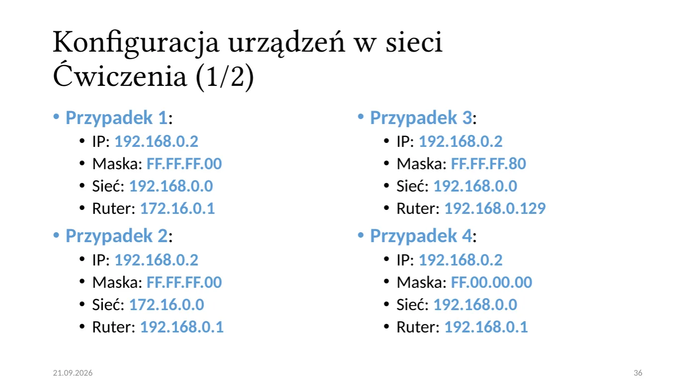

Ćwiczenia (1/2)‏  
Przypadek 1  
:  
IP:  
192.168.0.2  
Maska:  
FF.FF.FF.00  
Sieć:  
192.168.0.0  
Ruter:  
172.16.0.1  
Przypadek 2  
:  
IP:  
192.168.0.2  
Maska:  
FF.FF.FF.00  
Sieć:  
172.16.0.0  
Ruter:  
192.168.0.1  
Przypadek 3  
:  
IP:  
192.168.0.2  
Maska:  
FF.FF.FF.80  
Sieć:  
192.168.0.0  
Ruter:  
192.168.0.129  
Przypadek 4  
:  
IP:  
192.168.0.2  
Maska:  
FF.00.00.00  
Sieć:  
192.168.0.0  
Ruter:  
192.168.0.1  
16.01.2021  
36

### 37. Konfiguracja urządzeń w sieci

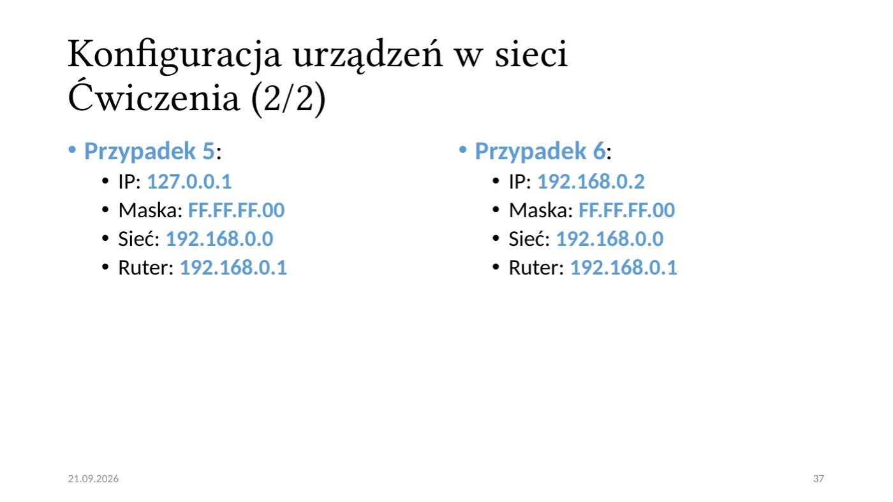

Ćwiczenia (2/2)‏  
Przypadek 5  
:  
IP:  
127.0.0.1  
Maska:  
FF.FF.FF.00  
Sieć:  
192.168.0.0  
Ruter:  
192.168.0.1  
Przypadek 6  
:  
IP:  
192.168.0.2  
Maska:  
FF.FF.FF.00  
Sieć:  
192.168.0.0  
Ruter:  
192.168.0.1  
16.01.2021  
37

### 38. DNS (ang. Domain Name System, pol. system nazw domen)

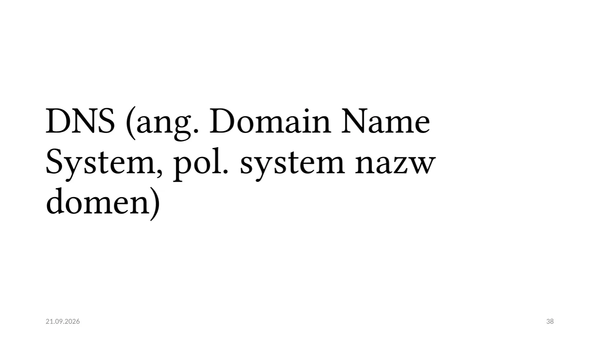

16.01.2021  
38

### 39. Domain Name System (1/2)

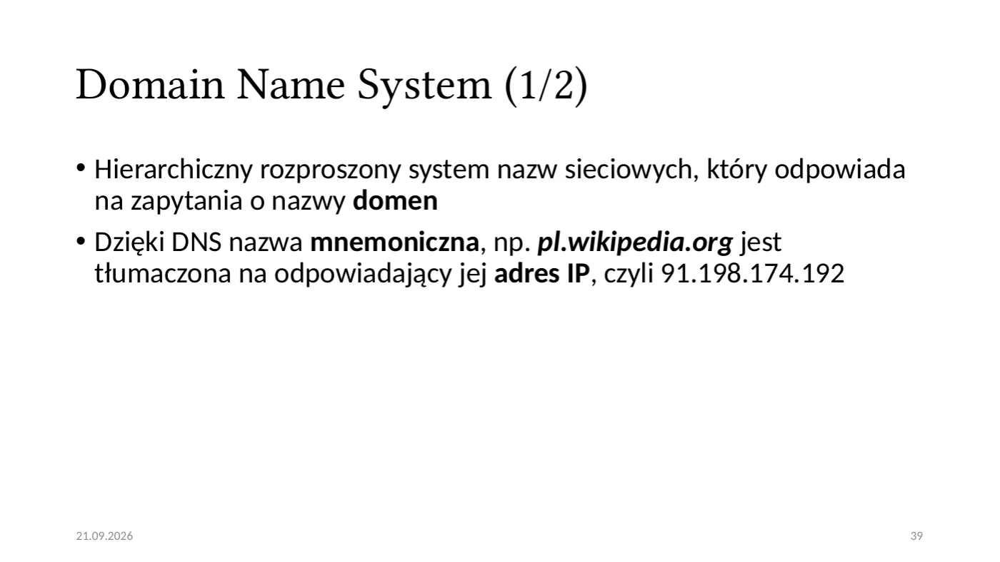

Hierarchiczny rozproszony system nazw sieciowych, który odpowiada na zapytania o nazwy  
domen  
Dzięki DNS nazwa  
mnemoniczna  
, np.  
pl.wikipedia.org  
jest tłumaczona na odpowiadający jej  
adres IP  
, czyli 91.198.174.192  
16.01.2021  
39

### 40. Domain Name System (2/2)

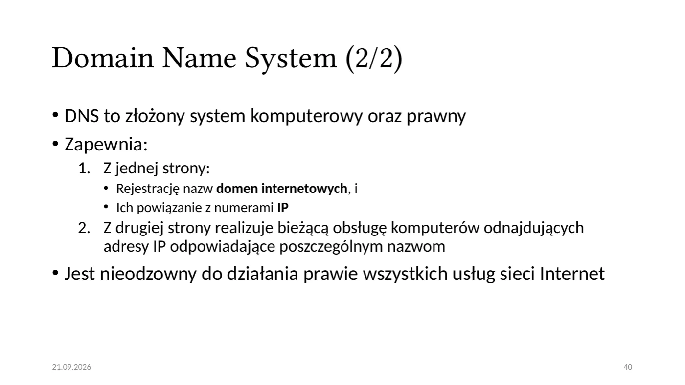

DNS to złożony system komputerowy oraz prawny  
Zapewnia:  
Z jednej strony:  
Rejestrację nazw  
domen internetowych  
, i  
Ich powiązanie z numerami  
IP  
Z drugiej strony realizuje bieżącą obsługę komputerów odnajdujących adresy IP odpowiadające poszczególnym nazwom  
Jest nieodzowny do działania prawie wszystkich usług sieci Internet  
16.01.2021  
40

### 41. Protokół BGP-4

16.01.2021  
41

### 42. Protokół BGP-4 – wprowadzenie (1/3)‏

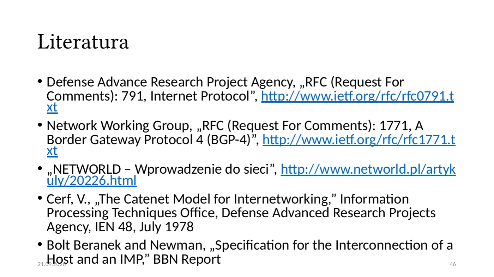

Protokół wymiany informacji o  
rutingu  
pomiędzy niezależnymi sieciami  
Stworzony (w wersji pierwszej, jako “RFC: 1267”) w 1991 roku przez:  
Cisco Systems  
IBM  
Następca protokołu EGP (“RFC: 904”)‏  
Wymiana informacji o dostępności sieci z innymi systemami BGP  
Dostępność sieci to m.in. lista Systemów Autonomicznych (  
Autonomous  
Systems, AS), przez które przechodzi informacja o dostępności  
16.01.2021  
42

